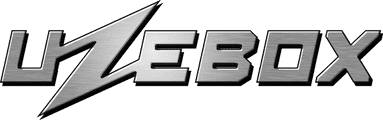

By:    

  

Last month, RetroAchievements added support for one of the oldest "build your own" consoles with the addition of the Elektor TV Computer Games system.  This month heads to the opposite end of the timeline by adding support for another "build your own" console and RetroAchievements 50th supported console, the Uzebox!

The Uzebox is an 8-bit console, from 2008, that is:
* Made by a hobbyist, for hobbyists;
* Easy to assemble from off-the-shelf parts; and
* Easy to make games for.

The console exhibits a  “retro-minimalist” design philosophy.  How was this accomplished, you ask?  Well, it sounds simple, at least in theory:
* All of the graphics are handled in software.
* This simplified the design to just two chips. Namely: (i) a general-purpose microcontroller * overclockable to be compatible with (ii) a signal converter between color formats.
* Interrupts are used to drive the software engine.
* This spares game developers from the chore of counting CPU cycles.

What else makes this console special?  A few things come to mind.
* Games can be dropped onto a regular SD card and loaded on the fly.
* SNES controllers are supported by design.
* Like the general-purpose Arduino platform, the design of the Uzebox is open source, meaning anyone can make or sell their own version of the console. This means more choices for consumers.

What were the launch titles back then? They included:
* A Tetris DS clone (AVR Megatris);
* Arkanoid;
* Maze;
* Whack-a-Mole; and
* Super Mario Demo.

How did the console come about?  The concept was developed by Belogic, drawing inspiration from the 8-bit console generation.  One of the project's primary goals was to utilize readily available hardware components and tools, making it accessible to tinkerers and developers.   Component kits were sold that allowed players to build their own console without needing to source the components individually.   Many of the devices also supported classic hardware, such as the NES or SNES controllers.

Why did the creator make this console in the first place?
* Then-existing DIY consoles hadn’t garnered adoption.
* Many had multiprocessor designs.  This made them more complex to program for.
* Many were limited to black-and-white video and primitive audio.
* Some required counting CPU cycles.  This made them tedious to program for.
* None of them had any API support.
* None of them had any support forums for asking questions or sharing ideas.

Why did the creator choose that particular microcontroller chip?
* It included the most RAM and flash memory in a DIY-friendly package.
* It featured many I/O ports, timers, and peripherals.
* It was easy and inexpensive to be able to flash your desired program onto it.
* It supported the level of overclocking necessary to support the other specs of the project.

Does this console also come in other variants?  Yes!
* Some additional variants of this console simplify the design even further by cutting out the signal-converter chip.
* One example is the European variant, the Euzebox.
* This further simplification was possible because European TVs have RGB inputs.  This means that the pre-converted signals can be used sans conversion.
* Another such example is the arcade variant, the Uzebox JAMMA.

What tools are available to would-be game developers?
* The Uzebox API sits on top of the GNU C compiler tool chain and provides functions to display text, handle video and audio, access the SD card, and so on.
* A text editor, the Eclipse IDE, or Atmel’s AVR Studio can be used to write game code.
* An emulator, Uzem, is available to run and debug games.
* Also provided are helper tools, such as to convert graphics and sound.

What can’t the console do?  More powerful things, like networking support.  A next hardware iteration is needed to make that work.

What are the core specs?
* Clock speed of 28.6 MHz (overclocked).
* Supports 64K of addressable memory (16-bit address space).
* This is divided into 4K RAM and 60K ROM.
* 256 simultaneous colors with an RGB bit distribution of 3:3:2.
* 10+ video modes offering up to 360x224 in resolution.
* 32+ simultaneous sprites.

What are the specs for the audio, storage, and peripherals?
* 5-channel sound engine.  Includes 3 wavetable channels, 1 noise channel, and 1 PCM channel.
* Audio is 8-bit mono and mixed at around 15 Khz.
* PS/2 keyboard interface.
* MIDI IN: allows creating music directly on the console via a sequencer.
* Compatible with two SNES (default) or NES (optional) controller ports.
* SD/MicroSD and FAT16/FAT32 support.

In more ways than one, the Uzebox game console is a perfect companion to the RetroAchievements community.   Both communities are a testament to the DIY spirit and were born out of a love for retro gaming.  This open-source, community-driven project offers an approachable way to make games that blend retro vibes with modern sensibilities.  In fact, new games are still being released for the console, with the most recent, UzeMaze, being added in March 2023.

For more on the Uzebox, their website is at: [http://www.uzebox.org/](http://www.uzebox.org/).

Their wiki offers many of the games for free download: [https://uzebox.org/wiki/Games_and_Demos](https://uzebox.org/wiki/Games_and_Demos).

Additional sources used for this article are listed as follows.  
[https://libregamewiki.org/Uzebox](https://libregamewiki.org/Uzebox)  
[https://github.com/uzebox/uzebox](https://github.com/uzebox/uzebox)  
[http://cdn.computerworld.com.au/article/392560/uzebox_an_open_source_hardware_games_console/](http://cdn.computerworld.com.au/article/392560/uzebox_an_open_source_hardware_games_console/)

# Launch Sets

| Game                                                                                                                                                                                                                                                                           | Developer                                                                       |
| ------------------------------------------------------------------------------------------------------------------------------------------------------------------------------------------------------------------------------------------------------------------------------ | ------------------------------------------------------------------------------- |
| <a class="gameicon-link" href="https://retroachievements.org/game/24713" target="_blank" rel="noopener">  2048</a>                                                         |                                                         |
| <a class="gameicon-link" href="https://retroachievements.org/game/24715" target="_blank" rel="noopener">  Alter Ego</a>                                               |                                                          |
| <a class="gameicon-link" href="https://retroachievements.org/game/24718" target="_blank" rel="noopener">  B.C. Dash</a>                                               |                                                   |
| <a class="gameicon-link" href="https://retroachievements.org/game/24712" target="_blank" rel="noopener">  Bomber</a>                                                     |                                                    |
| <a class="gameicon-link" href="https://retroachievements.org/game/24724" target="_blank" rel="noopener">  Bugz</a>                                                         |                                                        |
| <a class="gameicon-link" href="https://retroachievements.org/game/24725" target="_blank" rel="noopener">  Chickens In Choppers</a>                         |                                                      |
| <a class="gameicon-link" href="https://retroachievements.org/game/24800" target="_blank" rel="noopener">  Circuit Puzzle</a>                                     |                                                           |
| <a class="gameicon-link" href="https://retroachievements.org/game/24733" target="_blank" rel="noopener">  Donkey Kong</a>                                           |                                                   |
| <a class="gameicon-link" href="https://retroachievements.org/game/24805" target="_blank" rel="noopener">  Flight of a Dragon</a>                             |                                                    |
| <a class="gameicon-link" href="https://retroachievements.org/game/24739" target="_blank" rel="noopener">  Frog Feast</a>                                             |                                                    |
| <a class="gameicon-link" href="https://retroachievements.org/game/24810" target="_blank" rel="noopener">  Hattrick</a>                                                 |                                                          |
| <a class="gameicon-link" href="https://retroachievements.org/game/24743" target="_blank" rel="noopener">  Holey Moley</a>                                           |                                                     |
| <a class="gameicon-link" href="https://retroachievements.org/game/24754" target="_blank" rel="noopener">  Iros</a>                                                         |                                                     |
| <a class="gameicon-link" href="https://retroachievements.org/game/24744" target="_blank" rel="noopener">  Joyrider</a>                                                 |                                                            |
| <a class="gameicon-link" href="https://retroachievements.org/game/24752" target="_blank" rel="noopener">  Laser Puzzle</a>                                         |                                                       |
| <a class="gameicon-link" href="https://retroachievements.org/game/24767" target="_blank" rel="noopener">  Melli's Retro Land</a>                             |                                                       |
| <a class="gameicon-link" href="https://retroachievements.org/game/24758" target="_blank" rel="noopener">  Pengo</a>                                                       |                                                         |
| <a class="gameicon-link" href="https://retroachievements.org/game/24759" target="_blank" rel="noopener">  Reels of Fortune</a>                                 |                                                    |
| <a class="gameicon-link" href="https://retroachievements.org/game/24763" target="_blank" rel="noopener">  Ruby Crush</a>                                             |                                                      |
| <a class="gameicon-link" href="https://retroachievements.org/game/24773" target="_blank" rel="noopener">  Space Age</a>                                               |                                                             |
| <a class="gameicon-link" href="https://retroachievements.org/game/24774" target="_blank" rel="noopener">  Space Invaders</a>                                     |                                                         |
| <a class="gameicon-link" href="https://retroachievements.org/game/24798" target="_blank" rel="noopener">  Stormforce</a>                                             |                                                   |
| <a class="gameicon-link" href="https://retroachievements.org/game/24775" target="_blank" rel="noopener">  Submarine</a>                                               |                                                            |
| <a class="gameicon-link" href="https://retroachievements.org/game/24777" target="_blank" rel="noopener">  Tetris</a>                                                     |                                              |
| <a class="gameicon-link" href="https://retroachievements.org/game/24997" target="_blank" rel="noopener">  Toorum's Quest</a>                                     |                                                       |
| <a class="gameicon-link" href="https://retroachievements.org/game/24801" target="_blank" rel="noopener">  UzeMaze</a>                                                   |                                                     |
| <a class="gameicon-link" href="https://retroachievements.org/game/24783" target="_blank" rel="noopener">  Uzesweeper</a>                                             |                                                         |
| <a class="gameicon-link" href="https://retroachievements.org/game/24781" target="_blank" rel="noopener">  Uze Snakes</a>                                             |                                                           |
| <a class="gameicon-link" href="https://retroachievements.org/game/24789" target="_blank" rel="noopener">  XOR</a>                                                           |                                                       |
| <a class="gameicon-link" href="https://retroachievements.org/game/24790" target="_blank" rel="noopener">  Zombienator</a>                                           |    |
| <a class="gameicon-link" href="https://retroachievements.org/game/24793" target="_blank" rel="noopener">  Zooming Secretary</a>                               |    |
| <a class="gameicon-link" href="https://retroachievements.org/game/24755" target="_blank" rel="noopener">  ~Hack~ Megatris: Scoring Edition</a> |                                                           |

