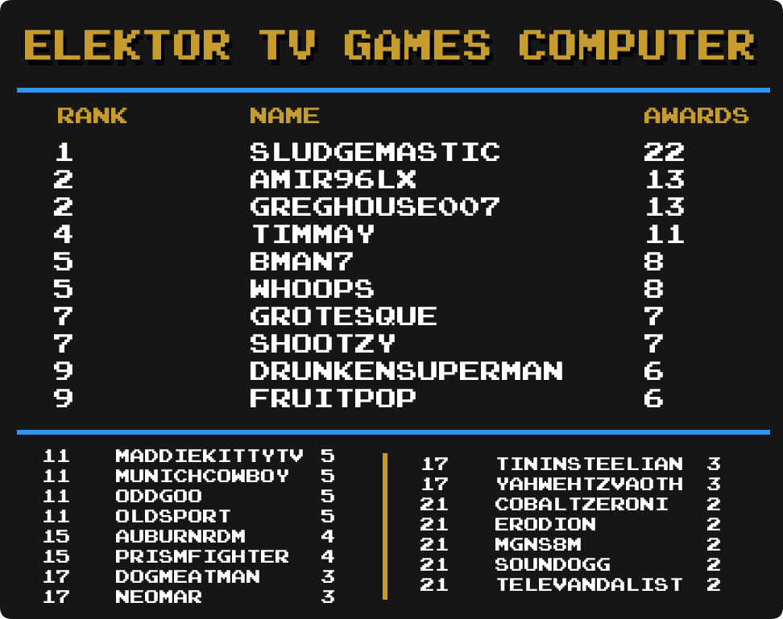

## Intro

We are going to take a look at another metric for greatness, Mastery Awards. Mastery awards are given to users when they complete every achievement for a given set in hardcore mode. Users wear mastery awards as a badge of honor on their profile page representing all the hard work they put into truly becoming a master of the game.

Below we will take a look at which users rank among the best with the most mastery awards in several categories well as notable updates from the previous month to each individual category. Check to see how you rank among the rest of the community members.

Special thanks to  for creating the ranking image templates.

\* Data as of September 1st 2023.

 

## Current Champions

<table>
    <tr style="text-align: left;"><th>:joystick: Category</th><th>:trophy: Champions</th><th>Mastery Awards</th></tr>
    <tr><td>
            
Total Awards

</td>               <td></td>                                 <td>1141</td><td><!--     --></td></tr>
    <tr><td>
            
Event Awards

</td>               <td></td>                             <td>22</td><td><!-- 101 --></td></tr>
    <tr><td>
            
Site Awards

</td>                <td></td>                          <td>28</td><td><!-- 101 --></td></tr>
    <tr><td>
            
Hacks

</td>                      <td></td>                            <td>236</td><td><!--     --></td></tr>
    <tr><td>
            
Homebrews

</td>                  <td></td>                              <td>228</td><td><!--     --></td></tr>
    <tr><td>
            
Subsets

</td>                    <td></td>                             <td>21</td><td><!--     --></td></tr>
    <tr><td>
            
3DO Interactive Multiplayer

</td><td> </td>      <td>12</td><td><!-- 43  --></td></tr>
    <tr><td>
            
Amstrad CPC

</td>                <td></td>                           <td>15</td><td><!-- 37  --></td></tr>
    <tr><td>
       
Apple II

</td>                   <td></td>                             <td>20</td><td><!-- 38  --></td></tr>
    <tr><td>
         
Arcade

</td>                     <td></td>                                <td>68</td><td><!-- 27  --></td></tr>
    <tr><td>
    
Arcadia 2001

</td>               <td></td>                           <td>19</td><td><!-- 73  --></td></tr>
    <tr><td>
        
Arduboy

</td>                    <td></td>                             <td>46</td><td><!-- 71  --></td></tr>
    <tr><td>
           
Atari 2600

</td>                 <td></td>                                 <td>121</td><td><!-- 25  --></td></tr>
    <tr><td>
           
Atari 7800

</td>                 <td></td>                                 <td>20</td><td><!-- 51  --></td></tr>
    <tr><td>
         
Atari Jaguar

</td>               <td></td>                                 <td>11</td><td><!-- 17  --></td></tr>
    <tr><td>
      
Atari Jaguar CD

</td>            <td></td>                           <td>8</td><td><!-- 71  --></td></tr>
    <tr><td>
           
Atari Lynx

</td>                 <td> </td>       <td>8</td><td><!-- 13  --></td></tr>
    <tr><td>
   
ColecoVision

</td>               <td></td>                                 <td>23</td><td><!-- 44  --></td></tr>
    <tr><td>
      
Dreamcast

</td>                  <td></td>                            <td>19</td><td><!-- 40  --></td></tr>
    <tr><td>
           
Elektor TV Games Computer

</td>  <td></td>                           <td>22</td><td><!-- 75  --></td></tr>
    <tr><td>
      
Fairchild Channel F

</td>        <td></td>                             <td>30</td><td><!-- 57  --></td></tr>
    <tr><td>
             
Game Boy

</td>                   <td></td>                                <td>144</td><td><!-- 4   --></td></tr>
    <tr><td>
            
Game Boy Advance

</td>           <td></td>                        <td>158</td><td><!-- 5   --></td></tr>
    <tr><td>
            
Game Boy Color

</td>             <td></td>                              <td>111</td><td><!-- 6   --></td></tr>
    <tr><td>
             
Game Gear

</td>                  <td></td>                                 <td>77</td><td><!-- 15  --></td></tr>
    <tr><td>
  
Intellivision

</td>              <td></td>                                 <td>21</td><td><!-- 45  --></td></tr>
    <tr><td>

Interton VC 4000

</td>           <td></td>                           <td>20</td><td><!-- 74  --></td></tr>
    <tr><td>
       
Magnavox Odyssey 2

</td>         <td></td>                                 <td>14</td><td><!-- 23  --></td></tr>
    <tr><td>
  
Master System

</td>              <td></td>                                 <td>96</td><td><!-- 11  --></td></tr>
    <tr><td>
             
Mega Drive

</td>                 <td></td>                                    <td>133</td><td><!-- 1   --></td></tr>
    <tr><td>
      
Mega Duck

</td>                  <td></td>                           <td>12</td><td><!-- 69  --></td></tr>
    <tr><td>
            
MSX

</td>                        <td></td>                                 <td>14</td><td><!-- 29  --></td></tr>
    <tr><td>
            
Nintendo 64

</td>                <td></td>                             <td>36</td><td><!-- 2   --></td></tr>
    <tr><td>
            
Neo Geo Pocket

</td>             <td></td>                              <td>15</td><td><!-- 14  --></td></tr>
    <tr><td>
            
NES

</td>                        <td></td>                              <td>245</td><td><!-- 7   --></td></tr>
    <tr><td>
             
Nintendo DS

</td>                <td></td>                                 <td>100</td><td><!-- 18  --></td></tr>
    <tr><td>
            
Nintendo DSi

</td>               <td></td>                            <td>30</td><td><!-- 78  --></td></tr>
    <tr><td>
            
PC Engine

</td>                  <td></td>                               <td>36</td><td><!-- 8   --></td></tr>
    <tr><td>
   
PC Engine CD

</td>               <td> </td>   <td>10</td><td><!-- 76  --></td></tr>
    <tr><td>
    
PC-8000/8800

</td>               <td></td>                                   <td>14</td><td><!-- 47  --></td></tr>
    <tr><td>
          
PC-FX

</td>                      <td></td>                                 <td>7</td><td><!-- 49  --></td></tr>
    <tr><td>
            
PlayStation

</td>                <td></td>                                 <td>112</td><td><!-- 12  --></td></tr>
    <tr><td>
            
PlayStation 2

</td>              <td></td>                               <td>56</td><td><!-- 21  --></td></tr>
    <tr><td>
            
PlayStation Portable

</td>       <td></td>                                 <td>52</td><td><!-- 41  --></td></tr>
    <tr><td>
   
Pokémon Mini

</td>               <td></td>                             <td>36</td><td><!-- 24  --></td></tr>
    <tr><td>
            
Sega 32X

</td>                   <td></td>                                <td>5</td><td><!-- 10  --></td></tr>
    <tr><td>
         
Sega Saturn

</td>                <td></td>                                   <td>16</td><td><!-- 39  --></td></tr>
    <tr><td>
            
Sega CD

</td>                    <td></td>                                 <td>17</td><td><!-- 9   --></td></tr>
    <tr><td>
        
SG-1000

</td>                    <td></td>                                 <td>17</td><td><!-- 33  --></td></tr>
    <tr><td>
           
SNES

</td>                       <td></td>                              <td>223</td><td><!-- 3   --></td></tr>
    <tr><td>
            
Uzebox

</td>                     <td></td>                           <td>18</td><td><!-- 80  --></td></tr>
    <tr><td>
        
Vectrex

</td>                    <td></td>                                 <td>13</td><td><!-- 46  --></td></tr>
    <tr><td>
    
Virtual Boy

</td>                <td></td>                                 <td>18</td><td><!-- 28  --></td></tr>
    <tr><td>
         
WASM-4

</td>                     <td></td>                               <td>50</td><td><!-- 72  --></td></tr>
    <tr><td>
    
Watara Supervision

</td>         <td></td>                           <td>47</td><td><!-- 63  --></td></tr>
    <tr><td>
     
WonderSwan

</td>                 <td></td>                                <td>5</td><td><!-- 53  --></td></tr>
</table>

## Notable Milestones

### 1,100 Mastery Awards

||||

### 700 Mastery Awards

||||

### 600 Mastery Awards

||||

### 400 Mastery Awards

||||

### 300 Mastery Awards

||||
||||

### 200 Mastery Awards

||||

### 100 Mastery Awards

||||
||||
||||
||||

## Category Rankings

### Total Awards

  

*  remains in 1st with 1141 total mastery awards.
*  has moved up 2 spots and is in 9th place.
*  has moved up 1 spot and is in 13rd place.
*  has moved up 3 spots and is in 20th place.
*  has made it into the top 25 and is in 23rd place.
*  has moved up 1 spot and is in 24th place.

### Total Awards (Excluding Hacks)

  

*  remains in 1st with 1117 total mastery awards.
*  has moved up 1 spot and is in 6th place.
*  has moved up 1 spot and is in 7th place.
*  has moved up 1 spot and is in 11st place.
*  has moved up 1 spot and is in 13rd place.
*  has moved up 1 spot and is in 14th place.
*  has moved up 1 spot and is in 16th place.
*  has moved up 1 spot and is in 20th place.
*  has moved up 1 spot and is in 22nd place.
*  has made it into the top 25 and is in 25th place.

### Event Awards

  

*  remains in 1st with 22 total mastery awards.
*  has moved up 1 spot and is tied for 10th place.
*  has moved up 3 spots and is in a 3-way tie for 12nd place.
*  has moved up 2 spots and is in a 3-way tie for 12nd place.
*  has moved up 8 spots and is in a 4-way tie for 15th place.
*  has moved up 2 spots and is in a 4-way tie for 15th place.
*  has moved up 2 spots and is in a 6-way tie for 19th place.

### Site Awards

  

*  has taken 1st place with 28 total mastery awards.
*  has moved up 2 spots and is in 4th place.
*  has moved up 1 spot and is tied for 7th place.
*  has moved up 3 spots and is in 11st place.
*  has moved up 5 spots and is in a 8-way tie for 14th place.
*  has moved up 5 spots and is in a 8-way tie for 14th place.
*  has moved up 1 spot and is in a 8-way tie for 14th place.
*  has moved up 1 spot and is tied for 22nd place.
*  has made it into the top 25 and is in a 3-way tie for 24th place.

### Hack Awards

  

*  has taken 1st place with 236 total mastery awards.
*  has moved up 1 spot and is in 2nd place.
*  has moved up 2 spots and is in 3rd place.
*  has moved up 1 spot and is in 5th place.
*  has moved up 1 spot and is in 6th place.
*  has moved up 1 spot and is in 7th place.
*  has moved up 1 spot and is in 8th place.
*  has moved up 1 spot and is in 9th place.
*  has moved up 1 spot and is tied for 10th place.
*  has moved up 1 spot and is tied for 10th place.
*  has moved up 1 spot and is in 12nd place.
*  has moved up 1 spot and is tied for 13rd place.
*  has moved up 2 spots and is tied for 13rd place.
*  has moved up 1 spot and is tied for 15th place.
*  has moved up 1 spot and is in 17th place.
*  has moved up 1 spot and is tied for 18th place.
*  has moved up 1 spot and is tied for 18th place.
*  has moved up 2 spots and is tied for 20th place.
*  has moved up 2 spots and is in 22nd place.
*  has made it into the top 25 and is tied for 24th place.

### Homebrew Awards

  

*  remains in 1st with 228 total mastery awards.
*  has moved up 1 spot and is tied for 5th place.
*  has moved up 5 spots and is in 11st place.
*  has moved up 1 spot and is tied for 13rd place.
*  has moved up 1 spot and is in 17th place.
*  has moved up 1 spot and is tied for 18th place.
*  has moved up 3 spots and is in 20th place.
*  has made it into the top 25 and is in 24th place.
*  has made it into the top 25 and is in 25th place.

### Subset Awards

  

*  has taken 1st place with 21 total mastery awards.
*  has moved up 2 spots and is in 2nd place.
*  has moved up 5 spots and is tied for 3rd place.
*  has moved up 3 spots and is in a 4-way tie for 5th place.
*  has moved up 1 spot and is in 9th place.
*  has moved up 1 spot and is in 10th place.
*  has moved up 1 spot and is in a 8-way tie for 11st place.
*  has moved up 1 spot and is in a 8-way tie for 11st place.
*  has moved up 7 spots and is in a 8-way tie for 11st place.
*  has moved up 7 spots and is in a 8-way tie for 11st place.
*  has moved up 5 spots and is in a 6-way tie for 19th place.
*  has made it into the top 25 and is in a 5-way tie for 25th place.

---

### Amstrad CPC

  

*  remains in 1st with 15 total mastery awards.

### Apple II

  

*  remains in 1st with 20 total mastery awards.
*  has moved up 2 spots and is in a 5-way tie for 7th place.

### Arcade

  

*  has taken 1st place with 68 total mastery awards.
*  has moved up 2 spots and is in 3rd place.
*  has moved up 2 spots and is in 5th place.
*  has moved up 1 spot and is in 7th place.
*  has moved up 2 spots and is in 8th place.
*  has moved up 1 spot and is in 10th place.
*  has moved up 1 spot and is in 11st place.
*  has moved up 1 spot and is in 12nd place.
*  has moved up 1 spot and is in 13rd place.
*  has moved up 1 spot and is in a 3-way tie for 14th place.
*  has moved up 1 spot and is in a 3-way tie for 14th place.
*  has moved up 1 spot and is in a 3-way tie for 14th place.
*  has moved up 1 spot and is in 17th place.
*  has moved up 1 spot and is tied for 18th place.
*  has moved up 4 spots and is tied for 18th place.
*  has made it into the top 25 and is tied for 20th place.
*  has made it into the top 25 and is in a 5-way tie for 22nd place.

### Arcadia 2001

  

*  remains in 1st with 19 total mastery awards.
*  has made it into the top 25 and is tied for 4th place.
*  has moved up 3 spots and is in a 6-way tie for 6th place.
*  has made it into the top 25 and is in a 6-way tie for 6th place.
*  has made it into the top 25 and is in a 18-way tie for 12nd place.
*  has made it into the top 25 and is in a 18-way tie for 12nd place.
*  has made it into the top 25 and is in a 18-way tie for 12nd place.
*  has made it into the top 25 and is in a 18-way tie for 12nd place.
*  has made it into the top 25 and is in a 18-way tie for 12nd place.
*  has made it into the top 25 and is in a 18-way tie for 12nd place.

### Arduboy

  

*  remains in 1st with 46 total mastery awards.
*  has moved up 3 spots and is tied for 2nd place.
*  has moved up 1 spot and is in 10th place.
*  has moved up 3 spots and is in 17th place.
*  has moved up 5 spots and is in a 4-way tie for 18th place.
*  has made it into the top 25 and is in 22nd place.

### Atari 2600

  

*  remains in 1st with 121 total mastery awards.
*  has moved up 1 spot and is in 17th place.
*  has moved up 2 spots and is in a 3-way tie for 20th place.
*  has made it into the top 25 and is in 25th place.

### Atari Jaguar CD

  

*  remains in 1st with 8 total mastery awards.
*  has moved up 2 spots and is in a 3-way tie for 3rd place.
*  has moved up 2 spots and is in a 3-way tie for 6th place.
*  has made it into the top 25 and is in a 13-way tie for 13rd place.
*  has made it into the top 25 and is in a 13-way tie for 13rd place.
*  has made it into the top 25 and is in a 13-way tie for 13rd place.

### Dreamcast

  

*  remains in 1st with 19 total mastery awards.
*  has moved up 4 spots and is in 5th place.
*  has made it into the top 25 and is in a 8-way tie for 11st place.
*  has made it into the top 25 and is in a 11-way tie for 19th place.

### Elektor TV Games Computer

  

*  remains in 1st with 22 total mastery awards.
*  has moved up 10 spots and is in 4th place.
*  has made it into the top 25 and is tied for 9th place.
*  has made it into the top 25 and is in a 4-way tie for 11st place.
*  has moved up 6 spots and is in a 4-way tie for 17th place.
*  has made it into the top 25 and is in a 4-way tie for 17th place.
*  has made it into the top 25 and is in a 7-way tie for 21st place.

### Fairchild Channel F

  

*  has taken 1st place with 30 total mastery awards.
*  has moved up 1 spot and is in 6th place.
*  has made it into the top 25 and is in 12nd place.
*  has moved up 5 spots and is in a 5-way tie for 20th place.
*  has moved up 2 spots and is in a 5-way tie for 20th place.
*  has made it into the top 25 and is in a 5-way tie for 20th place.

### Game Boy

  

*  remains in 1st with 144 total mastery awards.
*  has moved up 1 spot and is in 6th place.
*  has moved up 11 spot and is in 10th place.
*  has moved up 2 spots and is tied for 11st place.
*  has moved up 1 spot and is in 16th place.
*  has moved up 1 spot and is in 17th place.
*  has moved up 2 spots and is in a 3-way tie for 21st place.
*  has moved up 1 spot and is in a 3-way tie for 21st place.
*  has moved up 1 spot and is tied for 24th place.
*  has made it into the top 25 and is tied for 24th place.

### Game Boy Advance

  

*  remains in 1st with 158 total mastery awards.
*  has moved up 4 spots and is tied for 4th place.
*  has moved up 1 spot and is tied for 9th place.
*  has moved up 1 spot and is tied for 11st place.
*  has moved up 1 spot and is in 16th place.
*  has moved up 1 spot and is in 18th place.
*  has moved up 1 spot and is in 22nd place.
*  has made it into the top 25 and is in 23rd place.

### Game Boy Color

  

*  remains in 1st with 111 total mastery awards.
*  has moved up 1 spot and is in 15th place.
*  has moved up 4 spots and is in a 4-way tie for 16th place.
*  has moved up 1 spot and is tied for 21st place.
*  has made it into the top 25 and is tied for 23rd place.

### Game Gear

  

*  remains in 1st with 77 total mastery awards.
*  has moved up 9 spots and is in 14th place.
*  has moved up 8 spots and is in a 4-way tie for 16th place.
*  has made it into the top 25 and is in a 5-way tie for 22nd place.

### Interton VC 4000

  

*  remains in 1st with 20 total mastery awards.
*  has made it into the top 25 and is in 2nd place.
*  has made it into the top 25 and is in 3rd place.
*  has made it into the top 25 and is in 14th place.
*  has made it into the top 25 and is in a 23-way tie for 17th place.
*  has made it into the top 25 and is in a 23-way tie for 17th place.
*  has made it into the top 25 and is in a 23-way tie for 17th place.
*  has made it into the top 25 and is in a 23-way tie for 17th place.

### Master System

  

*  remains in 1st with 96 total mastery awards.
*  has moved up 1 spot and is in 8th place.
*  has moved up 2 spots and is in 9th place.
*  has moved up 2 spots and is in a 4-way tie for 13rd place.
*  has moved up 1 spot and is in a 4-way tie for 13rd place.
*  has moved up 6 spots and is in a 3-way tie for 17th place.

### Mega Drive

  

*  remains in 1st with 133 total mastery awards.
*  has moved up 1 spot and is tied for 2nd place.
*  has moved up 1 spot and is tied for 4th place.
*  has moved up 1 spot and is in a 3-way tie for 20th place.
*  has made it into the top 25 and is in 23rd place.

### Mega Duck

  

*  remains in 1st with 12 total mastery awards.
*  has moved up 2 spots and is in 3rd place.
*  has made it into the top 25 and is in a 6-way tie for 12nd place.

### Nintendo 64

  

*  remains in 1st with 36 total mastery awards.
*  has moved up 1 spot and is tied for 14th place.

### NES

  

*  remains in 1st with 245 total mastery awards.
*  has moved up 1 spot and is in 3rd place.
*  has moved up 1 spot and is in 4th place.
*  has moved up 1 spot and is in 5th place.
*  has moved up 1 spot and is in 6th place.
*  has moved up 1 spot and is in 7th place.
*  has moved up 1 spot and is in 8th place.
*  has moved up 1 spot and is in 9th place.
*  has moved up 1 spot and is in 10th place.
*  has moved up 1 spot and is in 11st place.
*  has moved up 1 spot and is in 12nd place.
*  has moved up 1 spot and is in 13rd place.
*  has moved up 1 spot and is in 14th place.
*  has moved up 1 spot and is in 15th place.
*  has moved up 2 spots and is in 16th place.
*  has moved up 3 spots and is tied for 18th place.
*  has moved up 4 spots and is tied for 18th place.
*  has moved up 1 spot and is in 23rd place.
*  has moved up 1 spot and is in 24th place.
*  has made it into the top 25 and is in 25th place.

### Nintendo DS

  

*  remains in 1st with 100 total mastery awards.
*  has moved up 3 spots and is tied for 7th place.
*  has moved up 8 spots and is in 9th place.
*  has moved up 2 spots and is in a 4-way tie for 10th place.
*  has moved up 1 spot and is in a 3-way tie for 17th place.
*  has moved up 1 spot and is in a 3-way tie for 17th place.
*  has made it into the top 25 and is in a 3-way tie for 20th place.
*  has made it into the top 25 and is in a 3-way tie for 23rd place.
*  has made it into the top 25 and is in a 3-way tie for 23rd place.
*  has made it into the top 25 and is in a 3-way tie for 23rd place.

### Nintendo DSi

  

*  remains in 1st with 30 total mastery awards.
*  has moved up 2 spots and is tied for 7th place.
*  has moved up 1 spot and is tied for 12nd place.
*  has made it into the top 25 and is in a 12-way tie for 21st place.

### PC Engine

  

*  remains in 1st with 36 total mastery awards.
*  has moved up 2 spots and is in a 3-way tie for 17th place.

### PC Engine CD

  

*  and  remain in 1st with 10 total mastery awards.
*  has moved up 1 spot and is in a 3-way tie for 5th place.
*  has moved up 12 spots and is in a 6-way tie for 10th place.
*  has moved up 13 spots and is in a 6-way tie for 10th place.
*  has made it into the top 25 and is in a 6-way tie for 10th place.
*  has made it into the top 25 and is in a 6-way tie for 10th place.
*  has made it into the top 25 and is in a 23-way tie for 16th place.
*  has made it into the top 25 and is in a 23-way tie for 16th place.

### PC-8000/8800

  

*  remains in 1st with 14 total mastery awards.
*  has moved up 2 spots and is in a 3-way tie for 6th place.

### PlayStation

  

*  remains in 1st with 112 total mastery awards.
*  has moved up 3 spots and is in 4th place.
*  has moved up 2 spots and is in 12nd place.
*  has moved up 3 spots and is in 14th place.
*  has moved up 1 spot and is in 18th place.
*  has made it into the top 25 and is tied for 19th place.
*  has moved up 1 spot and is in 22nd place.

### PlayStation 2

  

*  remains in 1st with 56 total mastery awards.
*  has moved up 4 spots and is in 3rd place.
*  has moved up 2 spots and is in 4th place.
*  has moved up 5 spots and is in a 3-way tie for 5th place.
*  has moved up 2 spots and is in a 3-way tie for 5th place.
*  has moved up 2 spots and is in 10th place.
*  has moved up 3 spots and is tied for 11st place.
*  has moved up 2 spots and is tied for 14th place.
*  has moved up 8 spots and is tied for 14th place.
*  has moved up 2 spots and is in a 3-way tie for 16th place.
*  has moved up 2 spots and is in a 3-way tie for 16th place.
*  has made it into the top 25 and is in a 3-way tie for 19th place.
*  has moved up 2 spots and is in a 3-way tie for 22nd place.
*  has made it into the top 25 and is in a 3-way tie for 22nd place.
*  has made it into the top 25 and is in a 3-way tie for 25th place.

### PlayStation Portable

  

*  remains in 1st with 52 total mastery awards.
*  has moved up 4 spots and is in a 3-way tie for 7th place.
*  has made it into the top 25 and is tied for 12nd place.
*  has moved up 2 spots and is in a 4-way tie for 14th place.
*  has moved up 3 spots and is in a 5-way tie for 18th place.
*  has made it into the top 25 and is in a 5-way tie for 23rd place.

### Pokémon Mini

  

*  remains in 1st with 36 total mastery awards.
*  has moved up 2 spots and is in 4th place.
*  has moved up 3 spots and is tied for 9th place.
*  has made it into the top 25 and is in a 4-way tie for 15th place.
*  has moved up 5 spots and is in a 3-way tie for 19th place.
*  has made it into the top 25 and is in a 8-way tie for 22nd place.

### Sega Saturn

  

*  remains in 1st with 16 total mastery awards.
*  has made it into the top 25 and is in a 10-way tie for 11st place.
*  has made it into the top 25 and is in a 16-way tie for 21st place.

### Sega CD

  

*  remains in 1st with 17 total mastery awards.
*  has moved up 2 spots and is in a 3-way tie for 3rd place.
*  has moved up 8 spots and is in a 7-way tie for 6th place.
*  has made it into the top 25 and is in a 10-way tie for 13rd place.
*  has made it into the top 25 and is in a 10-way tie for 13rd place.

### SNES

  

*  remains in 1st with 223 total mastery awards.
*  has moved up 1 spot and is in 3rd place.
*  has moved up 1 spot and is in a 3-way tie for 6th place.
*  has moved up 3 spots and is tied for 14th place.
*  has moved up 2 spots and is in 22nd place.

### Uzebox

  

* , , and  take the top 3 spots for the first Uzebox leaderboard.

### Virtual Boy

  

*  remains in 1st with 18 total mastery awards.
*  has moved up 2 spots and is in a 4-way tie for 6th place.
*  has moved up 2 spots and is in a 4-way tie for 6th place.
*  has moved up 2 spots and is in a 4-way tie for 6th place.
*  has moved up 1 spot and is tied for 12nd place.
*  has moved up 6 spots and is in a 6-way tie for 14th place.
*  has moved up 5 spots and is in a 6-way tie for 14th place.
*  has made it into the top 25 and is in a 8-way tie for 20th place.
*  has made it into the top 25 and is in a 8-way tie for 20th place.
*  has made it into the top 25 and is in a 8-way tie for 20th place.

### WASM-4

  

*  remains in 1st with 50 total mastery awards.
*  has moved up 1 spot and is tied for 6th place.
*  has moved up 2 spots and is tied for 22nd place.
*  has made it into the top 25 and is tied for 25th place.

### Watara Supervision

  

*  remains in 1st with 47 total mastery awards.
*  has made it into the top 25 and is tied for 20th place.
