## Intro

We are going to take a look at another metric for greatness, Mastery Awards. Mastery awards are given to users when they complete every achievement for a given set in hardcore mode. Users wear mastery awards as a badge of honor on their profile page representing all the hard work they put into truly becoming a master of the game.

Below we will take a look at which users rank among the best with the most mastery awards in several categories well as notable updates from the previous month to each individual category. Check to see how you rank among the rest of the community members.

Special thanks to  for creating the ranking image templates.

\* Data as of October 1st 2023.

 

## Current Champions

<table>
    <tr style="text-align: left;"><th>:joystick: Category</th><th>:trophy: Champions</th><th>Mastery Awards</th></tr>
    <tr><td>
            
Total Awards

</td>               <td></td>                               <td>1173</td><td><!--     --></td></tr>
    <tr><td>
            
Event Awards

</td>               <td> </td><td>25</td><td><!-- 101 --></td></tr>
    <tr><td>
            
Site Awards

</td>                <td></td>                          <td>28</td><td><!-- 101 --></td></tr>
    <tr><td>
            
Hacks

</td>                      <td></td>                            <td>261</td><td><!--     --></td></tr>
    <tr><td>
            
Homebrews

</td>                  <td></td>                              <td>230</td><td><!--     --></td></tr>
    <tr><td>
            
Subsets

</td>                    <td></td>                             <td>22</td><td><!--     --></td></tr>
    <tr><td>
            
3DO Interactive Multiplayer

</td><td> </td>      <td>12</td><td><!-- 43  --></td></tr>
    <tr><td>
            
Amstrad CPC

</td>                <td></td>                           <td>15</td><td><!-- 37  --></td></tr>
    <tr><td>
       
Apple II

</td>                   <td></td>                             <td>20</td><td><!-- 38  --></td></tr>
    <tr><td>
         
Arcade

</td>                     <td></td>                                <td>74</td><td><!-- 27  --></td></tr>
    <tr><td>
    
Arcadia 2001

</td>               <td></td>                           <td>19</td><td><!-- 73  --></td></tr>
    <tr><td>
        
Arduboy

</td>                    <td></td>                             <td>46</td><td><!-- 71  --></td></tr>
    <tr><td>
           
Atari 2600

</td>                 <td></td>                                 <td>121</td><td><!-- 25  --></td></tr>
    <tr><td>
           
Atari 7800

</td>                 <td></td>                                 <td>20</td><td><!-- 51  --></td></tr>
    <tr><td>
         
Atari Jaguar

</td>               <td></td>                                 <td>11</td><td><!-- 17  --></td></tr>
    <tr><td>
      
Atari Jaguar CD

</td>            <td></td>                           <td>8</td><td><!-- 71  --></td></tr>
    <tr><td>
           
Atari Lynx

</td>                 <td> </td>       <td>8</td><td><!-- 13  --></td></tr>
    <tr><td>
   
ColecoVision

</td>               <td></td>                                 <td>23</td><td><!-- 44  --></td></tr>
    <tr><td>
      
Dreamcast

</td>                  <td></td>                            <td>19</td><td><!-- 40  --></td></tr>
    <tr><td>
           
Elektor TV Games Computer

</td>  <td></td>                           <td>22</td><td><!-- 75  --></td></tr>
    <tr><td>
      
Fairchild Channel F

</td>        <td></td>                             <td>31</td><td><!-- 57  --></td></tr>
    <tr><td>
             
Game Boy

</td>                   <td></td>                                <td>147</td><td><!-- 4   --></td></tr>
    <tr><td>
            
Game Boy Advance

</td>           <td></td>                        <td>161</td><td><!-- 5   --></td></tr>
    <tr><td>
            
Game Boy Color

</td>             <td></td>                              <td>117</td><td><!-- 6   --></td></tr>
    <tr><td>
             
Game Gear

</td>                  <td></td>                                 <td>78</td><td><!-- 15  --></td></tr>
    <tr><td>
  
Intellivision

</td>              <td></td>                                 <td>21</td><td><!-- 45  --></td></tr>
    <tr><td>

Interton VC 4000

</td>           <td></td>                         <td>21</td><td><!-- 74  --></td></tr>
    <tr><td>
       
Magnavox Odyssey 2

</td>         <td></td>                             <td>16</td><td><!-- 23  --></td></tr>
    <tr><td>
  
Master System

</td>              <td></td>                                 <td>100</td><td><!-- 11  --></td></tr>
    <tr><td>
             
Mega Drive

</td>                 <td></td>                                    <td>134</td><td><!-- 1   --></td></tr>
    <tr><td>
      
Mega Duck

</td>                  <td></td>                           <td>12</td><td><!-- 69  --></td></tr>
    <tr><td>
            
MSX

</td>                        <td></td>                                 <td>14</td><td><!-- 29  --></td></tr>
    <tr><td>
            
Nintendo 64

</td>                <td></td>                             <td>37</td><td><!-- 2   --></td></tr>
    <tr><td>
            
Neo Geo Pocket

</td>             <td></td>                              <td>15</td><td><!-- 14  --></td></tr>
    <tr><td>
            
NES

</td>                        <td></td>                              <td>245</td><td><!-- 7   --></td></tr>
    <tr><td>
             
Nintendo DS

</td>                <td></td>                                 <td>101</td><td><!-- 18  --></td></tr>
    <tr><td>
            
Nintendo DSi

</td>               <td></td>                            <td>30</td><td><!-- 78  --></td></tr>
    <tr><td>
            
PC Engine

</td>                  <td></td>                               <td>36</td><td><!-- 8   --></td></tr>
    <tr><td>
   
PC Engine CD

</td>               <td> </td>   <td>10</td><td><!-- 76  --></td></tr>
    <tr><td>
    
PC-8000/8800

</td>               <td></td>                                   <td>14</td><td><!-- 47  --></td></tr>
    <tr><td>
          
PC-FX

</td>                      <td></td>                                 <td>7</td><td><!-- 49  --></td></tr>
    <tr><td>
            
PlayStation

</td>                <td></td>                                 <td>112</td><td><!-- 12  --></td></tr>
    <tr><td>
            
PlayStation 2

</td>              <td></td>                               <td>62</td><td><!-- 21  --></td></tr>
    <tr><td>
            
PlayStation Portable

</td>       <td></td>                                 <td>52</td><td><!-- 41  --></td></tr>
    <tr><td>
   
Pokémon Mini

</td>               <td></td>                             <td>36</td><td><!-- 24  --></td></tr>
    <tr><td>
            
Sega 32X

</td>                   <td> </td>      <td>5</td><td><!-- 10  --></td></tr>
    <tr><td>
         
Sega Saturn

</td>                <td></td>                                   <td>16</td><td><!-- 39  --></td></tr>
    <tr><td>
            
Sega CD

</td>                    <td></td>                                 <td>17</td><td><!-- 9   --></td></tr>
    <tr><td>
        
SG-1000

</td>                    <td></td>                                 <td>17</td><td><!-- 33  --></td></tr>
    <tr><td>
           
SNES

</td>                       <td></td>                              <td>224</td><td><!-- 3   --></td></tr>
    <tr><td>
            
Uzebox

</td>                     <td></td>                           <td>18</td><td><!-- 80  --></td></tr>
    <tr><td>
        
Vectrex

</td>                    <td></td>                                 <td>13</td><td><!-- 46  --></td></tr>
    <tr><td>
    
Virtual Boy

</td>                <td></td>                                 <td>18</td><td><!-- 28  --></td></tr>
    <tr><td>
         
WASM-4

</td>                     <td></td>                               <td>52</td><td><!-- 72  --></td></tr>
    <tr><td>
    
Watara Supervision

</td>         <td></td>                           <td>47</td><td><!-- 63  --></td></tr>
    <tr><td>
     
WonderSwan

</td>                 <td></td>                           <td>8</td><td><!-- 53  --></td></tr>
</table>

## Notable Milestones

### 600 Mastery Awards

||||

### 500 Mastery Awards

||||

### 400 Mastery Awards

||||
||||

### 300 Mastery Awards

||||

### 200 Mastery Awards

||||

### 100 Mastery Awards

||||
||||
||||
||||
||||

## Category Rankings

### Total Awards

  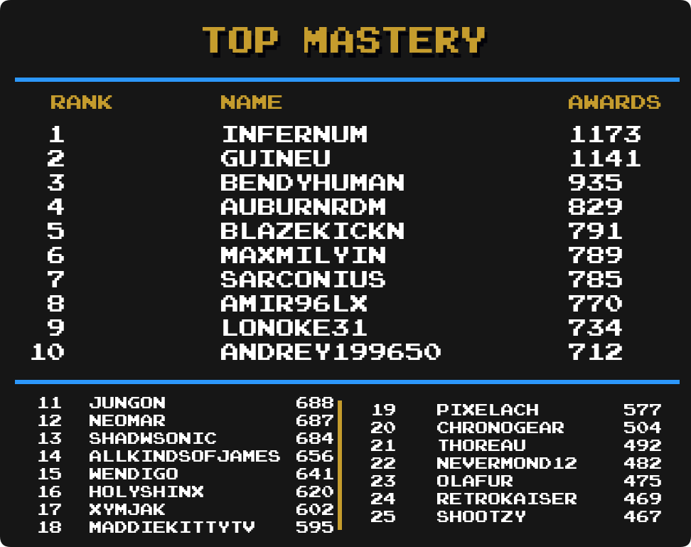

*  has taken 1st place with 1173 total mastery awards.
*  has moved up 1 spot and is in 5th place.
*  has moved up 1 spot and is in 11th place.
*  has moved up 1 spot and is in 12th place.
*  has moved up 1 spot and is in 14th place.
*  has moved up 2 spots and is in 16th place.
*  has moved up 3 spots and is in 22nd place.

### Total Awards (Excluding Hacks)

  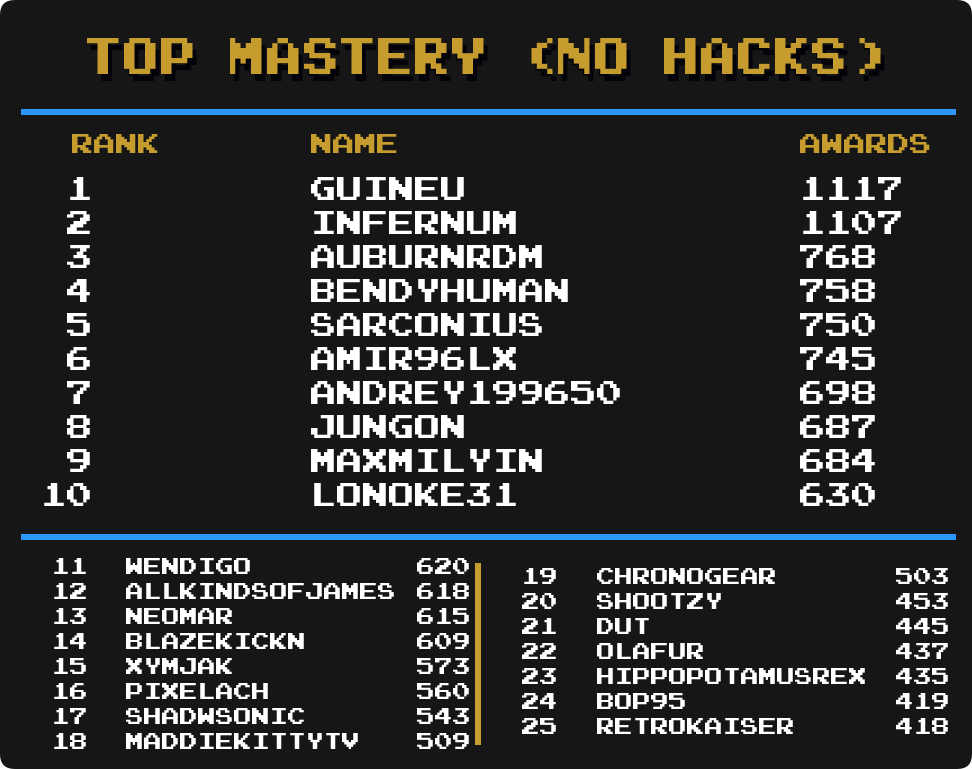

*  remains in 1st with 1117 total mastery awards.
*  has moved up 1 spot and is in 8th place.
*  has moved up 1 spot and is in 10th place.
*  has moved up 1 spot and is in 12th place.
*  has moved up 1 spot and is in 13th place.

### Event Awards

  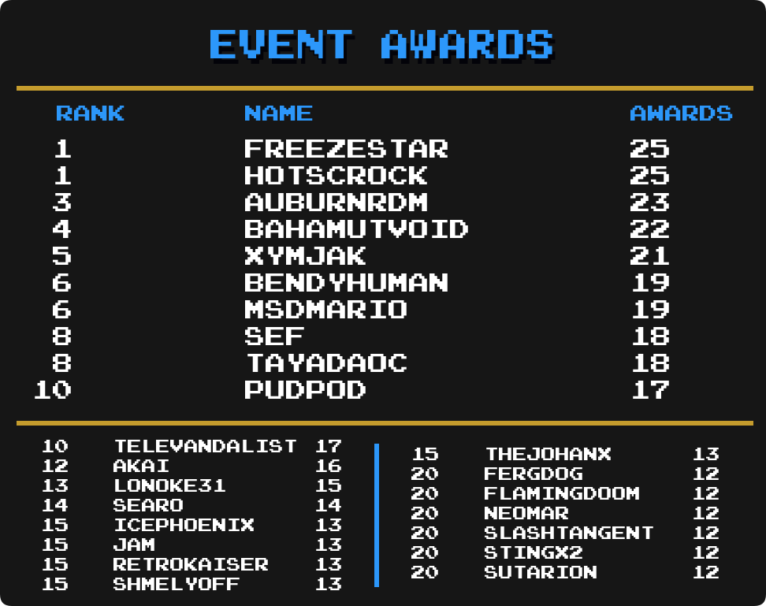

*  has moves into a tie with  for 1st with 25 total mastery awards.
*  has moved up 1 spot and is in 4th place.
*  has moved up 1 spot and is tied for 6th place.
*  has moved up 2 spots and is tied for 8th place.
*  has moved up 2 spots and is tied for 8th place.
*  has moved up 3 spots and is in 12th place.
*  has moved up 8 spots and is in 13th place.
*  has moved up 5 spots and is in a 5-way tie for 15th place.
*  has moved up 1 spot and is in a 5-way tie for 15th place.
*  has moved up 1 spot and is in a 5-way tie for 15th place.
*  has made it into the top 25 and is in a 5-way tie for 15th place.
*  has made it into the top 25 and is in a 8-way tie for 20th place.
*  has made it into the top 25 and is in a 8-way tie for 20th place.
*  has made it into the top 25 and is in a 8-way tie for 20th place.

### Site Awards

  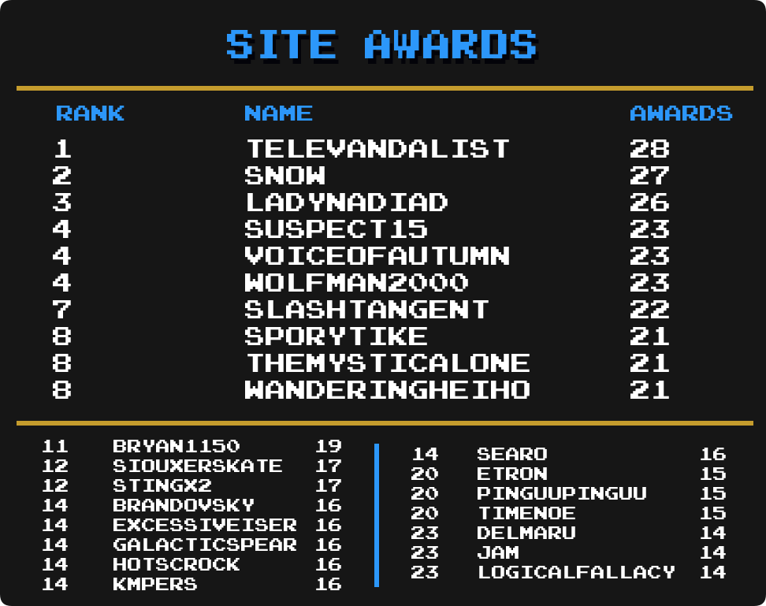

*  remains in 1st with 28 total mastery awards.
*  has moved up 1 spot and is in a 3-way tie for 4th place.
*  has moved up 1 spot and is in a 3-way tie for 4th place.
*  has moved up 1 spot and is in a 3-way tie for 8th place.
*  has moved up 1 spot and is in a 3-way tie for 8th place.
*  has moved up 8 spots and is tied for 12th place.
*  has moved up 4 spots and is in a 3-way tie for 20th place.

### Hack Awards

  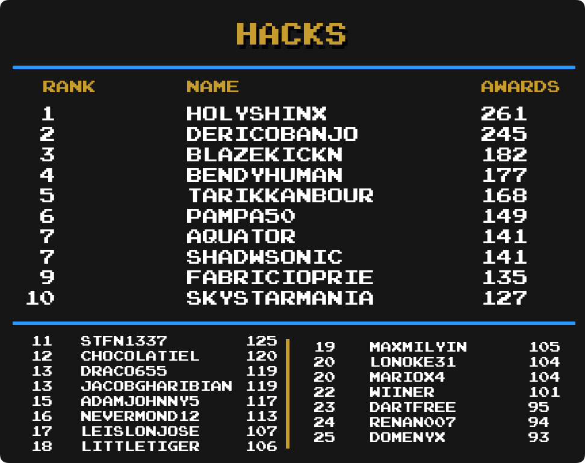

*  has taken 1st place with 261 total mastery awards.
*  has moved up 1 spot and is in 6th place.
*  has moved up 1 spot and is tied for 7th place.
*  has moved up 1 spot and is in 17th place.
*  has moved up 1 spot and is in 19th place.
*  has moved up 2 spots and is tied for 20th place.
*  has moved up 1 spot and is in 24th place.

### Homebrew Awards

  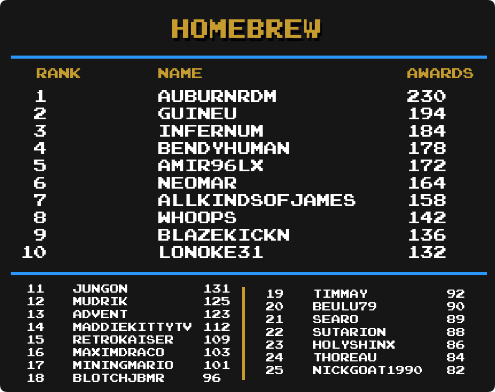

*  remains in 1st with 230 total mastery awards.
*  has moved up 1 spot and is in 3rd place.
*  has moved up 3 spots and is in 8th place.
*  has moved up 3 spots and is in 17th place.
*  has moved up 5 spots and is in 19th place.
*  has moved up 3 spots and is in 22nd place.

### Subset Awards

  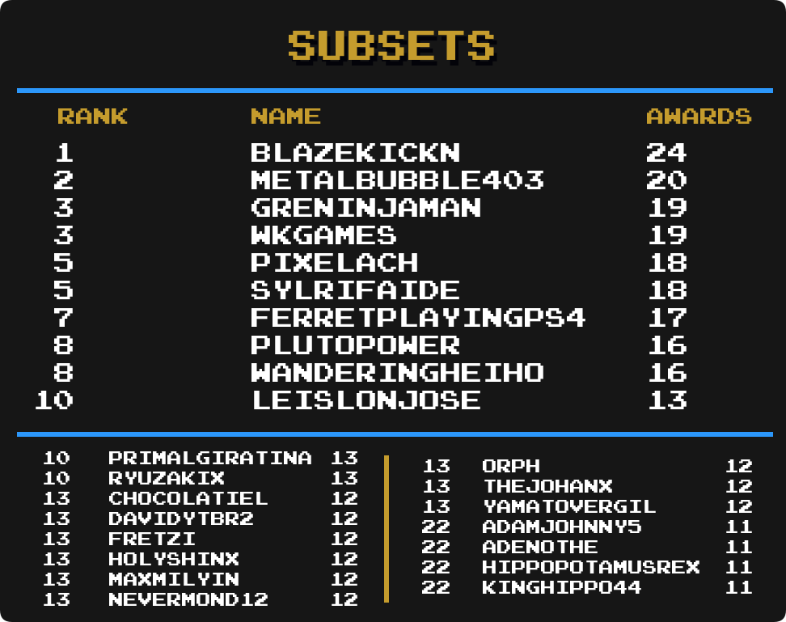

*  remains in 1st with 24 total mastery awards.
*  has moved up 2 spots and is in 2nd place.
*  has moved up 2 spots and is tied for 3rd place.
*  has moved up 1 spot and is tied for 5th place.
*  has moved up 2 spots and is tied for 5th place.
*  has moved up 4 spots and is in a 3-way tie for 10th place.
*  has moved up 4 spots and is in a 3-way tie for 10th place.
*  has made it into the top 25 and is in a 9-way tie for 13th place.
*  has moved up 5 spots and is in a 9-way tie for 13th place.
*  has moved up 4 spots and is in a 9-way tie for 13th place.
*  has made it into the top 25 and is in a 5-way tie for 22nd place.

---

### Amstrad CPC

  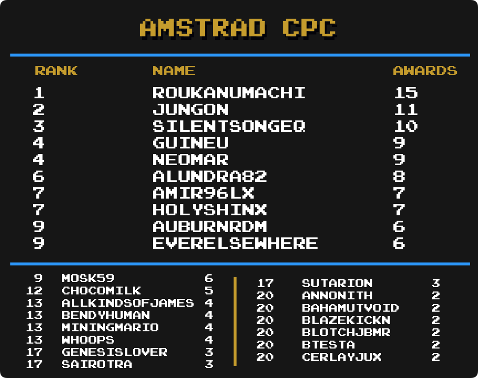

*  remains in 1st with 15 total mastery awards.
*  has moved up 3 spots and is tied for 7th place.
*  has moved up 4 spots and is in a 3-way tie for 9th place.
*  has moved up 3 spots and is in a 4-way tie for 13th place.

### Apple II

  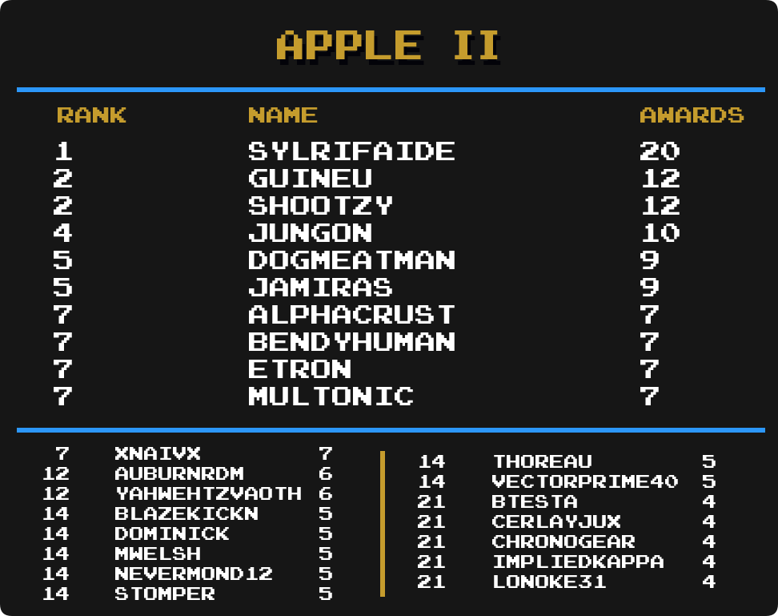

*  remains in 1st with 20 total mastery awards.
*  has moved up 1 spot and is in 4th place.
*  has moved up 1 spot and is tied for 5th place.

### Arcade

  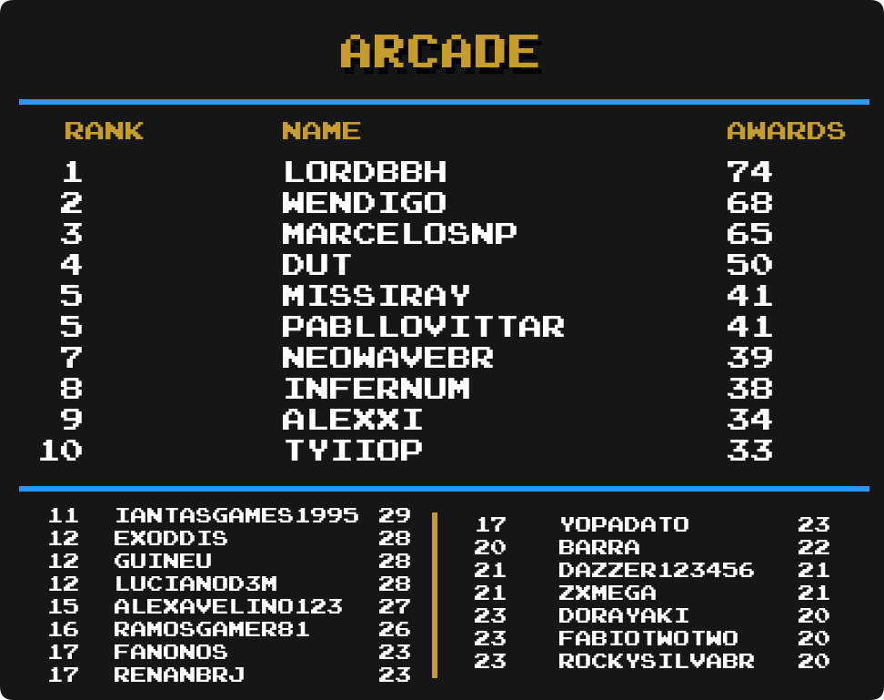

*  has taken 1st place with 74 total mastery awards.
*  has moved up 1 spot and is in 7th place.
*  has moved up 2 spots and is in a 3-way tie for 12th place.
*  has moved up 1 spot and is in a 3-way tie for 12th place.
*  has moved up 7 spots and is in a 3-way tie for 17th place.
*  has moved up 1 spot and is in a 3-way tie for 17th place.

### Arcadia 2001

  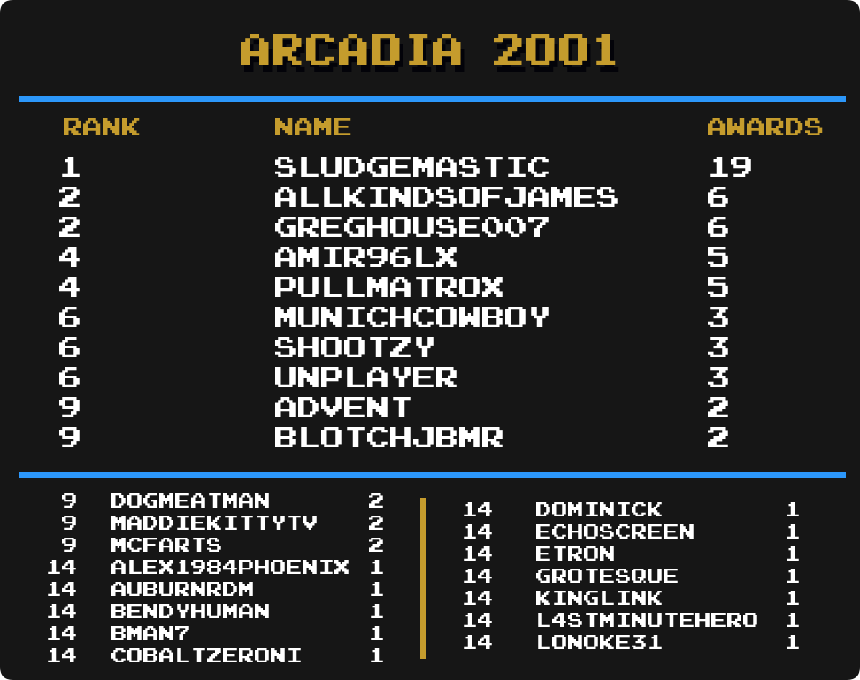

*  remains in 1st with 19 total mastery awards.
*  has made it into the top 25 and is tied for 2nd place.
*  has made it into the top 25 and is tied for 4th place.
*  has moved up 3 spots and is in a 3-way tie for 6th place.
*  has made it into the top 25 and is in a 23-way tie for 14th place.
*  has made it into the top 25 and is in a 23-way tie for 14th place.
*  has made it into the top 25 and is in a 23-way tie for 14th place.
*  has made it into the top 25 and is in a 23-way tie for 14th place.

### Arduboy

  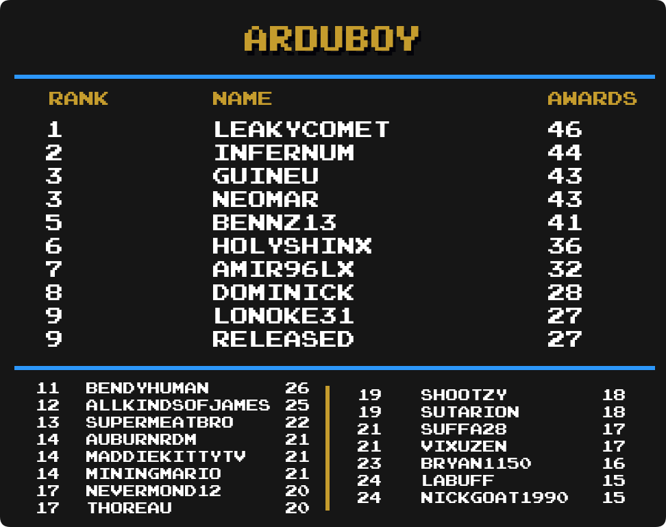

*  remains in 1st with 46 total mastery awards.
*  has moved up 1 spot and is in 2nd place.
*  has moved up 4 spots and is in 8th place.
*  has moved up 1 spot and is in a 3-way tie for 14th place.
*  has made it into the top 25 and is tied for 17th place.
*  has made it into the top 25 and is in a 3-way tie for 24th place.

### Atari 2600

  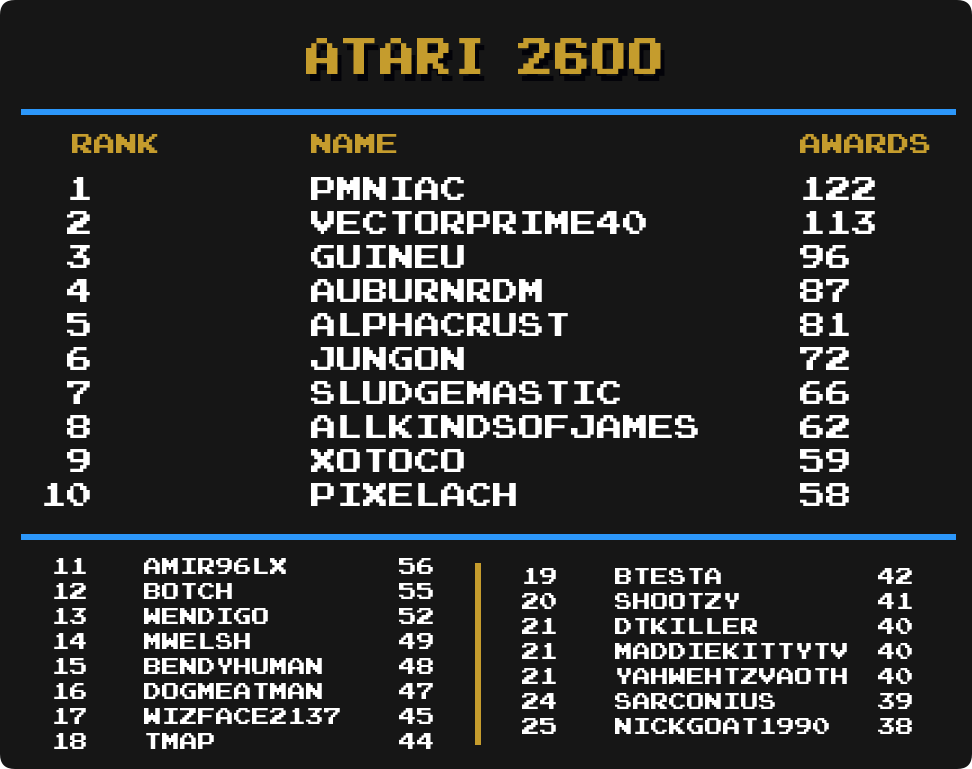

*  remains in 1st with 122 total mastery awards.
*  has moved up 1 spot and is in 9th place.
*  has moved up 1 spot and is in 11th place.
*  has moved up 1 spot and is in 16th place.
*  has made it into the top 25 and is in 18th place.

### Atari Jaguar CD

  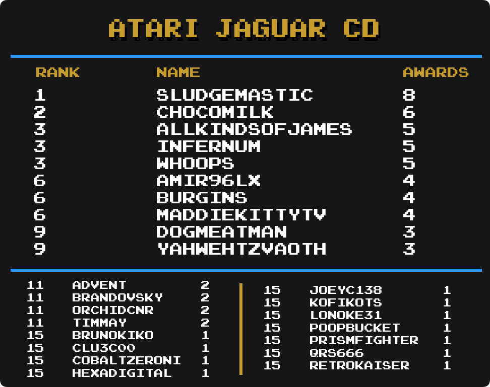

*  remains in 1st with 8 total mastery awards.
*  has made it into the top 25 and is in a 4-way tie for 11th place.
*  has moved up 10 spots and is in a 4-way tie for 11th place.
*  has made it into the top 25 and is in a 14-way tie for 15th place.

### Dreamcast

  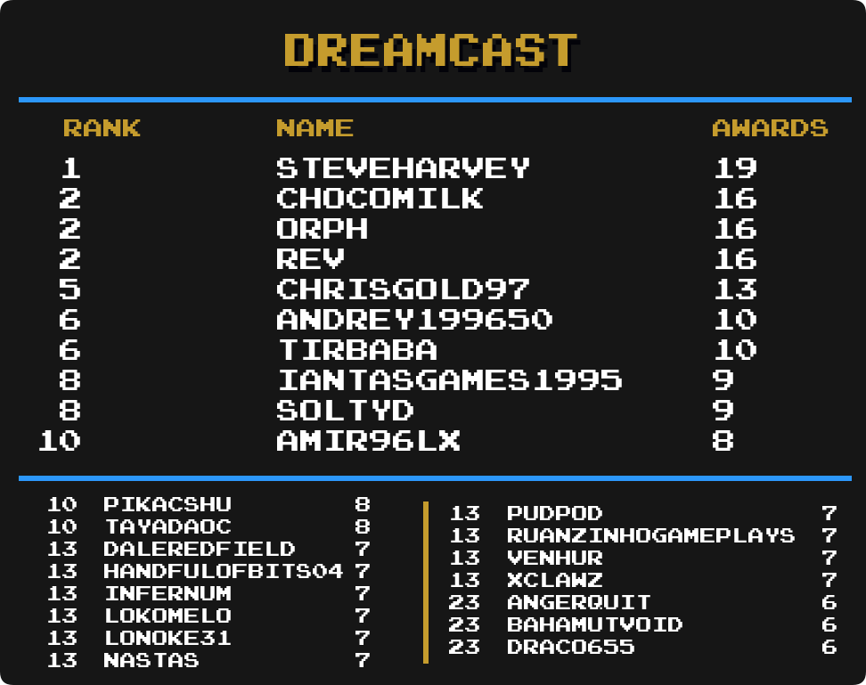

*  remains in 1st with 19 total mastery awards.
*  has moved up 2 spots and is in a 3-way tie for 2nd place.
*  has moved up 15 spots and is in 5th place.
*  has moved up 1 spot and is tied for 6th place.
*  has made it into the top 25 and is in a 3-way tie for 10th place.
*  has moved up 8 spots and is in a 10-way tie for 13th place.
*  has made it into the top 25 and is in a 10-way tie for 13th place.
*  has made it into the top 25 and is in a 11-way tie for 23rd place.

### Elektor TV Games Computer

  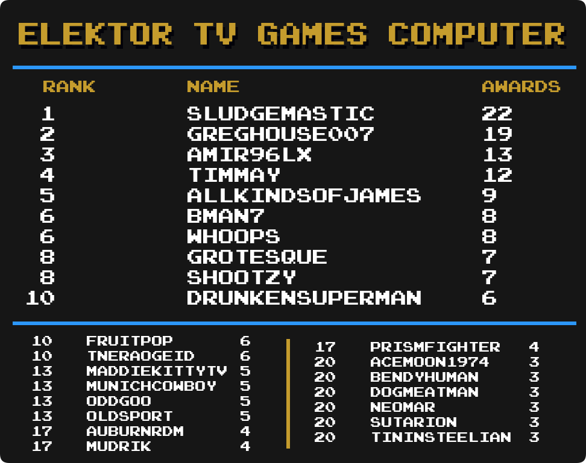

*  remains in 1st with 22 total mastery awards.
*  has moved up 1 spot and is in 2nd place.
*  has made it into the top 25 and is in 5th place.
*  has made it into the top 25 and is in a 3-way tie for 10th place.
*  has made it into the top 25 and is in a 3-way tie for 17th place.
*  has made it into the top 25 and is in a 8-way tie for 20th place.
*  has made it into the top 25 and is in a 8-way tie for 20th place.
*  has made it into the top 25 and is in a 8-way tie for 20th place.

### Fairchild Channel F

  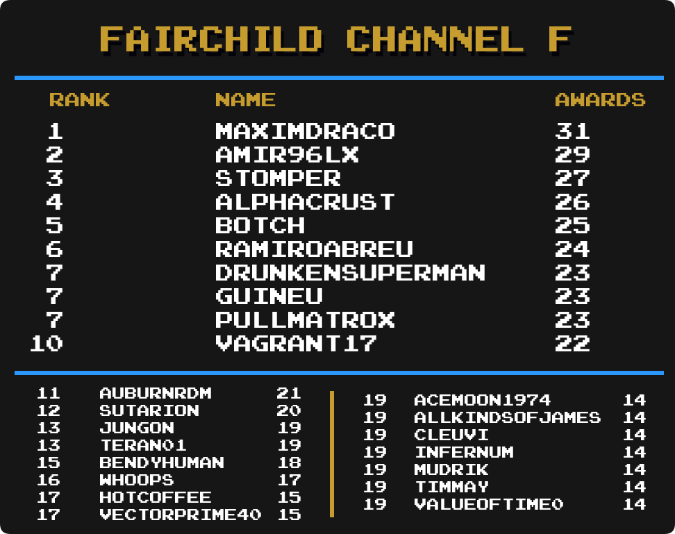

*  remains in 1st with 31 total mastery awards.
*  has moved up 1 spot and is in 3rd place.
*  has moved up 13 spots and is in a 3-way tie for 7th place.
*  has moved up 3 spots and is in a 3-way tie for 7th place.
*  has made it into the top 25 and is tied for 13th place.
*  has moved up 7 spots and is in 16th place.
*  has moved up 6 spots and is in a 7-way tie for 19th place.
*  has made it into the top 25 and is in a 7-way tie for 19th place.

### Game Boy

  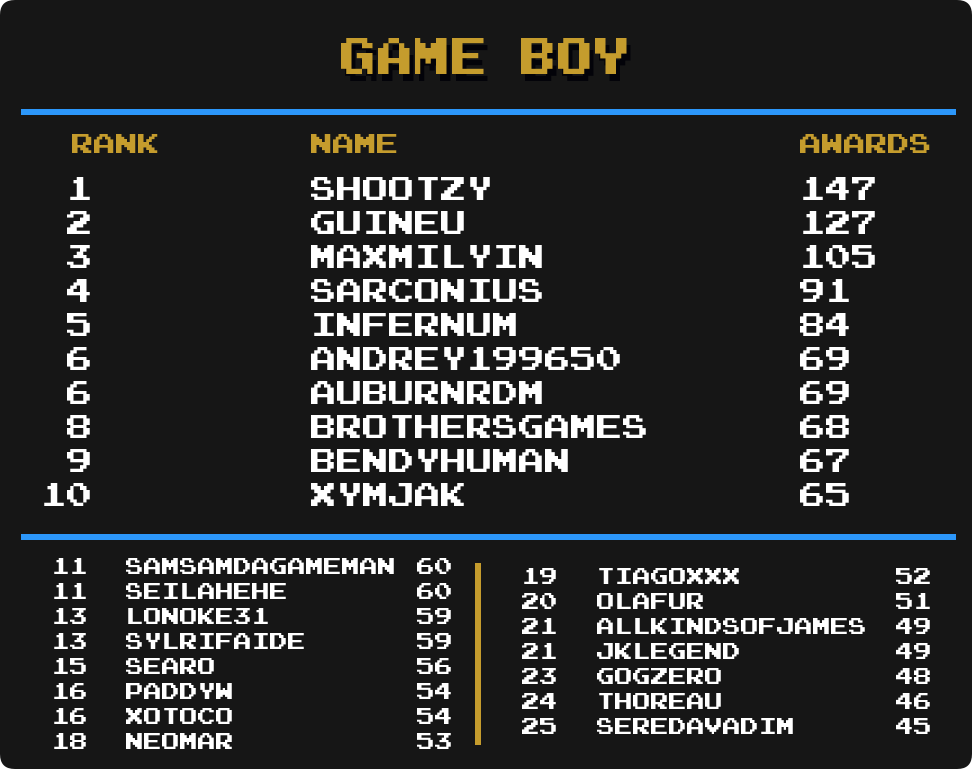

*  remains in 1st with 147 total mastery awards.
*  has moved up 1 spot and is in 4th place.
*  has moved up 2 spots and is in 8th place.
*  has moved up 3 spots and is tied for 11th place.
*  has moved up 7 spots and is tied for 16th place.
*  has moved up 1 spot and is in 24th place.

### Game Boy Advance

  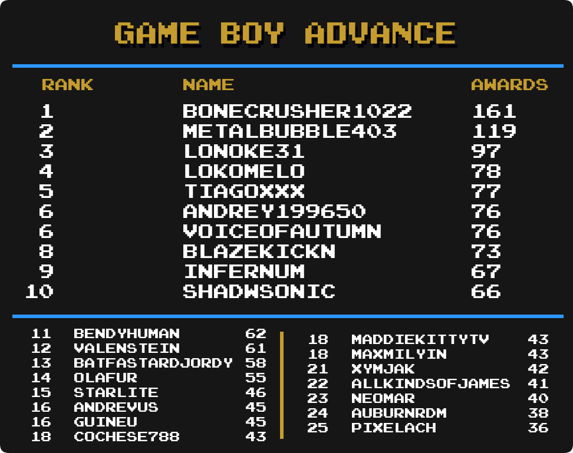

*  remains in 1st with 161 total mastery awards.
*  has moved up 1 spot and is tied for 6th place.
*  has moved up 1 spot and is tied for 16th place.
*  has moved up 4 spots and is in a 3-way tie for 18th place.

### Game Boy Color

  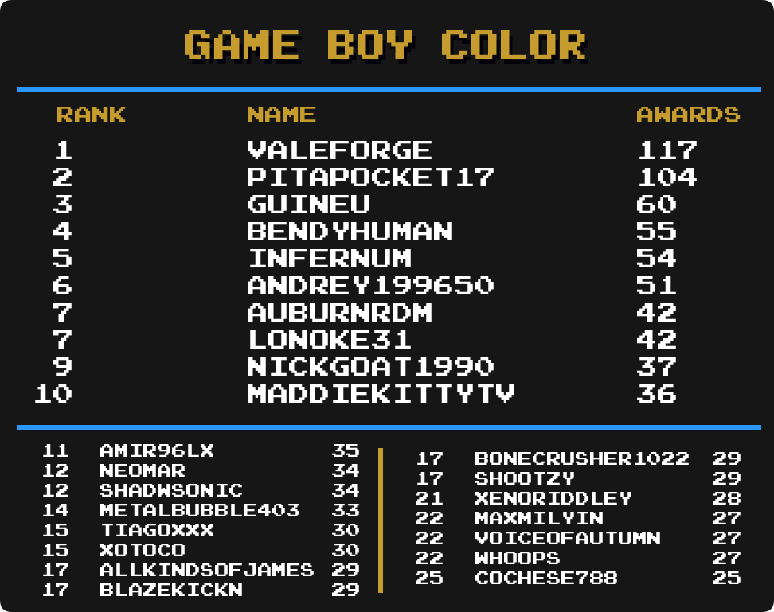

*  remains in 1st with 117 total mastery awards.
*  has moved up 2 spots and is tied for 12th place.
*  has moved up 4 spots and is tied for 15th place.
*  has moved up 3 spots and is in a 4-way tie for 17th place.
*  has made it into the top 25 and is in a 3-way tie for 22nd place.

### Game Gear

  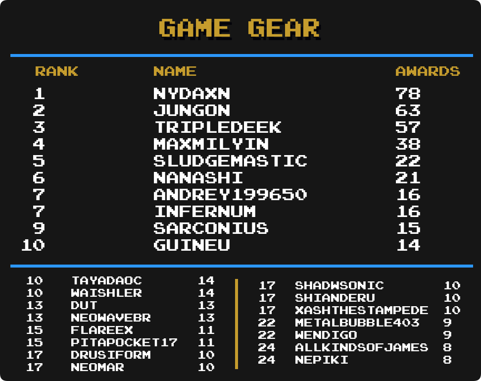

*  remains in 1st with 78 total mastery awards.
*  has moved up 1 spot and is tied for 7th place.
*  has moved up 1 spot and is tied for 15th place.
*  has moved up 5 spots and is in a 5-way tie for 17th place.
*  has moved up 2 spots and is in a 5-way tie for 17th place.
*  has made it into the top 25 and is tied for 22nd place.

### Interton VC 4000

  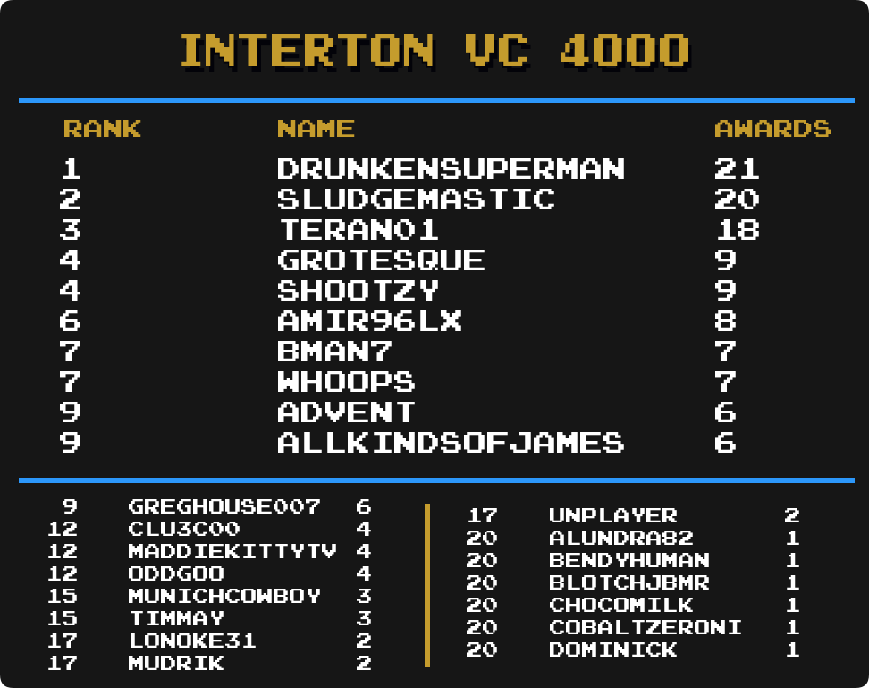

*  has taken 1st place with 21 total mastery awards.
*  has moved up 3 spots and is tied for 7th place.
*  has made it into the top 25 and is in a 3-way tie for 9th place.
*  has made it into the top 25 and is in a 3-way tie for 17th place.
*  has made it into the top 25 and is in a 3-way tie for 17th place.
*  has made it into the top 25 and is in a 25-way tie for 20th place.

### Master System

  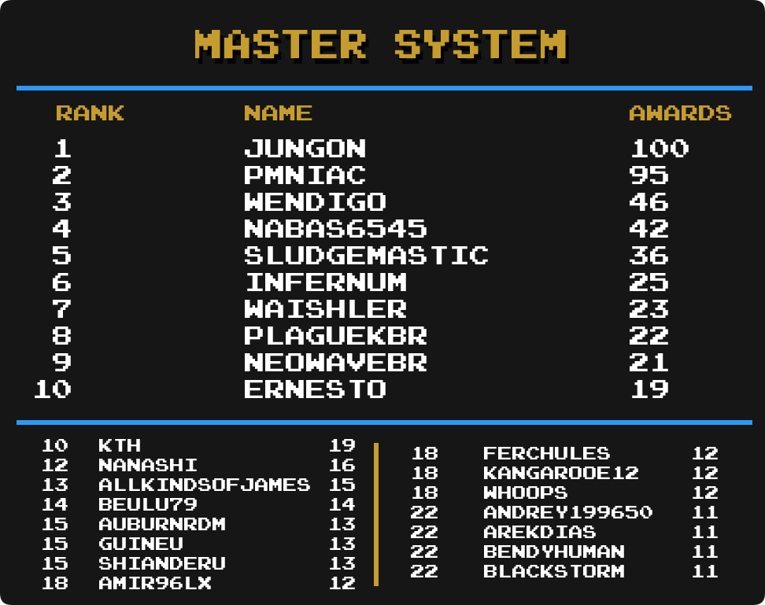

*  remains in 1st with 100 total mastery awards.
*  has moved up 2 spots and is in 6th place.
*  has moved up 1 spot and is in 14th place.
*  has moved up 2 spots and is in a 3-way tie for 15th place.
*  has made it into the top 25 and is in a 4-way tie for 18th place.
*  has made it into the top 25 and is in a 4-way tie for 18th place.
*  has made it into the top 25 and is in a 7-way tie for 22nd place.

### Mega Drive

  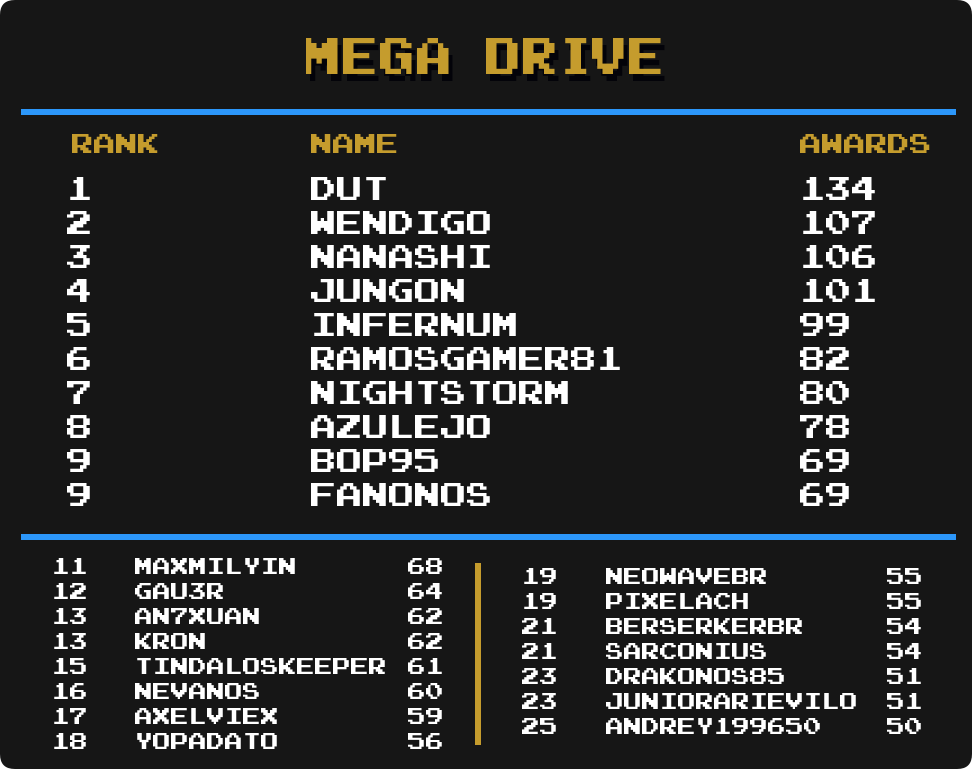

*  remains in 1st with 134 total mastery awards.
*  has moved up 1 spot and is in 2nd place.
*  has moved up 1 spot and is in 4th place.
*  has moved up 1 spot and is tied for 9th place.
*  has moved up 1 spot and is in 16th place.
*  has moved up 1 spot and is tied for 19th place.
*  has moved up 1 spot and is tied for 19th place.
*  has made it into the top 25 and is tied for 23rd place.

### Mega Duck

  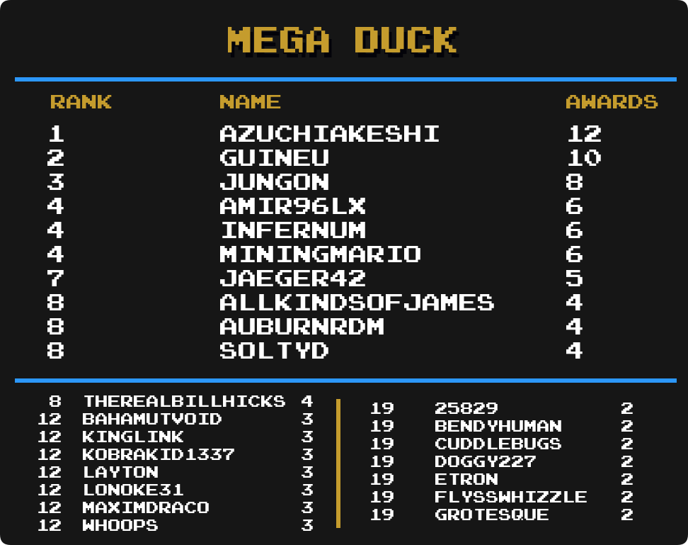

*  remains in 1st with 12 total mastery awards.
*  has moved up 7 spots and is in a 7-way tie for 12th place.
*  has made it into the top 25 and is in a 12-way tie for 19th place.

### Nintendo 64

  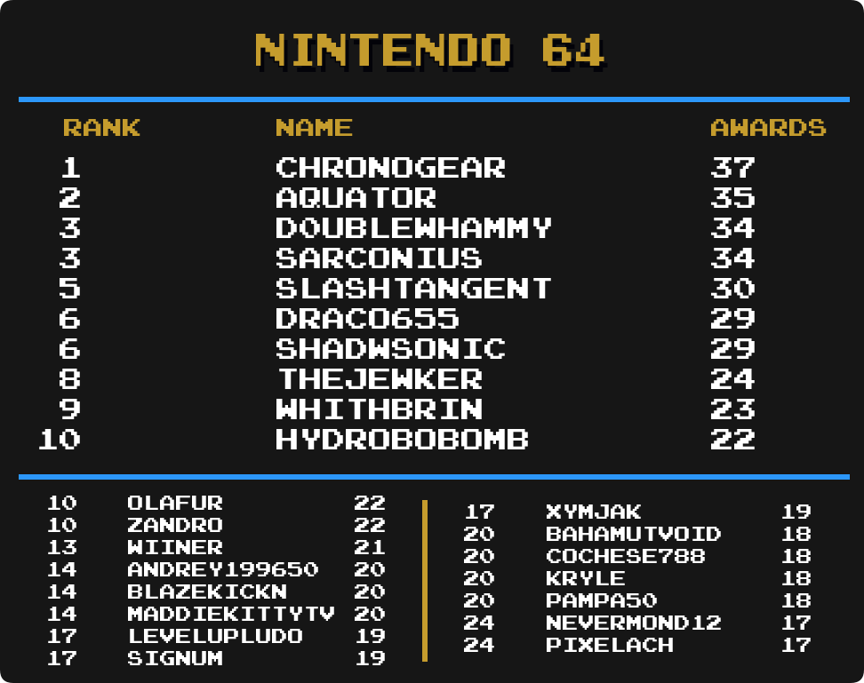

*  remains in 1st with 37 total mastery awards.
*  has moved up 1 spot and is in a 3-way tie for 14th place.
*  has moved up 4 spots and is in a 3-way tie for 17th place.

### NES

  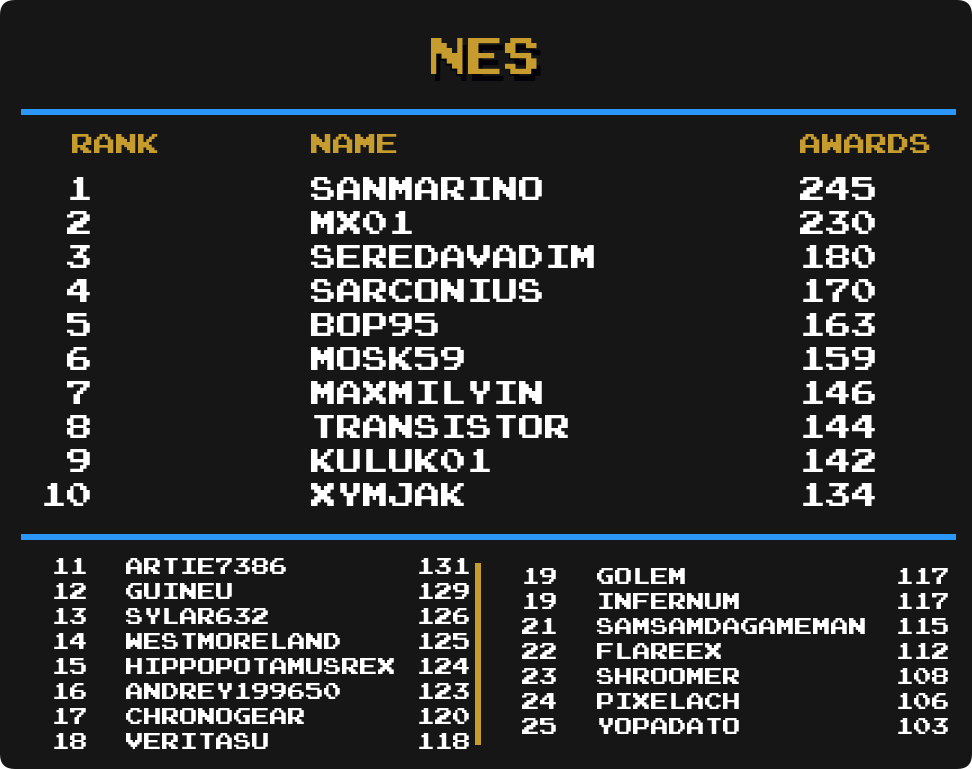

*  remains in 1st with 245 total mastery awards.
*  has moved up 1 spot and is in 8th place.
*  has moved up 1 spot and is in 17th place.
*  has moved up 1 spot and is tied for 19th place.

### Nintendo DS

  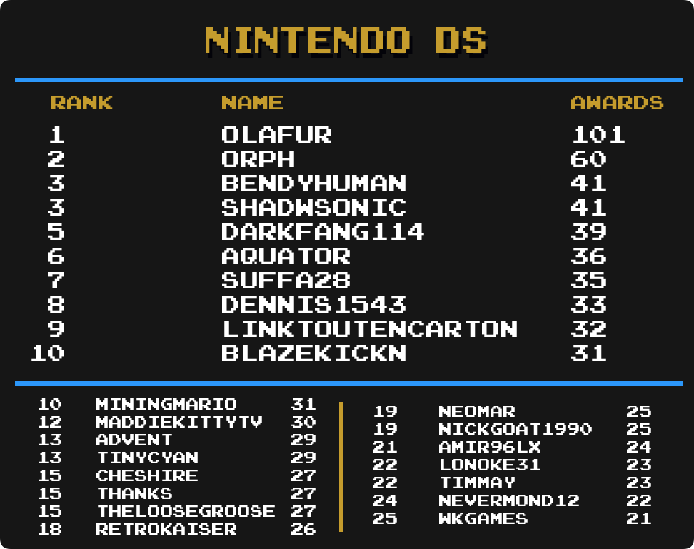

*  remains in 1st with 101 total mastery awards.
*  has moved up 2 spots and is in 7th place.
*  has moved up 1 spot and is tied for 10th place.
*  has moved up 4 spots and is tied for 13th place.
*  has moved up 3 spots and is in a 3-way tie for 15th place.
*  has moved up 2 spots and is tied for 19th place.
*  has moved up 2 spots and is in 21st place.
*  has moved up 1 spot and is tied for 22nd place.

### Nintendo DSi

  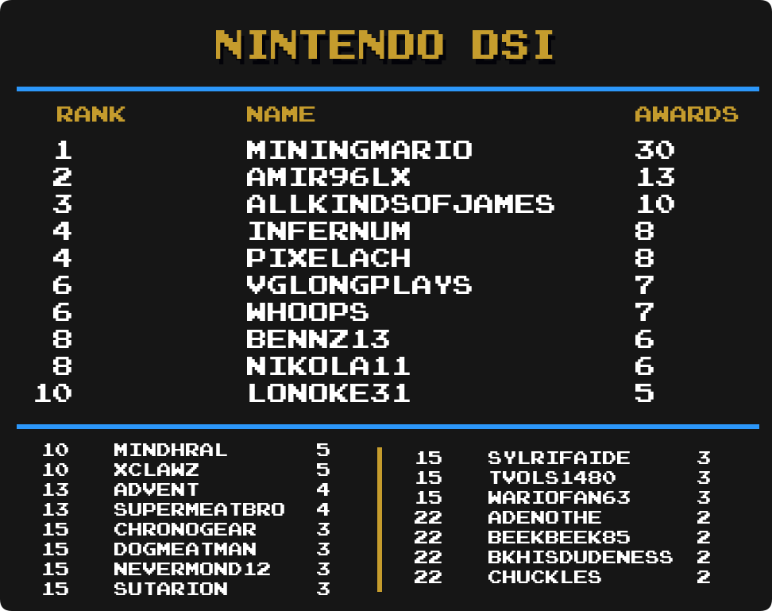

*  remains in 1st with 30 total mastery awards.
*  has made it into the top 25 and is tied for 4th place.

### PC Engine

  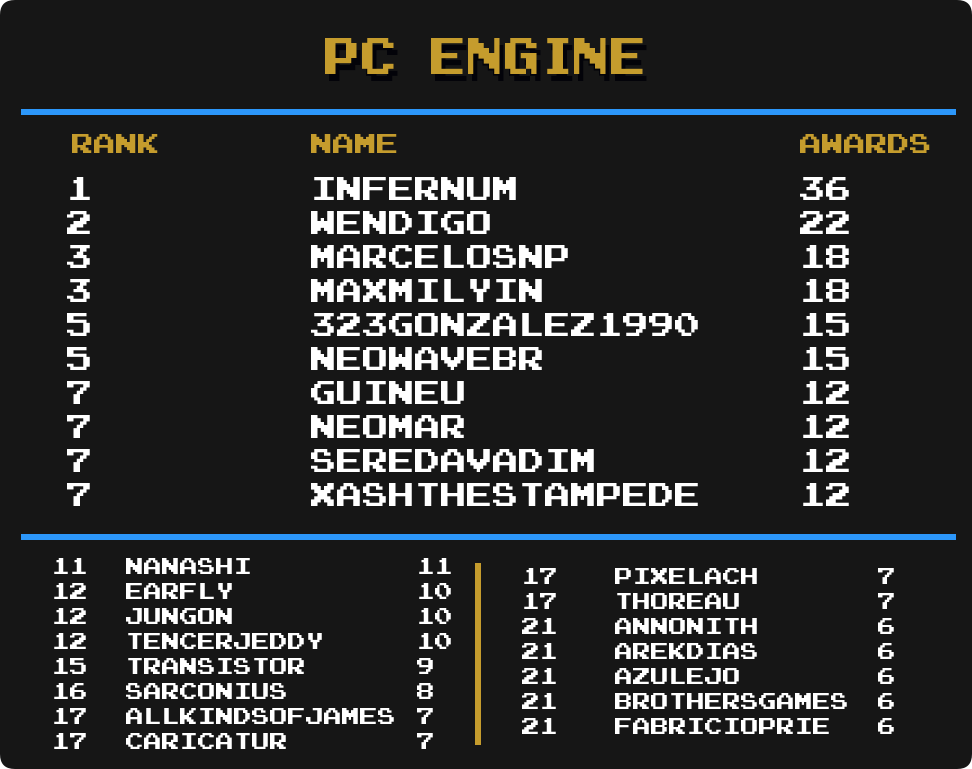

*  remains in 1st with 36 total mastery awards.
*  has moved up 5 spots and is tied for 5th place.
*  has moved up 7 spots and is in a 4-way tie for 7th place.
*  has made it into the top 25 and is in a 4-way tie for 17th place.

### PC Engine CD

  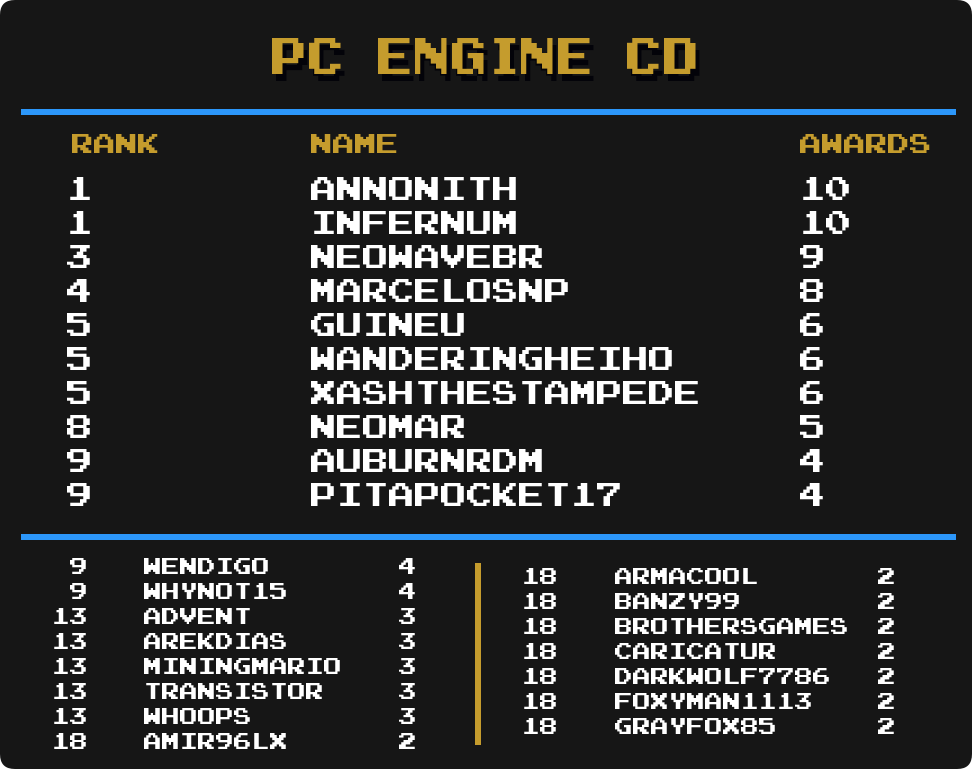

*  and  remain in 1st with 10 total mastery awards.
*  has moved up 1 spot and is in 3rd place.
*  has moved up 3 spots and is in 8th place.
*  has moved up 2 spots and is in a 4-way tie for 9th place.
*  has moved up 3 spots and is in a 4-way tie for 9th place.
*  has made it into the top 25 and is in a 5-way tie for 13th place.
*  has made it into the top 25 and is in a 5-way tie for 13th place.
*  has made it into the top 25 and is in a 27-way tie for 18th place.

### PC-8000/8800

  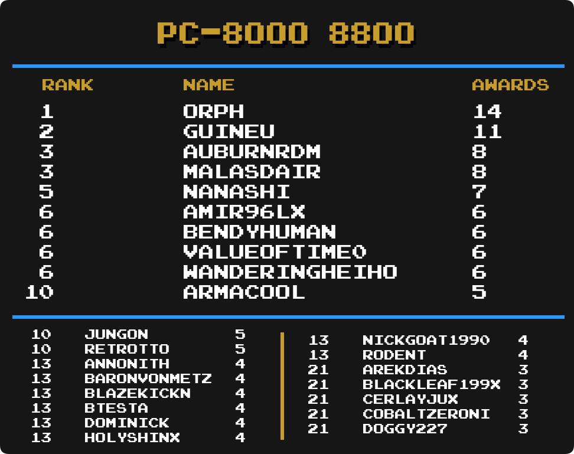

*  remains in 1st with 14 total mastery awards.
*  has made it into the top 25 and is in a 4-way tie for 6th place.
*  has made it into the top 25 and is in a 3-way tie for 10th place.
*  has made it into the top 25 and is in a 8-way tie for 13th place.
*  has made it into the top 25 and is in a 10-way tie for 21st place.

### PlayStation

  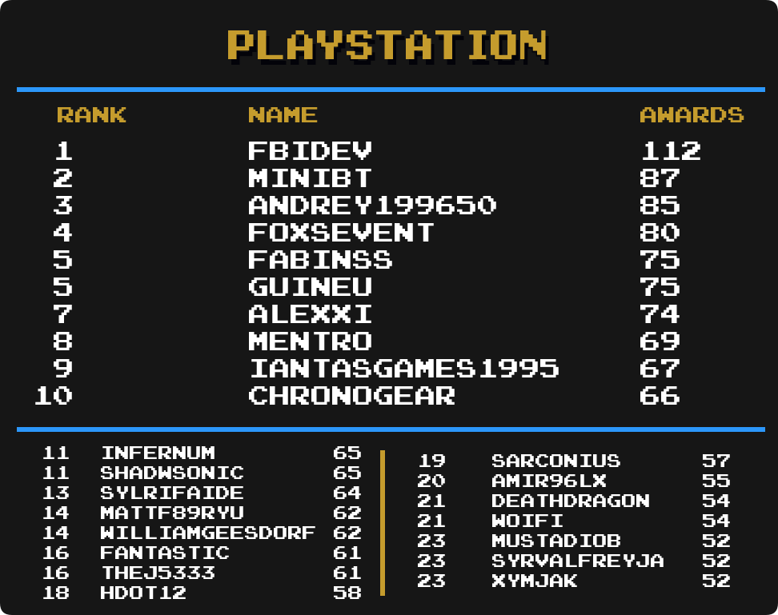

*  remains in 1st with 112 total mastery awards.
*  has moved up 2 spots and is in 10th place.
*  has moved up 3 spots and is tied for 11th place.
*  has moved up 6 spots and is tied for 14th place.
*  has moved up 2 spots and is in 20th place.
*  has moved up 2 spots and is in a 3-way tie for 23rd place.
*  has made it into the top 25 and is in a 3-way tie for 23rd place.

### PlayStation 2

  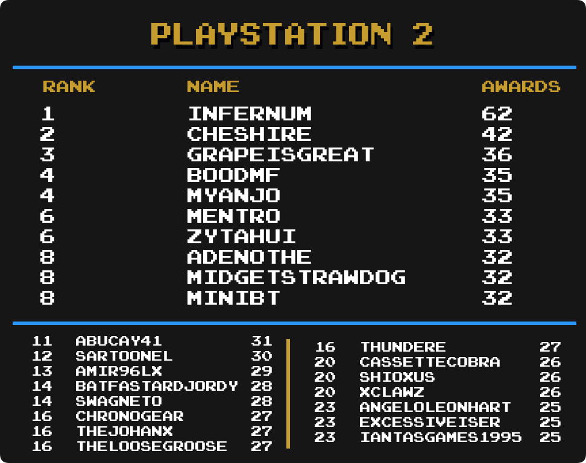

*  remains in 1st with 62 total mastery awards.
*  has moved up 7 spots and is in 3rd place.
*  has moved up 4 spots and is tied for 4th place.
*  has moved up 5 spots and is tied for 14th place.
*  has moved up 2 spots and is tied for 14th place.
*  has moved up 7 spots and is in a 4-way tie for 16th place.
*  has moved up 2 spots and is in a 4-way tie for 16th place.
*  has made it into the top 25 and is in a 3-way tie for 23rd place.
*  has made it into the top 25 and is in a 3-way tie for 23rd place.

### PlayStation Portable

  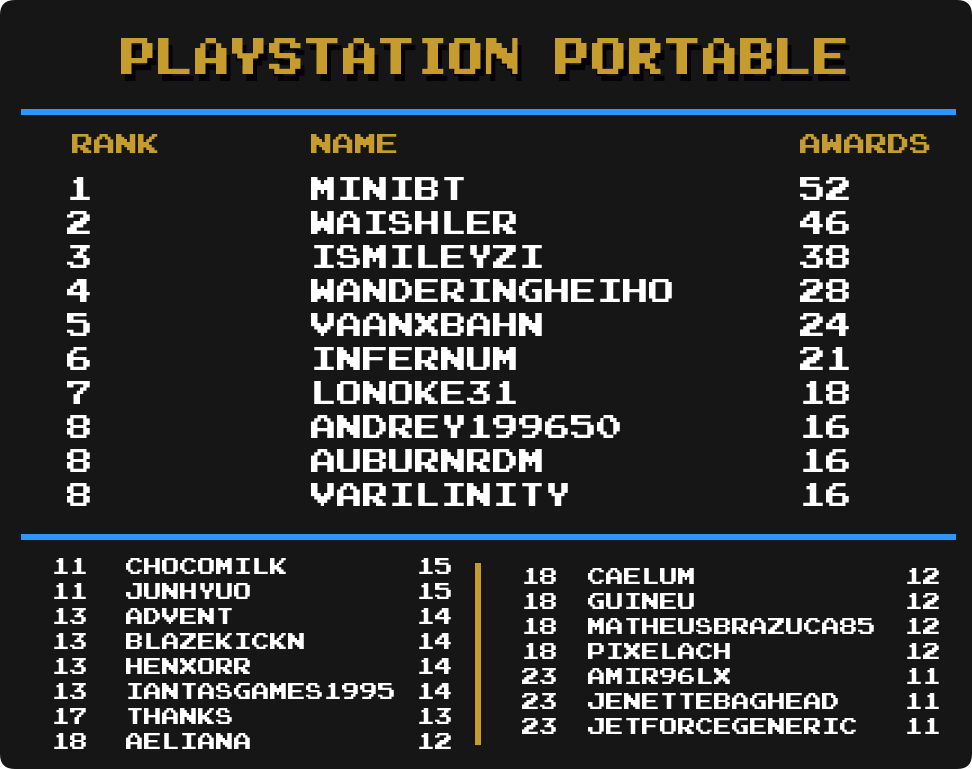

*  remains in 1st with 52 total mastery awards.
*  has moved up 1 spot and is in 4th place.
*  has moved up 1 spot and is in 7th place.
*  has moved up 1 spot and is in a 3-way tie for 8th place.
*  has moved up 1 spot and is tied for 11th place.
*  has moved up 1 spot and is in a 4-way tie for 13th place.
*  has moved up 1 spot and is in a 4-way tie for 13th place.

### Pokémon Mini

  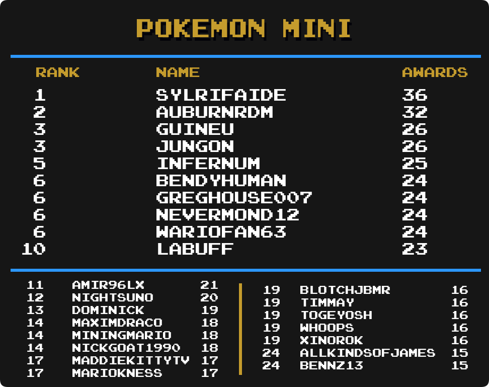

*  remains in 1st with 36 total mastery awards.
*  has moved up 3 spots and is tied for 3rd place.
*  has moved up 1 spot and is in a 4-way tie for 6th place.
*  has moved up 6 spots and is in 12th place.
*  has moved up 2 spots and is in a 3-way tie for 14th place.
*  has made it into the top 25 and is in a 5-way tie for 19th place.
*  has made it into the top 25 and is in a 5-way tie for 19th place.

### Sega Saturn

  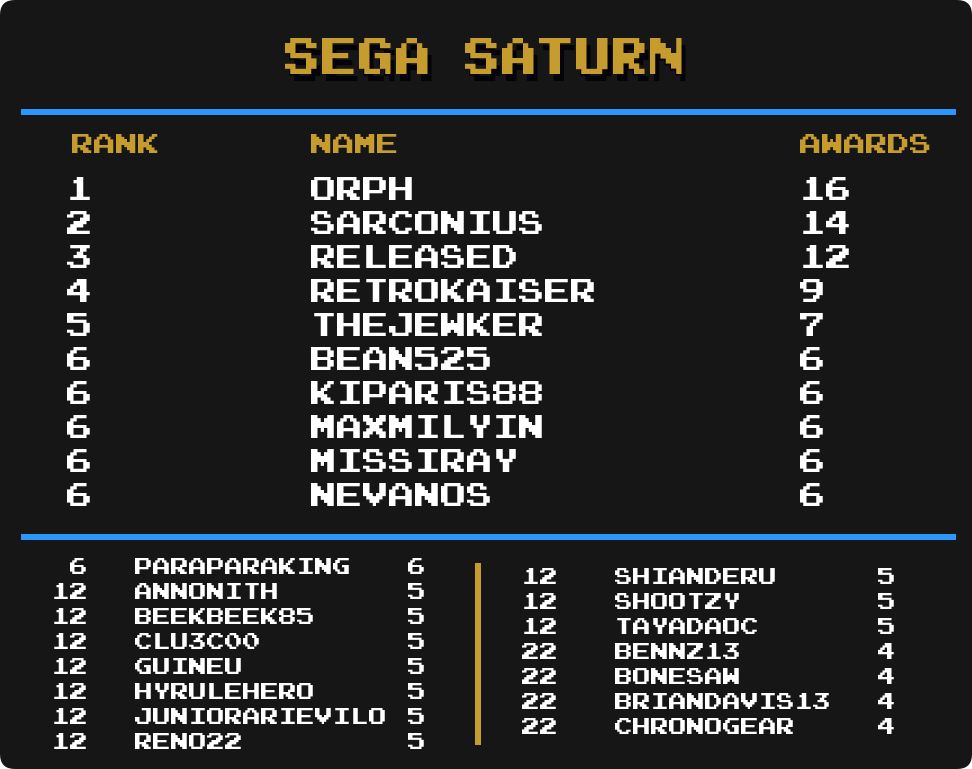

*  remains in 1st with 16 total mastery awards.
*  has moved up 6 spots and is in a 6-way tie for 6th place.
*  has made it into the top 25 and is in a 10-way tie for 12th place.
*  has made it into the top 25 and is in a 17-way tie for 22nd place.

### Sega CD

  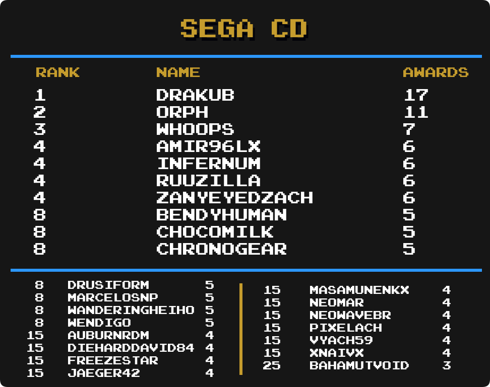

*  remains in 1st with 17 total mastery awards.
*  has made it into the top 25 and is in 3rd place.
*  has moved up 5 spots and is in a 4-way tie for 4th place.
*  has moved up 4 spots and is in a 7-way tie for 8th place.
*  has made it into the top 25 and is in a 10-way tie for 15th place.

### SG-1000

  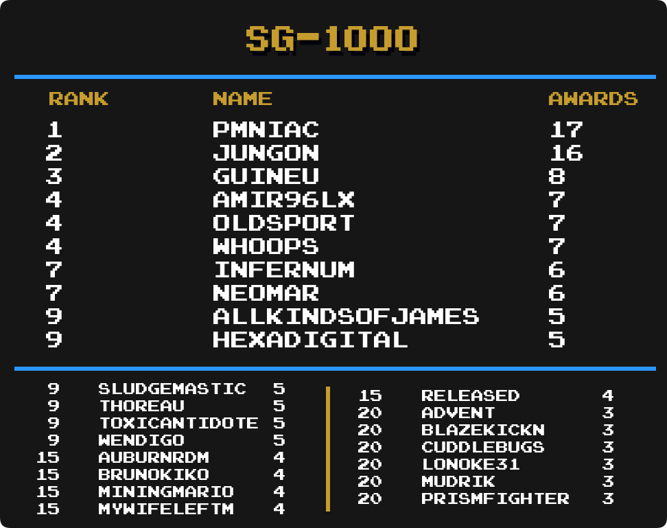

*  remains in 1st with 17 total mastery awards.
*  has moved up 1 spot and is in a 3-way tie for 4th place.
*  has made it into the top 25 and is in a 3-way tie for 4th place.
*  has moved up 5 spots and is in a 3-way tie for 4th place.
*  has moved up 2 spots and is tied for 7th place.
*  has moved up 2 spots and is tied for 7th place.
*  has made it into the top 25 and is in a 6-way tie for 9th place.
*  has made it into the top 25 and is in a 6-way tie for 9th place.
*  has moved up 3 spots and is in a 6-way tie for 9th place.
*  has made it into the top 25 and is in a 6-way tie for 9th place.
*  has made it into the top 25 and is in a 5-way tie for 15th place.
*  has made it into the top 25 and is in a 5-way tie for 15th place.
*  has made it into the top 25 and is in a 11-way tie for 20th place.
*  has made it into the top 25 and is in a 11-way tie for 20th place.
*  has made it into the top 25 and is in a 11-way tie for 20th place.

### SNES

  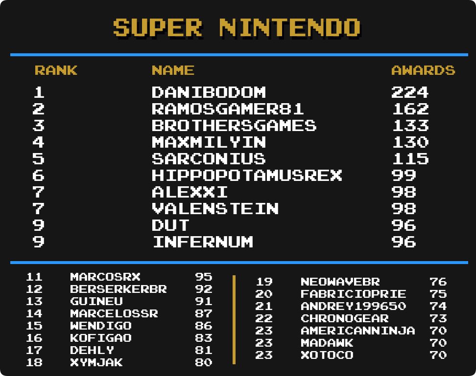

*  remains in 1st with 224 total mastery awards.
*  has moved up 1 spot and is in 6th place.

### Uzebox

  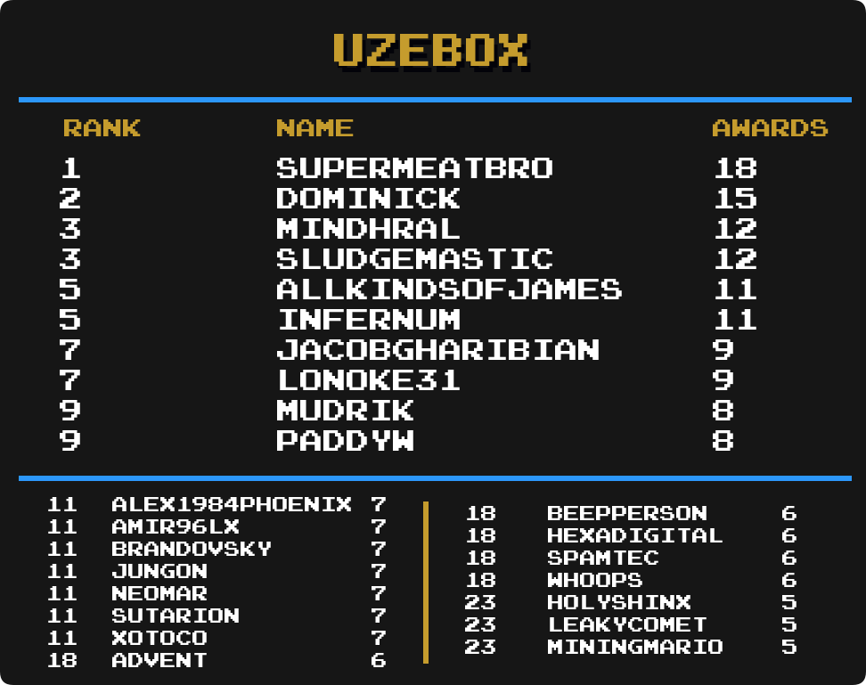

*  remains in 1st with 18 total mastery awards.
*  has moved up 10 spots and is tied for 9th place.
*  has made it into the top 25 and is in a 7-way tie for 11th place.
*  has moved up 8 spots and is in a 7-way tie for 11th place.
*  has made it into the top 25 and is in a 7-way tie for 11th place.
*  has made it into the top 25 and is in a 5-way tie for 18th place.
*  has made it into the top 25 and is in a 3-way tie for 23rd place.

### Virtual Boy

  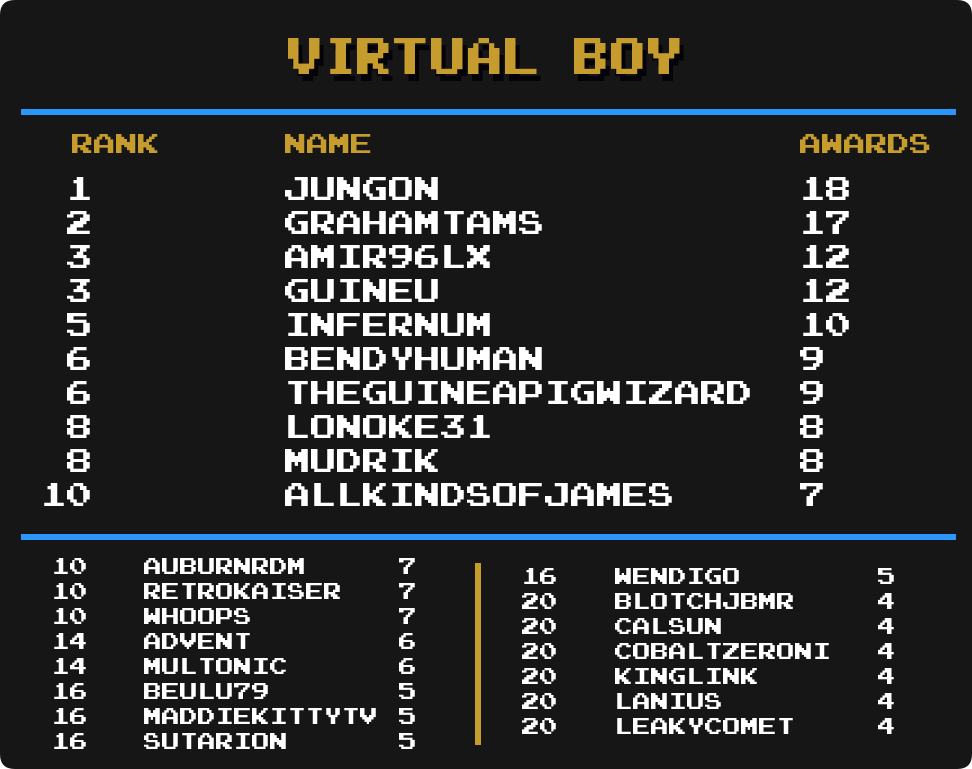

*  remains in 1st with 18 total mastery awards.
*  has moved up 2 spots and is tied for 6th place.
*  has moved up 4 spots and is in a 4-way tie for 10th place.
*  has moved up 6 spots and is in a 4-way tie for 10th place.
*  has made it into the top 25 and is in a 9-way tie for 20th place.

### WASM-4

  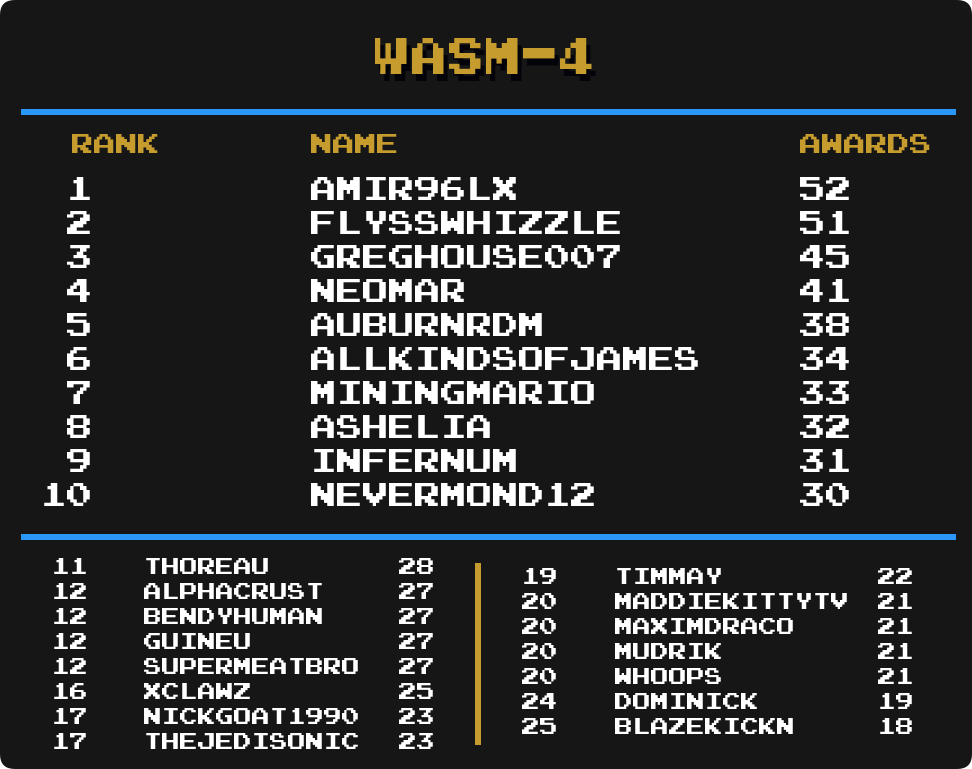

*  remains in 1st with 52 total mastery awards.
*  has moved up 2 spots and is in 7th place.
*  has moved up 5 spots and is in 9th place.
*  has moved up 2 spots and is in a 4-way tie for 12th place.
*  has moved up 3 spots and is in 19th place.
*  has made it into the top 25 and is in 24th place.
*  has made it into the top 25 and is in a 3-way tie for 25th place.

### Watara Supervision

  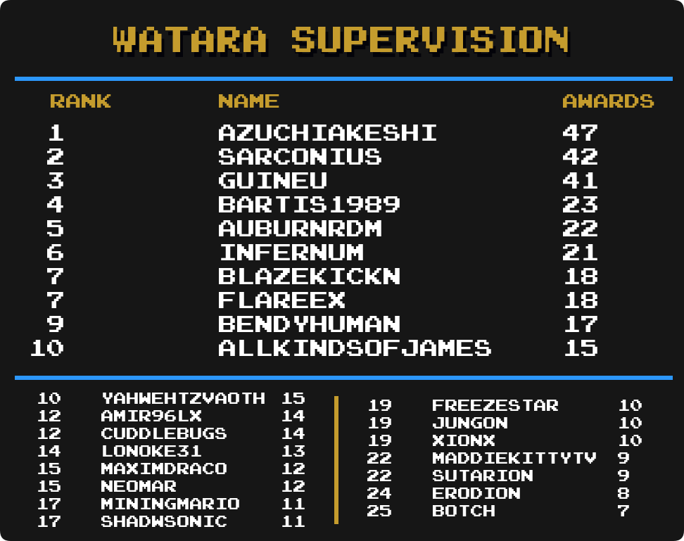

*  remains in 1st with 47 total mastery awards.
*  has moved up 1 spot and is tied for 12th place.
*  has moved up 4 spots and is in 14th place.
*  has moved up 1 spot and is tied for 15th place.
*  has moved up 3 spots and is tied for 17th place.
*  has moved up 3 spots and is tied for 17th place.
*  has made it into the top 25 and is in a 3-way tie for 19th place.
*  has made it into the top 25 and is tied for 22nd place.
*  has made it into the top 25 and is in 24th place.
*  has made it into the top 25 and is in a 8-way tie for 25th place.
