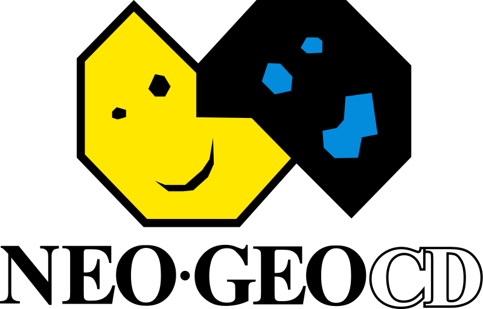

  

In the 1980s, most arcade games had unique motherboards designed to play one game only. This worked fine for popular games such as Pac-Man and Donkey Kong, since they always had plenty of players lining up to spend their quarters. However, not every game enjoyed the same popularity and as older games became less popular, the operators would need to replace the entire cabinet to make room for newer games. Towards the end of the decade, arcade game manufacturer SNK noticed that arcade operators were struggling with the cost of swapping out games and wanted to make it easier to add new games to their cabinets.  

In 1990, SNK released the Neo Geo MVS, a multi-slot cartridge based arcade machine, capable of hosting up to 6 games at once. This allowed arcade operators to swap games without needing to swap out the cabinet. It also allowed them to host multiple games on a single machine, which was particularly helpful for smaller arcades. The MVS system became immensely popular in arcades worldwide.

At the same time, SNK released a home console, the Neo Geo AES, using this same cartridge based technology. While players were thrilled to be able to play exact ports of the arcade games at home, the technology came with a hefty price tag. The system itself retailed for $599, and the cartridges could reach up to $300. As a result, the Neo Geo AES sold very poorly and the cartridges became collectors items due to their lack of availablity.

Several years later, SNK introduced its second home console, the Neo Geo CD. The console was released in late 1994 in Japan and Europe and reached North American shores in early 1996. Although the available games were mostly ports from the AES/MVS era, the shift to the CD-ROM format allowed games on the Neo Geo CD to sell for a much more reasonable $50.  

Despite this affordability, the console struggled to gain traction, selling only around 570,000 units. This was attributed to various issues, including a lackluster marketing campaign and the drawback of a 1x read CD-ROM drive, resulting in long loading times. Many of the games were also considered dated by the time the console arrived, with tastes already shifting towards 3D graphics.

Fortunately, with the power of emulation, these loading times are no longer an issue, so we get to benefit by playing RetroAchievement’s 51st supported system!

## Launch Sets

| Game                                                                                                                                                                                                                                                                                                                                                                                                                 | Developer                                                |
| -------------------------------------------------------------------------------------------------------------------------------------------------------------------------------------------------------------------------------------------------------------------------------------------------------------------------------------------------------------------------------------------------------------------- | -------------------------------------------------------- |
| <a class="gameicon-link" href="https://retroachievements.org/game/23824" target="_blank" rel="noopener">  ADK World</a>                                                                                                                                                                                     |                              |
| <a class="gameicon-link" href="https://retroachievements.org/game/9149" target="_blank" rel="noopener">  Crossed Swords</a>                                                                                                                                                                            |                                      |
| <a class="gameicon-link" href="https://retroachievements.org/game/9186" target="_blank" rel="noopener">  Crossed Swords II</a>                                                                                                                                                                      |                            |
| <a class="gameicon-link" href="https://retroachievements.org/game/23834" target="_blank" rel="noopener">  Double Dragon</a>                                                                                                                                                                             |                              |
| <a class="gameicon-link" href="https://retroachievements.org/game/9156" target="_blank" rel="noopener">  Far East of Eden: Tengai Makyou Shinden \| Far East of Eden: Kabuki Klash</a>                                                      |                                   |
| <a class="gameicon-link" href="https://retroachievements.org/game/9189" target="_blank" rel="noopener">  Ironclad: Tesshou Rusha \| Choutetsu Brikin'ger</a>                                                                                                          |                       |
| <a class="gameicon-link" href="https://retroachievements.org/game/23873" target="_blank" rel="noopener">  King of Fighters '97, The</a>                                                                                                                                                     |                                    |
| <a class="gameicon-link" href="https://retroachievements.org/game/9122" target="_blank" rel="noopener">  Mutation Nation</a>                                                                                                                                                                          |                            |
| <a class="gameicon-link" href="https://retroachievements.org/game/26990" target="_blank" rel="noopener">  Mutation Nation [Subset - Multi]</a>                                                                                                                                       |                            |
| <a class="gameicon-link" href="https://retroachievements.org/game/23848" target="_blank" rel="noopener">  Neo Drift Out: New Technology</a>                                                                                                                                             |   |
| <a class="gameicon-link" href="https://retroachievements.org/game/23831" target="_blank" rel="noopener">  Neo Turf Masters \| Big Tournament Golf</a>                                                                                                                         |                                     |
| <a class="gameicon-link" href="https://retroachievements.org/game/23857" target="_blank" rel="noopener">  Pleasure Goal: 5 on 5 Mini Soccer \| Futsal: 5 on 5 Mini Soccer</a>                                                                         |                             |
| <a class="gameicon-link" href="https://retroachievements.org/game/9164" target="_blank" rel="noopener">  Pulstar</a>                                                                                                                                                                                          |                                   |
| <a class="gameicon-link" href="https://retroachievements.org/game/23803" target="_blank" rel="noopener">  Puzzle Bobble ~ Bust-A-Move</a>                                                                                                                                                 |                             |
| <a class="gameicon-link" href="https://retroachievements.org/game/23849" target="_blank" rel="noopener">  Rally Chase \| Thrash Rally</a>                                                                                                                                                 |          |
| <a class="gameicon-link" href="https://retroachievements.org/game/23866" target="_blank" rel="noopener">  Savage Reign \| Fu'un Mokushiroku: Kakutou Sousei</a>                                                                                                     |                                |
| <a class="gameicon-link" href="https://retroachievements.org/game/23879" target="_blank" rel="noopener">  Super Sidekicks 3: The Next Glory \| Tokuten-ou 3: Eikou e no Chousen</a>                                                             |                                     |
| <a class="gameicon-link" href="https://retroachievements.org/game/26691" target="_blank" rel="noopener">  Super Sidekicks 3: The Next Glory \| Tokuten-ou 3: Eikou e no Chousen [Subset - Post '98 Champions]</a> |                                     |
| <a class="gameicon-link" href="https://retroachievements.org/game/9146" target="_blank" rel="noopener">  Top Hunter: Roddy & Cathy</a>                                                                                                                                                      |                              |
| <a class="gameicon-link" href="https://retroachievements.org/game/23882" target="_blank" rel="noopener">  Twinkle Star Sprites</a>                                                                                                                                                               |                                |
| <a class="gameicon-link" href="https://retroachievements.org/game/23887" target="_blank" rel="noopener">  World Heroes Perfect</a>                                                                                                                                                               |                               |
| <a class="gameicon-link" href="https://retroachievements.org/game/23888" target="_blank" rel="noopener">  \~Homebrew~ Xeno Crisis</a>                                                                                                                                                          |                                  |
| <a class="gameicon-link" href="https://retroachievements.org/game/23829" target="_blank" rel="noopener">  \~Unlicensed~ Bang² Busters</a>                                                                                                                                                  |                                   |