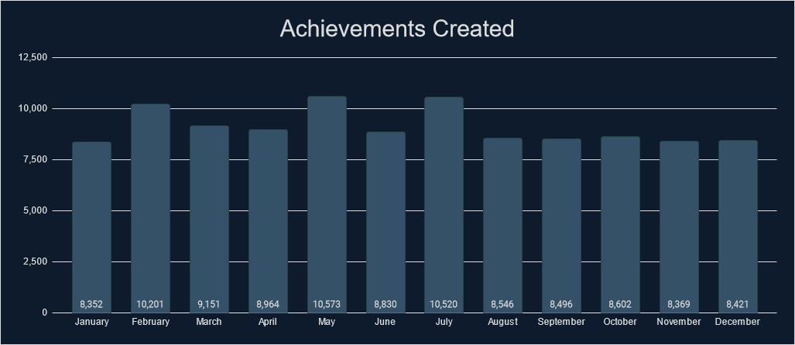
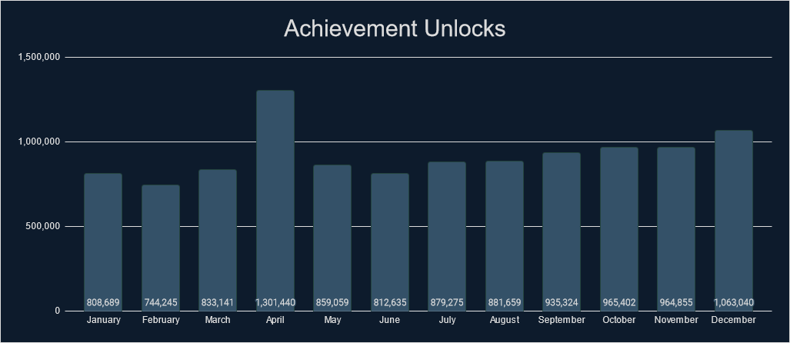
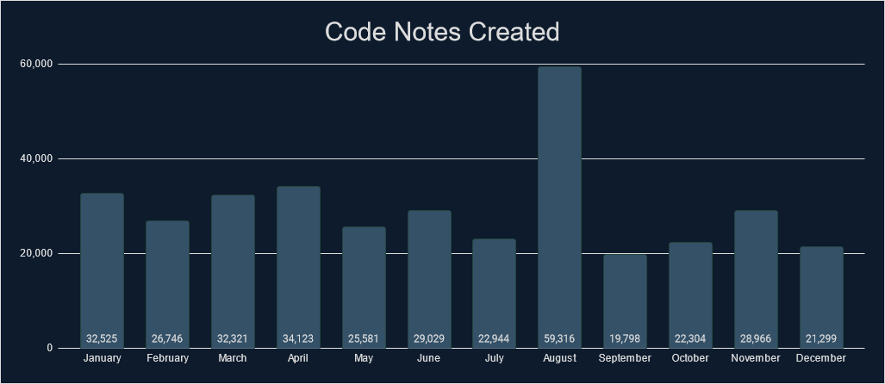
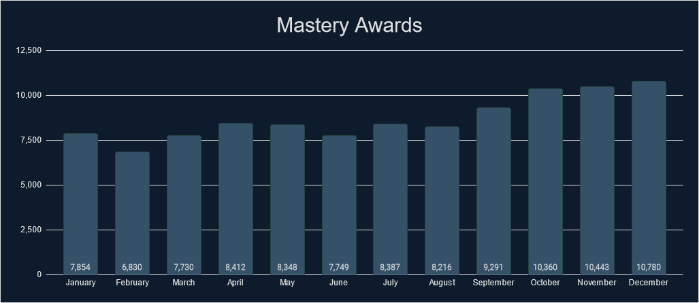
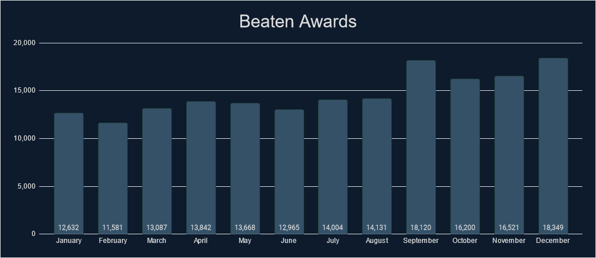
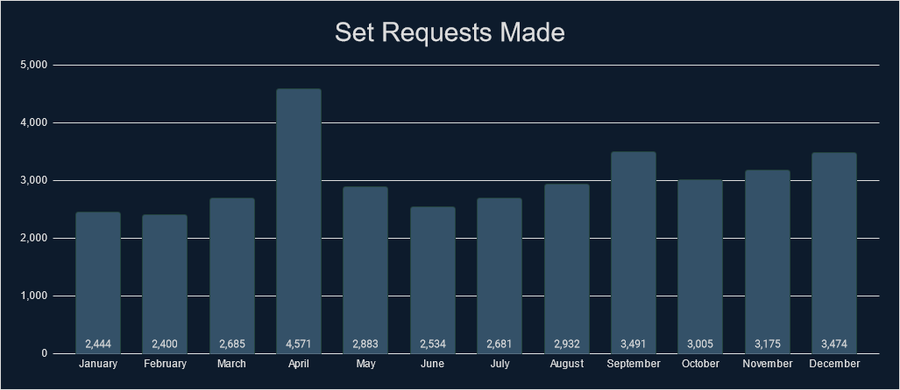
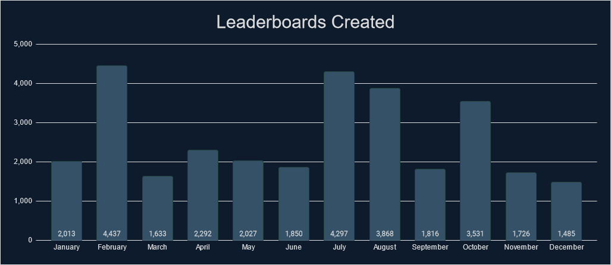

# Intro
If you like looking at stats and data, then you have come to the right place. We've gathered tons of stats from 2023 that cover a wide range of measurable aspects that RetroAchievements offer. Check out what the community has accomplished.

# General Stats
Check out some general stats from this year.

| Stat                                                             | Value       | % Change from 2022 |
| ---------------------------------------------------------------- | ----------- | ------------------ |
| Number of sets released.                                         | 1,809       | +28.42%            |
| Number of achievements released.                                 | 96,298      | +19.54%            |
| Number of hardcore achievements earned.                          | 10,549,784  | +65.8%             |
| Number of code notes created.                                    | 381,891     | +24.79%            |
| Number of mastery awards awarded.                                | 104,400     | +61.39%            |
| Number of beaten awards awarded.                                 | 175,100     | +74.3%             |
| Number of set requests made.                                     | 36,275      | +81.88%            |
| Number of leaderboards created.                                  | 28,756      | +25.52%            |
| Number of leaderboard entries submitted.                         | 1,490,923   | +129.35%           |
| Number of users who have earned at least 1 hardcore achievement. | 69,836      | +56.57%            |
| Number of total hardcore points earned by players.               | 68,362,616  | +60.39%            |
| Number of total hardcore retro points earned by players.         | 248,051,346 | +128.91%           |
| Number of user accounts created.                                 | 266,949     | +126.9%            |
| Number of new user accounts reaching >=500 points.               | 7,302       | +67.48%            |

# Achievements Created

## Monthly Breakdown

## Console Breakdown

    

    <table><thead><tr><th>Console</th><th>Achievements</th></tr></thead><tbody>
        <tr><td>32X                         </td><td>405</td></tr>
        <tr><td>3DO Interactive Multiplayer </td><td>96</td></tr>
        <tr><td>Amstrad CPC                 </td><td>238</td></tr>
        <tr><td>Apple II                    </td><td>492</td></tr>
        <tr><td>Arcade                      </td><td>3,201</td></tr>
        <tr><td>Arcadia 2001                </td><td>403</td></tr>
        <tr><td>Arduboy                     </td><td>150</td></tr>
        <tr><td>Atari 2600                  </td><td>435</td></tr>
        <tr><td>Atari 7800                  </td><td>245</td></tr>
        <tr><td>Atari Jaguar                </td><td>207</td></tr>
        <tr><td>Atari Jaguar CD             </td><td>440</td></tr>
        <tr><td>Atari Lynx                  </td><td>160</td></tr>
        <tr><td>ColecoVision                </td><td>242</td></tr>
        <tr><td>Dreamcast                   </td><td>2,176</td></tr>
        <tr><td>Elektor TV Games Computer   </td><td>183</td></tr>
        <tr><td>Events                      </td><td>688</td></tr>
        <tr><td>Fairchild Channel F         </td><td>73</td></tr>
        <tr><td>Game Boy                    </td><td>2,195</td></tr>
        <tr><td>Game Boy Advance            </td><td>6,538</td></tr>
        <tr><td>Game Boy Color              </td><td>2,209</td></tr>
        <tr><td>Game Gear                   </td><td>665</td></tr>
        <tr><td>Intellivision               </td><td>238</td></tr>
        <tr><td>Interton VC 4000            </td><td>460</td></tr>
        <tr><td>Magnavox Odyssey 2          </td><td>116</td></tr>
        <tr><td>Master System               </td><td>881</td></tr>
        <tr><td>Mega Drive                  </td><td>2,263</td></tr>
    </tbody></table>
    
 

    <table><thead><tr><th>Console</th><th>Achievements</th></tr></thead><tbody>
        <tr><td>Mega Duck                   </td><td>93</td></tr>
        <tr><td>MSX                         </td><td>314</td></tr>
        <tr><td>Neo Geo CD                  </td><td>1,041</td></tr>
        <tr><td>Neo Geo Pocket              </td><td>434</td></tr>
        <tr><td>NES                         </td><td>5,043</td></tr>
        <tr><td>Nintendo 64                 </td><td>4,213</td></tr>
        <tr><td>Nintendo DS                 </td><td>9,848</td></tr>
        <tr><td>Nintendo DSi                </td><td>2,201</td></tr>
        <tr><td>PC Engine                   </td><td>533</td></tr>
        <tr><td>PC Engine CD                </td><td>400</td></tr>
        <tr><td>PC-8000/8800                </td><td>244</td></tr>
        <tr><td>PC-FX                       </td><td>175</td></tr>
        <tr><td>PlayStation                 </td><td>6,174</td></tr>
        <tr><td>PlayStation 2               </td><td>24,299</td></tr>
        <tr><td>PlayStation Portable        </td><td>6,011</td></tr>
        <tr><td>Pokemon Mini                </td><td>148</td></tr>
        <tr><td>Saturn                      </td><td>511</td></tr>
        <tr><td>Sega CD                     </td><td>344</td></tr>
        <tr><td>SG-1000                     </td><td>1,354</td></tr>
        <tr><td>SNES                        </td><td>5,848</td></tr>
        <tr><td>Uzebox                      </td><td>596</td></tr>
        <tr><td>Vectrex                     </td><td>98</td></tr>
        <tr><td>Virtual Boy                 </td><td>164</td></tr>
        <tr><td>WASM-4                      </td><td>146</td></tr>
        <tr><td>Watara Supervision          </td><td>52</td></tr>
        <tr><td>WonderSwan                  </td><td>615</td></tr>
    </tbody></table>
    

 

## Top 25 Achievement Creators
Check out the top 25 achievement creators this year, how many achievements they created and what console they created the most achievements for.

| Rank | Developer                           | Achievements |
| ---- | ----------------------------------- | ------------ |
| 1    |            | 3,614        |
| 2    |                 | 2,766        |
| 3    |      | 2,321        |
| 4    |        | 1,873        |
| 5    |                | 1,866        |
| 6    |  | 1,829        |
| 7    |              | 1,776        |
| 8    |              | 1,710        |
| 9    |            | 1,641        |
| 10   |           | 1,620        |
| 11   |            | 1,603        |
| 12   |               | 1,588        |
| 13   |               | 1,564        |
| 14   |           | 1,549        |
| 15   |          | 1,496        |
| 16   |             | 1,487        |
| 17   |             | 1,484        |
| 18   |        | 1,383        |
| 19   |       | 1,265        |
| 20   |           | 1,258        |
| 21   |        | 1,224        |
| 22   |         | 1,223        |
| 23   |             | 1,079        |
| 24   |               | 1,059        |
| 25   |         | 1,039        |

## Top 25 Developers
Check out some stats regarding unlocks and points awarded by the developers. Included is the number of unlocks, points and retro points awarded to the players. This data includes all achievements but only counts unlocks during 2022.

| Rank | Developer                           | Unlocks Awarded | Points Awarded | Retro Points Awarded |
| :--- | :---------------------------------- | :-------------: | :------------: | :------------------: |
| 1    |                |     251,499     |   1,837,311    |      5,326,313       |
| 2    |                 |     236,556     |   1,333,697    |      4,498,149       |
| 3    |            |     230,061     |   1,286,612    |      4,405,404       |
| 4    |        |     226,306     |   1,728,811    |      5,498,285       |
| 5    |        |     208,430     |   1,625,612    |      7,730,273       |
| 6    |              |     205,824     |   1,094,568    |      5,354,371       |
| 7    |                |     204,074     |   1,543,111    |      6,849,913       |
| 8    |             |     190,681     |   1,552,335    |      3,247,942       |
| 9    |  |     181,568     |   1,349,330    |      2,500,244       |
| 10   |            |     181,394     |   1,115,732    |      3,863,457       |
| 11   |        |     163,833     |   1,011,536    |      2,436,074       |
| 12   |           |     145,150     |    802,698     |      3,409,694       |
| 13   |           |     139,406     |    870,084     |      1,998,194       |
| 14   |                |     138,634     |    683,327     |      1,485,390       |
| 15   |        |     137,478     |    744,957     |      1,908,309       |
| 16   |       |     136,599     |   1,012,623    |      3,931,721       |
| 17   |               |     135,430     |    889,533     |      2,513,213       |
| 18   |               |     122,076     |    936,955     |      2,770,735       |
| 19   |             |     114,654     |    667,866     |      6,703,691       |
| 20   |              |     111,740     |    723,876     |      1,596,229       |
| 21   |           |     109,819     |    585,052     |      2,591,984       |
| 22   |                |     105,108     |    745,960     |      1,692,568       |
| 23   |               |     99,335      |    927,295     |      2,723,314       |
| 24   |            |     97,440      |    592,516     |      1,091,345       |
| 25   |             |     93,781      |    475,809     |       835,296        |

\* Hardcore only

# Achievement Unlocks

## Monthly Breakdown

## Console Breakdown

    

    <table><thead><tr><th>Console</th><th>Unlocks</th></tr></thead><tbody>
        <tr><td>32X                         </td><td>10,417</td></tr>
        <tr><td>3DO Interactive Multiplayer </td><td>14,067</td></tr>
        <tr><td>Amstrad CPC                 </td><td>8,244</td></tr>
        <tr><td>Apple II                    </td><td>10,942</td></tr>
        <tr><td>Arcade                      </td><td>246,925</td></tr>
        <tr><td>Arcadia 2001                </td><td>2,850</td></tr>
        <tr><td>Arduboy                     </td><td>23,661</td></tr>
        <tr><td>Atari 2600                  </td><td>109,688</td></tr>
        <tr><td>Atari 7800                  </td><td>12,324</td></tr>
        <tr><td>Atari Jaguar                </td><td>4,703</td></tr>
        <tr><td>Atari Jaguar CD             </td><td>1,952</td></tr>
        <tr><td>Atari Lynx                  </td><td>7,117</td></tr>
        <tr><td>ColecoVision                </td><td>7,266</td></tr>
        <tr><td>Dreamcast                   </td><td>159,459</td></tr>
        <tr><td>Elektor TV Games Computer   </td><td>3,479</td></tr>
        <tr><td>Events                      </td><td>458,002</td></tr>
        <tr><td>Fairchild Channel F         </td><td>11,897</td></tr>
        <tr><td>Game Boy                    </td><td>506,986</td></tr>
        <tr><td>Game Boy Advance            </td><td>1,051,043</td></tr>
        <tr><td>Game Boy Color              </td><td>317,745</td></tr>
        <tr><td>Game Gear                   </td><td>65,003</td></tr>
        <tr><td>Hubs                        </td><td>573</td></tr>
        <tr><td>Intellivision               </td><td>5,705</td></tr>
        <tr><td>Interton VC 4000            </td><td>3,885</td></tr>
        <tr><td>Magnavox Odyssey 2          </td><td>5,230</td></tr>
        <tr><td>Master System               </td><td>83,103</td></tr>
        <tr><td>Mega Drive                  </td><td>471,259</td></tr>
    </tbody></table>
    
 

    <table><thead><tr><th>Console</th><th>Unlocks</th></tr></thead><tbody>
        <tr><td>Mega Duck                   </td><td>5,166</td></tr>
        <tr><td>MSX                         </td><td>8,531</td></tr>
        <tr><td>Neo Geo CD                  </td><td>4,115</td></tr>
        <tr><td>Neo Geo Pocket              </td><td>17,255</td></tr>
        <tr><td>NES                         </td><td>1,111,310</td></tr>
        <tr><td>Nintendo 64                 </td><td>543,161</td></tr>
        <tr><td>Nintendo DS                 </td><td>479,395</td></tr>
        <tr><td>Nintendo DSi                </td><td>13,514</td></tr>
        <tr><td>PC Engine                   </td><td>72,706</td></tr>
        <tr><td>PC Engine CD                </td><td>29,818</td></tr>
        <tr><td>PC-8000/8800                </td><td>7,421</td></tr>
        <tr><td>PC-FX                       </td><td>3,160</td></tr>
        <tr><td>PlayStation                 </td><td>1,463,249</td></tr>
        <tr><td>PlayStation 2               </td><td>1,640,278</td></tr>
        <tr><td>PlayStation Portable        </td><td>383,562</td></tr>
        <tr><td>Pokemon Mini                </td><td>21,100</td></tr>
        <tr><td>Saturn                      </td><td>47,341</td></tr>
        <tr><td>Sega CD                     </td><td>32,918</td></tr>
        <tr><td>SG-1000                     </td><td>22,756</td></tr>
        <tr><td>SNES                        </td><td>1,463,507</td></tr>
        <tr><td>Uzebox                      </td><td>12,478</td></tr>
        <tr><td>Vectrex                     </td><td>4,024</td></tr>
        <tr><td>Virtual Boy                 </td><td>11,514</td></tr>
        <tr><td>WASM-4                      </td><td>23,768</td></tr>
        <tr><td>Watara Supervision          </td><td>7,690</td></tr>
        <tr><td>WonderSwan                  </td><td>15,502</td></tr>
    </tbody></table>
    

 

## Top 25 Users
Check out who has the most achievement unlocks, points, retro points, and mastery awards earned this year.

| Rank | User                            | Achievements | Points  | Retro Points |
| ---- | ------------------------------- | :----------: | :-----: | :----------: |
| 1    |         |    18,288    | 137,706 |   419,275    |
| 2    |       |    13,197    | 79,411  |   250,922    |
| 3    |         |    12,905    | 91,970  |   253,669    |
| 4    |         |    12,254    | 70,057  |   202,771    |
| 5    |  |    11,899    | 88,463  |   272,755    |
| 6    |    |    11,092    | 107,842 |   507,482    |
| 7    |     |    11,002    | 61,748  |   129,831    |
| 8    |         |    10,699    | 59,682  |   145,437    |
| 9    |           |    10,605    | 56,351  |    97,181    |
| 10   |           |    10,449    | 69,263  |   199,809    |
| 11   |             |    9,998     | 66,379  |   286,411    |
| 12   |         |    9,703     | 74,448  |   592,500    |
| 13   |        |    9,559     | 71,242  |   172,687    |
| 14   |        |    9,533     | 88,388  |   891,513    |
| 15   |         |    9,210     | 60,846  |   229,169    |
| 16   |       |    9,154     | 67,849  |   388,742    |
| 17   |     |    9,152     | 66,796  |   166,477    |
| 18   |        |    9,121     | 69,608  |   372,847    |
| 19   |      |    9,050     | 56,968  |   128,732    |
| 20   |          |    8,971     | 55,737  |   159,253    |
| 21   |      |    8,710     | 52,021  |   326,137    |
| 22   |           |    8,684     | 43,617  |    73,379    |
| 23   |   |    8,678     | 61,044  |   242,633    |
| 24   |         |    8,599     | 54,636  |   151,787    |
| 25   |        |    8,584     | 62,225  |   189,977    |

## Top 25 Awarded Achievements
Check out which achievements were earned the most this year. Limit one achievement per game.

| Rank | Achievement                                                                                                                                                                                                                                                                                           | Game                                                                                                                                                                                                                                                                                               | Times Awarded |
| :--- | :---------------------------------------------------------------------------------------------------------------------------------------------------------------------------------------------------------------------------------------------------------------------------------------------------- | :------------------------------------------------------------------------------------------------------------------------------------------------------------------------------------------------------------------------------------------------------------------------------------------------- | :------------ |
| 1    | <a class="gameicon-link" href="https://retroachievements.org/achievement/342" target="_blank" rel="noopener">  Giddy Up!</a>                                      | <a class="gameicon-link" href="https://retroachievements.org/game/228" target="_blank" rel="noopener">  Super Mario World</a>                                                     | 6965          |
| 2    | <a class="gameicon-link" href="https://retroachievements.org/achievement/3159" target="_blank" rel="noopener">  Shroooooms...</a>                            | <a class="gameicon-link" href="https://retroachievements.org/game/1446" target="_blank" rel="noopener">  Super Mario Bros.</a>                                                    | 5316          |
| 3    | <a class="gameicon-link" href="https://retroachievements.org/achievement/947" target="_blank" rel="noopener">  You Can Spell!</a>                           | <a class="gameicon-link" href="https://retroachievements.org/game/337" target="_blank" rel="noopener">  Donkey Kong Country</a>                                                 | 3953          |
| 4    | <a class="gameicon-link" href="https://retroachievements.org/achievement/48638" target="_blank" rel="noopener">  A New Journey</a>                            | <a class="gameicon-link" href="https://retroachievements.org/game/10003" target="_blank" rel="noopener">  Super Mario 64</a>                                                         | 3878          |
| 5    | <a class="gameicon-link" href="https://retroachievements.org/achievement/2" target="_blank" rel="noopener">  Amateur Collector</a>                       | <a class="gameicon-link" href="https://retroachievements.org/game/1" target="_blank" rel="noopener">  Sonic the Hedgehog</a>                                                     | 3453          |
| 6    | <a class="gameicon-link" href="https://retroachievements.org/achievement/4126" target="_blank" rel="noopener">  Prepare For Take-Off</a>              | <a class="gameicon-link" href="https://retroachievements.org/game/1995" target="_blank" rel="noopener">  Super Mario Bros. 3</a>                                                | 3147          |
| 7    | <a class="gameicon-link" href="https://retroachievements.org/achievement/943" target="_blank" rel="noopener">  Illuminating</a>                               | <a class="gameicon-link" href="https://retroachievements.org/game/355" target="_blank" rel="noopener">  Legend of Zelda, The: A Link to the Past</a>       | 2912          |
| 8    | <a class="gameicon-link" href="https://retroachievements.org/achievement/82635" target="_blank" rel="noopener">  What is a Man?</a>                          | <a class="gameicon-link" href="https://retroachievements.org/game/11240" target="_blank" rel="noopener">  Castlevania: Symphony of the Night</a>                 | 2906          |
| 9    | <a class="gameicon-link" href="https://retroachievements.org/achievement/1144" target="_blank" rel="noopener">  Mushroom Man</a>                              | <a class="gameicon-link" href="https://retroachievements.org/game/504" target="_blank" rel="noopener">  Super Mario Land</a>                                                       | 2523          |
| 10   | <a class="gameicon-link" href="https://retroachievements.org/achievement/82936" target="_blank" rel="noopener">  Rutabaga!</a>                                    | <a class="gameicon-link" href="https://retroachievements.org/game/10434" target="_blank" rel="noopener">  Crash Bandicoot</a>                                                       | 2482          |
| 11   | <a class="gameicon-link" href="https://retroachievements.org/achievement/3735" target="_blank" rel="noopener">  It's Dangerous to Go Alone!</a> | <a class="gameicon-link" href="https://retroachievements.org/game/1454" target="_blank" rel="noopener">  Legend of Zelda, The</a>                                              | 2481          |
| 12   | <a class="gameicon-link" href="https://retroachievements.org/achievement/5760" target="_blank" rel="noopener">  Keep On Rollin'</a>                        | <a class="gameicon-link" href="https://retroachievements.org/game/534" target="_blank" rel="noopener">  Metroid: Zero Mission</a>                                             | 1840          |
| 13   | <a class="gameicon-link" href="https://retroachievements.org/achievement/108022" target="_blank" rel="noopener">  Journey Has Started</a>              | <a class="gameicon-link" href="https://retroachievements.org/game/724" target="_blank" rel="noopener">  Pokemon Red Version \| Pokemon Blue Version</a> | 1831          |
| 14   | <a class="gameicon-link" href="https://retroachievements.org/achievement/3086" target="_blank" rel="noopener">  Life Leech</a>                                  | <a class="gameicon-link" href="https://retroachievements.org/game/510" target="_blank" rel="noopener">  Castlevania: Aria of Sorrow</a>                                 | 1805          |
| 15   | <a class="gameicon-link" href="https://retroachievements.org/achievement/4207" target="_blank" rel="noopener">  Double</a>                                          | <a class="gameicon-link" href="https://retroachievements.org/game/2022" target="_blank" rel="noopener">  Tetris (Nintendo)</a>                                                    | 1796          |
| 16   | <a class="gameicon-link" href="https://retroachievements.org/achievement/27592" target="_blank" rel="noopener">  Rival</a>                                           | <a class="gameicon-link" href="https://retroachievements.org/game/668" target="_blank" rel="noopener">  Pokemon Emerald Version</a>                                         | 1778          |
| 17   | <a class="gameicon-link" href="https://retroachievements.org/achievement/5815" target="_blank" rel="noopener">  Save the Princess?</a>                  | <a class="gameicon-link" href="https://retroachievements.org/game/471" target="_blank" rel="noopener">  Super Mario RPG: Legend of the Seven Stars</a>   | 1706          |
| 18   | <a class="gameicon-link" href="https://retroachievements.org/achievement/3364" target="_blank" rel="noopener">  Vampire Killer</a>                          | <a class="gameicon-link" href="https://retroachievements.org/game/1462" target="_blank" rel="noopener">  Castlevania</a>                                                                | 1705          |
| 19   | <a class="gameicon-link" href="https://retroachievements.org/achievement/987" target="_blank" rel="noopener">  Kremkoin</a>                                       | <a class="gameicon-link" href="https://retroachievements.org/game/466" target="_blank" rel="noopener">  Donkey Kong Country 2: Diddy's Kong Quest</a>     | 1701          |
| 20   | <a class="gameicon-link" href="https://retroachievements.org/achievement/343" target="_blank" rel="noopener">  Why Can't Metroid Crawl?</a>       | <a class="gameicon-link" href="https://retroachievements.org/game/236" target="_blank" rel="noopener">  Super Metroid</a>                                                             | 1654          |
| 21   | <a class="gameicon-link" href="https://retroachievements.org/achievement/26924" target="_blank" rel="noopener">  Super Mario Bronus</a>                 | <a class="gameicon-link" href="https://retroachievements.org/game/253" target="_blank" rel="noopener">  Super Mario All-Stars</a>                                             | 1624          |
| 22   | <a class="gameicon-link" href="https://retroachievements.org/achievement/33592" target="_blank" rel="noopener">  I Choose You!</a>                           | <a class="gameicon-link" href="https://retroachievements.org/game/515" target="_blank" rel="noopener">  Pokemon FireRed Version</a>                                         | 1592          |
| 23   | <a class="gameicon-link" href="https://retroachievements.org/achievement/95922" target="_blank" rel="noopener">  Newbie combo</a>                             | <a class="gameicon-link" href="https://retroachievements.org/game/11259" target="_blank" rel="noopener">  Tekken 3</a>                                                                     | 1579          |
| 24   | <a class="gameicon-link" href="https://retroachievements.org/achievement/51304" target="_blank" rel="noopener">  First Stage Clear!</a>                 | <a class="gameicon-link" href="https://retroachievements.org/game/10082" target="_blank" rel="noopener">  Super Smash Bros.</a>                                                   | 1439          |
| 25   | <a class="gameicon-link" href="https://retroachievements.org/achievement/255562" target="_blank" rel="noopener">  First of Many</a>                          | <a class="gameicon-link" href="https://retroachievements.org/game/2782" target="_blank" rel="noopener">  God of War</a>                                                                  | 1428          |

\* Hardcore only

## Top 25 2023 Awarded Achievements
Check out which achievements created in 2023 were earned the most this year. Limit one achievement per game.

| Rank | Achievement                                                                                                                                                                                                                                                                                                                  | Game                                                                                                                                                                                                                                                                                             | Times Awarded |
| :--- | :--------------------------------------------------------------------------------------------------------------------------------------------------------------------------------------------------------------------------------------------------------------------------------------------------------------------------- | :----------------------------------------------------------------------------------------------------------------------------------------------------------------------------------------------------------------------------------------------------------------------------------------------- | :------------ |
| 1    | <a class="gameicon-link" href="https://retroachievements.org/achievement/284538" target="_blank" rel="noopener">  Handle With Care</a>                                           | <a class="gameicon-link" href="https://retroachievements.org/game/11279" target="_blank" rel="noopener">  Spyro the Dragon</a>                                                   | 1284          |
| 2    | <a class="gameicon-link" href="https://retroachievements.org/achievement/308520" target="_blank" rel="noopener">  Miracle of the Scroll</a>                                 | <a class="gameicon-link" href="https://retroachievements.org/game/9998" target="_blank" rel="noopener">  Alex Kidd in Miracle World</a>                                | 1241          |
| 3    | <a class="gameicon-link" href="https://retroachievements.org/achievement/292650" target="_blank" rel="noopener">  Battletoads</a>                                                     | <a class="gameicon-link" href="https://retroachievements.org/game/10433" target="_blank" rel="noopener">  Crash Bandicoot 3: Warped</a>                                 | 1165          |
| 4    | <a class="gameicon-link" href="https://retroachievements.org/achievement/312936" target="_blank" rel="noopener">  Despoiled the Desert</a>                                   | <a class="gameicon-link" href="https://retroachievements.org/game/355" target="_blank" rel="noopener">  Legend of Zelda, The: A Link to the Past</a>     | 1037          |
| 5    | <a class="gameicon-link" href="https://retroachievements.org/achievement/287993" target="_blank" rel="noopener">  We're Like Brothers, Only Enemies</a>         | <a class="gameicon-link" href="https://retroachievements.org/game/20590" target="_blank" rel="noopener">  Dragon Ball Z: Budokai Tenkaichi 3</a>               | 786           |
| 6    | <a class="gameicon-link" href="https://retroachievements.org/achievement/362731" target="_blank" rel="noopener">  Doubled Up</a>                                                       | <a class="gameicon-link" href="https://retroachievements.org/game/1462" target="_blank" rel="noopener">  Castlevania</a>                                                              | 749           |
| 7    | <a class="gameicon-link" href="https://retroachievements.org/achievement/277512" target="_blank" rel="noopener">  Respect Plus</a>                                                   | <a class="gameicon-link" href="https://retroachievements.org/game/2772" target="_blank" rel="noopener">  Grand Theft Auto: San Andreas</a>                          | 717           |
| 8    | <a class="gameicon-link" href="https://retroachievements.org/achievement/310834" target="_blank" rel="noopener">  Watching, Waiting</a>                                         | <a class="gameicon-link" href="https://retroachievements.org/game/24124" target="_blank" rel="noopener">  ~Homebrew~ Slender: The 8 Pages</a>                     | 668           |
| 9    | <a class="gameicon-link" href="https://retroachievements.org/achievement/282076" target="_blank" rel="noopener">  Spelunking Fossils</a>                                       | <a class="gameicon-link" href="https://retroachievements.org/game/21360" target="_blank" rel="noopener">  ~Hack~ Pokemon Emerald Rogue</a>                           | 636           |
| 10   | <a class="gameicon-link" href="https://retroachievements.org/achievement/307069" target="_blank" rel="noopener">  Custom Compact</a>                                               | <a class="gameicon-link" href="https://retroachievements.org/game/2697" target="_blank" rel="noopener">  Burnout 3: Takedown</a>                                              | 634           |
| 11   | <a class="gameicon-link" href="https://retroachievements.org/achievement/308212" target="_blank" rel="noopener">  Mute City I Winner</a>                                       | <a class="gameicon-link" href="https://retroachievements.org/game/252" target="_blank" rel="noopener">  F-Zero</a>                                                                         | 509           |
| 12   | <a class="gameicon-link" href="https://retroachievements.org/achievement/279200" target="_blank" rel="noopener">  Sins of the Father, Sins of the Son</a>     | <a class="gameicon-link" href="https://retroachievements.org/game/2778" target="_blank" rel="noopener">  Final Fantasy X: International</a>                        | 508           |
| 13   | <a class="gameicon-link" href="https://retroachievements.org/achievement/284927" target="_blank" rel="noopener">  AK-47 Expert</a>                                                   | <a class="gameicon-link" href="https://retroachievements.org/game/19040" target="_blank" rel="noopener">  Black</a>                                                                         | 492           |
| 14   | <a class="gameicon-link" href="https://retroachievements.org/achievement/321734" target="_blank" rel="noopener">  Loading Screen Aficionado</a>                         | <a class="gameicon-link" href="https://retroachievements.org/game/10154" target="_blank" rel="noopener">  Paper Mario</a>                                                             | 488           |
| 15   | <a class="gameicon-link" href="https://retroachievements.org/achievement/293732" target="_blank" rel="noopener">  Wumpin' Good</a>                                                   | <a class="gameicon-link" href="https://retroachievements.org/game/19044" target="_blank" rel="noopener">  Crash Twinsanity</a>                                                   | 480           |
| 16   | <a class="gameicon-link" href="https://retroachievements.org/achievement/327028" target="_blank" rel="noopener">  What Might’ve Been</a>                                   | <a class="gameicon-link" href="https://retroachievements.org/game/5677" target="_blank" rel="noopener">  Spider-Man 2</a>                                                            | 474           |
| 17   | <a class="gameicon-link" href="https://retroachievements.org/achievement/290616" target="_blank" rel="noopener">  Millionaire Traffic Attacker</a>                   | <a class="gameicon-link" href="https://retroachievements.org/game/2994" target="_blank" rel="noopener">  Burnout Revenge</a>                                                      | 446           |
| 18   | <a class="gameicon-link" href="https://retroachievements.org/achievement/300336" target="_blank" rel="noopener">  Here We Go Again</a>                                           | <a class="gameicon-link" href="https://retroachievements.org/game/3072" target="_blank" rel="noopener">  Ratchet & Clank: Going Commando</a>                      | 418           |
| 19   | <a class="gameicon-link" href="https://retroachievements.org/achievement/324310" target="_blank" rel="noopener">  Zombie Panic</a>                                                   | <a class="gameicon-link" href="https://retroachievements.org/game/405" target="_blank" rel="noopener">  Zombies Ate My Neighbors</a>                                     | 414           |
| 20   | <a class="gameicon-link" href="https://retroachievements.org/achievement/370164" target="_blank" rel="noopener">  Better Than Before</a>                                       | <a class="gameicon-link" href="https://retroachievements.org/game/1103" target="_blank" rel="noopener">  Pocky & Rocky</a>                                                          | 405           |
| 21   | <a class="gameicon-link" href="https://retroachievements.org/achievement/280620" target="_blank" rel="noopener">  Westopolis</a>                                                       | <a class="gameicon-link" href="https://retroachievements.org/game/9454" target="_blank" rel="noopener">  Shadow the Hedgehog</a>                                              | 404           |
| 22   | <a class="gameicon-link" href="https://retroachievements.org/achievement/289324" target="_blank" rel="noopener">  You're My Only Hope</a>                                     | <a class="gameicon-link" href="https://retroachievements.org/game/3124" target="_blank" rel="noopener">  LEGO Star Wars II: The Original Trilogy</a>      | 400           |
| 23   | <a class="gameicon-link" href="https://retroachievements.org/achievement/297952" target="_blank" rel="noopener">  Exit Wound</a>                                                       | <a class="gameicon-link" href="https://retroachievements.org/game/470" target="_blank" rel="noopener">  Super Bomberman</a>                                                       | 398           |
| 24   | <a class="gameicon-link" href="https://retroachievements.org/achievement/297750" target="_blank" rel="noopener">  Lifestyle Changing</a>                                       | <a class="gameicon-link" href="https://retroachievements.org/game/3073" target="_blank" rel="noopener">  Ratchet & Clank: Up Your Arsenal</a>                    | 396           |
| 25   | <a class="gameicon-link" href="https://retroachievements.org/achievement/280854" target="_blank" rel="noopener">  Ah, How Many Fingers Am I Holding Up?</a> | <a class="gameicon-link" href="https://retroachievements.org/game/10873" target="_blank" rel="noopener">  Ratchet: Deadlocked \| Ratchet: Gladiator</a> | 391           |

\* Hardcore only

# Code Notes

## Monthly Breakdown

## Console Breakdown

    

    <table><thead><tr><th>Console</th><th>Notes</th></tr></thead><tbody>
        <tr><td>32X                         </td><td>414</td></tr>
        <tr><td>3DO Interactive Multiplayer </td><td>373</td></tr>
        <tr><td>Amstrad CPC                 </td><td>244</td></tr>
        <tr><td>Apple II                    </td><td>997</td></tr>
        <tr><td>Arcade                      </td><td>6,840</td></tr>
        <tr><td>Arcadia 2001                </td><td>850</td></tr>
        <tr><td>Arduboy                     </td><td>208</td></tr>
        <tr><td>Atari 2600                  </td><td>627</td></tr>
        <tr><td>Atari 7800                  </td><td>377</td></tr>
        <tr><td>Atari Jaguar                </td><td>142</td></tr>
        <tr><td>Atari Jaguar CD             </td><td>558</td></tr>
        <tr><td>Atari Lynx                  </td><td>390</td></tr>
        <tr><td>ColecoVision                </td><td>393</td></tr>
        <tr><td>Commodore 64                </td><td>4</td></tr>
        <tr><td>Dreamcast                   </td><td>4,191</td></tr>
        <tr><td>Elektor TV Games Computer   </td><td>454</td></tr>
        <tr><td>Events                      </td><td>3</td></tr>
        <tr><td>Fairchild Channel F         </td><td>144</td></tr>
        <tr><td>Game Boy                    </td><td>4,837</td></tr>
        <tr><td>Game Boy Advance            </td><td>21,395</td></tr>
        <tr><td>Game Boy Color              </td><td>6,313</td></tr>
        <tr><td>Game Gear                   </td><td>887</td></tr>
        <tr><td>GameCube                    </td><td>778</td></tr>
        <tr><td>Hubs                        </td><td>1</td></tr>
        <tr><td>Intellivision               </td><td>378</td></tr>
        <tr><td>Interton VC 4000            </td><td>481</td></tr>
        <tr><td>Magnavox Odyssey 2          </td><td>228</td></tr>
        <tr><td>Master System               </td><td>1,289</td></tr>
        <tr><td>Mega Drive                  </td><td>6,097</td></tr>
    </tbody></table>
    
 

    <table><thead><tr><th>Console</th><th>Notes</th></tr></thead><tbody>
        <tr><td>Mega Duck                   </td><td>70</td></tr>
        <tr><td>MSX                         </td><td>1,118</td></tr>
        <tr><td>Neo Geo CD                  </td><td>1,315</td></tr>
        <tr><td>Neo Geo Pocket              </td><td>395</td></tr>
        <tr><td>NES                         </td><td>10,619</td></tr>
        <tr><td>Nintendo 64                 </td><td>7,675</td></tr>
        <tr><td>Nintendo DS                 </td><td>44,526</td></tr>
        <tr><td>Nintendo DSi                </td><td>6,669</td></tr>
        <tr><td>PC Engine                   </td><td>808</td></tr>
        <tr><td>PC Engine CD                </td><td>680</td></tr>
        <tr><td>PC-8000/8800                </td><td>238</td></tr>
        <tr><td>PC-FX                       </td><td>4,163</td></tr>
        <tr><td>PlayStation                 </td><td>36,712</td></tr>
        <tr><td>PlayStation 2               </td><td>118,673</td></tr>
        <tr><td>PlayStation Portable        </td><td>39,790</td></tr>
        <tr><td>Pokemon Mini                </td><td>51</td></tr>
        <tr><td>Saturn                      </td><td>4,464</td></tr>
        <tr><td>Sega CD                     </td><td>646</td></tr>
        <tr><td>SG-1000                     </td><td>1,744</td></tr>
        <tr><td>SNES                        </td><td>12,665</td></tr>
        <tr><td>Uzebox                      </td><td>637</td></tr>
        <tr><td>Vectrex                     </td><td>213</td></tr>
        <tr><td>Virtual Boy                 </td><td>191</td></tr>
        <tr><td>WASM-4                      </td><td>122</td></tr>
        <tr><td>Watara Supervision          </td><td>145</td></tr>
        <tr><td>Wii                         </td><td>1</td></tr>
        <tr><td>WonderSwan                  </td><td>725</td></tr>
        <tr><td>Xbox                        </td><td>1</td></tr>
    </tbody></table>
    

 

## Top 10 Code Note Creators
Check out which developers created the most code notes this year.

    

    <table><thead><tr><th>Rank</th><th>Developer</th><th>Notes</th></tr></thead><tbody>
        <tr><td>1</td><td></td><td>39,931</td></tr>
        <tr><td>2</td><td></td><td>33,523</td></tr>
        <tr><td>3</td><td></td><td>21,264</td></tr>
        <tr><td>4</td><td></td><td>10,705</td></tr>
        <tr><td>5</td><td></td><td>10,281</td></tr>
    </tbody></table>
    
 

    <table><thead><tr><th>Rank</th><th>Developer</th><th>Notes</th></tr></thead><tbody>
        <tr><td>6</td><td></td><td>10,177</td></tr>
        <tr><td>7</td><td></td><td>10,163</td></tr>
        <tr><td>8</td><td></td><td>9,002</td></tr>
        <tr><td>9</td><td></td><td>7,256</td></tr>
        <tr><td>10</td><td></td><td>6,843</td></tr>
    </tbody></table>
    

 

# Mastery Awards

## Monthly Breakdown

## Console Breakdown

    

    <table><thead><tr><th>Console</th><th>Awards</th></tr></thead><tbody>
        <tr><td>32X                         </td><td>281</td></tr>
        <tr><td>3DO Interactive Multiplayer </td><td>407</td></tr>
        <tr><td>Amstrad CPC                 </td><td>133</td></tr>
        <tr><td>Apple II                    </td><td>449</td></tr>
        <tr><td>Arcade                      </td><td>1,731</td></tr>
        <tr><td>Arcadia 2001                </td><td>165</td></tr>
        <tr><td>Arduboy                     </td><td>1,516</td></tr>
        <tr><td>Atari 2600                  </td><td>4,084</td></tr>
        <tr><td>Atari 7800                  </td><td>321</td></tr>
        <tr><td>Atari Jaguar                </td><td>101</td></tr>
        <tr><td>Atari Jaguar CD             </td><td>88</td></tr>
        <tr><td>Atari Lynx                  </td><td>147</td></tr>
        <tr><td>ColecoVision                </td><td>274</td></tr>
        <tr><td>Dreamcast                   </td><td>913</td></tr>
        <tr><td>Elektor TV Games Computer   </td><td>394</td></tr>
        <tr><td>Events                      </td><td>2,363</td></tr>
        <tr><td>Fairchild Channel F         </td><td>1,012</td></tr>
        <tr><td>Game Boy                    </td><td>7,715</td></tr>
        <tr><td>Game Boy Advance            </td><td>9,137</td></tr>
        <tr><td>Game Boy Color              </td><td>5,383</td></tr>
        <tr><td>Game Gear                   </td><td>1,048</td></tr>
        <tr><td>Intellivision               </td><td>208</td></tr>
        <tr><td>Interton VC 4000            </td><td>262</td></tr>
        <tr><td>Magnavox Odyssey 2          </td><td>302</td></tr>
        <tr><td>Master System               </td><td>1,132</td></tr>
        <tr><td>Mega Drive                  </td><td>5,119</td></tr>
    </tbody></table>
    
 

    <table><thead><tr><th>Console</th><th>Awards</th></tr></thead><tbody>
        <tr><td>Mega Duck                   </td><td>123</td></tr>
        <tr><td>MSX                         </td><td>197</td></tr>
        <tr><td>Neo Geo CD                  </td><td>41</td></tr>
        <tr><td>Neo Geo Pocket              </td><td>285</td></tr>
        <tr><td>NES                         </td><td>11,405</td></tr>
        <tr><td>Nintendo 64                 </td><td>5,095</td></tr>
        <tr><td>Nintendo DS                 </td><td>4,130</td></tr>
        <tr><td>Nintendo DSi                </td><td>288</td></tr>
        <tr><td>PC Engine                   </td><td>335</td></tr>
        <tr><td>PC Engine CD                </td><td>199</td></tr>
        <tr><td>PC-8000/8800                </td><td>160</td></tr>
        <tr><td>PC-FX                       </td><td>129</td></tr>
        <tr><td>PlayStation                 </td><td>9,723</td></tr>
        <tr><td>PlayStation 2               </td><td>6,694</td></tr>
        <tr><td>PlayStation Portable        </td><td>2,031</td></tr>
        <tr><td>Pokemon Mini                </td><td>1,609</td></tr>
        <tr><td>Saturn                      </td><td>322</td></tr>
        <tr><td>Sega CD                     </td><td>295</td></tr>
        <tr><td>SG-1000                     </td><td>1,062</td></tr>
        <tr><td>SNES                        </td><td>11,522</td></tr>
        <tr><td>Uzebox                      </td><td>673</td></tr>
        <tr><td>Vectrex                     </td><td>172</td></tr>
        <tr><td>Virtual Boy                 </td><td>341</td></tr>
        <tr><td>WASM-4                      </td><td>2,260</td></tr>
        <tr><td>Watara Supervision          </td><td>454</td></tr>
        <tr><td>WonderSwan                  </td><td>170</td></tr>
    </tbody></table>
    

 

## Top 25 Mastery Awards

    

    <table><thead><tr><th>Rank</th><th>User</th><th>Awards</th></tr></thead><tbody>
        <tr><td>1</td><td>           </td><td>717</td></tr>
        <tr><td>2</td><td>             </td><td>633</td></tr>
        <tr><td>3</td><td>    </td><td>468</td></tr>
        <tr><td>4</td><td>           </td><td>459</td></tr>
        <tr><td>5</td><td>             </td><td>394</td></tr>
        <tr><td>6</td><td>           </td><td>384</td></tr>
        <tr><td>7</td><td>           </td><td>383</td></tr>
        <tr><td>8</td><td>       </td><td>381</td></tr>
        <tr><td>9</td><td>             </td><td>374</td></tr>
        <tr><td>10</td><td>             </td><td>370</td></tr>
        <tr><td>11</td><td>          </td><td>366</td></tr>
        <tr><td>12</td><td>        </td><td>365</td></tr>
        <tr><td>13</td><td>         </td><td>345</td></tr>
    </tbody></table>
    
 

    <table><thead><tr><th>Rank</th><th>User</th><th>Awards</th></tr></thead><tbody>
        <tr><td>14</td><td>      </td><td>287</td></tr>
        <tr><td>15</td><td>       </td><td>272</td></tr>
        <tr><td>16</td><td>             </td><td>266</td></tr>
        <tr><td>17</td><td>          </td><td>235</td></tr>
        <tr><td>18</td><td>        </td><td>220</td></tr>
        <tr><td>19</td><td>             </td><td>211</td></tr>
        <tr><td>20</td><td>       </td><td>210</td></tr>
        <tr><td>21</td><td> </td><td>207</td></tr>
        <tr><td>22</td><td>              </td><td>201</td></tr>
        <tr><td>23</td><td>           </td><td>198</td></tr>
        <tr><td>24</td><td>    </td><td>191</td></tr>
        <tr><td>25</td><td>     </td><td>191</td></tr>
    </tbody></table>
    

 

## Top 25 Mastered Sets
Check out which sets were mastered most this year.

| Rank | Game                                                                                                                                                                                                                                                                                                                                                           | Awards |
| ---- | -------------------------------------------------------------------------------------------------------------------------------------------------------------------------------------------------------------------------------------------------------------------------------------------------------------------------------------------------------------- | ------ |
| 1    | <a class="gameicon-link" href="https://retroachievements.org/game/24124" target="_blank" rel="noopener">  ~Homebrew~ Slender: The 8 Pages (Game Boy Color)</a>                                                 | 620    |
| 2    | <a class="gameicon-link" href="https://retroachievements.org/game/13393" target="_blank" rel="noopener">  ~Homebrew~ Cookie Clicker (NES)</a>                                                                                   | 452    |
| 3    | <a class="gameicon-link" href="https://retroachievements.org/game/11279" target="_blank" rel="noopener">  Spyro the Dragon (PlayStation)</a>                                                                                     | 409    |
| 4    | <a class="gameicon-link" href="https://retroachievements.org/game/23902" target="_blank" rel="noopener">  Super Mario Bros. [Subset - RetroAchievements Stimulus Package] (Events)</a> | 406    |
| 5    | <a class="gameicon-link" href="https://retroachievements.org/game/10434" target="_blank" rel="noopener">  Crash Bandicoot (PlayStation)</a>                                                                                       | 368    |
| 6    | <a class="gameicon-link" href="https://retroachievements.org/game/9026" target="_blank" rel="noopener">  ~Prototype~ Diablo \| Diablo Junior (Game Boy)</a>                                                      | 359    |
| 7    | <a class="gameicon-link" href="https://retroachievements.org/game/724" target="_blank" rel="noopener">  Pokemon Red Version \| Pokemon Blue Version (Game Boy)</a>                                       | 329    |
| 8    | <a class="gameicon-link" href="https://retroachievements.org/game/1627" target="_blank" rel="noopener">  Color a Dinosaur (NES)</a>                                                                                                      | 327    |
| 9    | <a class="gameicon-link" href="https://retroachievements.org/game/723" target="_blank" rel="noopener">  Pokemon Yellow Version: Special Pikachu Edition (Game Boy)</a>                               | 320    |
| 10   | <a class="gameicon-link" href="https://retroachievements.org/game/11260" target="_blank" rel="noopener">  Spyro 2: Ripto's Rage! \| Spyro 2: Gateway to Glimmer (PlayStation)</a>           | 295    |
| 11   | <a class="gameicon-link" href="https://retroachievements.org/game/21948" target="_blank" rel="noopener">  ~Prototype~ Mario Kart XXL (Game Boy Advance)</a>                                                       | 292    |
| 12   | <a class="gameicon-link" href="https://retroachievements.org/game/1" target="_blank" rel="noopener">  Sonic the Hedgehog (Mega Drive)</a>                                                                                       | 266    |
| 13   | <a class="gameicon-link" href="https://retroachievements.org/game/1351" target="_blank" rel="noopener">  Scooby-Doo! Classic Creep Capers (Game Boy Color)</a>                                                | 265    |
| 14   | <a class="gameicon-link" href="https://retroachievements.org/game/515" target="_blank" rel="noopener">  Pokemon FireRed Version (Game Boy Advance)</a>                                                               | 260    |
| 15   | <a class="gameicon-link" href="https://retroachievements.org/game/228" target="_blank" rel="noopener">  Super Mario World (SNES)</a>                                                                                                   | 258    |
| 16   | <a class="gameicon-link" href="https://retroachievements.org/game/22589" target="_blank" rel="noopener">  ~Homebrew~ 20 Second Platformer, A (Game Boy Color)</a>                                           | 257    |
| 17   | <a class="gameicon-link" href="https://retroachievements.org/game/21491" target="_blank" rel="noopener">  It's Corn! (WASM-4)</a>                                                                                                           | 250    |
| 18   | <a class="gameicon-link" href="https://retroachievements.org/game/8013" target="_blank" rel="noopener">  Halloween 2023 - Bronze (Events)</a>                                                                                  | 249    |
| 19   | <a class="gameicon-link" href="https://retroachievements.org/game/17034" target="_blank" rel="noopener">  ~Homebrew~ Binding of Isaac, The: Game Boy Edition (Game Boy)</a>                       | 248    |
| 20   | <a class="gameicon-link" href="https://retroachievements.org/game/10432" target="_blank" rel="noopener">  Crash Bandicoot 2: Cortex Strikes Back (PlayStation)</a>                                         | 246    |
| 21   | <a class="gameicon-link" href="https://retroachievements.org/game/1471" target="_blank" rel="noopener">  Dragon Quest \| Dragon Warrior (NES)</a>                                                                          | 244    |
| 22   | <a class="gameicon-link" href="https://retroachievements.org/game/337" target="_blank" rel="noopener">  Donkey Kong Country (SNES)</a>                                                                                               | 240    |
| 23   | <a class="gameicon-link" href="https://retroachievements.org/game/3606" target="_blank" rel="noopener">  Felix the Cat (Game Boy)</a>                                                                                                  | 239    |
| 24   | <a class="gameicon-link" href="https://retroachievements.org/game/17393" target="_blank" rel="noopener">  ~Homebrew~ ~Demo~ Pokemon Orange (Pokemon Mini)</a>                                                   | 238    |
| 25   | <a class="gameicon-link" href="https://retroachievements.org/game/11267" target="_blank" rel="noopener">  Spyro: Year of the Dragon (PlayStation)</a>                                                                   | 233    |

# Beaten Awards

## Monthly Breakdown

## Console Breakdown

    

    <table><thead><tr><th>Console</th><th>Awards</th></tr></thead><tbody>
        <tr><td>32X                         </td><td>329</td></tr>
        <tr><td>3DO Interactive Multiplayer </td><td>425</td></tr>
        <tr><td>Amstrad CPC                 </td><td>247</td></tr>
        <tr><td>Apple II                    </td><td>524</td></tr>
        <tr><td>Arcade                      </td><td>6,866</td></tr>
        <tr><td>Arcadia 2001                </td><td>237</td></tr>
        <tr><td>Arduboy                     </td><td>1,736</td></tr>
        <tr><td>Atari 2600                  </td><td>5,959</td></tr>
        <tr><td>Atari 7800                  </td><td>473</td></tr>
        <tr><td>Atari Jaguar                </td><td>141</td></tr>
        <tr><td>Atari Jaguar CD             </td><td>102</td></tr>
        <tr><td>Atari Lynx                  </td><td>219</td></tr>
        <tr><td>ColecoVision                </td><td>423</td></tr>
        <tr><td>Dreamcast                   </td><td>2,001</td></tr>
        <tr><td>Elektor TV Games Computer   </td><td>444</td></tr>
        <tr><td>Fairchild Channel F         </td><td>1,227</td></tr>
        <tr><td>Game Boy                    </td><td>11,264</td></tr>
        <tr><td>Game Boy Advance            </td><td>16,377</td></tr>
        <tr><td>Game Boy Color              </td><td>7,290</td></tr>
        <tr><td>Game Gear                   </td><td>1,872</td></tr>
        <tr><td>Intellivision               </td><td>262</td></tr>
        <tr><td>Interton VC 4000            </td><td>308</td></tr>
        <tr><td>Magnavox Odyssey 2          </td><td>370</td></tr>
        <tr><td>Master System               </td><td>2,042</td></tr>
        <tr><td>Mega Drive                  </td><td>9,386</td></tr>
        <tr><td>Mega Duck                   </td><td>160</td></tr>
    </tbody></table>
    
 

    <table><thead><tr><th>Console</th><th>Awards</th></tr></thead><tbody>
        <tr><td>MSX                         </td><td>245</td></tr>
        <tr><td>Neo Geo CD                  </td><td>108</td></tr>
        <tr><td>Neo Geo Pocket              </td><td>500</td></tr>
        <tr><td>NES                         </td><td>20,723</td></tr>
        <tr><td>Nintendo 64                 </td><td>8,204</td></tr>
        <tr><td>Nintendo DS                 </td><td>6,322</td></tr>
        <tr><td>Nintendo DSi                </td><td>364</td></tr>
        <tr><td>PC Engine                   </td><td>728</td></tr>
        <tr><td>PC Engine CD                </td><td>396</td></tr>
        <tr><td>PC-8000/8800                </td><td>169</td></tr>
        <tr><td>PC-FX                       </td><td>164</td></tr>
        <tr><td>PlayStation                 </td><td>18,410</td></tr>
        <tr><td>PlayStation 2               </td><td>13,841</td></tr>
        <tr><td>PlayStation Portable        </td><td>3,467</td></tr>
        <tr><td>Pokemon Mini                </td><td>1,860</td></tr>
        <tr><td>Saturn                      </td><td>632</td></tr>
        <tr><td>Sega CD                     </td><td>540</td></tr>
        <tr><td>SG-1000                     </td><td>1,302</td></tr>
        <tr><td>SNES                        </td><td>21,665</td></tr>
        <tr><td>Uzebox                      </td><td>784</td></tr>
        <tr><td>Vectrex                     </td><td>235</td></tr>
        <tr><td>Virtual Boy                 </td><td>419</td></tr>
        <tr><td>WASM-4                      </td><td>2,553</td></tr>
        <tr><td>Watara Supervision          </td><td>523</td></tr>
        <tr><td>WonderSwan                  </td><td>262</td></tr>
    </tbody></table>
    

 

## Top 25 Beaten Awards

    

    <table><thead><tr><th>Rank</th><th>User</th><th>Awards</th></tr></thead><tbody>
        <tr><td>1</td><td>        </td><td>715</td></tr>
        <tr><td>2</td><td>          </td><td>652</td></tr>
        <tr><td>3</td><td> </td><td>595</td></tr>
        <tr><td>4</td><td> </td><td>530</td></tr>
        <tr><td>5</td><td>        </td><td>457</td></tr>
        <tr><td>6</td><td>        </td><td>439</td></tr>
        <tr><td>7</td><td>        </td><td>436</td></tr>
        <tr><td>8</td><td>       </td><td>413</td></tr>
        <tr><td>9</td><td>      </td><td>412</td></tr>
        <tr><td>10</td><td>          </td><td>408</td></tr>
        <tr><td>11</td><td>          </td><td>399</td></tr>
        <tr><td>12</td><td>    </td><td>385</td></tr>
        <tr><td>13</td><td>          </td><td>385</td></tr>
    </tbody></table>
    
 

    <table><thead><tr><th>Rank</th><th>User</th><th>Awards</th></tr></thead><tbody>
        <tr><td>14</td><td>       </td><td>383</td></tr>
        <tr><td>15</td><td>     </td><td>371</td></tr>
        <tr><td>16</td><td>   </td><td>307</td></tr>
        <tr><td>17</td><td>    </td><td>300</td></tr>
        <tr><td>18</td><td>    </td><td>284</td></tr>
        <tr><td>19</td><td>        </td><td>279</td></tr>
        <tr><td>20</td><td>          </td><td>276</td></tr>
        <tr><td>21</td><td>        </td><td>241</td></tr>
        <tr><td>22</td><td>          </td><td>239</td></tr>
        <tr><td>23</td><td>     </td><td>229</td></tr>
        <tr><td>24</td><td>       </td><td>227</td></tr>
        <tr><td>25</td><td>    </td><td>220</td></tr>
    </tbody></table>
    

 

## Top 25 Beaten Sets
Check out which sets were mastered most this year.

| Rank | Game                                                                                                                                                                                                                                                                                                                                                                                       | Awards |
| ---- | ------------------------------------------------------------------------------------------------------------------------------------------------------------------------------------------------------------------------------------------------------------------------------------------------------------------------------------------------------------------------------------------ | ------ |
| 1    | <a class="gameicon-link" href="https://retroachievements.org/game/228" target="_blank" rel="noopener">  Super Mario World (SNES)</a>                                                                                                                               | 1,236  |
| 2    | <a class="gameicon-link" href="https://retroachievements.org/game/11279" target="_blank" rel="noopener">  Spyro the Dragon (PlayStation)</a>                                                                                                                 | 731    |
| 3    | <a class="gameicon-link" href="https://retroachievements.org/game/337" target="_blank" rel="noopener">  Donkey Kong Country (SNES)</a>                                                                                                                           | 720    |
| 4    | <a class="gameicon-link" href="https://retroachievements.org/game/504" target="_blank" rel="noopener">  Super Mario Land (Game Boy)</a>                                                                                                                         | 652    |
| 5    | <a class="gameicon-link" href="https://retroachievements.org/game/24124" target="_blank" rel="noopener">  ~Homebrew~ Slender: The 8 Pages (Game Boy Color)</a>                                                                             | 643    |
| 6    | <a class="gameicon-link" href="https://retroachievements.org/game/11240" target="_blank" rel="noopener">  Castlevania: Symphony of the Night (PlayStation)</a>                                                                             | 618    |
| 7    | <a class="gameicon-link" href="https://retroachievements.org/game/802" target="_blank" rel="noopener">  WarioWare, Inc.: Mega Microgames! \| WarioWare, Inc.: Minigame Mania (Game Boy Advance)</a> | 614    |
| 8    | <a class="gameicon-link" href="https://retroachievements.org/game/724" target="_blank" rel="noopener">  Pokemon Red Version \| Pokemon Blue Version (Game Boy)</a>                                                                   | 611    |
| 9    | <a class="gameicon-link" href="https://retroachievements.org/game/706" target="_blank" rel="noopener">  Kirby's Dream Land (Game Boy)</a>                                                                                                                     | 579    |
| 10   | <a class="gameicon-link" href="https://retroachievements.org/game/10003" target="_blank" rel="noopener">  Super Mario 64 (Nintendo 64)</a>                                                                                                                     | 563    |
| 11   | <a class="gameicon-link" href="https://retroachievements.org/game/534" target="_blank" rel="noopener">  Metroid: Zero Mission (Game Boy Advance)</a>                                                                                               | 561    |
| 12   | <a class="gameicon-link" href="https://retroachievements.org/game/1446" target="_blank" rel="noopener">  Super Mario Bros. (NES)</a>                                                                                                                                | 548    |
| 13   | <a class="gameicon-link" href="https://retroachievements.org/game/236" target="_blank" rel="noopener">  Super Metroid (SNES)</a>                                                                                                                                       | 531    |
| 14   | <a class="gameicon-link" href="https://retroachievements.org/game/355" target="_blank" rel="noopener">  Legend of Zelda, The: A Link to the Past (SNES)</a>                                                                                 | 500    |
| 15   | <a class="gameicon-link" href="https://retroachievements.org/game/10434" target="_blank" rel="noopener">  Crash Bandicoot (PlayStation)</a>                                                                                                                   | 472    |
| 16   | <a class="gameicon-link" href="https://retroachievements.org/game/13393" target="_blank" rel="noopener">  ~Homebrew~ Cookie Clicker (NES)</a>                                                                                                               | 462    |
| 17   | <a class="gameicon-link" href="https://retroachievements.org/game/1454" target="_blank" rel="noopener">  Legend of Zelda, The (NES)</a>                                                                                                                          | 461    |
| 18   | <a class="gameicon-link" href="https://retroachievements.org/game/723" target="_blank" rel="noopener">  Pokemon Yellow Version: Special Pikachu Edition (Game Boy)</a>                                                           | 450    |
| 19   | <a class="gameicon-link" href="https://retroachievements.org/game/510" target="_blank" rel="noopener">  Castlevania: Aria of Sorrow (Game Boy Advance)</a>                                                                                   | 446    |
| 20   | <a class="gameicon-link" href="https://retroachievements.org/game/515" target="_blank" rel="noopener">  Pokemon FireRed Version (Game Boy Advance)</a>                                                                                           | 444    |
| 21   | <a class="gameicon-link" href="https://retroachievements.org/game/637" target="_blank" rel="noopener">  Mega Man X (SNES)</a>                                                                                                                                             | 444    |
| 22   | <a class="gameicon-link" href="https://retroachievements.org/game/10433" target="_blank" rel="noopener">  Crash Bandicoot 3: Warped (PlayStation)</a>                                                                                               | 432    |
| 23   | <a class="gameicon-link" href="https://retroachievements.org/game/1" target="_blank" rel="noopener">  Sonic the Hedgehog (Mega Drive)</a>                                                                                                                   | 423    |
| 24   | <a class="gameicon-link" href="https://retroachievements.org/game/1447" target="_blank" rel="noopener">  Contra \| Probotector (NES)</a>                                                                                                                        | 417    |
| 25   | <a class="gameicon-link" href="https://retroachievements.org/game/10432" target="_blank" rel="noopener">  Crash Bandicoot 2: Cortex Strikes Back (PlayStation)</a>                                                                     | 408    |

# Set Requests

## Monthly Breakdown

## Console Breakdown

    

    <table><thead><tr><th>Console</th><th>Requests</th></tr></thead><tbody>
        <tr><td>32X                         </td><td>45</td></tr>
        <tr><td>3DO Interactive Multiplayer </td><td>100</td></tr>
        <tr><td>Amiga                       </td><td>23</td></tr>
        <tr><td>Amstrad CPC                 </td><td>39</td></tr>
        <tr><td>Apple II                    </td><td>99</td></tr>
        <tr><td>Arcade                      </td><td>1,137</td></tr>
        <tr><td>Arcadia 2001                </td><td>1</td></tr>
        <tr><td>Arduboy                     </td><td>2</td></tr>
        <tr><td>Atari 2600                  </td><td>59</td></tr>
        <tr><td>Atari 5200                  </td><td>2</td></tr>
        <tr><td>Atari 7800                  </td><td>12</td></tr>
        <tr><td>Atari Jaguar                </td><td>23</td></tr>
        <tr><td>Atari Jaguar CD             </td><td>3</td></tr>
        <tr><td>Atari Lynx                  </td><td>12</td></tr>
        <tr><td>Atari ST                    </td><td>1</td></tr>
        <tr><td>ColecoVision                </td><td>9</td></tr>
        <tr><td>Commodore 64                </td><td>8</td></tr>
        <tr><td>DOS                         </td><td>82</td></tr>
        <tr><td>Dreamcast                   </td><td>875</td></tr>
        <tr><td>Events                      </td><td>17</td></tr>
        <tr><td>Fairchild Channel F         </td><td>11</td></tr>
        <tr><td>Game Boy                    </td><td>314</td></tr>
        <tr><td>Game Boy Advance            </td><td>1,614</td></tr>
        <tr><td>Game Boy Color              </td><td>405</td></tr>
        <tr><td>Game Gear                   </td><td>149</td></tr>
        <tr><td>GameCube                    </td><td>1,026</td></tr>
        <tr><td>Intellivision               </td><td>16</td></tr>
        <tr><td>Magnavox Odyssey 2          </td><td>7</td></tr>
        <tr><td>Master System               </td><td>286</td></tr>
        <tr><td>Mega Drive                  </td><td>885</td></tr>
        <tr><td>Mega Duck                   </td><td>4</td></tr>
        <tr><td>MSX                         </td><td>47</td></tr>
        <tr><td>Neo Geo CD                  </td><td>56</td></tr>
    </tbody></table>
    
 

    <table><thead><tr><th>Console</th><th>Requests</th></tr></thead><tbody>
        <tr><td>Neo Geo Pocket              </td><td>22</td></tr>
        <tr><td>NES                         </td><td>967</td></tr>
        <tr><td>Nintendo 3DS                </td><td>213</td></tr>
        <tr><td>Nintendo 64                 </td><td>913</td></tr>
        <tr><td>Nintendo DS                 </td><td>2,471</td></tr>
        <tr><td>Nintendo DSi                </td><td>121</td></tr>
        <tr><td>Nokia N-Gage                </td><td>1</td></tr>
        <tr><td>PC Engine                   </td><td>99</td></tr>
        <tr><td>PC Engine CD                </td><td>154</td></tr>
        <tr><td>PC-8000/8800                </td><td>24</td></tr>
        <tr><td>PC-9800                     </td><td>78</td></tr>
        <tr><td>PC-FX                       </td><td>8</td></tr>
        <tr><td>Philips CD-i                </td><td>23</td></tr>
        <tr><td>PlayStation                 </td><td>3,915</td></tr>
        <tr><td>PlayStation 2               </td><td>14,436</td></tr>
        <tr><td>PlayStation Portable        </td><td>2,487</td></tr>
        <tr><td>Saturn                      </td><td>489</td></tr>
        <tr><td>Sega CD                     </td><td>142</td></tr>
        <tr><td>SG-1000                     </td><td>21</td></tr>
        <tr><td>Sharp X1                    </td><td>4</td></tr>
        <tr><td>Sharp X68000                </td><td>12</td></tr>
        <tr><td>SNES                        </td><td>1,852</td></tr>
        <tr><td>Uzebox                      </td><td>2</td></tr>
        <tr><td>Vectrex                     </td><td>7</td></tr>
        <tr><td>Virtual Boy                 </td><td>8</td></tr>
        <tr><td>WASM-4                      </td><td>3</td></tr>
        <tr><td>Wii                         </td><td>223</td></tr>
        <tr><td>Wii U                       </td><td>45</td></tr>
        <tr><td>WonderSwan                  </td><td>85</td></tr>
        <tr><td>Xbox                        </td><td>71</td></tr>
        <tr><td>Zeebo                       </td><td>3</td></tr>
        <tr><td>ZX Spectrum                 </td><td>7</td></tr>
    </tbody></table>
    

 

# Leaderboards

## Monthly Breakdown

## Console Breakdown

    

    <table><thead><tr><th>Console</th><th>Leaderboards</th></tr></thead><tbody>
        <tr><td>32X                         </td><td>72</td></tr>
        <tr><td>3DO Interactive Multiplayer </td><td>19</td></tr>
        <tr><td>Amstrad CPC                 </td><td>32</td></tr>
        <tr><td>Apple II                    </td><td>27</td></tr>
        <tr><td>Arcade                      </td><td>663</td></tr>
        <tr><td>Arcadia 2001                </td><td>140</td></tr>
        <tr><td>Arduboy                     </td><td>27</td></tr>
        <tr><td>Atari 2600                  </td><td>160</td></tr>
        <tr><td>Atari 7800                  </td><td>57</td></tr>
        <tr><td>Atari Jaguar                </td><td>13</td></tr>
        <tr><td>Atari Jaguar CD             </td><td>57</td></tr>
        <tr><td>Atari Lynx                  </td><td>13</td></tr>
        <tr><td>ColecoVision                </td><td>66</td></tr>
        <tr><td>Dreamcast                   </td><td>419</td></tr>
        <tr><td>Elektor TV Games Computer   </td><td>45</td></tr>
        <tr><td>Events                      </td><td>1</td></tr>
        <tr><td>Fairchild Channel F         </td><td>12</td></tr>
        <tr><td>Game Boy                    </td><td>284</td></tr>
        <tr><td>Game Boy Advance            </td><td>1,339</td></tr>
        <tr><td>Game Boy Color              </td><td>539</td></tr>
        <tr><td>Game Gear                   </td><td>175</td></tr>
        <tr><td>GameCube                    </td><td>2</td></tr>
        <tr><td>Intellivision               </td><td>42</td></tr>
        <tr><td>Interton VC 4000            </td><td>232</td></tr>
        <tr><td>Magnavox Odyssey 2          </td><td>16</td></tr>
        <tr><td>Master System               </td><td>226</td></tr>
        <tr><td>Mega Drive                  </td><td>402</td></tr>
    </tbody></table>
    
 

    <table><thead><tr><th>Console</th><th>Leaderboards</th></tr></thead><tbody>
        <tr><td>Mega Duck                   </td><td>2</td></tr>
        <tr><td>MSX                         </td><td>19</td></tr>
        <tr><td>Neo Geo CD                  </td><td>155</td></tr>
        <tr><td>Neo Geo Pocket              </td><td>135</td></tr>
        <tr><td>NES                         </td><td>991</td></tr>
        <tr><td>Nintendo 64                 </td><td>827</td></tr>
        <tr><td>Nintendo DS                 </td><td>2,640</td></tr>
        <tr><td>Nintendo DSi                </td><td>3,125</td></tr>
        <tr><td>PC Engine                   </td><td>52</td></tr>
        <tr><td>PC Engine CD                </td><td>13</td></tr>
        <tr><td>PC-8000/8800                </td><td>12</td></tr>
        <tr><td>PC-FX                       </td><td>43</td></tr>
        <tr><td>PlayStation                 </td><td>3,281</td></tr>
        <tr><td>PlayStation 2               </td><td>10,486</td></tr>
        <tr><td>PlayStation Portable        </td><td>2,177</td></tr>
        <tr><td>Pokemon Mini                </td><td>19</td></tr>
        <tr><td>Saturn                      </td><td>200</td></tr>
        <tr><td>Sega CD                     </td><td>29</td></tr>
        <tr><td>SG-1000                     </td><td>203</td></tr>
        <tr><td>SNES                        </td><td>1,030</td></tr>
        <tr><td>Uzebox                      </td><td>259</td></tr>
        <tr><td>Vectrex                     </td><td>17</td></tr>
        <tr><td>Virtual Boy                 </td><td>65</td></tr>
        <tr><td>WASM-4                      </td><td>27</td></tr>
        <tr><td>Watara Supervision          </td><td>4</td></tr>
        <tr><td>WonderSwan                  </td><td>84</td></tr>
    </tbody></table>
    

 

## Top 10 Leaderboard Creators
Check out which developers created the most leaderboards this year.

    

    <table><thead><tr><th>Rank</th><th>Developer</th><th>Leaderboards</th></tr></thead><tbody>
        <tr><td>1</td><td>             </td><td>2,116</td></tr>
        <tr><td>2</td><td>            </td><td>1,810</td></tr>
        <tr><td>3</td><td>         </td><td>1,730</td></tr>
        <tr><td>4</td><td>       </td><td>1,570</td></tr>
        <tr><td>5</td><td>           </td><td>1,432</td></tr>
        <tr><td>6</td><td>       </td><td>1,074</td></tr>
        <tr><td>7</td><td>         </td><td>1,030</td></tr>
        <tr><td>8</td><td>         </td><td>1,005</td></tr>
        <tr><td>9</td><td>         </td><td>975</td></tr>
        <tr><td>10</td><td>              </td><td>657</td></tr>
        <tr><td>11</td><td>          </td><td>626</td></tr>
        <tr><td>12</td><td>        </td><td>622</td></tr>
        <tr><td>13</td><td>             </td><td>595</td></tr>
    </tbody></table>
    
 

    <table><thead><tr><th>Rank</th><th>Developer</th><th>Leaderboards</th></tr></thead><tbody>
        <tr><td>14</td><td>              </td><td>487</td></tr>
        <tr><td>15</td><td>          </td><td>460</td></tr>
        <tr><td>16</td><td>          </td><td>447</td></tr>
        <tr><td>17</td><td>           </td><td>406</td></tr>
        <tr><td>18</td><td>            </td><td>355</td></tr>
        <tr><td>19</td><td>        </td><td>317</td></tr>
        <tr><td>20</td><td>             </td><td>309</td></tr>
        <tr><td>21</td><td>          </td><td>293</td></tr>
        <tr><td>22</td><td> </td><td>287</td></tr>
        <tr><td>23</td><td>      </td><td>284</td></tr>
        <tr><td>24</td><td>      </td><td>257</td></tr>
        <tr><td>25</td><td>               </td><td>252</td></tr>
    </tbody></table>
    

 
