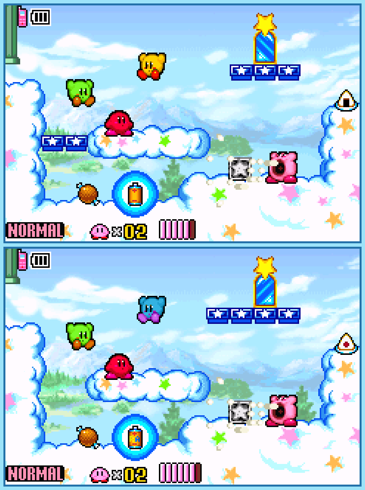

## Last Month's Winners

<table><tbody>
  <tr>
    <td colspan="4" style="text-align: center; vertical-align: middle;">
 
</td>
  </tr>
  <tr>
    <td colspan="2" style="text-align: center; vertical-align: middle;">🥈 </td>
    <td colspan="2" style="text-align: center; vertical-align: middle;">🥉 </td>
  </tr>
  <tr>
    <td></td>
    <td></td>
    <td></td>
    <td></td>
  </tr>
  <tr>
    <td></td>
    <td colspan="3"></td>
  </tr>
</tbody></table>

Scott and his friends are playing the multiplayer of Kirby & The Amazing Mirror but it seems like Scott's game is not synced with the rest. Can you find all 10 differences?

  

## About the Game

| Game                                                    | Console          | Genre                        |
| ------------------------------------------------------- | ---------------- | ---------------------------- |
|  | Game Boy Advance | 2D Platforming, Metroidvania |

* Suggested by: 

**Note:** Every user who finds all 10 differences and sends proof to SporyTike via Site DM or Discord will be listed in the next issue. Additionally a random selected user who submitted the solution until the end of the month will be chosen to select the game of the next picture.
