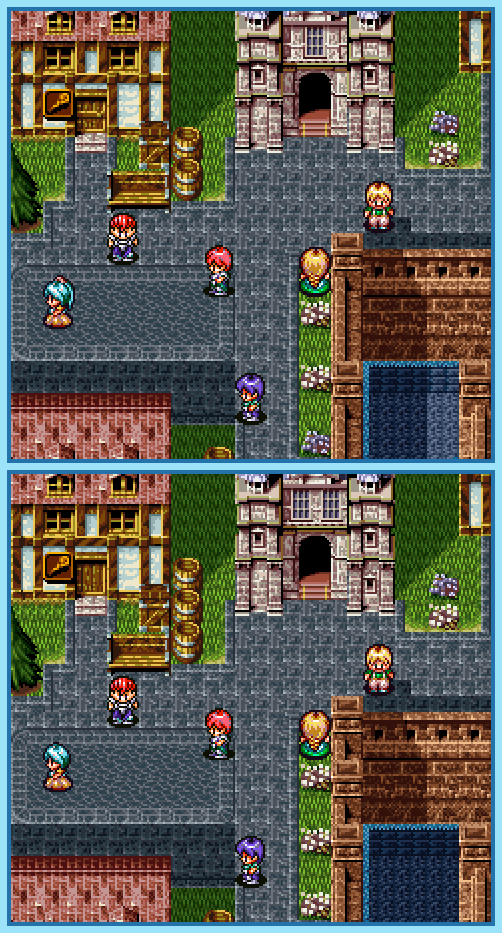

## Last Month's Winners

<table><tbody>
  <tr>
    <td colspan="4" style="text-align: center; vertical-align: middle;">
 
</td>
  </tr>
  <tr>
    <td colspan="2" style="text-align: center; vertical-align: middle;">🥈 </td>
    <td colspan="2" style="text-align: center; vertical-align: middle;">🥉 </td>
  </tr>
  <tr>
    <td></td>
    <td></td>
    <td></td>
    <td></td>
  </tr>
  <tr>
    <td></td>
    <td></td>
    <td></td>
    <td></td>
  </tr>
  <tr>
    <td></td>
    <td></td>
    <td></td>
    <td></td>
  </tr>
  <tr>
    <td></td>
    <td colspan=3></td>
  </tr>
</tbody></table>

The young hero Maxim is searching for his next adventure in his home town Elcid. While checking every corner of the city, he realized that much is different from what it seemed at first. Can you find all 10 differences?

  

## About the Game

| Game                                                           | Console            | Genre                             |
| -------------------------------------------------------------- | ------------------ | --------------------------------- |
|  | SNES/Super Famicom | Role-Playing Game, Turn-based RPG |

* Suggested by: 

**Note:** Every user who finds all 10 differences and sends proof to SporyTike via Site DM or Discord will be listed in the next issue. Additionally a random selected user who submitted the solution until the end of the month will be chosen to select the game of the next picture.
