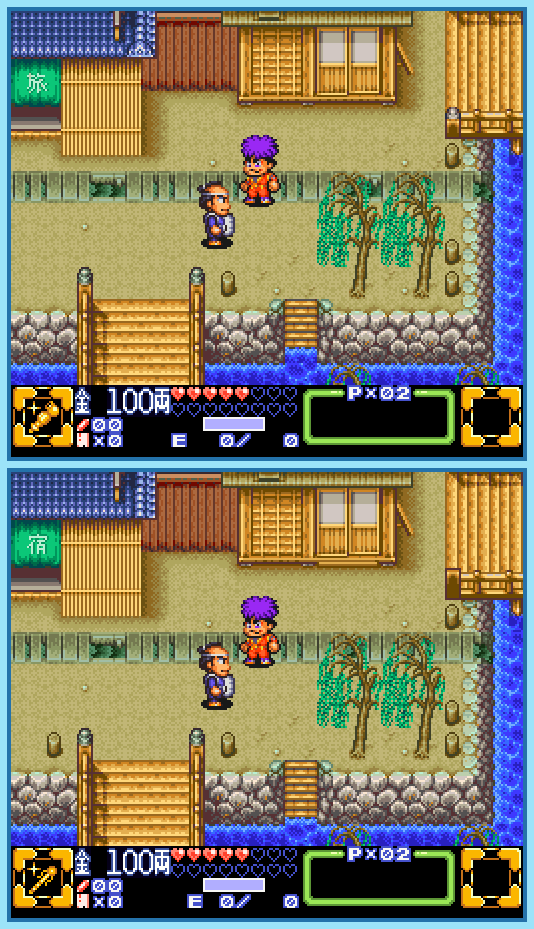

## Last Month's Winners

<table><tbody>
  <tr>
    <td colspan="4" style="text-align: center; vertical-align: middle;">
 
</td>
  </tr>
  <tr>
    <td colspan="2" style="text-align: center; vertical-align: middle;">🥈 </td>
    <td colspan="2" style="text-align: center; vertical-align: middle;">🥉 </td>
  </tr>
  <tr>
    <td></td>
    <td></td>
    <td></td>
    <td></td>
  </tr>
  <tr>
    <td></td>
    <td></td>
    <td></td>
    <td></td>
  </tr>
  <tr>
    <td></td>
    <td colspan=3></td>
  </tr>
</tbody></table>

Goemon is a heroic ninja who fights for justice. But before he became a ninja, he had to prove himself in different disciplines. He had to be not only athletic, but also patient and attentive. He had to notice even the slightest movement of a small pebble. Are you like Goemon and can find all 10 differences?

  

## About the Game

| Game                                                                                      | Console            | Genre  |
| ----------------------------------------------------------------------------------------- | ------------------ | ------ |
|  | SNES/Super Famicom | Action |

* Suggested by: 

**Note:** Every user who finds all 10 differences and sends proof to SporyTike via Site DM or Discord will be listed in the next issue. Additionally a random selected user who submitted the solution until the end of the month will be chosen to select the game of the next picture.
