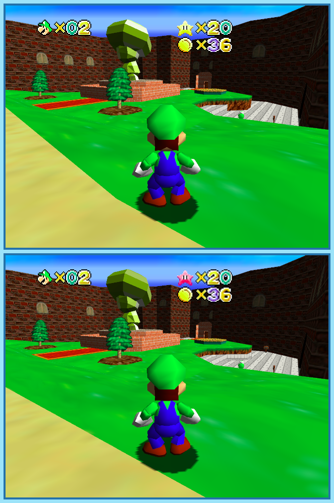

## Last Month's Winners

<table><tbody>
  <tr>
    <td colspan="4" style="text-align: center; vertical-align: middle;">
 
</td>
  </tr>
  <tr>
    <td colspan="2" style="text-align: center; vertical-align: middle;">🥈 </td>
    <td colspan="2" style="text-align: center; vertical-align: middle;">🥉 </td>
  </tr>
  <tr>
    <td></td>
    <td></td>
    <td></td>
    <td></td>
  </tr>
  <tr>
    <td></td>
    <td></td>
    <td></td>
    <td></td>
  </tr>
  <tr>
    <td colspan=4></td>
  </tr>
</tbody></table>

Mario is on a new adventure, but unlike previous ones, this one feels like a surreal dream. Locations he has previously visited change, a path that previously lead to an empty town now leads somewhere else and even stars he already collected look like they were never touched before Can you help Mario out of this nightmare and find all 10 differences?

  

## About the Game

| Game                                                                           | Console     | Genre                          |
| ------------------------------------------------------------------------------ | ----------- | ------------------------------ |
|  | Nintendo 64 | 3D Platforming, Collect-a-thon |

* Suggested by: 

**Note:** Every user who finds all 10 differences and sends proof to SporyTike via Site DM or Discord will be listed in the next issue. Additionally a random selected user who submitted the solution until the end of the month will be chosen to select the game of the next picture.
