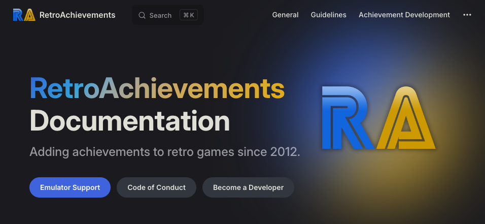

## RADocs Overhaul

  

[RADocs](https://docs.retroachievements.org/) has gone through a much needed and overdue overhaul. Along with a new look,the new docs has better seaching accurace, language support, and a dark mode theme. Edits to the docs are no longer wiki edits, but rather proper Pull Requests that get revied and merged. Information about how to contribute to the new docs can be found [here](https://docs.retroachievements.org/general/contributing-to-the-docs.html).

## RA Awards

Th RA Awards discussion and voting is at it again for it's 4th year. Checkout the `#rawards-discussion` and `#rawards-voting` Discord channels for more information and the latests polls.

## PlayTester Revamp

The PlayTester team has been revamped in order to expant the team and it's current capabilities. Playtest request can be submitted and discussed via Discord in the new forum channel.

Reach out to  for more information.

## Cheat Investigation

We've started an official cheat team and created the dedicated account .

If you suspect anyone may be cheating or see suspicious scores/times, you can send a DM to that account and the team will look into it.

## Official RA YouTube

The official [RetroAchievements YouTube Channel](https://www.youtube.com/@retrocheevos) has passed 1,000 subscribers. We're looking for users who may already have videos or would like to make videos to contribute to the channel.

Type of content we're looking for:
- "What is RetroAchievements" - A Channel Intro video showcasing what the website is all about!
- Emulation Tutorials,
- Developer Tutorials,
- Achievement Guides,
- Announcement Videos,
- Reviews,
- Top 10's
- ...and more!

If you're interested in making content for the channel reach out to  via DM!

## Team Additions

<table>
    <thead>
        <tr>
            <th colspan="3"><a alt=""> Code Reviewer</a></th>
        </tr>
    </thead>
    <tbody>
        <tr>
            <td colspan="1"></td>
            <td colspan="1"></td>
            <td colspan="1"></td>
        </tr>
    </tbody>
    <thead>
        <tr>
            <th colspan="3"><a alt=""> Writing Team</a></th>
        </tr>
    </thead>
    <tbody>
        <tr>
            <td colspan="1"></td>
            <td colspan="1"></td>
            <td colspan="1"></td>
        </tr>
        <tr>
            <td colspan="1"></td>
            <td colspan="1"></td>
            <td colspan="1"></td>
        </tr>
        <tr>
            <td colspan="1"></td>
            <td colspan="1"></td>
            <td colspan="1"></td>
        </tr>
    </tbody>
</table>

## Jr Developer Graduates

| Graduate                        | Game                                                                    |
| :------------------------------ | :---------------------------------------------------------------------- |
|        |  |
|           |        |
|     |                     |
|           |   |
|  |    |

**Current Stats**: 20 Developers have graduated in 2024.

## Developer Compliance

### Set Approvals
*  [Subset - Nintendo Gallery]
*  [Subset - 3 Heart Challenge]
* 
* 
* 
* 
* 

### Achievement Updates
*  demoted for unwelcome concept: Playing Poorly Without Purpose.
*  demoted ror unwelcome concept: Overly RNG Reliant.

## Site Updates
### RAWeb v6.5.0
- Updated UI for ticket editor by [@Jamiras](https://github.com/Jamiras) in [#2375](https://github.com/RetroAchievements/RAWeb/pull/2375)
- Updated UI for ticket manager by [@Jamiras](https://github.com/Jamiras) in [#2400](https://github.com/RetroAchievements/RAWeb/pull/2400)
- Add phone tree when reporting issue from achievement page by [@Jamiras](https://github.com/Jamiras) in [#2393](https://github.com/RetroAchievements/RAWeb/pull/2393)
- Allow leaderboard listing on game page to scroll by [@wescopeland](https://github.com/wescopeland) in [#2376](https://github.com/RetroAchievements/RAWeb/pull/2376)
- Add role-based privileges to achievement editing through Folio by [@wescopeland](https://github.com/wescopeland) in [#2328](https://github.com/RetroAchievements/RAWeb/pull/2328)
- Start looking at roles for forum interactions by [@wescopeland](https://github.com/wescopeland) in [#2377](https://github.com/RetroAchievements/RAWeb/pull/2377)
- Allow muted users to comment on their open tickets by [@wescopeland](https://github.com/wescopeland) in [#2409](https://github.com/RetroAchievements/RAWeb/pull/2409)
- Point 'Cores Compatibility List' link to RetroAchievements documentation by [@Hexadigital](https://github.com/Hexadigital) in [#2395](https://github.com/RetroAchievements/RAWeb/pull/2395)
- Update PCSX2 documentation link to match redirect by [@falsepopsky](https://github.com/falsepopsky) in [#2410](https://github.com/RetroAchievements/RAWeb/pull/2410)
- Fix extra bucket appearing in achievement distribution graph for games with few achievements by [@wescopeland](https://github.com/wescopeland) in [#2398](https://github.com/RetroAchievements/RAWeb/pull/2398)
- Fix shortcode substitution greedily matching partial URLs by [@wescopeland](https://github.com/wescopeland) in [#2361](https://github.com/RetroAchievements/RAWeb/pull/2361)
- Fix rank display when going to next page on leaderboards by [@wescopeland](https://github.com/wescopeland) in [#2392](https://github.com/RetroAchievements/RAWeb/pull/2392)
- Fix active claims not being dropped when developer requests account deletion by [@Jamiras](https://github.com/Jamiras) in [#2372](https://github.com/RetroAchievements/RAWeb/pull/2372)
- Fix initial tooltip display when moving mouse by [@christianlegge](https://github.com/christianlegge) in [#2390](https://github.com/RetroAchievements/RAWeb/pull/2390)

**Public API**:
- Add optional flag to API_GetGameInfoAndUserProgress to return highest award data by [@wescopeland](https://github.com/wescopeland) in [#2382](https://github.com/RetroAchievements/RAWeb/pull/2382)

**Environment**:
- Bump filament to 3.2.72 by [@wescopeland](https://github.com/wescopeland) in #2388
- Write leaderboard data to both LeaderboardEntry and leaderboard_entries by [@wescopeland](https://github.com/wescopeland) in [#2326](https://github.com/RetroAchievements/RAWeb/pull/2326)
- Prefer user_ids when reading from Friends table by [@wescopeland](https://github.com/wescopeland) in [#2380](https://github.com/RetroAchievements/RAWeb/pull/2380)
- Prefer user_ids when reading from AchievementSetClaim table by [@wescopeland](https://github.com/wescopeland) in [#2387](https://github.com/RetroAchievements/RAWeb/pull/2387)
- Prefer user_ids when reading from SiteAwards table by [@wescopeland](https://github.com/wescopeland) in [#2385](https://github.com/RetroAchievements/RAWeb/pull/2385)
- Prefer user_ids when reading from Forum tables by [@wescopeland](https://github.com/wescopeland) in [#2394](https://github.com/RetroAchievements/RAWeb/pull/2394)
- Prefer user_ids when reading from Achievements table by [@wescopeland](https://github.com/wescopeland) in [#2391](https://github.com/RetroAchievements/RAWeb/pull/2391) and [#2397](https://github.com/RetroAchievements/RAWeb/pull/2397)
- Drop Author column from ForumTopic; use author_id instead by [@wescopeland](https://github.com/wescopeland) in [#2338](https://github.com/RetroAchievements/RAWeb/pull/2338)
- Add legacy_game_id column to game_sets table by [@wescopeland](https://github.com/wescopeland) in [#2386](https://github.com/RetroAchievements/RAWeb/pull/2386)
- Add internal API for fetching a list of game images and titles by [@Jamiras](https://github.com/Jamiras) in [#2401](https://github.com/RetroAchievements/RAWeb/pull/2401)
- Rename Hub Manager and Tester roles, add Cheat Investigator and Game Editor roles by [@wescopeland](https://github.com/wescopeland) in [#2389](https://github.com/RetroAchievements/RAWeb/pull/2389)
- Change :link widget properties to :href by [@wescopeland](https://github.com/wescopeland) in [#2403](https://github.com/RetroAchievements/RAWeb/pull/2403)

**New Contributors**
- [@christianlegge](https://github.com/christianlegge) made their first contribution in [#2390](https://github.com/RetroAchievements/RAWeb/pull/2390)
- [@Hexadigital](https://github.com/Hexadigital) made their first contribution in [#2395](https://github.com/RetroAchievements/RAWeb/pull/2395)
- [@falsepopsky](https://github.com/falsepopsky) made their first contribution in [#2410](https://github.com/RetroAchievements/RAWeb/pull/2410)

[Full Changelog](https://github.com/RetroAchievements/RAWeb/releases/tag/6.5.0)

### RAWeb v6.6.0
- Updated UI for Contact Us page by [@wescopeland](https://github.com/wescopeland) in [#2422](https://github.com/RetroAchievements/RAWeb/pull/2422)
- Convert Recent Forum Posts widget/page to Blade by [@wescopeland](https://github.com/wescopeland) in [#2444](https://github.com/RetroAchievements/RAWeb/pull/2444)
- Convert Comments widget/page to Blade by @Jamiras in [#2426](https://github.com/RetroAchievements/RAWeb/pull/2426)
- Completing a primary claim will now also complete any collaboration claims on the same game by [@wescopeland](https://github.com/wescopeland) in [#2439](https://github.com/RetroAchievements/RAWeb/pull/2439)
- Use consistent iconography for Download Emulator by [@wescopeland](https://github.com/wescopeland) in [#2468](https://github.com/RetroAchievements/RAWeb/pull/2468)
- Fix gameslist response not being ordered by title by @Jamiras in [#2440](https://github.com/RetroAchievements/RAWeb/pull/2440)
- Fix submitlbentry response not returning shared ranks by @Jamiras in [#2447](https://github.com/RetroAchievements/RAWeb/pull/2447)
- Fix Mastered count for followed users ranking always showing 0 by [@wescopeland](https://github.com/wescopeland) in [#2438](https://github.com/RetroAchievements/RAWeb/pull/2438)
- Fix special character handling in Edit Post page by [@wescopeland](https://github.com/wescopeland) in [#2421](https://github.com/RetroAchievements/RAWeb/pull/2421)
- Fix note tooltip not showing when indirection is not a pointer by @Jamiras in [#2445](https://github.com/RetroAchievements/RAWeb/pull/2445)
- Fix random white flashing dot that appears during page load by [@wescopeland](https://github.com/wescopeland) in [#2449](https://github.com/RetroAchievements/RAWeb/pull/2449)
- Fix Filament logging of achievement changes by [@wescopeland](https://github.com/wescopeland) in [#2341](https://github.com/RetroAchievements/RAWeb/pull/2341)

**Environment**:

- Migrate site award deduplication php logic to sql by [@wescopeland](https://github.com/wescopeland) in [#2408](https://github.com/RetroAchievements/RAWeb/pull/2408)
- Delete player_stats records on account deletion by [@wescopeland](https://github.com/wescopeland) in [#2419](https://github.com/RetroAchievements/RAWeb/pull/2419)
- Update achievement/leaderboard queries to use user id fields by [@wescopeland](https://github.com/wescopeland) in [#2406](https://github.com/RetroAchievements/RAWeb/pull/2406)
- Update achievement model to read author from developer relation by [@wescopeland](https://github.com/wescopeland) in [#2436](https://github.com/RetroAchievements/RAWeb/pull/2436)
- Create achievement_set_game_hashes table by [@wescopeland](https://github.com/wescopeland) in [#2437](https://github.com/RetroAchievements/RAWeb/pull/2437)
- Drop LeaderboardEntry table by [@wescopeland](https://github.com/wescopeland) in [#2420](https://github.com/RetroAchievements/RAWeb/pull/2420)
- Use Folio-native routing for Beaten Games by [@wescopeland](https://github.com/wescopeland) in [#2428](https://github.com/RetroAchievements/RAWeb/pull/2428)
- Use Folio-native routing for Completion Progress by [@wescopeland](https://github.com/wescopeland) in [#2432](https://github.com/RetroAchievements/RAWeb/pull/2432)
- Use Folio-native routing for Game Compare pages by [@wescopeland](https://github.com/wescopeland) in [#2431](https://github.com/RetroAchievements/RAWeb/pull/2431)
- Use Folio-native routing for Developer Sets and Developer Feed by [@wescopeland](https://github.com/wescopeland) in [#2430](https://github.com/RetroAchievements/RAWeb/pull/2430)
- Use Folio-native routing for Tickets by [@wescopeland](https://github.com/wescopeland) in [#2424](https://github.com/RetroAchievements/RAWeb/pull/2424)
- Use Folio-native routing for Game Suggestions by [@wescopeland](https://github.com/wescopeland) in [#2425](https://github.com/RetroAchievements/RAWeb/pull/2425)
- Use Folio-native routing for Game List by [@wescopeland](https://github.com/wescopeland) in [#2429](https://github.com/RetroAchievements/RAWeb/pull/2429)
- Use Folio-native routing for Messages by [@wescopeland](https://github.com/wescopeland) in [#2427](https://github.com/RetroAchievements/RAWeb/pull/2427)

[Full Changelog](https://github.com/RetroAchievements/RAWeb/releases/tag/6.6.0)

## RATools v1.14.0
- Support for multiline comments via /* */
- Add #MinimumVersion header meta-comment to specify some minimum target version for optional features
- Serialize addresses as 16-bit if script does not reference any addresses over 0xFFFF
- Support to translate prev(A == B) into prev(A) == prev(B)
- Support invoking functions stored in dictionaries without intermediate variables
- Support indexing function returns without intermediate variables
- Show output path as tooltip on local achievement count
- Allow character chords containing Ctrl (i.e. Ctrl+Alt+4 for left curly brace on French keyboards)
- Report error ORing hitcounts inside tally (instead of commas)
- Better error when summing expressions that cannot be converted to requirements
- Fix modification of nested dictionaries
- Fix arithmetic and bitwise modifications being combined incorrectly
- Fix constant modifier at end of AddSource chain becoming always_true()/always_false() when viewing logic
- Fix always_true() clause being removed from end of AddSource chain
- Fix IDs not being generated when using the CLI tool
- Fix modified comparisons being considered equal if they're equivalent without the modification
- Fix modified comparison losing modification when used inside tally()
- Fix error specifying anonymous function as default parameter
- Fix extra tally when dumping script containing AddHits chain inside Measured
- Fix address not updating when shrinking big endian sizes
- Fix exception processing repeated(N, always_true() && never(X))
- Fix exception doing a search and replace of some string to empty string
- Fix exception when cross-multipling conditions results in an always_true()
- Fix exception when predicate doesn't return a value

[Full Changelog](https://github.com/Jamiras/RATools/releases/tag/v1.14.1)

## DevQuest

### DevQuest Awards

<table>
    <thead>
        <tr>
            <th colspan="3"></th>
        </tr>
    </thead>
    <tbody>
        <tr>
            <td rowspan="3" width=250></td>
        </tr>
        <tr>
            <td colspan="1"></td>
        </tr>
        <tr>
            <td colspan="1"></td>
        </tr>
    </tbody>
</table>
 
<table>
    <thead>
        <tr>
            <th colspan="3"></th>
        </tr>
    </thead>
    <tbody>
        <tr>
            <td rowspan="1"></td>
            <td rowspan="1"></td>
        </tr>
    </tbody>
</table>
 
<table>
    <thead>
        <tr>
            <th colspan="3"></th>
        </tr>
    </thead>
    <tbody>
        <tr>
            <td rowspan="1" width=250></td>
            <td colspan="1"></td>
        </tr>
        <tr>
            <td rowspan="1" width=250></td>
            <td colspan="1"></td>
        </tr>
    </tbody>
</table>
 
<table>
    <thead>
        <tr>
            <th colspan="3"></th>
        </tr>
    </thead>
    <tbody>
        <tr>
            <td rowspan="1" width=250></td>
            <td colspan="1"></td>
        </tr>
    </tbody>
</table>
 
<table>
    <thead>
        <tr>
            <th colspan="3"></th>
        </tr>
    </thead>
    <tbody>
        <tr>
            <td rowspan="3" width=250></td>
        </tr>
        <tr>
            <td colspan="1"></td>
        </tr>
        <tr>
            <td colspan="1"></td>
        </tr>
    </tbody>
</table>
 
<table>
    <thead>
        <tr>
            <th colspan="3"></th>
        </tr>
    </thead>
    <tbody>
        <tr>
            <td rowspan="4" width=250></td>
        </tr>
        <tr>
            <td colspan="1"></td>
        </tr>
        <tr>
            <td colspan="1"></td>
        </tr>
        <tr>
            <td colspan="1"></td>
        </tr>
        <tr>
            <td rowspan="4" width=250></td>
        </tr>
        <tr>
            <td colspan="1"></td>
        </tr>
        <tr>
            <td colspan="1"></td>
        </tr>
        <tr>
            <td colspan="1"></td>
        </tr>
    </tbody>
</table>
 
<table>
    <thead>
        <tr>
            <th colspan="3"></th>
        </tr>
    </thead>
    <tbody>
        <tr>
            <td rowspan="3" width=250></td>
        </tr>
        <tr>
            <td colspan="1"></td>
        </tr>
        <tr>
            <td colspan="1"></td>
        </tr>
    </tbody>
</table>
 
<table>
    <thead>
        <tr>
            <th colspan="3"></th>
        </tr>
    </thead>
    <tbody>
        <tr>
            <td rowspan="1" width=250></td>
            <td colspan="1"></td>
        </tr>
        <tr>
            <td rowspan="1" width=250></td>
            <td colspan="1"></td>
        </tr>
    </tbody>
</table>
 
<table>
    <thead>
        <tr>
            <th colspan="3"></th>
        </tr>
    </thead>
    <tbody>
        <tr>
            <td rowspan="1"></td>
        </tr>
    </tbody>
</table>
 
<table>
    <thead>
        <tr>
            <th colspan="3"></th>
        </tr>
    </thead>
    <tbody>
        <tr>
            <td rowspan="4" width=250></td>
        </tr>
        <tr>
            <td colspan="1"></td>
        </tr>
        <tr>
            <td colspan="1"></td>
        </tr>
        <tr>
            <td colspan="1"></td>
        </tr>
        <tr>
            <td rowspan="4" width=250></td>
        </tr>
        <tr>
            <td colspan="1"></td>
        </tr>
        <tr>
            <td colspan="1"></td>
        </tr>
        <tr>
            <td colspan="1"></td>
        </tr>
        <tr>
            <td rowspan="4" width=250></td>
        </tr>
        <tr>
            <td colspan="1"></td>
        </tr>
        <tr>
            <td colspan="1"></td>
        </tr>
        <tr>
            <td colspan="1"></td>
        </tr>
        <tr>
            <td rowspan="4" width=250></td>
        </tr>
        <tr>
            <td colspan="1"></td>
        </tr>
        <tr>
            <td colspan="1"></td>
        </tr>
        <tr>
            <td colspan="1"></td>
        </tr>
        <tr>
            <td rowspan="4" width=250></td>
        </tr>
        <tr>
            <td colspan="1"></td>
        </tr>
        <tr>
            <td colspan="1"></td>
        </tr>
        <tr>
            <td colspan="1"></td>
        </tr>
    </tbody>
</table>

### Veteran Dev Awards

<table>
    <thead>
        <tr>
            <th colspan="3"></th>
        </tr>
    </thead>
    <tbody>
        <tr>
            <td colspan="1"></td>
            <td colspan="1"></td>
        </tr>
    </tbody>
</table>
 
<table>
    <thead>
        <tr>
            <th colspan="3">Has obtained at least five badges through DevQuest</th>
        </tr>
    </thead>
    <tbody>
        <tr>
            <td colspan="1"></td>
        </tr>
    </tbody>
</table>