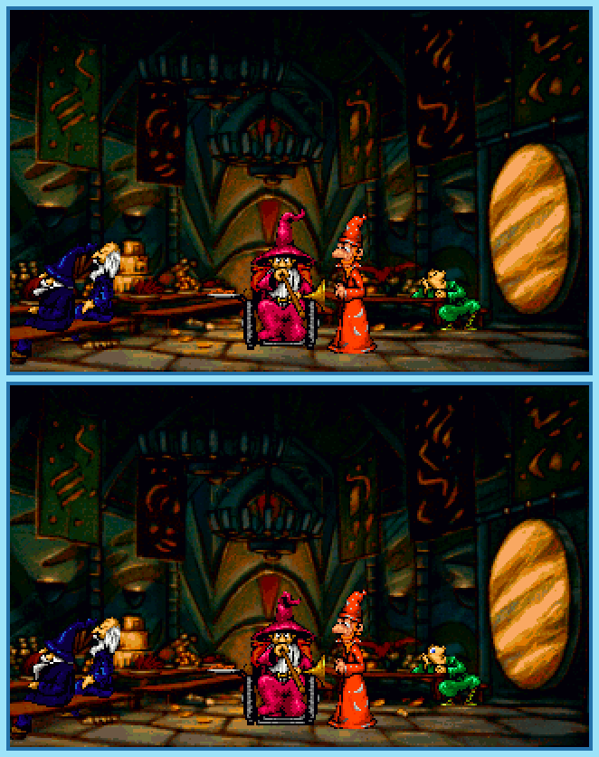

## Last Month's Winners

<table><tbody>
  <tr>
    <td colspan="4" style="text-align: center; vertical-align: middle;">
 
</td>
  </tr>
  <tr>
    <td colspan="2" style="text-align: center; vertical-align: middle;">🥈 </td>
    <td colspan="2" style="text-align: center; vertical-align: middle;">🥉 </td>
  </tr>
  <tr>
    <td></td>
    <td></td>
    <td></td>
    <td></td>
  </tr>
  <tr>
    <td></td>
    <td></td>
    <td></td>
    <td></td>
  </tr>
  <tr>
    <td></td>
    <td></td>
    <td></td>
    <td></td>
  </tr>
  <tr>
    <td colspan=4></td>
  </tr>
</tbody></table>

Rincewind is a wizard with no wizardly qualifications until one day when his destiny decided to send him on an adventure. Not only does he now need to learn how to use magic wisely, but also how alternative dimensions work. Can you find all 10 difference

  

## About the Game

| Game                                     | Console     | Genre                     |
| ---------------------------------------- | ----------- | ------------------------- |
|  | PlayStation | Point-and-Click Adventure |

* Suggested by: 

**Note:** Every user who finds all 10 differences and sends proof to SporyTike via Site DM or Discord will be listed in the next issue. Additionally a random selected user who submitted the solution until the end of the month will be chosen to select the game of the next picture.
