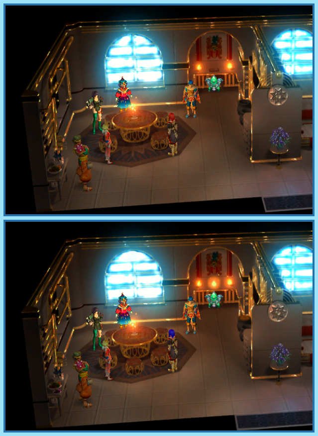

## Last Month's Winners

<table><tbody>
  <tr>
    <td colspan="4" style="text-align: center; vertical-align: middle;">
 
</td>
  </tr>
  <tr>
    <td colspan="2" style="text-align: center; vertical-align: middle;">🥈 </td>
    <td colspan="2" style="text-align: center; vertical-align: middle;">🥉 </td>
  </tr>
  <tr>
    <td></td>
    <td></td>
    <td></td>
    <td></td>
  </tr>
  <tr>
    <td></td>
    <td></td>
    <td></td>
    <td></td>
  </tr>
</tbody></table>

Kalas, Xelha and their friends are on a quest to save the world from the Malpercio, the God of Destruction. While searching for the remaining End Magnus they meet a man named Lyude who invites them to his home. The heroes notice that something is odd since objects shift while they don't look at them. Can you find all 10 differences?

  

## About the Game

| Game                                                                         | Console  | Genre                                 |
| ---------------------------------------------------------------------------- | -------- | ------------------------------------- |
|  | GameCube | Turn-based RPG, Collectible Card Game |

* Suggested by: 

**Note:** Every user who finds all 10 differences and sends proof to SporyTike via Site DM or Discord will be listed in the next issue. Additionally a random selected user who submitted the solution until the end of the month will be chosen to select the game of the next picture.
