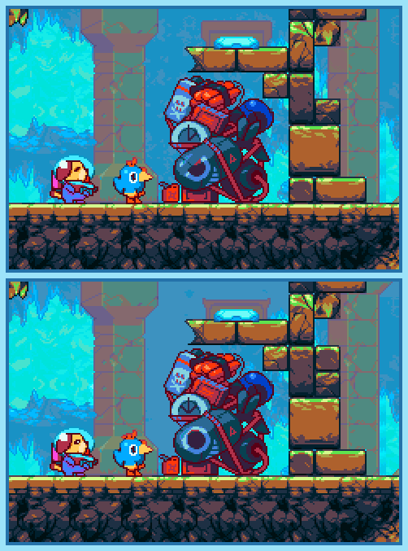

## Last Month's Winners

<table><tbody>
  <tr>
    <td colspan="4" style="text-align: center; vertical-align: middle;">
 
</td>
  </tr>
  <tr>
    <td colspan="2" style="text-align: center; vertical-align: middle;">🥈 </td>
    <td colspan="2" style="text-align: center; vertical-align: middle;">🥉 </td>
  </tr>
  <tr>
    <td></td>
    <td></td>
    <td></td>
    <td></td>
  </tr>
  <tr>
    <td></td>
    <td></td>
    <td></td>
    <td></td>
  </tr>
  <tr>
    <td></td>
    <td colspan=3></td>
  </tr>
</tbody></table>

Maxwell is stranded on an unknown planet and seems to run in circles and returns to places he was before. However, in his absence it seems that something is changing. Can you find all 10 differences?

  

## About the Game

| Game                                                                          | Console          | Genre        |
| ----------------------------------------------------------------------------- | ---------------- | ------------ |
|  | Game Boy Advance | Metroidvania |

* Suggested by: 

**Note:** Every user who finds all 10 differences and sends proof to SporyTike via Site DM or Discord will be listed in the next issue. Additionally a random selected user who submitted the solution until the end of the month will be chosen to select the game of the next picture.
