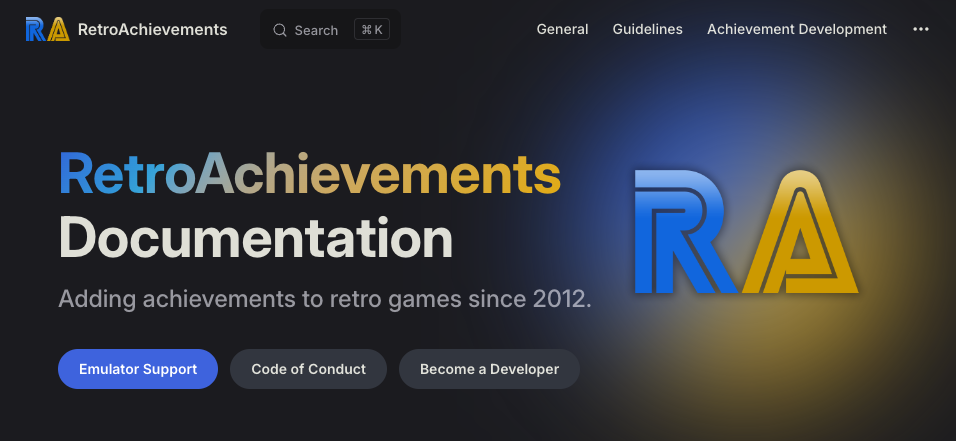

## GameCube Is Here!!!

  

GameCube is finally here. With over 100 sets available on release, this is the largest console launch in RA history. Huge thanks to everyone involved making the deam of GameCube achievement on RA a reality.

Head over to [GameCube Launch Part 3](./gamecube-launch.html) for more even more writeups for launch sets.

## RADocs Overhaul

  

[RADocs](https://docs.retroachievements.org/) has gone through a much needed and overdue overhaul. Along with a new look, the new docs have better seaching accuracy, language support, and a dark mode theme. Edits to the docs are no longer wiki edits, but rather proper Pull Requests that get reviewed and merged. Information about how to contribute to the new docs can be found [here](https://docs.retroachievements.org/general/contributing-to-the-docs.html).

## RA Awards

Th RA Awards discussion and voting is at it again for its 4th year. Checkout the `#rawards-discussion` and `#rawards-voting` Discord channels for more information and the latest polls.

## PlayTester Revamp

The PlayTester team has been revamped in order to expand the team and its current capabilities. Playtest request can be submitted and discussed via Discord in the new forum channel.

Reach out to  for more information.

## Cheat Investigation

We've started an official cheat team and created the dedicated account .

If you suspect anyone may be cheating or see suspicious scores/times, you can send a DM to that account and the team will look into it.

## Official RA YouTube

The official [RetroAchievements YouTube Channel](https://www.youtube.com/@retrocheevos) has passed 1,000 subscribers. We're looking for users who may already have videos or would like to make videos to contribute to the channel.

Type of content we're looking for:
- "What is RetroAchievements" - A Channel Intro video showcasing what the website is all about!
- Emulation Tutorials,
- Developer Tutorials,
- Achievement Guides,
- Announcement Videos,
- Reviews,
- Top 10's
- ...and more!

If you're interested in making content for the channel reach out to  via DM!

## Jr Developer Graduates

| Graduate&nbsp;           | Game                                                           |
| :----------------------- | :------------------------------------------------------------- |
|  |  |
|  |   |

**Current Stats**: 30 Developers have graduated in 2024.

## Developer Compliance

### Set Approvals
- [Resident Evil](https://retroachievements.org/game/29328) regional variant
- [Burnout [Subset - Criterion Times]](https://retroachievements.org/game/30708)
- [Dragon Ball Z: Budokai 2 [Subset - World Tournament]](https://retroachievements.org/game/30720)
- [~Hack~ Andaron Saga [Subset - Secrets Hunt]](https://retroachievements.org/game/30883)

### Achievement & Set Updates
- [Mighty Beanz: Pocket Puzzles](https://retroachievements.org/game/3620): Demotion - Unwelcome Concept: Demoted for consistent unwelcome concepts
- [Gillionaire](https://retroachievements.org/achievement/7200): Demotion - Unwelcome Concept: Pointless Grinding
- [Pac-Man](https://retroachievements.org/game/12192): Title/Description Updates: Updated to avoid plagiarism
- [Your Last Breath](https://retroachievements.org/achievement/10925): Demotion - Unwelcome Concept: Zero Purpose
- [See Ya Later, Copper!](https://retroachievements.org/achievement/367004): Demotion - Unwelcome Concept: Playing Poorly Without Purpose
- [There's No Pausing War, Son](https://retroachievements.org/achievement/167690): Demotion - Unwelcome Concept: Zero Effort Without Purpose
- [Give Credit Where Credit 'Tis Due](https://retroachievements.org/achievement/46452): Demotion - Unwelcome Concept: Zero Effort Without Purpose
- ['Tis-a-me!](https://retroachievements.org/achievement/46449): Demotion - Unwelcome Concept: Zero Effort Without Purpose
- [Going All the Way](https://retroachievements.org/achievement/4440): Demotion - Unwelcome Concept: Pointless Grinding
- [Ace of the Maze](https://retroachievements.org/achievement/108057): Title Update: Remove banned user from title
- [Invisibility Won't Stop Me](https://retroachievements.org/achievement/106084): Title Update: Remove banned user from title
- [Palkia](https://retroachievements.org/achievement/329826): Title Update: Remove banned user from title
- [Damp Dugout](https://retroachievements.org/achievement/325342): Demotion - Unwelcome Concept: Achievement Spam
- [The True Winner of VLDC9: YOU!](https://retroachievements.org/achievement/325334): Demotion - Unwelcome Concept: Achievement Spam
- [I Made You a Level But I Eated It](https://retroachievements.org/achievement/325337): Demotion - Unwelcome Concept: Achievement Spam
- [The Grass Feels Greener](https://retroachievements.org/achievement/325335): Demotion - Unwelcome Concept: Achievement Spam
- [The Wilderness Must Be Explored!](https://retroachievements.org/achievement/325336): Demotion - Unwelcome Concept: Achievement Spam
- [Just Breathe, You Can Do This.](https://retroachievements.org/achievement/325338): Demotion - Unwelcome Concept: Achievement Spam
- [Life's a Beach](https://retroachievements.org/achievement/325339): Demotion - Unwelcome Concept: Achievement Spam
- [Chilled to The Core](https://retroachievements.org/achievement/325343): Demotion - Unwelcome Concept: Achievement Spam
- [Super Mario Galaxy](https://retroachievements.org/achievement/325340): Demotion - Unwelcome Concept: Achievement Spam
- [A Harvest Moon, So Aptly Named](https://retroachievements.org/achievement/325341): Demotion - Unwelcome Concept: Achievement Spam
- [Can You Feel It?](https://retroachievements.org/achievement/325238): Demotion - Unwelcome Concept: Achievement Spam
- [The Cream of The Crop](https://retroachievements.org/achievement/325344): Demotion - Unwelcome Concept: Achievement Spam
- [Gamer Encyclopedia](https://retroachievements.org/achievement/451753): Demotion - Unwelcome Concept: Zero Effort Without Purpose
- [Who's the Evil Cat Now?](https://retroachievements.org/achievement/86756): Demotion - Unwelcome Concept: Achievement Spam
- [Amateur Collector](https://retroachievements.org/achievement/131433): Demotion - Unwelcome Concept: Achievement Spam
- [Advanced Collector](https://retroachievements.org/achievement/131434): Demotion - Unwelcome Concept: Achievement Spam
- [The Ultimate Acrobat](https://retroachievements.org/achievement/134865): Demotion - Unwelcome Concept: Pointless Grinding
- [Batman Forever](https://retroachievements.org/achievement/341820): Demotion - Unwelcome Concept: Requires Perfection
- [Hoarding Disorder](https://retroachievements.org/achievement/341822): Demotion - Unwelcome Concept: Pointless Grinding
- [Who Wants to Live Forever](https://retroachievements.org/achievement/376257): Demotion - Unwelcome Concept: Pointless Grinding
- [Score Shatterer](https://retroachievements.org/achievement/29587): Demotion - Unwelcome Concept: Pointless Grinding
- [Pacifist](https://retroachievements.org/achievement/65240): Demotion - Unwelcome Concept: Playing Poorly Without Purpose
- [Major Pacifist](https://retroachievements.org/achievement/65241): Demotion - Unwelcome Concept: Playing Poorly Without Purpose
- [Ninja Dodger](https://retroachievements.org/achievement/65242): Demotion - Unwelcome Concept: Playing Poorly Without Purpose
- [King Abaddon](https://retroachievements.org/achievement/36124): Demotion - Unwelcome Concept: Pointless Grinding
- [Kingu Da!!!](https://retroachievements.org/achievement/36127): Demotion - Unwelcome Concept: Pointless Grinding
- [King Abaddon](https://retroachievements.org/achievement/36395): Demotion - Unwelcome Concept: Pointless Grinding
- [Kingu Da!!!](https://retroachievements.org/achievement/36398): Demotion - Unwelcome Concept: Pointless Grinding
- [[DW2] Party of Power](https://retroachievements.org/achievement/192278): Demotion - Unwelcome Concept: Pointless Grinding
- [The title screen is so ...Y](https://retroachievements.org/achievement/19807): Demotion - Unwelcome Concept: Zero Effort Without Purpose
- [Score board](https://retroachievements.org/achievement/19794): Demotion - Unwelcome Concept: Zero Effort Without Purpose
- [Trapped?](https://retroachievements.org/achievement/335099): Demotion - Unwelcome Concept: Playing Poorly Without Purpose
- [Never Coming Home](https://retroachievements.org/achievement/23316): Demotion - Unwelcome Concept: Overly RNG Reliant
- [Thou Art a Slime Rancher](https://retroachievements.org/achievement/46455): Demotion - Unwelcome Concept: Overly RNG Reliant
- [The Dark Knight Rises...and Falls](https://retroachievements.org/achievement/48036): Demotion - Unwelcome Concept: Playing Poorly Without Purpose
- [Tribute to Satoru Iwata](https://retroachievements.org/achievement/65574): Demotion - Unwelcome Concept: Playing Poorly Without Purpose
- [Thine Power is Over 9000!](https://retroachievements.org/achievement/46409): Demotion - Unwelcome Concept: Pointless Grinding
- [The More You Know](https://retroachievements.org/achievement/50744): Demotion - Unwelcome Concept: Zero Effort Without Purpose
- [It's Such an Unexpected Decision.](https://retroachievements.org/achievement/69819): Demotion - Unwelcome Concept: Zero Effort Without Purpose
- [I've Caught More Demons](https://retroachievements.org/achievement/36413): Demotion - Unwelcome Concept: Pointless Grinding
- [I've Caught More Demons](https://retroachievements.org/achievement/36143): Demotion - Unwelcome Concept: Pointless Grinding
- [Busted](https://retroachievements.org/achievement/45073): Demotion - Unwelcome Concept: Playing Poorly Without Purpose
- [Mortal Combat](https://retroachievements.org/achievement/47425): Demotion - Unwelcome Concept: Zero Effort Without Purpose
- [It's A Leap Of Faith, Kid...](https://retroachievements.org/achievement/107788): Demotion - Unwelcome Concept: Playing Poorly Without Purpose

## Site Updates
### RAWeb v6.9.0
**Features:**
- Standardize release date format on game pages by [@wescopeland](https://github.com/wescopeland) in [#2514](https://github.com/RetroAchievements/RAWeb/pull/2514)
- Support for Remember/Recall when viewing trigger definitions by [@Jamiras](https://github.com/Jamiras) in [#2567](https://github.com/RetroAchievements/RAWeb/pull/2567)
- Add release/developer/publisher/genre fields to game editor in management console by [@wescopeland](https://github.com/wescopeland) in [#2513](https://github.com/RetroAchievements/RAWeb/pull/2513)
- Add game hashes to management console by [@wescopeland](https://github.com/wescopeland) in [#2522](https://github.com/RetroAchievements/RAWeb/pull/2522)
- Add achievement reorder/promote/demote functionality to management console by [@wescopeland](https://github.com/wescopeland) in [#2516](https://github.com/RetroAchievements/RAWeb/pull/2516)
- Add memory notes to management console by [@wescopeland](https://github.com/wescopeland) in [#2569](https://github.com/RetroAchievements/RAWeb/pull/2569)
- Add leaderboard management to management console by [@wescopeland](https://github.com/wescopeland) in [#2546](https://github.com/RetroAchievements/RAWeb/pull/2546)
- Migrate Most Reported Games to management console by [@wescopeland](https://github.com/wescopeland) in [#2551](https://github.com/RetroAchievements/RAWeb/pull/2551)
- Migrate Get Achievement Unlocks tool to management console by [@wescopeland](https://github.com/wescopeland) in [#2544](https://github.com/RetroAchievements/RAWeb/pull/2544) and [#2576](https://github.com/RetroAchievements/RAWeb/pull/2576)
- Capture game hash in player sessions by [@wescopeland](https://github.com/wescopeland) in [#2537](https://github.com/RetroAchievements/RAWeb/pull/2537)
- Require 250 points to upload user avatar by [@wescopeland](https://github.com/wescopeland) in [#2543](https://github.com/RetroAchievements/RAWeb/pull/2543)
- Allow extra information to be passed through report issue phone tree by [@Jamiras](https://github.com/Jamiras) in [#2573](https://github.com/RetroAchievements/RAWeb/pull/2573)
- Redirect to home if no token provided when trying to validate email by [@wescopeland](https://github.com/wescopeland) in [#2541](https://github.com/RetroAchievements/RAWeb/pull/2541)
- Fix leaderboard management not showing if all leaderboards are hidden by [@wescopeland](https://github.com/wescopeland) in [#2555](https://github.com/RetroAchievements/RAWeb/pull/2555)
- Fix query for total games beaten by [@wescopeland](https://github.com/wescopeland) in [#2553](https://github.com/RetroAchievements/RAWeb/pull/2553)
- Fix rank calculation for followed users leaderboard by [@wescopeland](https://github.com/wescopeland) in [#2554](https://github.com/RetroAchievements/RAWeb/pull/2554)
- Fix exception viewing games list sorted by ticket count when not logged in by [@Jamiras](https://github.com/Jamiras) in [#2566](https://github.com/RetroAchievements/RAWeb/pull/2566)
- Fix word-break in Most Recently Played component by [@wescopeland](https://github.com/wescopeland) in [#2532](https://github.com/RetroAchievements/RAWeb/pull/2532)

**Public API:**
- Add API_GetLeaderboardEntries by [@ioslife](https://github.com/ioslife) in [#2564](https://github.com/RetroAchievements/RAWeb/pull/2564)

**Environment:**
- Rename CodeNotes to memory_notes by [@wescopeland](https://github.com/wescopeland) in [#2540](https://github.com/RetroAchievements/RAWeb/pull/2540)
- Add achievements_unlocked_softcore column to player_games table by [@TwosomesUP](https://github.com/TwosomesUP) in [#2477](https://github.com/RetroAchievements/RAWeb/pull/2477)
- Add webhook for unwelcome concepts inbox by [@wescopeland](https://github.com/wescopeland) in [#2539](https://github.com/RetroAchievements/RAWeb/pull/2539)
- Add webhooks for incorrect types and issue reports by [@wescopeland](https://github.com/wescopeland) in [#2560](https://github.com/RetroAchievements/RAWeb/pull/2560)
- Include direct links to achievements in unwelcome concept reports by [@wescopeland](https://github.com/wescopeland) in [#2557](https://github.com/RetroAchievements/RAWeb/pull/2557)
- Remove unused css by [@wescopeland](https://github.com/wescopeland) in [#2581](https://github.com/RetroAchievements/RAWeb/pull/2581)
- Add a make:js-component Artisan command by [@wescopeland](https://github.com/wescopeland) in [#2533](https://github.com/RetroAchievements/RAWeb/pull/2533)
- Add basic test coverage to lbinfo dorequest endpoint by [@wescopeland](https://github.com/wescopeland) in [#2524](https://github.com/RetroAchievements/RAWeb/pull/2524)
- Update game retropoints less frequently by [@wescopeland](https://github.com/wescopeland) in [#2530](https://github.com/RetroAchievements/RAWeb/pull/2530)
- Fix typographical errors in code comments by [@THE-Spellchecker](https://github.com/THE-Spellchecker) in [#2558](https://github.com/RetroAchievements/RAWeb/pull/2558)
- Fix contribution calculation for deleted users by [@wescopeland](https://github.com/wescopeland) in [#2545](https://github.com/RetroAchievements/RAWeb/pull/2545)

**New Contributors:**
- [@THE-Spellchecker](https://github.com/THE-Spellchecker) made their first contribution in [#2558](https://github.com/RetroAchievements/RAWeb/pull/2558)
- [@TwosomesUP](https://github.com/TwosomesUP) made their first contribution in [#2477](https://github.com/RetroAchievements/RAWeb/pull/2477)

[Full Changelog](https://github.com/RetroAchievements/RAWeb/releases/tag/6.9.0)

### RAWeb v6.10.0
**Features:**
- Fixed a bug where developers submitting game meta would sometimes get error responses by [@wescopeland](https://github.com/wescopeland) in [#2587](https://github.com/RetroAchievements/RAWeb/pull/2587)
- Fixed a bug where games could be removed from the Last 5 Games Played list on user profiles by [@wescopeland](https://github.com/wescopeland) in [#2592](https://github.com/RetroAchievements/RAWeb/pull/2592)

**Web API:**
- Added endpoint for user's Want to Play Games list by [@ioslife](https://github.com/ioslife) in [#2549](https://github.com/RetroAchievements/RAWeb/pull/2549)
- Added offset and count parameters to API_GetGameList by [@WedgeSparda](https://github.com/WedgeSparda) in [#2574](https://github.com/RetroAchievements/RAWeb/pull/2574)
- Added endpoint for fetching Game Leaderboards by [@ioslife](https://github.com/ioslife) in [#2563](https://github.com/RetroAchievements/RAWeb/pull/2563)

**Environment:**
- Prepared to migrate the forum Recent Posts page to React.js by [@wescopeland](https://github.com/wescopeland) in [#2502](https://github.com/RetroAchievements/RAWeb/pull/2502)
- Resolve all eslint warnings by [@wescopeland](https://github.com/wescopeland) in [#2593](https://github.com/RetroAchievements/RAWeb/pull/2593)

[Full Changelog](https://github.com/RetroAchievements/RAWeb/releases/tag/6.10.0)

### RAWeb 6.12.0 has been released
**Features:**
- Revamp "High scores" component on game page with a dynamic "Latest Masters" component by [@Jamiras](https://github.com/Jamiras) in #2583
- Allow emulators to backdate unlocks by [@Jamiras](https://github.com/Jamiras) in #2618
- Expand resolved tickets page; add created tickets page by [@Jamiras](https://github.com/Jamiras) in #2622
- Add console links from "Last 5 Games Played" to Completion Progress page by [@wescopeland](https://github.com/wescopeland) in #2610

**Bug Fixes:**
- Fix an issue where the Open Tickets link on game pages would show unexpected results by [@wescopeland](https://github.com/wescopeland) in #2605
- Speed up game pages with lots of leaderboards by [@wescopeland](https://github.com/wescopeland) in #2599
- Speed up an animation on the user profile for iOS Safari users by [@wescopeland](https://github.com/wescopeland) in #2611
- Properly handle soft deleted users in DispatchUpdateDeveloperContributionYieldJob by [@wescopeland](https://github.com/wescopeland) in #2594
- Pluralize 'points' in followed users ranking component by [@wescopeland](https://github.com/wescopeland) in #2626

**Management Console Changes:**
- Improve breadcrumbs UX on some pages by [@wescopeland](https://github.com/wescopeland) in #2595
- In the navbar, link the Manage dropdown to the management console by [@wescopeland](https://github.com/wescopeland) in #2600
- Adjust game achievements table core/unofficial filtering UX by [@wescopeland](https://github.com/wescopeland) in #2607
- Add Newest Ticket Date column to Most Reported Games table by [@wescopeland](https://github.com/wescopeland) in #2612
- Log and show game/achievement badge changes in the audit log by [@wescopeland](https://github.com/wescopeland) in #2615

Web API Changes:
- API_GetGame: use structured release dates on API_GetGame by [@wescopeland](https://github.com/wescopeland) in #2588
- API_GetGameExtended, API_GetGameInfoAndUserProgress: use structured release dates by [@wescopeland](https://github.com/wescopeland) in #2589
- Remove the z query param by [@ioslife](https://github.com/ioslife) in #2591

**Environment Changes:**
- Migrate /forums/recent-posts to React.js by [@wescopeland](https://github.com/wescopeland) in #2579
- Migrate user settings page back-end code to controllers by [@wescopeland](https://github.com/wescopeland) in #2596
- Add tracking events to the external links by [@wescopeland](https://github.com/wescopeland) in #2614
- Squash all database migrations by [@wescopeland](https://github.com/wescopeland) in #2598
- 
[Full Changelog](https://github.com/RetroAchievements/RAWeb/releases/tag/6.12.0)

### RAWeb 6.13.0 has been released
**Features:**
- Add hash information to game history by [@Jamiras](https://github.com/Jamiras) in #2646
- Show indicator for users who have mastered a set in the Most Points Earned list by [@Jamiras](https://github.com/Jamiras) in #2639
- Add Nokia N-Gage and Sega Pico system icons by [@oddgoo](https://github.com/oddgoo) in #2647

**Bug Fixes:**
- Prevent exception trying to render recent mastery for deleted user by [@Jamiras](https://github.com/Jamiras) in #2636
- Remediate issue where "Mastered" glow has a strobing effect by [@wescopeland](https://github.com/wescopeland) in #2650
- Allow muted users to message team accounts by [@Jamiras](https://github.com/Jamiras) in #2638
- Don't show today's date on user profiles recently played section when given null dates by [@wescopeland](https://github.com/wescopeland) in #2643

**Environment Changes:**
- Include command line arguments in logged exceptions by [@Jamiras](https://github.com/Jamiras) in #2634
- Store user shortcodes as [user=ID] in the database by [@wescopeland](https://github.com/wescopeland) in #2606
- Re-add migration value insertions into mysql schema dump by [@wescopeland](https://github.com/wescopeland) in #2651
- Migrate the Contact page to React.js by [@wescopeland](https://github.com/wescopeland) in #2648
- For internal analytics, track gamelist type and forum topic id in pageview events by [@wescopeland](https://github.com/wescopeland) in #2653
- Improve the load performance of forum recent topics page by [@wescopeland](https://github.com/wescopeland) in #2644
- Migrate the Terms page to React.js by [@wescopeland](https://github.com/wescopeland) in #2645

[Full Changelog](https://github.com/RetroAchievements/RAWeb/releases/tag/6.13.0)

## Emulation Updates
### RAIntegration v1.3.1
**For Players:**
- Report issue dialog redirects to website to leverage new guided issue feature
- Fix leaderboard popups displaying when position is set to None.
- Fix friends list appearing empty
- Fix crash viewing recent games list if it contains a large number of not-so-recent games

**For developers:**
- Add modulus operator (%), addition operator (+), and subtraction operator (-)
- Add Remember flag and Recall data type
- Add Pause button to memory bookmarks window
- Add import button to memory viewer to start a new search using data from an export
- Move Pointer Finder out of "Open All" subsection of menu
- Ability to increment/decrement value at cursor in memory viewer using numpad +/-
- Attempt to re-queue uploads that fail with 429 Too Many Requests
- Fix memory display when total exposed memory is not a multiple of 16.
- Fix deadlock using tools in RAMeka
- Fix crash narrowing search after excluding results
- Fix crash reverting active published achievement when open in editor
- Fix crash trying to publish achievement with no conditions
- Fix achievement type dropdown not updating hen resetting achievement
- Fix target value visibility not updating when changing condition flag

**Framework:**
- Raise RC_CLIENT_RAINTEGRATION_EVENT_MENU_CHANGED rc_client_raintegration event when login status changes
- Support for client-side hashing when using rc_client_raintegration

## DevQuest

### DevQuest Awards

<table>
    <thead>
        <tr>
            <th colspan="3"></th>
        </tr>
    </thead>
    <tbody>
        <tr>
            <td rowspan="1"></td>
        </tr>
    </tbody>
</table>
 
<table>
    <thead>
        <tr>
            <th colspan="3"></th>
        </tr>
    </thead>
    <tbody>
        <tr>
            <td rowspan="1"></td>
        </tr>
    </tbody>
</table>
 
<table>
    <thead>
        <tr>
            <th colspan="4"></th>
        </tr>
    </thead>
    <tbody>
        <tr>
            <td rowspan="1"></td>
            <td rowspan="1"></td>
            <td rowspan="1"></td>
            <td rowspan="1"></td>
        </tr>
    </tbody>
</table>
 

<table>
    <thead>
        <tr>
            <th colspan="3"></th>
        </tr>
    </thead>
    <tbody>
        <tr>
            <td rowspan="2" width=250></td>
        </tr>
        <tr>
            <td colspan="1"></td>
        </tr>
        <tr>
            <td rowspan="2" width=250></td>
        </tr>
        <tr>
            <td colspan="1"></td>
        </tr>
    </tbody>
</table>
 
<table>
    <thead>
        <tr>
            <th colspan="3"></th>
        </tr>
    </thead>
    <tbody>
        <tr>
            <td rowspan="2" width=250></td>
        </tr>
        <tr>
            <td colspan="1"></td>
        </tr>
    </tbody>
</table>
 
<table>
    <thead>
        <tr>
            <th colspan="3"></th>
        </tr>
    </thead>
    <tbody>
        <tr>
            <td rowspan="2" width=250></td>
        </tr>
        <tr>
            <td colspan="1"></td>
        </tr>
        <tr>
            <td rowspan="2" width=250></td>
        </tr>
        <tr>
            <td colspan="1"></td>
        </tr>
    </tbody>
</table>
 
<table>
    <thead>
        <tr>
            <th colspan="3"></th>
        </tr>
    </thead>
    <tbody>
        <tr>
            <td rowspan="3" width=250></td>
        </tr>
        <tr>
            <td colspan="1"></td>
        </tr>
        <tr>
            <td colspan="1"></td>
        </tr>
    </tbody>
</table>
 
<table>
    <thead>
        <tr>
            <th colspan="3"></th>
        </tr>
    </thead>
    <tbody>
        <tr>
            <td rowspan="2" width=250></td>
        </tr>
        <tr>
            <td colspan="1"></td>
        </tr>
        <tr>
            <td rowspan="2" width=250></td>
        </tr>
        <tr>
            <td colspan="1"></td>
        </tr>
    </tbody>
</table>
 
<table>
    <thead>
        <tr>
            <th colspan="3"></th>
        </tr>
    </thead>
    <tbody>
        <tr>
            <td rowspan="3" width=250></td>
        </tr>
        <tr>
            <td colspan="1"></td>
        </tr>
        <tr>
            <td colspan="1"></td>
        </tr>
        <tr>
            <td rowspan="3" width=250></td>
        </tr>
        <tr>
            <td colspan="1"></td>
        </tr>
        <tr>
            <td colspan="1"></td>
        </tr>
    </tbody>
</table>
 
<table>
    <thead>
        <tr>
            <th colspan="3"></th>
        </tr>
    </thead>
    <tbody>
        <tr>
            <td rowspan="2" width=250></td>
        </tr>
        <tr>
            <td colspan="1"></td>
        </tr>
        <tr>
            <td rowspan="2" width=250></td>
        </tr>
        <tr>
            <td colspan="1"></td>
        </tr>
    </tbody>
</table>
 
<table>
    <thead>
        <tr>
            <th colspan="3"></th>
        </tr>
    </thead>
    <tbody>
        <tr>
            <td rowspan="3" width=250></td>
        </tr>
        <tr>
            <td colspan="1"></td>
        </tr>
        <tr>
            <td colspan="1"></td>
        </tr>
    </tbody>
</table>
 
<table>
    <thead>
        <tr>
            <th colspan="3"></th>
        </tr>
    </thead>
    <tbody>
        <tr>
            <td rowspan="2" width=250></td>
        </tr>
        <tr>
            <td colspan="1"></td>
        </tr>
        <tr>
            <td rowspan="2" width=250></td>
        </tr>
        <tr>
            <td colspan="1"></td>
        </tr>
        <tr>
            <td rowspan="2" width=250></td>
        </tr>
        <tr>
            <td colspan="1"></td>
        </tr>
    </tbody>
</table>
 
<table>
    <thead>
        <tr>
            <th colspan="3"></th>
        </tr>
    </thead>
    <tbody>
        <tr>
            <td rowspan="4" width=250></td>
        </tr>
        <tr>
            <td colspan="1"></td>
        </tr>
        <tr>
            <td colspan="1"></td>
        </tr>
        <tr>
            <td colspan="1"></td>
        </tr>
        <tr>
            <td rowspan="4" width=250></td>
        </tr>
        <tr>
            <td colspan="1"></td>
        </tr>
        <tr>
            <td colspan="1"></td>
        </tr>
        <tr>
            <td colspan="1"></td>
        </tr>
    </tbody>
</table>
