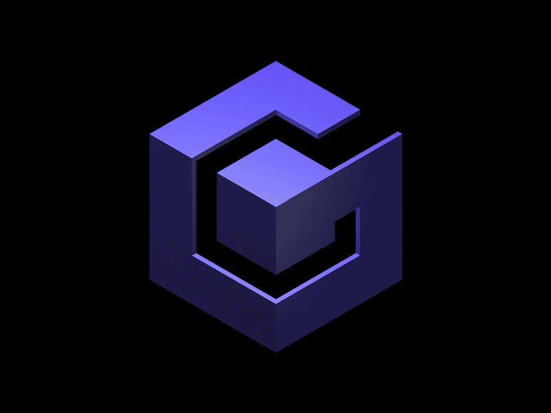

  

RetroAchievements is proud to announce support for its 52nd console, the GameCube!

The Nintendo GameCube launched in Fall 2001 as a successor to the Nintendo 64. It features a handle so you can whack people with the Gamecube and yell "that's my purse, I don't know you!". The system used mini discs which actually spin backward as an attempt at anti piracy. This primarily worked until the end of the system's lifestyle. Unfortunately the mini disc format was hard to develop for by third-party developers. Although the GameCube was not the lowest powered system of the generation (that honor went to the PlayStation 2), it did often receive buggier versions of ports. Still, the system was not short on power or exclusives and boasts some of the most memorable exclusives in the generation.

With this launch, RetroAchievements is proud to announce this was our **Biggest Launch** of all time with over 100 games here at release. That means GameCube will launch with over 25% of the system's library already available!

This project was spearheaded by [LillyJade](https://retroachievements.org/user/LillyJade) at the coding helm, and the entire project at this point was a good 2 years of work. We also have to thank our partners at the Dolphin Team for working with us to get this product out the door.

We also need to thank the Writing Team led by [Nepiki](https://retroachievements.org/user/Nepiki) who have made sure these sets are up to a high standard for English readability. We also can't forget to thank the Dolphin Testers for taking the sets and beating them with a hammer to find lingering bugs and errors. Finally, thanks go out to the Rollout Team who have helped over the past two years including [Snow](https://retroachievements.org/user/Snow), [StingX2](https://retroachievements.org/user/StingX2), [TheMysticalOne](https://retroachievements.org/user/TheMysticalOne), [AuburnRDM](https://retroachievements.org/user/AuburnRDM), [pinguupinguu](https://retroachievements.org/user/pinguupinguu), [televandalist](https://retroachievements.org/user/televandalist), and [Sutarion](https://retroachievements.org/user/Sutarion). An additional thank you to [Jazerus](https://retroachievements.org/user/Jazerus) and [Kiwiron](https://retroachievements.org/user/Kiwiron) for their contributions to this article.

Furthermore, an event for the GameCube launch is now ongoing as well. Check out [this forum post](https://retroachievements.org/viewtopic.php?t=27246) for all the details regarding this event!

**With RANews, we wanted to take a look at each of the games released during this rollout and give you a short introduction on what to expect. This will be split up into three articles, with each covering a random set of games! Here is the final set for you to check out:**

***

| Game                                                   | Genre           |
| ------------------------------------------------------ | --------------- |
|  | Survival Horror |

By: 

While Leon and Claire are busy with the events of Resident Evil 2, Jill Valentine is in need of help to escape Raccoon City. With most of the population transformed into zombies by the T-Virus, including some hulking giants named Nemesis very much desiring your death, it won't be easy... but fortunately, you have all the tools you need! In this third-person survival horror game, outsmart and defeat you enemies by finding a variety of firearms. Doesn't matter if they are undead, a rocket launcher they ain't surviving! And if you want to control some other characters, the mercenaries minigame has you covered, where characters met throughout the story must travel from one end of Raccoon City to the other under a strict time limit, which can be extended by performing various tasks like rescuing civilians. Hard mode is required for the entire set, but with a rocket launcher at your side, those zombies will pose no threat!

| Game                                                                    | Genre       |
| ----------------------------------------------------------------------- | ----------- |
|  | 3D Fighting |

By: 

Relive the adventures of the Bleach manga in this Japanese-exclusive title now available on RetroAchievements, Bleach GC: Tasogare ni Mamieru Shinigami! It is the first installment in the Bleach Nintendo Home Consoles series, developed by SEGA as a weapon-based fighting game. It follows three scenarios, each with multiple acts that will be a joy for fans of the series... if you can read Japanese that is, as the game currently does not have a fan translation. Fortunately if all you care about is gameplay, then you're good to go, with a total of 27 characters to choose from, all from various arcs of the manga. Duke it out in 3D fighting across 12 stages, and prove that you have what it takes to be a true Shinigami!

| Game                                                     | Genre  |
| -------------------------------------------------------- | ------ |
|  | Action |

By: 

The Jedi are in need of your help again in Star Wars: The Clone Wars. Set during the Star Wars prequel trilogy, this game features popular main characters Anakin Skywalker, Obi-Wan Kenobi, and Mace Windu playable during third-person Jedi fighting segments on foot taking on events familiar to fans of the series. The majority of the game however, is done through vehicular combat, with players having access to clone warships, starfighters, speeder bikes, and tanks, all coming with different controls to make you feel what every vehicle is capable of. If you are ready to become a Jedi Master yourself, be sure to take on every mission on the highest difficulty, as well as completing all bonus objectives. Once completed, check out the Thule Moon Academy and make it to wave 20 to ensure mastery will become yours!

| Game                                                    | Genre       |
| ------------------------------------------------------- | ----------- |
|  | 3D Fighting |

By: 

Another Naruto set? Believe it! In this 3D fighting game based on the early episodes of the hit anime Naruto, experience the story of Naruto graduating against all odds from the Ninja Academy and eventually working his way up to entering the Chunin Exams with his team! Clash of Ninja 2 brings the iconic characters of the Chunin Exams to the roster as well as four-player multiplayer action! The set includes progression and a wide range of completion achievements as well as some creative challenges. Do you have what it takes to be a true shinobi of the Hidden Leaf?

| Game                                                   | Genre |
| ------------------------------------------------------ | ----- |
|  | Party |

By: 

If you were always wondering "man, I really like Mario Party but I wish I could play as Nickelodeon characters instead" then do not fear, as Nickelodeon Party Blast is here! There are many series present from the history of Nickelodeon, like Rugrats, The Wild Thornberrys, Rocket Power, and of course SpongeBob SquarePants, having a total of eight characters representing them and more than twenty stages. Various events are taking place in these stages, like basketball where you score the most goals to win with tricks earning even more points, or food fight where you are duking it out against others by piling food on them. If that wasn't enough, there are a total of six different party modes to keep your attention. The set also comes with a variety of challenges to keep you engaged, like not losing health or points in a party game, or getting more than a specified amount of points.

| Game                                          | Genre           |
| --------------------------------------------- | --------------- |
|  | Survival Horror |

By: 

All aboard! There have been reports of cannibalism and murder outside of Raccoon City, and it's up to the unlikely pairing of S.T.A.R.S. medic Rebecca Chambers and former Marine-turned-convict Billy Coen to investigate. Together, they must uncover a secret that will unleash countless horrors onto the world and kickstart one of the most beloved franchises of all time...

Resident Evil 0 is a prequel to the original game, featuring gameplay that is reminiscent of the original PS1 classics, with all-new and improved graphical fidelity seen in the GameCube remake of Resident Evil. This entry to the series breaks new ground by letting you play as both characters in the same story! Each character has their own strengths and skills that change how you play them, adding an extra layer of complexity to the puzzles you'd usually expect in a Resident Evil title. This achievement set will truly test your mastery, featuring damageless and knife-only boss challenges, S Rank completion, and speedruns! The set also showcases Leech Hunter mode, asking you to experience every facet of this survival horror classic.

| Game                                             | Genre           |
| ------------------------------------------------ | --------------- |
|  | Sports - Tennis |

By: 

Get back on the court with the fourth entry in the tennis sub-series of Mario, Mario Power Tennis! Mario and friends are ready to take on a wide variety of unique tennis matches against each other, ranging from regular tennis on regular- and gimmicky courts, but also ones that feel like minigames in and of themselves, like Ring Shot where you shoot balls through rings of increasing sizes, and Tic-Tac-Glow to liberate Shine Sprites trapped in dirt by hitting them with ball of water. In classic Mario fashion, a unique spin is given to the sports that you wouldn't find elsewhere, and with eighteen playable characters each having a different playstyle, and a number of modes not mentioned yet like Tournament and Item Battle, this game will game keep your attention for a long while to come. Which is good, because it comes with a gigantic set of over 200 achievements, making absolutely sure that you will see every corner the game has to offer!

| Game                                              | Genre                 |
| ------------------------------------------------- | --------------------- |
|  | 3D Platforming, Party |

By: 

AiAi and friends are going bananas, as their precious bananas are stolen by the evil Dr. Bad-Boon! Super Monkey Ball 2 is the second installment in the beloved arcade franchise, with this title being exclusively released on home console, giving it the opportunity to come with a story mode all about monkeys and bananas. With this new mode, the series has become more approachable than ever, giving the player infinite lives so that they too can triumph over Dr. Bad-Boon. But of course, it wouldn't be Super Monkey Ball with a nice challenge mode of increasing difficulties, adding more stages per difficulty, and a total of 12 minigames! If you cannot get enough of these exciting-but-tough ball rolling adventures, then this is the set for you to check out.

| Game                                           | Genre                         |
| ---------------------------------------------- | ----------------------------- |
|  | Extreme Sports - Snowboarding |

By: 

Ready to board down the mountains again? The sequel to 1080° Snowboarding, named 1080° Avalanche, made its snowy descent to the GameCube in style. Rather than other snowboarding games like SSX, the 1080° series focuses more at its core on racing downhill rather than performing tricks, competing against other players in over 20 courses. The titular Avalanche is new to this game, with it being the final event of every Match Race, Be sure you are up to speed, as you'll be trying to outboard an avalanche descending quickly behind you. Aside from racing though, you can still do tricks in Trick Attack, and a Gate mode where you have to race through gates failing as little as possible. And all of these are covered in the core set, as well as completing every time trial record and some special challenges. All in all, if you are a fan of skateboarding, this is a game you must not miss out on!

A subset with extreme time trials were also in development, but the developer was a bit of a bad penguib so that's not happening anytime soon. Oh well, better luck next time!

| Game                                                                               | Genre         |
| ---------------------------------------------------------------------------------- | ------------- |
|                            | Sports - Golf |
|  | Sports - Golf |

By: 

Developed at the same time as the earlier-mentioned Power Tennis, Mario Golf: Toadstool Tour brings the birdies to the GameCube! Released shortly after Super Mario Sunshine, it would be the first title to include substantial content from it, like the playable characters Bowser Jr., Shadow Mario, and Petey Piranha, as well as Diddy Kong from Donkey Kong Country. In general it plays similar to the games that came before, but with more technical advancements come more quality of life features, like changing the camera and updating the controls. Like its tennis counterpart, there are a variety of modes to choose from, including the usual tournaments and character matches, but also a very similar minigame in Ring Shot where you shoot through rings, and special side games like Hole-in-One contest. Beating each mode as every character is also the objective of the completionist subset, but fortunately the core set also offers more than enough, unlocking each character and finishing tournaments with every hole being a birdie or better. If you are a golf enjoyer, then this game will keep you busy for a long while to come!

| Game                                                           | Genre                                  |
| -------------------------------------------------------------- | -------------------------------------- |
|  | Third-Person Shooter, Action-Adventure |

By: 

Set in the dystopian world of Iron Star, a rebellious robot named Glitch joins the resistance to prevent a group of evil robots taking over the planet. He does this through 3D shooting action-adventure gameplay, going through a total of 42 levels in the story campaign all around this metallic planet. Glitch has over seventeen weapons accessible to him, such as flamethrowers and machine guns. The game features a total of four difficulties, which is good since the difficulty in general can be quite high, making this a game that will appeal to all audiences. The levels also offer secret chips that can be found, and a ranking for beating the level under par time. All of these are covered in the achievement set available on RetroAchievements!

| Game                                                       | Genre                       |
| ---------------------------------------------------------- | --------------------------- |
|  | Simulation, Life Simulation |

By: 

Back to the farmlands we go with Harvest Moon: Magical Melody, the third game in this simulation series released on the Nintendo GameCube. Choose which gendered character you would like to play as, and settle in your new home as an exciting journey is about to unveil, involving the awakening of the Harvest Goddess who has turned herself to stone out of melancholy at the townspeople's disregard. You will be on the hunt for musical notes to awaken her, while making sure you'll take good care of your plots of land and raising animals, and becoming friendly with the townsfolk. With some you can get more than friendly, as each gender has a total of 11 bachelor- or bachelorettes to choose from and share their life with. The achievement set has a ton of interesting and unique achievements to make sure you will see everything this town has to offer.

| Game                                                            | Genre                          |
| --------------------------------------------------------------- | ------------------------------ |
|  | 3D Platforming, Collect-a-thon |

By: 

If you grew up with SpongeBob SquarePants during the 90s and early 2000s, you may remember the hype when the first official movie was announced for our favourite yellow sponge. And with this movie came a 3D Platforming game, full of collect-a-thon goodness. Players take control over both SpongeBob and Patrick, going through 18 levels that loosely follow the storyline of the film, completing side tasks and occasionally facing a boss that was prevalent in the movie. Over time their moveset will increase, allowing levels to evolve over time. But aside from platforming, there are also a bunch of different levels like a Super Monkey Ball-like Spongeball, driving with a character who should never drive, and sliding in a small bathtub. Completion of every level will be your main objective for the achievement set, as well as doing a minimalist playthrough where you can not have any Macho of Health upgrades when collecting main tokens or defeating bosses. And of course, don't forget the speedrunning for the driving and sliding levels!

| Game                                                | Genre                       |
| --------------------------------------------------- | --------------------------- |
|  | Sports - Football \| Soccer |

By: 

We've had golf and we've had tennis, as well as baseball in a previous edition. But what sport could possibly be missing...? If your answer was football but extreme then you are correct! This game takes the concept of football, removes the referees because who likes them, and adds a dose of Mario personality. Each team comes with characters from across the Mario universe, with the team captain having a over-the-top Super Strike that will give two points on goal. And of course in classic Mario fashion, there are a bunch of Mario-themed items that change how the game is played. With multiple gameplay modes like Grudge Match and Cup Battles, you will have a ton of fun matches in this achievement set now available on RetroAchievements!

| Game                                  | Genre                |
| ------------------------------------- | -------------------- |
|  | Third-Person Shooter |

By: 

Capcom had a deal with Nintendo to bring five exclusive titles to their system, which... didn't exactly work out as there is now only one exclusive. That game, is P.N.03, a third-person shooter with a female mercenary protagonist fighting against berserk robots in battles where defensive and rhythmic maneuvers are the star of the show. With the powered exoskeleton attached to her spine, Vanessa can shoot out energy beams and perform powerful energy drives, and dance around enemies who portray their attack wish visual and aural cues. Through the game you'll also find a bunch of different suits, and upgrading them will be one of the objectives for the achievement set, as well as defeating bosses without using any energy. If you want to play an often overlooked hidden gem on the GameCube by a well-established publisher, then this is certainly one to check out!

| Game                                                             | Genre     |
| ---------------------------------------------------------------- | --------- |
|  | Minigames |

By:  and 

WAAHH, are you ready to play some microgames? Released shortly after the first game from GBA and coincidentally also being a remake of that game, WarioWare, Inc: Mega Party Games! will test your reflexes as you will go through a bunch of themed microgames that only last a few seconds. While you will have a rough idea of what the controls are because of the theme, you will have a short time to realize what you are doing and what you need to do to complete the minigame, and this will only become faster over time with increasing difficulties! All microgames from the original game are present here, with some new additions like Time Attack and character stats. These are all covered in the set too!

The main appeal of the GameCube version however, was multiplayer. Fortunately, a multiplayer subset for this game is in the works, so hopefully you will be able to enjoy this soon as well!

| Game                                                                                           | Genre            |
| ---------------------------------------------------------------------------------------------- | ---------------- |
|  | Action-Adventure |

By: 

With a popular movie like The Chronicles of Narnia: The Lion, the Witch and the Wardrobe, a game based on it was pretty much an inevitability. As with the movie, your objective is to guide the four Pevensie children through the enchanted, wintery land of Narnia to end the tyrannical rule of the White Witch. This is done through fifteen linear levels, using various gameplay elements like stealth, combat, puzzle-solving, and strategy. Aside from the main objective in these levels, the player can find coins, statues, and shields to upgrade the characters, unlocking more abilities over time that will help them with the before-mentioned gameplay styles. If you collect everything as well as beating every level on Hard difficulty, then the mastery will soon enough be yours!

| Game                                                    | Genre       |
| ------------------------------------------------------- | ----------- |
|  | 3D Fighting |

By: 

Let out your inner beast and help end oppression in this new entry in the Bloody Roar series. Originally released for the GameCube and later ported to Xbox, this 3D fighting game features face-paced, combo-heavy combat, where you built up energy over the course of battle to transform into a powerful beast form, each unique per character. This risky transformation will come at the cost of a life bar depleting over time, but skilled fighters can ensure victory by knocking down the opponent and reverting to human form. After all, the benefits of becoming a beast far outweigh the demerits. The player can choose from a variety of modes, such as Arcade, Time Attack, and Survival, which will all be necessary for the achievement set as well. Do you have what it takes to become the strongest Zoanthrope?

| Game                                                         | Genre                        |
| ------------------------------------------------------------ | ---------------------------- |
|  | 2D Platforming, Metroidvania |

By: 

Jack in, Mega Man! The popular Battle Network spin-off series of Mega Man games would debut on the Game Boy Advance, but to reach as big an audience as possible, Capcom decided to make a spin-off of a spin-off for the GameCube. This title would be called Mega Man Network Transmission, which would take on a 2D Platforming style while keeping elements from the original RPG gameplay, such as chips to use that act as a variety of different weapons. Taking place one month after the first Battle Network game, Lan and MegaMan.EXE are once again confronting WWW, the evil organization led by this universe's Dr. Wily. This game would have a slight nudge to the X series however, with the Zero Virus taking the centerpiece. MegaMan.EXE has to go through various levels, fighting both old- and new EXE variants of the beloved robot masters, and return peace once again. As seen on the GBA sets, S ranking every boss is a big objective of the achievement set, but with this being a 2D Platformer now, taking out every boss with just the Mega Buster is an additional challenge to undertake. Collect all chips and program advances, and save the net once again in Mega Man Network Transmission!

| Game                                         | Genre |
| -------------------------------------------- | ----- |
|  | Party |

By: 

Every edition of the GameCube Launch articles had a Mario Party to talk about, and today we reach the final one--at least, for this rollout. Mario Party 6th is, as the title indicates, the sixth installment in this party spin-off series, where friendships are put to the test in exhilarating minigames. One wrong move can potentially cost you the game... or another player just ends up lucky and steals everything anyway, oops! Unique to this game is the day-and-night system, which is also the main plot of the story mode, where representatives of the sun and moon are dueling each other to see who is more popular. Aside from that new feature, the game mostly plays how you expect it to: go through various modes and play up to 82 minigames in a variety of modes, with the achievement set making the most out of each mode. It is a tough set, so be sure to bring your skills to the table... or pray to lady luck!

| Game                                             | Genre            |
| ------------------------------------------------ | ---------------- |
|  | Action-Adventure |

By: 

It is time for another superhero to take stage. Spawn: Armageddon features the titular anti-hero in a hack and slash adventure, inspired by the first 99 issues of his own dedicated comic book series. Spawn goes through fast-paced, stylish combat, with his trademark Agony Axe and chains, hellish powers, and of course firearms to ensure his enemies will be deader than dead. Collecting demon souls will allow him to buy more ammunition and upgrade himself, ensuring that he is even more deadly. And you'll have to make sure he is as deadly as possible, as this tough set will force you to go through the entire game on Hard difficulty, reaching a high rank on every mission, and not dying during missions nor losing Necroplasm. But with as epic an anti-hero as Spawn, all of these will be trivial before his might!

| Game                                             | Genre                  |
| ------------------------------------------------ | ---------------------- |
|  | Action, 3D Platforming |

By: 

Bomberman would see his own animated TV series named Bomberman Jetters, where he gained weird realistic eyes. Sorry, I just can't get past those eyes. Anyway, ignoring what I have to say, it was a given that this series would come with a game adaptation, and that it did! Building on the action-adventure gameplay style established by Bomberman Generation, players control Bomberman who, as always, uses bombs to take care of his enemies. These come with different elemental attributes, that are also used to solve puzzles to finish the stage. Also returning to this game are the Charabombs, Pokemon-like creatures that have made a few appearances in previous games. Bomberman can use them for gameplay, with the new adition being that they can evolve and change their appearance and abilities. Evolving these Charabombs and completing each level will be your main objective for this achievement set, but in classic Bomberman fashion, we of course can not forget about the classic maze gameplay that is included as a sidemode!

| Game                                                                                       | Genre            |
| ------------------------------------------------------------------------------------------ | ---------------- |
|  | Action-Adventure |

By: 

Samus Goes to the Fridge to Get a Glass of Milk 3D is a hack for Metroid Prime which continues the ongoing saga of Samus getting a glass of milk for Adam, as detailed in the original Samus Goes to the Fridge to Get a Glass of Milk and the sequel, Samus Goes to the Fridge to Get a Glass of Milk II. In this exciting 3D debut for Samus and milk, traverse the space pirate frigate Orpheon in search of their fridge and seize their ill-gotten gains for the good of the Galactic Federation. The set will challenge you to think about milk runs in all new ways as well as providing progression for more vanilla runners. Stay frosty, bounty hunters!

| Game                                          | Genre                                 |
| --------------------------------------------- | ------------------------------------- |
|  | Survival Horror, Third-Person Shooter |

By:  and 

One of the Capcom Five titles that was meant to be an exclusive to the GameCube which... surely did not work out, Resident Evil 4 is one of the most critically acclaimed video games of all time, let alone within its own franchise. Which is interesting because it was a somewhat big shift in terms of gameplay, with it still following the survival horror theme but focusing more on action this time around, also ditching the fixed camera angles the game used to have. You control the special agent Leon S. Kennedy, returning successfully from the events of Resident Evil 2 to this time be sent out to rescue the US President's daughter who has been kidnapped by a religious cult in Spain. The entire game also takes place here, with the zombies being replaced by violent villagers called Los Ganados. Other changes to the gameplay include more results from shooting specific parts of bodies, as well as context-sensitive controls that will allow the player to pull off moves based on the situation. The game comes with a big achievement set that not only covers the story, but also the Mercenaries sidegame, where the player is tasked to get a 5-Star ranking on all levels as every playable character.

| Game                                          | Genre           |
| --------------------------------------------- | --------------- |
|  | Life Simulation |

By:  and 

Welcome to Animal Crossing. Get ready to meet your anthropomorphic neighbors. Maybe you'll hit things off, or maybe they'll despise you. Whatever it may be, this town keeps running along, whether you're there or not. Enjoy holidays, events, and become a part of the community. You'll be able to fish, catch bugs, dig up fossils (or rummage through garbage), and plant trees. If you're more monetarily inclined, prepare to pay off your debts to Tom Nook while you run errands for your neighbors. Or better yet, you can sit back, do some interior designing and relax. Just be careful: Nook will be there. Watching. Always.

| Game                                                                                | Genre       |
| ----------------------------------------------------------------------------------- | ----------- |
|                              | 3D Fighting |
|  | 3D Fighting |

By: 

Unleash your inner Super Saiyan and get ready for intense duels in the second installment of the 3D Fighting series, Dragon Ball Z: Budokai 2! Based on the anime/manga with the same name, you take control of 34 characters, with 12 of them making their debut in this game. The character you control has a Ki bar, which allows them to perform special moves alongside regular attacks, and whoever has their health bar emptied first, loses. The modes that are able to be chosen from include the story mode called Dragon World, direct dueling, and the world tournament which is also the focus of the subset. The core set obviously focuses on completion, finishing the story mode with every character that can partake in it, as well as character-specific abilities to demonstrate the abilities they have to the max. 

| Game                                                                  | Genre                                     |
| --------------------------------------------------------------------- | ----------------------------------------- |
|  | 3D Platforming, Collect-a-thon, Run & Gun |

By: 

Our favourite Edgy the Hedgy had an... interesting game for himself. Opinions on it may vary depending on who you ask, but something that cannot be denied is that it could benefit from having some quality-of-life features. That's what the team behind Shadow the Hedgehog: Reloaded thought as well, bringing a general improvement mod to the GameCube version that is available to play on RetroAchievements! The last story unlocks earlier now rather than after getting 10 separate endings, and expert mode is unlocked right after beating the last story rather than getting all A ranks. Speaking of ranks, the levels in general have been altered to allow some leeway in not fully completing the tedious objectives like killing all enemies, and S ranks have been added for those who are able to do so within a specified time and score. There are far more improvements to the gameplay as well, but to not spoil anything, I instead encourage you to check out the hack for yourself. Set developer Tybis was involved with the creation of this hack, and has come up with an excellent set that features challenges for each level besides regular completion.

| Game                                                       | Genre          |
| ---------------------------------------------------------- | -------------- |
|  | Turn-Based RPG |

By: 

Released as a spin-off to the Mega Man X series, Mega Man X: Command Mission puts the player in a turn-based RPG environment. Aside from X, Zero, and Axl, there are four unique characters made for this game that make up the main cast, who will help our Maverick Hunters to stop usage of the newly-discovered Force Metal material, as this can revolutionize the engineering for Reploids and should not be fallen into wrong hands. But instead of going through fast-paced high-action stages, X and crew take it slow and await their turn, dealing with enemies through normal attacks learned over time, as well as Hyper Mode and a Final Strike attack once your party is complete. The achievement set comes with progression, as well as tasks that are based on in-game achievements, for which you are rewarded in-game as well. And of course, there is the Eternal Forest, a big stage with branching paths, each having a reward at the end. It's time to deploy into action once again!

| Game                                                                       | Genre            |
| -------------------------------------------------------------------------- | ---------------- |
|  | Action-Adventure |

By:  and 

What's better than one Link? Four Links of course! Advertised heavily as a multiplayer game with connectivity to the Game Boy Advance, this unique Zelda-title can fortunately be played alone without interactivity needed with the handheld. And hey, it comes with a RetroAchievements set, what more is there to ask for? The Legend of Zelda: Four Swords Adventures tasks Link and his clones to restore peace to hyrule, helping each other out in top-down gameplay in a world reminiscent of A Link to the Past, sharing a graphical artstyle with that game as well as a few locations. The Links find items that are needed for progression through stages, sometimes needing to combine them to move forward. The achievement set covers completion of the game, upgrading all items and finishing the stages without dying, as well as some challenges exclusive to specific levels. So get together with your friends, imaginary or not, and become the heroes of Hyrule!

| Game                                                   | Genre                          |
| ------------------------------------------------------ | ------------------------------ |
|  | Extreme Sports - Skateboarding |

By: 

The legendary skateboard man returns for the fourth time in his own Tony Hawk's Pro Skater series! Pull off some sick tricks and get a high score through combos to show you are just as legendary as him. As a departure from the earlier games, the Career mode now is more similar to Free Skate, no longer forcing a time limit and allowing the player to explore the levels and talk to characters to obtain their goals to partake in. There are a total of 15 skateboarders to choose from, with four more to unlock that are based on cultural references of the time, like Iron Maiden and Star Wars. The achievement set covers all the skateparks and tricks that can be found, so be sure to explore every crook and nanny for this mastery!

| Game                                                    | Genre              |
| ------------------------------------------------------- | ------------------ |
|  | Twin Stick Shooter |

By: 

The hit homebrew game that has been ported to pretty much anything imaginable (after the 16-bit era at least), Xeno Crisis of course made its way to the GameCube as well. If you are familiar with other versions, you will be instantly familiar with this twin-stick shooter as well. A scientific research facility is overrun by aliens, and space marines John Marsh and Sarah Ridley are dispatched to take care of them. The player, or players if you got a friend, go through seven procedurally generated areas, fighting through monsters to receive items and weapons, and finally defeating a tough boss at the end. There are three modes to choose from, with you having to get an S rank on every area during Story mode, beating all bosses during Boss Rush, and getting a specified amount of kills in Endless mode. If you can master these three modes, then the mastery is yours!