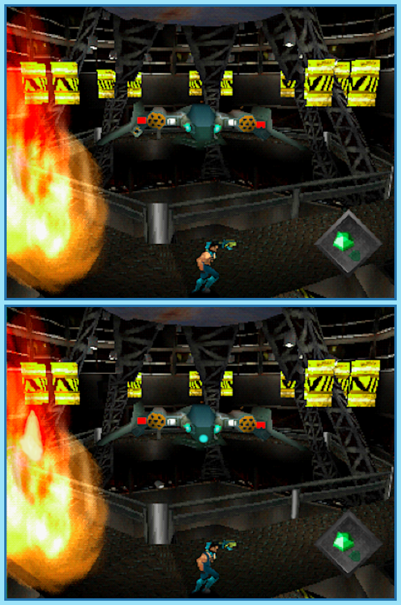

## Last Month's Winners

<table><tbody>
  <tr>
    <td colspan="4" style="text-align: center; vertical-align: middle;">
 
</td>
  </tr>
  <tr>
    <td colspan="2" style="text-align: center; vertical-align: middle;">🥈 </td>
    <td colspan="2" style="text-align: center; vertical-align: middle;">🥉 </td>
  </tr>
  <tr>
    <td></td>
    <td></td>
    <td></td>
    <td></td>
  </tr>
  <tr>
    <td></td>
    <td></td>
    <td></td>
    <td></td>
  </tr>
  <tr>
    <td></td>
    <td colspan=3></td>
  </tr>
</tbody></table>

Waking up in an apartment with no memory, John Cain need to find out who he is, why his arm is a gun, and why the military is hunting him. It's uncertain what has happened but one step to find out is to find all 10 differences.

  

## About the Game

| Game                              | Console     | Genre                                           |
| --------------------------------- | ----------- | ----------------------------------------------- |
|  | PlayStation | 3D Platforming, Third-Person Shooter, Run & Gun |

* Suggested by: 

**Note:** Every user who finds all 10 differences and sends proof to SporyTike via Site DM or Discord will be listed in the next issue. Additionally a random selected user who submitted the solution until the end of the month will be chosen to select the game of the next picture.
