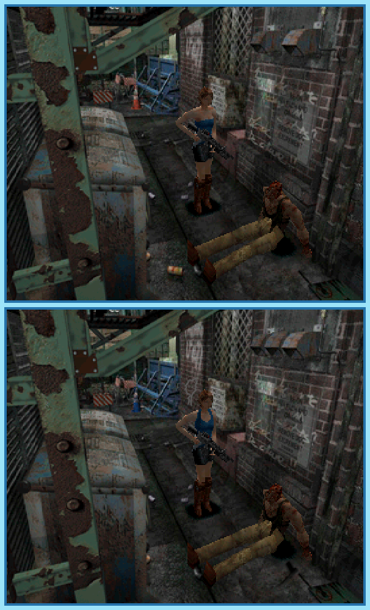

## Last Month's Winners

<table><tbody>
  <tr>
    <td colspan="4" style="text-align: center; vertical-align: middle;">
 
</td>
  </tr>
  <tr>
    <td colspan="2" style="text-align: center; vertical-align: middle;">🥈 </td>
    <td colspan="2" style="text-align: center; vertical-align: middle;">🥉 </td>
  </tr>
  <tr>
    <td></td>
    <td></td>
    <td></td>
    <td></td>
  </tr>
  <tr>
    <td></td>
    <td colspan=3></td>
  </tr>
</tbody></table>

 

All answers for previous issues can be found [here](../spot-the-diff-answers.html).

 

Jill Valentine is shooting her way through a destroyed Raccoon City to find a way to escape. On her way out she does not only protect herself against zombies that are lurking behind every corner, but also a giant mutant that is just hunting for her. What's even worse, in all this mess there seems to be some group that still finds time to mess with the environment. Can you find all 10 differences?

  

## About the Game

| Game                                                    | Console     | Genre                                           |
| ------------------------------------------------------- | ----------- | ----------------------------------------------- |
|  | PlayStation | 3D Platforming, Third-Person Shooter, Run & Gun |

* Suggested by: 

**Note:** Every user who finds all 10 differences and sends proof to SporyTike via Site DM or Discord will be listed in the next issue. Additionally a random selected user who submitted the solution until the end of the month will be chosen to select the game of the next picture.
