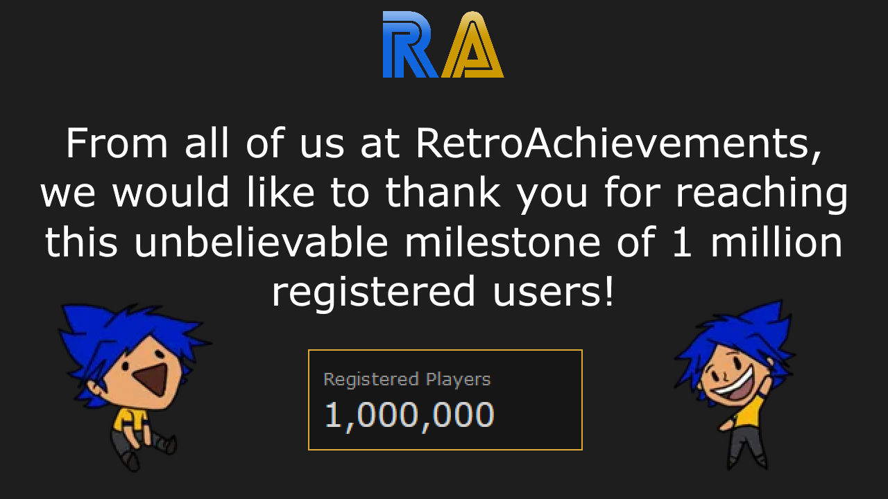

## 1,000,000 Registered Players

## Community Manager
Please join me in welcoming  as our first Community Manager at RetroAchievements.

Community Manager roles:
- Helping facilitate better communication between users and the various teams to ensure everyone feels heard and supported.
- Helping navigate misunderstandings and conflicts, ensuring our community remains a welcoming space for all.
- Helping oversee our various social platforms (Discord, the site forums, Reddit, etc) to make sure everyone on those platforms feels heard.
- Helping us with moderation support: managing people who talk about piracy, are toxic to others, or otherwise break our Code of Conduct.

## Hash Compatibility Testing

The QA-team is happy to announce a new process for hash compatibility testing! This allows users to help test hash compatibility for existing sets. You can work with the developer on testing new hashes while mastering the set to verify compatibility.

More information can be found in the docs at [Player Compatibility Testing](https://docs.retroachievements.org/guidelines/content/player-compatibility-testing.html).

## PlayTester Revamp

The PlayTester team has been revamped in order to expand the team and its current capabilities. Playtest request can be submitted and discussed via Discord in the new forum channel.

Reach out to  for more information.

## Cheat Investigation

We've started an official cheat team and created the dedicated account .

If you suspect anyone may be cheating or see suspicious scores/times, you can send a DM to that account and the team will look into it.

## Official RA YouTube

The official [RetroAchievements YouTube Channel](https://www.youtube.com/@retrocheevos) has passed 1,000 subscribers. We're looking for users who may already have videos or would like to make videos to contribute to the channel.

Type of content we're looking for:
- "What is RetroAchievements" - A Channel Intro video showcasing what the website is all about!
- Emulation Tutorials,
- Developer Tutorials,
- Achievement Guides,
- Announcement Videos,
- Reviews,
- Top 10's
- ...and more!

If you're interested in making content for the channel reach out to  via DM!

## Jr Developer Graduates

| Graduate&nbsp;              | Game                                                                                  |
| :-------------------------- | :------------------------------------------------------------------------------------ |
|     |                           |
|  |                       |
|   |                   |
|    |                               |
|     |  |

**Current Stats**: 51 Developers have graduated in 2024.

## Developer Compliance

### Set Approvals
- [Monster Rancher 2 [Subset - 389 Major 4]](https://retroachievements.org/game/32120)

### Achievement & Set Updates

| Set                           | Achievement                                            | Description                                                                                                                        | Update                                             |
| ----------------------------- | ------------------------------------------------------ | ---------------------------------------------------------------------------------------------------------------------------------- | -------------------------------------------------- |
|   |          | Put an end to Orochi's scheme.                                                                                                     | Demoted for Unwelcome Concept: Achievement Spam    |
|  |    | Watch the Attract Mode demo play at least once                                                                                     | Demoted for Unwelcome Concept: Zero Effort         |
|  |          | Defeat Ellis of Jormungandr passing through no more than 75 rooms but no less than 25 in one run (No warp glitch, New Map on load) | Demoted for Unwelcome Concept: Requires Perfection |
|   |        | Reach Max Level.                                                                                                                   | Demoted for Unwelcome Concept: Pointless Grinding  |
|    |                  | Congratulations you have accessed the Debug Menu! now all Achievements are locked, you will need to re-load the game               | Demoted for Unwelcome Concept: Zero Effort         |
|    |  | 10 Minutes passed and wait i didn’t die                                                                                            | Demoted for Unwelcome Concept: Zero Effort         |

## Site Updates
###  RAWeb v6.21.0
**New Features**
- Allow the database to store credit for achievement logic, art, writing, and testing by [@wescopeland](https://github.com/wescopeland) in [#2683](https://github.com/RetroAchievements/RAWeb/pull/2683)
- Allow the database to store credit for game badge art by [@wescopeland](https://github.com/wescopeland) in [#2877](https://github.com/RetroAchievements/RAWeb/pull/2877)
- Update User-Agent parser for some edge cases by [@Jamiras](https://github.com/Jamiras) in [#2874](https://github.com/RetroAchievements/RAWeb/pull/2874)
- Add Progress filter to game lists by [@wescopeland](https://github.com/wescopeland) in [#2898](https://github.com/RetroAchievements/RAWeb/pull/2898)
- Add Random Game button to game lists by [@wescopeland](https://github.com/wescopeland) in [#2866](https://github.com/RetroAchievements/RAWeb/pull/2866)
- Add a 'Rows per page' control to game lists by [@wescopeland](https://github.com/wescopeland) in [#2885](https://github.com/RetroAchievements/RAWeb/pull/2885)
- Convert game Top Achievers page to React, allow pagination through all players by [@Jamiras](https://github.com/Jamiras) in [#2879](https://github.com/RetroAchievements/RAWeb/pull/2879)
- Allow inactive emulators to be selected when creating tickets by [@Jamiras](https://github.com/Jamiras) in [#2891](https://github.com/RetroAchievements/RAWeb/pull/2891)

**Bug Fixes**
- Fix issues with notification emails not being sent by [@wescopeland](https://github.com/wescopeland) in [#2886](https://github.com/RetroAchievements/RAWeb/pull/2886)
- Fix overzealous form validation on the Create Ticket page by [@wescopeland](https://github.com/wescopeland) in [#2869](https://github.com/RetroAchievements/RAWeb/pull/2869) and [#2872](https://github.com/RetroAchievements/RAWeb/pull/2872)
- Update RAPatches regex validation pattern by [@wescopeland](https://github.com/wescopeland) in [#2870](https://github.com/RetroAchievements/RAWeb/pull/2870)
- Automatically extend collaboration claims when primary claim is extended by [@Jamiras](https://github.com/Jamiras) in [#2883](https://github.com/RetroAchievements/RAWeb/pull/2883)
- Don't catch evergreen achievements for AotW widget by [@Jamiras](https://github.com/Jamiras) in [#2897](https://github.com/RetroAchievements/RAWeb/pull/2897)
- Always reset sort title on game title change by [@wescopeland](https://github.com/wescopeland) in [#2896](https://github.com/RetroAchievements/RAWeb/pull/2896)

**Management Console Changes**
- Add create event admin tool by [@Jamiras](https://github.com/Jamiras) in [#2864](https://github.com/RetroAchievements/RAWeb/pull/2864)
- Remediate a perms matrix security issue by [@wescopeland](https://github.com/wescopeland) in [#2876](https://github.com/RetroAchievements/RAWeb/pull/2876)

**Localization**
- Move translations to https://crowdin.com/project/retroachievements by [@wescopeland](https://github.com/wescopeland) in [#2888](https://github.com/RetroAchievements/RAWeb/pull/2888), [#2893](https://github.com/RetroAchievements/RAWeb/pull/2893), [#2889](https://github.com/RetroAchievements/RAWeb/pull/2889), and [#2907](https://github.com/RetroAchievements/RAWeb/pull/2907)
- Add Russian translation by [@Potat0SSack](https://github.com/Potat0SSack), [@RudeBoy4RomUA](https://github.com/RudeBoy4RomUA), [@Skyimp007](https://github.com/Skyimp007), and [@fomdt](https://github.com/fomdt) in [#2852](https://github.com/RetroAchievements/RAWeb/pull/2852)
- Update translations for fr_FR by [@Crazeuh](https://github.com/Crazeuh) in [#2875](https://github.com/RetroAchievements/RAWeb/pull/2875)
- Use type-safe t() function by [@wescopeland](https://github.com/wescopeland) in [#2894](https://github.com/RetroAchievements/RAWeb/pull/2894)

**Web API Changes**
- Add API_GetUsersIFollow and API_GetUsersFollowingMe by [@gastongaiduk](https://github.com/gastongaiduk) in [#2887](https://github.com/RetroAchievements/RAWeb/pull/2887)

**Environment Changes**
- Migrate /game/{game}/hashes/comments to React by [@wescopeland](https://github.com/wescopeland) in [#2871](https://github.com/RetroAchievements/RAWeb/pull/2871)
- Migrate /game/{game}/claims/comments to React by [@wescopeland](https://github.com/wescopeland) in [#2880](https://github.com/RetroAchievements/RAWeb/pull/2880)
- Migrate /game/{game}/modification-comments to React by [@wescopeland](https://github.com/wescopeland) in [#2890](https://github.com/RetroAchievements/RAWeb/pull/2890)
- Add action to resolve sets for emulators in preparation for multiset by [@wescopeland](https://github.com/wescopeland) in [#2842](https://github.com/RetroAchievements/RAWeb/pull/2842)
- Add Active Players back-end actions for /demo/home by [@wescopeland](https://github.com/wescopeland) in [#2856](https://github.com/RetroAchievements/RAWeb/pull/2856)
- Add key existence check in ReleaseTablesSeeder by [@gastongaiduk](https://github.com/gastongaiduk) in [#2884](https://github.com/RetroAchievements/RAWeb/pull/2884)
- Reach 100% coverage in the react app by [@wescopeland](https://github.com/wescopeland) in [#2892](https://github.com/RetroAchievements/RAWeb/pull/2892)
- Migrate Active Players to React on /demo/home by [@wescopeland](https://github.com/wescopeland) in [#2860](https://github.com/RetroAchievements/RAWeb/pull/2860)
- Force unique 'random' titles during tests by [@wescopeland](https://github.com/wescopeland) in [#2899](https://github.com/RetroAchievements/RAWeb/pull/2899)

**New Contributors**
- [@Potat0SSack](https://github.com/Potat0SSack) made their first contribution in [#2852](https://github.com/RetroAchievements/RAWeb/pull/2852)
- [@Crazeuh](https://github.com/Crazeuh) made their first contribution in [#2875](https://github.com/RetroAchievements/RAWeb/pull/2875)
- [@gastongaiduk](https://github.com/gastongaiduk) made their first contribution in [#2884](https://github.com/RetroAchievements/RAWeb/pull/2884)
- [@github-actions](https://github.com/github-actions) made their first contribution in [#2907](https://github.com/RetroAchievements/RAWeb/pull/2907)

[Full Changelog](https://github.com/RetroAchievements/RAWeb/releases/tag/6.21.0)

###  RAWeb v6.22.0

**New Features**
- Make the refreshed homepage generally available by @[@wescopeland](https://github.com/wescopeland) in [#2926](https://github.com/RetroAchievements/RAWeb/pull/2926), [#2903](https://github.com/RetroAchievements/RAWeb/pull/2903), [#2913](https://github.com/RetroAchievements/RAWeb/pull/2913), [#2943](https://github.com/RetroAchievements/RAWeb/pull/2943), and [#2937](https://github.com/RetroAchievements/RAWeb/pull/2937)
- Migrate the system game list pages to React and add self-healing URLs by @[@wescopeland](https://github.com/wescopeland) in [#2908](https://github.com/RetroAchievements/RAWeb/pull/2908)
- Add ra:community:generate-annual-recap command by @[@Jamiras](https://github.com/Jamiras) in [#2905](https://github.com/RetroAchievements/RAWeb/pull/2905)
- Add automatic 'Group by console' functionality to new datatable by @[@wescopeland](https://github.com/wescopeland) in [#2927](https://github.com/RetroAchievements/RAWeb/pull/2927)
- Build dedicated pages for hubs (not yet publicly-exposed) by @[@wescopeland](https://github.com/wescopeland) in [#2923](https://github.com/RetroAchievements/RAWeb/pull/2923)

**Bug Fixes**
- Don't error when restoring deleted achievement credit by @[@wescopeland](https://github.com/wescopeland) in [#2911](https://github.com/RetroAchievements/RAWeb/pull/2911)
- Stop messages forwarded to team Discord inboxes from auto-deleting by @[@wescopeland](https://github.com/wescopeland) in [#2915](https://github.com/RetroAchievements/RAWeb/pull/2915)
- Don't open a modal dialog on inertia ticket redirect by @[@wescopeland](https://github.com/wescopeland) in [#2917](https://github.com/RetroAchievements/RAWeb/pull/2917)
- Allow giving achievement credit to deleted users by @[@wescopeland](https://github.com/wescopeland) in [#2918](https://github.com/RetroAchievements/RAWeb/pull/2918)
- Sync dev role attach/detach with legacy permissions value by @[@wescopeland](https://github.com/wescopeland) in [#2878](https://github.com/RetroAchievements/RAWeb/pull/2878)
- Ignore event achievements for unranked users by @[@Jamiras](https://github.com/Jamiras) in [#2916](https://github.com/RetroAchievements/RAWeb/pull/2916)
- Don't update LastLogin for manual unlocks by @[@Jamiras](https://github.com/Jamiras) in [#2919](https://github.com/RetroAchievements/RAWeb/pull/2919)
- Disable "Surprise me" button when there are no games in the list by @[@wescopeland](https://github.com/wescopeland) in [#2922](https://github.com/RetroAchievements/RAWeb/pull/2922)
- Auto-scroll new datatable on first and last pages by @[@wescopeland](https://github.com/wescopeland) in [#2924](https://github.com/RetroAchievements/RAWeb/pull/2924)
- If only one filterable system, hide the System filter on new datatable by @[@wescopeland](https://github.com/wescopeland) in [#2925](https://github.com/RetroAchievements/RAWeb/pull/2925)
- Correctly set page meta descriptions for Inertia.js pages by @[@wescopeland](https://github.com/wescopeland) in [#2904](https://github.com/RetroAchievements/RAWeb/pull/2904)
- Fix parse error when user agent contains adjacent spaces by @[@Jamiras](https://github.com/Jamiras) in [#2930](https://github.com/RetroAchievements/RAWeb/pull/2930)
- Fix EmailAddress key not found error by @[@Jamiras](https://github.com/Jamiras) in [#2931](https://github.com/RetroAchievements/RAWeb/pull/2931)
- Don't hide ticket comments from banned users by @[@Jamiras](https://github.com/Jamiras) in [#2932](https://github.com/RetroAchievements/RAWeb/pull/2932)
- Fix bug where wrong ticket type is displayed in email notifications by @[@Jamiras](https://github.com/Jamiras) in [#2933](https://github.com/RetroAchievements/RAWeb/pull/2933)
- Prefer hardcore unlock time when present by @[@Jamiras](https://github.com/Jamiras) in [#2934](https://github.com/RetroAchievements/RAWeb/pull/2934)

**Management Console Changes**
- Allow DevQuest for authoring events by @[@Jamiras](https://github.com/Jamiras) in [#2912](https://github.com/RetroAchievements/RAWeb/pull/2912)
- Block Jr Devs from updating credit by @[@wescopeland](https://github.com/wescopeland) in [#2921](https://github.com/RetroAchievements/RAWeb/pull/2921)
- Allow Art Team members to give achievement badge artwork credit by @[@wescopeland](https://github.com/wescopeland) in [#2928](https://github.com/RetroAchievements/RAWeb/pull/2928)

**Environment Changes**
- Raise composer analyse pre-push memory limit by @[@wescopeland](https://github.com/wescopeland) in [#2914](https://github.com/RetroAchievements/RAWeb/pull/2914)
- Sync translations from Crowdin by @[@github-actions](https://github.com/github-actions) in [#2929](https://github.com/RetroAchievements/RAWeb/pull/2929)
- Upgrade to Inertia 2.0 by @[@wescopeland](https://github.com/wescopeland) in [#2938](https://github.com/RetroAchievements/RAWeb/pull/2938)
- Bump Vite to 6.0.3 by @[@wescopeland](https://github.com/wescopeland) in [#2939](https://github.com/RetroAchievements/RAWeb/pull/2939)
- Update TRANSLATIONS.md to reflect new process on Crowdin by @[@wescopeland](https://github.com/wescopeland) in [#2941](https://github.com/RetroAchievements/RAWeb/pull/2941)
- Migrate user moderation comments page to React by @[@wescopeland](https://github.com/wescopeland) in [#2944](https://github.com/RetroAchievements/RAWeb/pull/2944)
- Drop GameData.Released and GameData.IsFinal columns by @[@wescopeland](https://github.com/wescopeland) in [#2945](https://github.com/RetroAchievements/RAWeb/pull/2945)
- Delete legacy Ticket viewmodel by @[@wescopeland](https://github.com/wescopeland) in [#2942](https://github.com/RetroAchievements/RAWeb/pull/2942)

[Full Changelog](https://github.com/RetroAchievements/RAWeb/releases/tag/6.22.0)

###  RAWeb v6.23.0

**New Features**
- Add 'Remember my view' checkbox by [@wescopeland](https://github.com/wescopeland) in [#2936](https://github.com/RetroAchievements/RAWeb/pull/2936)
- Rename 'View' button to 'Columns' by [@wescopeland](https://github.com/wescopeland) in [#2954](https://github.com/RetroAchievements/RAWeb/pull/2954)

**Bug Fixes**
- On the home page's Currently Online chart, use the browser's local time for x-axis and tooltip timestamps by [@wescopeland](https://github.com/wescopeland) in [#2956](https://github.com/RetroAchievements/RAWeb/pull/2956)
- Improve light mode hover styles on the Active Players list by [@wescopeland](https://github.com/wescopeland) in [#2955](https://github.com/RetroAchievements/RAWeb/pull/2955)
- For Hubs 2.0, add special handling for DevQuest sets hub breadcrumbs by [@wescopeland](https://github.com/wescopeland) in [#2947](https://github.com/RetroAchievements/RAWeb/pull/2947)
- Prevent exception when trying to generate tooltip for an open ticket by [@Jamiras](https://github.com/Jamiras) in [#2964](https://github.com/RetroAchievements/RAWeb/pull/2964)
- Detect Android tablets as desktop devices by [@wescopeland](https://github.com/wescopeland) in [#2961](https://github.com/RetroAchievements/RAWeb/pull/2961)

**Management Console Changes**
- Add management capabilities for Hubs 2.0 by [@wescopeland](https://github.com/wescopeland) in [#2940](https://github.com/RetroAchievements/RAWeb/pull/2940)

**Web API Changes**
- Add API_GetUserGameLeaderboards by [@gastongaiduk](https://github.com/gastongaiduk) in [#2935](https://github.com/RetroAchievements/RAWeb/pull/2935)

**Environment Changes**
- Drop Rating and Votes by [@wescopeland](https://github.com/wescopeland) in [#2948](https://github.com/RetroAchievements/RAWeb/pull/2948)
- Prepare for multiset by sending all game sets to modern (as of yet unreleased) emulator versions by [@wescopeland](https://github.com/wescopeland) in [#2857](https://github.com/RetroAchievements/RAWeb/pull/2857)
- Modernize the news table schema by [@wescopeland](https://github.com/wescopeland) in [#2949](https://github.com/RetroAchievements/RAWeb/pull/2949)

[Full Changelog](https://github.com/RetroAchievements/RAWeb/releases/tag/6.23.0)

## Emulation Update

### RASnes9x 1.2 has been released

- It is available from the Downloads page.
- Adds support for exposing additional memory provided by the SA-1 chip. (NOTE: no cores currently support this)
- Also upgrades to the Snes9x 1.63 release (from a pre-release version of 1.61)

## DevQuest

### DevQuest Awards

<table>
    <thead>
        <tr>
            <th colspan="3"></th>
        </tr>
    </thead>
    <tbody>
        <tr>
            <td rowspan="1"></td>
            <td rowspan="1"></td>
            <td rowspan="1"></td>
        </tr>
    </tbody>
</table>
 
<table>
    <thead>
        <tr>
            <th colspan="3"></th>
        </tr>
    </thead>
    <tbody>
        <tr>
            <td rowspan="1"></td>
            <td rowspan="1"></td>
        </tr>
    </tbody>
</table>
 
<table>
    <thead>
        <tr>
            <th colspan="3"></th>
        </tr>
    </thead>
    <tbody>
        <tr>
            <td rowspan="1"></td>
            <td rowspan="1"></td>
            <td rowspan="1"></td>
        </tr>
    </tbody>
</table>
 
<table>
    <thead>
        <tr>
            <th colspan="3"></th>
        </tr>
    </thead>
    <tbody>
        <tr>
            <td rowspan="4" width=250></td>
        </tr>
        <tr>
            <td colspan="1"></td>
        </tr>
        <tr>
            <td colspan="1"></td>
        </tr>
        <tr>
            <td colspan="1"></td>
        </tr>
    </tbody>
</table>
 
<table>
    <thead>
        <tr>
            <th colspan="3"></th>
        </tr>
    </thead>
    <tbody>
        <tr>
            <td rowspan="2" width=250></td>
        </tr>
        <tr>
            <td colspan="1"></td>
        </tr>
    </tbody>
</table>
 
<table>
    <thead>
        <tr>
            <th colspan="3"></th>
        </tr>
    </thead>
    <tbody>
        <tr>
            <td rowspan="2" width=250></td>
        </tr>
        <tr>
            <td colspan="1"></td>
        </tr>
        <tr>
            <td rowspan="2" width=250></td>
        </tr>
        <tr>
            <td colspan="1"></td>
        </tr>
    </tbody>
</table>
 
<table>
    <thead>
        <tr>
            <th colspan="3"></th>
        </tr>
    </thead>
    <tbody>
        <tr>
            <td rowspan="2" width=250></td>
        </tr>
        <tr>
            <td colspan="1"></td>
        </tr>
    </tbody>
</table>
 
<table>
    <thead>
        <tr>
            <th colspan="3"></th>
        </tr>
    </thead>
    <tbody>
        <tr>
            <td rowspan="3" width=250></td>
        </tr>
        <tr>
            <td colspan="1"></td>
        </tr>
        <tr>
            <td colspan="1"></td>
        </tr>
        <tr>
            <td rowspan="3" width=250></td>
        </tr>
        <tr>
            <td colspan="1"></td>
        </tr>
        <tr>
            <td colspan="1"></td>
        </tr>
        <tr>
            <td rowspan="3" width=250></td>
        </tr>
        <tr>
            <td colspan="1"></td>
        </tr>
        <tr>
            <td colspan="1"></td>
        </tr>
    </tbody>
</table>
 
<table>
    <thead>
        <tr>
            <th colspan="3"></th>
        </tr>
    </thead>
    <tbody>
        <tr>
            <td rowspan="2" width=250></td>
        </tr>
        <tr>
            <td colspan="1"></td>
        </tr>
    </tbody>
</table>
 
<table>
    <thead>
        <tr>
            <th colspan="3"></th>
        </tr>
    </thead>
    <tbody>
        <tr>
            <td rowspan="3" width=250></td>
        </tr>
        <tr>
            <td colspan="1"></td>
        </tr>
        <tr>
            <td colspan="1"></td>
        </tr>
        <tr>
            <td rowspan="3" width=250></td>
        </tr>
        <tr>
            <td colspan="1"></td>
        </tr>
        <tr>
            <td colspan="1"></td>
        </tr>
    </tbody>
</table>
 
<table>
    <thead>
        <tr>
            <th colspan="3"></th>
        </tr>
    </thead>
    <tbody>
        <tr>
            <td rowspan="3" width=250></td>
        </tr>
        <tr>
            <td colspan="1"></td>
        </tr>
        <tr>
            <td colspan="1"></td>
        </tr>
    </tbody>
</table>
 
<table>
    <thead>
        <tr>
            <th colspan="3"></th>
        </tr>
    </thead>
    <tbody>
        <tr>
            <td rowspan="7" width=250></td>
        </tr>
        <tr>
            <td colspan="1"></td>
        </tr>
        <tr>
            <td colspan="1"></td>
        </tr>
        <tr>
            <td colspan="1"></td>
        </tr>
        <tr>
            <td colspan="1"></td>
        </tr>
        <tr>
            <td colspan="1"></td>
        </tr>
        <tr>
            <td colspan="1"></td>
        </tr>
        <tr>
            <td rowspan="10" width=250></td>
        </tr>
        <tr>
            <td colspan="1"></td>
        </tr>
        <tr>
            <td colspan="1"></td>
        </tr>
        <tr>
            <td colspan="1"></td>
        </tr>
        <tr>
            <td colspan="1"></td>
        </tr>
        <tr>
            <td colspan="1"></td>
        </tr>
        <tr>
            <td colspan="1"></td>
        </tr>
        <tr>
            <td colspan="1"></td>
        </tr>
        <tr>
            <td colspan="1"></td>
        </tr>
        <tr>
            <td colspan="1"></td>
        </tr>
    </tbody>
</table>
