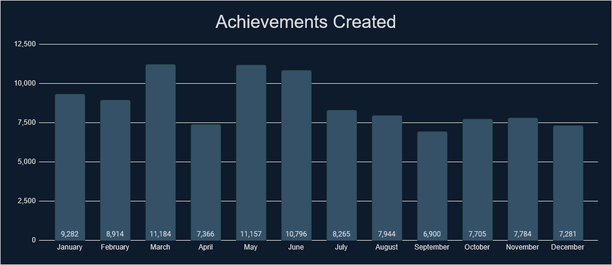
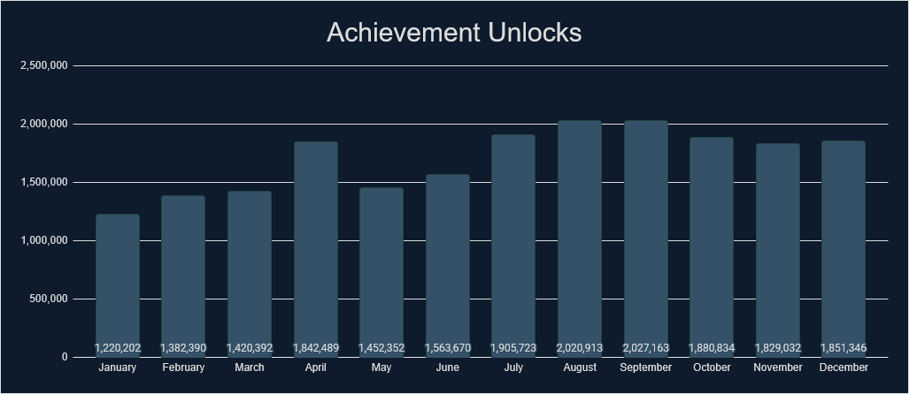
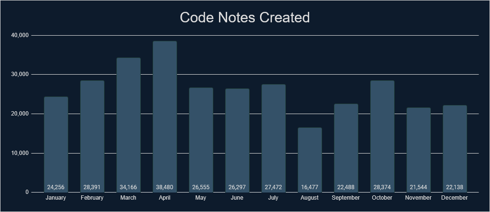
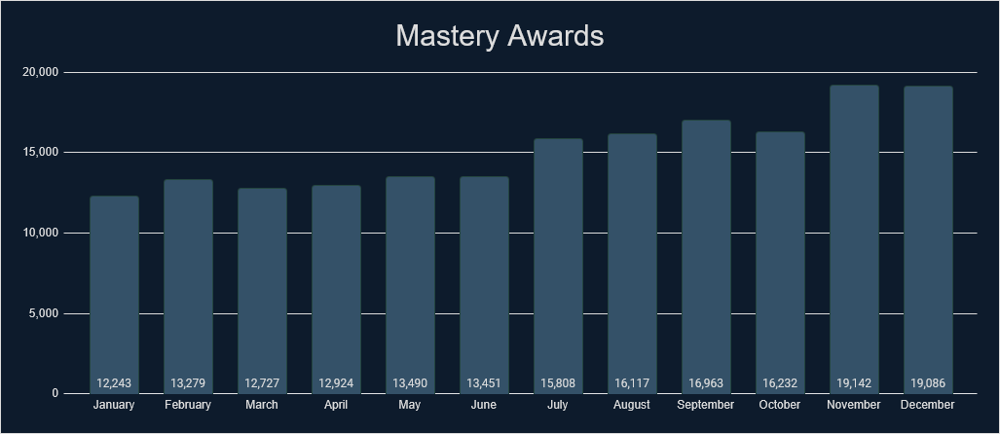
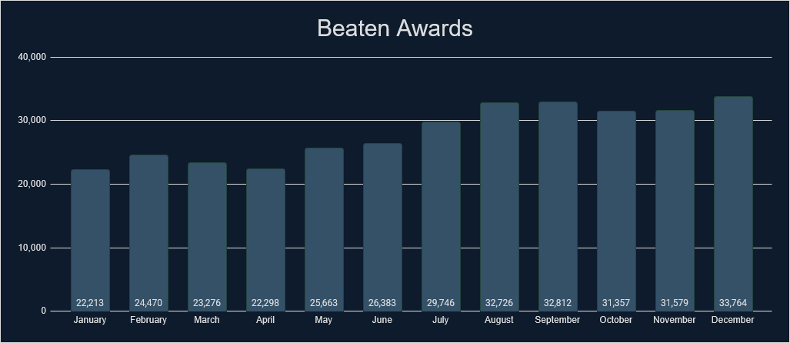
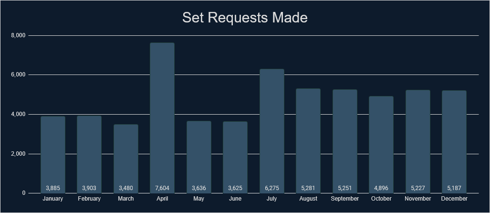
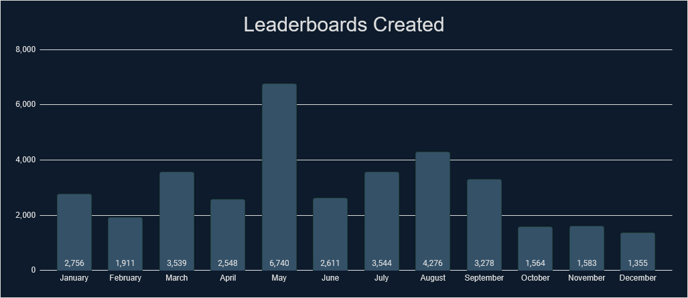

# Intro
If you like looking at stats and data, then you have come to the right place. We've gathered tons of stats from 2024 that cover a wide range of measurable aspects that RetroAchievements offer. Check out what the community has accomplished.

# General Stats
Check out some general stats from last year.

| Stat                                                             | Value       | % Change from 2023                    |
| ---------------------------------------------------------------- | ----------- | ------------------------------------- |
| Number of sets released.                                         | 1,757       | -2.87%   |
| Number of achievements released.                                 | 93,702      | -2.7%    |
| Number of hardcore achievements earned.                          | 19,692,284  | +86.66%  |
| Number of code notes created.                                    | 316,638     | -17.09%  |
| Number of mastery awards awarded.                                | 181,462     | +73.81%  |
| Number of beaten awards awarded.                                 | 336,287     | +92.05%  |
| Number of set requests made.                                     | 58,250      | +60.58%  |
| Number of leaderboards created.                                  | 35,427      | +23.2%   |
| Number of leaderboard entries submitted.                         | 3,937,331   | +164.09% |
| Number of users who have earned at least 1 hardcore achievement. | 130,912     | +87.46%  |
| Number of total hardcore points earned by players.               | 131,178,164 | +91.89%  |
| Number of total hardcore retro points earned by players.         | 435,250,423 | +75.47%  |
| Number of user accounts created.                                 | 381,332     | +42.85%  |
| Number of new user accounts reaching >=500 points.               | 20,131      | +175.69% |

# Achievements Created

## Monthly Breakdown

## Console Breakdown

    

    <table><thead><tr><th>Console</th><th>Achievements</th></tr></thead><tbody>
        <tr><td> 32X                          </td><td> 65 </td></tr>
        <tr><td> 3DO Interactive Multiplayer  </td><td> 505 </td></tr>
        <tr><td> Amstrad CPC                  </td><td> 238 </td></tr>
        <tr><td> Apple II                     </td><td> 270 </td></tr>
        <tr><td> Arcade                       </td><td> 3,674 </td></tr>
        <tr><td> Arcadia 2001                 </td><td> 6 </td></tr>
        <tr><td> Arduboy                      </td><td> 248 </td></tr>
        <tr><td> Atari 2600                   </td><td> 245 </td></tr>
        <tr><td> Atari 7800                   </td><td> 95 </td></tr>
        <tr><td> Atari Jaguar                 </td><td> 85 </td></tr>
        <tr><td> Atari Jaguar CD              </td><td> 14 </td></tr>
        <tr><td> Atari Lynx                   </td><td> 141 </td></tr>
        <tr><td> ColecoVision                 </td><td> 132 </td></tr>
        <tr><td> Dreamcast                    </td><td> 1,441 </td></tr>
        <tr><td> Elektor TV Games Computer    </td><td> 18 </td></tr>
        <tr><td> Events                       </td><td> 433 </td></tr>
        <tr><td> Fairchild Channel F          </td><td> 23 </td></tr>
        <tr><td> Game Boy                     </td><td> 1,830 </td></tr>
        <tr><td> Game Boy Advance             </td><td> 4,922 </td></tr>
        <tr><td> Game Boy Color               </td><td> 2,224 </td></tr>
        <tr><td> Game Gear                    </td><td> 324 </td></tr>
        <tr><td> GameCube                     </td><td> 13,340 </td></tr>
        <tr><td> Genesis/Mega Drive           </td><td> 2,388 </td></tr>
        <tr><td> Intellivision                </td><td> 159 </td></tr>
        <tr><td> Interton VC 4000             </td><td> 15 </td></tr>
        <tr><td> Magnavox Odyssey 2           </td><td> 59 </td></tr>
        <tr><td> Master System                </td><td> 343 </td></tr>
    </tbody></table>
    
 

    <table><thead><tr><th>Console</th><th>Achievements</th></tr></thead><tbody>
        <tr><td> Mega Duck                    </td><td> 50 </td></tr>
        <tr><td> MSX                          </td><td> 262 </td></tr>
        <tr><td> Neo Geo CD                   </td><td> 170 </td></tr>
        <tr><td> Neo Geo Pocket               </td><td> 80 </td></tr>
        <tr><td> NES/Famicom                  </td><td> 3,344 </td></tr>
        <tr><td> Nintendo 64                  </td><td> 3,353 </td></tr>
        <tr><td> Nintendo DS                  </td><td> 6,148 </td></tr>
        <tr><td> Nintendo DSi                 </td><td> 116 </td></tr>
        <tr><td> PC Engine CD/TurboGrafx-CD   </td><td> 1,089 </td></tr>
        <tr><td> PC Engine/TurboGrafx-16      </td><td> 1,264 </td></tr>
        <tr><td> PC-8000/8800                 </td><td> 844 </td></tr>
        <tr><td> PC-FX                        </td><td> 22 </td></tr>
        <tr><td> PlayStation                  </td><td> 8,957 </td></tr>
        <tr><td> PlayStation 2                </td><td> 19,647 </td></tr>
        <tr><td> PlayStation Portable         </td><td> 4,363 </td></tr>
        <tr><td> Pokemon Mini                 </td><td> 18 </td></tr>
        <tr><td> Saturn                       </td><td> 3,060 </td></tr>
        <tr><td> Sega CD                      </td><td> 108 </td></tr>
        <tr><td> SG-1000                      </td><td> 28 </td></tr>
        <tr><td> SNES/Super Famicom           </td><td> 6,638 </td></tr>
        <tr><td> Standalone                   </td><td> 210 </td></tr>
        <tr><td> Uzebox                       </td><td> 107 </td></tr>
        <tr><td> Vectrex                      </td><td> 85 </td></tr>
        <tr><td> Virtual Boy                  </td><td> 19 </td></tr>
        <tr><td> WASM-4                       </td><td> 34 </td></tr>
        <tr><td> Watara Supervision           </td><td> 58 </td></tr>
        <tr><td> WonderSwan                   </td><td> 391 </td></tr>
    </tbody></table>
    

 

## Top 25 Achievement Creators
Check out the top 25 achievement creators last year and how many achievements they created.

| Rank | Developer                      | Achievements |
| ---- | ------------------------------ | ------------ |
| 1    |        | 2,906        |
| 2    |        | 2,414        |
| 3    |       | 2,220        |
| 4    |        | 1,899        |
| 5    |    | 1,868        |
| 6    |  | 1,820        |
| 7    |            | 1,797        |
| 8    |          | 1,779        |
| 9    |  | 1,615        |
| 10   |       | 1,600        |
| 11   |   | 1,470        |
| 12   |          | 1,469        |
| 13   |           | 1,462        |
| 14   |  | 1,447        |
| 15   |   | 1,348        |
| 16   |     | 1,249        |
| 17   |         | 1,232        |
| 18   |          | 1,175        |
| 19   |         | 1,126        |
| 20   |       | 1,072        |
| 21   |          | 1,065        |
| 22   |     | 1,060        |
| 23   |      | 1,036        |
| 24   |           | 1,000        |
| 25   |         | 998          |

## Top 25 Developers
Check out some stats regarding unlocks and points awarded by the developers. Included is the number of unlocks, points and retro points awarded to the players. This data includes all achievements but only counts unlocks during 2024.

| Rank | Developer                           | Unlocks Awarded | Points Awarded | Retro Points Awarded |
| :--- | :---------------------------------- | :-------------: | :------------: | :------------------: |
| 1    |            |     490,785     |   8,725,476    |      13,375,122      |
| 2    |            |     425,211     |   2,342,244    |      7,571,384       |
| 3    |                 |     379,314     |   2,225,588    |      7,361,234       |
| 4    |                |     371,960     |   2,754,894    |      7,626,060       |
| 5    |  |     371,806     |   2,610,463    |      5,311,019       |
| 6    |        |     354,849     |   2,733,429    |      15,589,007      |
| 7    |              |     353,965     |   1,975,163    |      9,180,178       |
| 8    |              |     353,077     |   2,828,747    |      12,501,904      |
| 9    |        |     346,150     |   2,633,283    |      8,419,248       |
| 10   |            |     313,045     |   1,881,689    |      7,596,332       |
| 11   |        |     282,839     |   1,654,800    |      4,319,820       |
| 12   |             |     275,949     |   2,266,712    |      4,703,725       |
| 13   |           |     272,020     |   1,627,060    |      6,753,003       |
| 14   |                |     267,651     |   2,012,751    |      9,206,828       |
| 15   |       |     245,299     |   1,806,989    |      6,493,130       |
| 16   |               |     244,870     |   1,572,688    |      4,339,317       |
| 17   |             |     241,518     |   1,494,389    |      8,888,998       |
| 18   |           |     239,574     |   1,490,000    |      3,172,133       |
| 19   |            |     236,396     |   1,538,994    |      10,545,017      |
| 20   |        |     233,584     |   1,322,382    |      3,187,373       |
| 21   |            |     219,669     |   1,731,541    |      7,586,051       |
| 22   |                |     195,605     |   1,021,470    |      2,306,117       |
| 23   |           |     195,491     |   1,084,117    |      4,792,473       |
| 24   |         |     194,310     |   1,221,785    |      5,963,551       |
| 25   |               |     193,251     |   1,515,485    |      4,694,635       |

\* Hardcore only

# Achievement Unlocks

## Monthly Breakdown

## Console Breakdown

    

    <table><thead><tr><th>Console</th><th>Unlocks</th></tr></thead><tbody>
        <tr><td> 32X                          </td><td> 13,969 </td></tr>
        <tr><td> 3DO Interactive Multiplayer  </td><td> 30,529 </td></tr>
        <tr><td> Amstrad CPC                  </td><td> 6,616 </td></tr>
        <tr><td> Apple II                     </td><td> 14,417 </td></tr>
        <tr><td> Arcade                       </td><td> 416,980 </td></tr>
        <tr><td> Arcadia 2001                 </td><td> 3,571 </td></tr>
        <tr><td> Arduboy                      </td><td> 44,759 </td></tr>
        <tr><td> Atari 2600                   </td><td> 139,335 </td></tr>
        <tr><td> Atari 7800                   </td><td> 12,573 </td></tr>
        <tr><td> Atari Jaguar                 </td><td> 4,789 </td></tr>
        <tr><td> Atari Jaguar CD              </td><td> 1,403 </td></tr>
        <tr><td> Atari Lynx                   </td><td> 8,298 </td></tr>
        <tr><td> ColecoVision                 </td><td> 11,126 </td></tr>
        <tr><td> Dreamcast                    </td><td> 248,056 </td></tr>
        <tr><td> Elektor TV Games Computer    </td><td> 5,034 </td></tr>
        <tr><td> Events                       </td><td> 678,468 </td></tr>
        <tr><td> Fairchild Channel F          </td><td> 15,013 </td></tr>
        <tr><td> Game Boy                     </td><td> 823,118 </td></tr>
        <tr><td> Game Boy Advance             </td><td> 1,841,919 </td></tr>
        <tr><td> Game Boy Color               </td><td> 506,869 </td></tr>
        <tr><td> Game Gear                    </td><td> 60,976 </td></tr>
        <tr><td> GameCube                     </td><td> 1,659,708 </td></tr>
        <tr><td> Genesis/Mega Drive           </td><td> 663,541 </td></tr>
        <tr><td> Hubs                         </td><td> 681 </td></tr>
        <tr><td> Intellivision                </td><td> 7,623 </td></tr>
        <tr><td> Interton VC 4000             </td><td> 6,002 </td></tr>
        <tr><td> Magnavox Odyssey 2           </td><td> 5,277 </td></tr>
        <tr><td> Master System                </td><td> 104,651 </td></tr>
    </tbody></table>
    
 

    <table><thead><tr><th>Console</th><th>Unlocks</th></tr></thead><tbody>
        <tr><td> Mega Duck                    </td><td> 5,974 </td></tr>
        <tr><td> MSX                          </td><td> 9,049 </td></tr>
        <tr><td> Neo Geo CD                   </td><td> 7,364 </td></tr>
        <tr><td> Neo Geo Pocket               </td><td> 19,975 </td></tr>
        <tr><td> NES/Famicom                  </td><td> 1,532,534 </td></tr>
        <tr><td> Nintendo 64                  </td><td> 977,734 </td></tr>
        <tr><td> Nintendo DS                  </td><td> 815,048 </td></tr>
        <tr><td> Nintendo DSi                 </td><td> 19,974 </td></tr>
        <tr><td> PC Engine CD/TurboGrafx-CD   </td><td> 56,535 </td></tr>
        <tr><td> PC Engine/TurboGrafx-16      </td><td> 94,850 </td></tr>
        <tr><td> PC-8000/8800                 </td><td> 12,835 </td></tr>
        <tr><td> PC-FX                        </td><td> 1,975 </td></tr>
        <tr><td> PlayStation                  </td><td> 2,455,722 </td></tr>
        <tr><td> PlayStation 2                </td><td> 3,301,553 </td></tr>
        <tr><td> PlayStation Portable         </td><td> 915,494 </td></tr>
        <tr><td> Pokemon Mini                 </td><td> 30,817 </td></tr>
        <tr><td> Saturn                       </td><td> 124,156 </td></tr>
        <tr><td> Sega CD                      </td><td> 40,403 </td></tr>
        <tr><td> SG-1000                      </td><td> 16,545 </td></tr>
        <tr><td> SNES/Super Famicom           </td><td> 2,049,484 </td></tr>
        <tr><td> Standalone                   </td><td> 491,334 </td></tr>
        <tr><td> Uzebox                       </td><td> 12,304 </td></tr>
        <tr><td> Vectrex                      </td><td> 5,468 </td></tr>
        <tr><td> Virtual Boy                  </td><td> 13,519 </td></tr>
        <tr><td> WASM-4                       </td><td> 23,420 </td></tr>
        <tr><td> Watara Supervision           </td><td> 5,439 </td></tr>
        <tr><td> WonderSwan                   </td><td> 21,700 </td></tr>
    </tbody></table>
    

 

## Top 25 Users
Check out who has the most achievement unlocks, points, and retro points last year.

| Rank | User                           | Achievements | Points  | Retro Points |
| ---- | ------------------------------ | :----------: | :-----: | :----------: |
| 1    |         |    14,892    | 101,667 |   326,859    |
| 2    |        |    13,484    | 84,985  |   250,703    |
| 3    |       |    12,865    | 74,186  |   141,343    |
| 4    |    |    12,005    | 92,112  |   238,084    |
| 5    |        |    11,863    | 64,949  |   160,874    |
| 6    |       |    11,491    | 70,658  |   192,445    |
| 7    |       |    11,366    | 97,619  |   723,056    |
| 8    |         |    11,174    | 52,052  |    95,580    |
| 9    |        |    10,951    | 67,311  |   223,176    |
| 10   |        |    10,923    | 63,981  |   189,439    |
| 11   |      |    10,733    | 89,243  |   599,308    |
| 12   |           |    10,457    | 62,019  |   285,746    |
| 13   |  |    10,242    | 69,178  |   245,076    |
| 14   |          |    10,012    | 65,390  |   195,676    |
| 15   |         |    9,960     | 91,492  |   936,237    |
| 16   |    |    9,851     | 46,525  |   113,796    |
| 17   |        |    9,608     | 75,449  |  1,029,036   |
| 18   |        |    9,525     | 62,326  |   121,498    |
| 19   |     |    9,411     | 62,535  |   531,224    |
| 20   |         |    9,282     | 75,309  |   540,286    |
| 21   |          |    9,263     | 56,002  |   135,249    |
| 22   |      |    9,201     | 48,181  |   108,397    |
| 23   |            |    9,152     | 66,712  |   480,929    |
| 24   |     |    9,110     | 57,482  |   310,251    |
| 25   |        |    9,061     | 43,933  |    69,696    |

## Top 25 Awarded Achievements
Check out which achievements were earned the most last year. Limit one achievement per game.

| Rank | Achievement                                                                 | Game                                                                       | Times Awarded |
| :--- | :-------------------------------------------------------------------------- | :------------------------------------------------------------------------- | :------------ |
| 1    |                                         |                              | 8,536         |
| 2    |                                   |                             | 6,833         |
| 3    |                                   |                               | 6,216         |
| 4    |                                  |           | 5,408         |
| 5    |                                  |                               | 5,096         |
| 6    |                           |                             | 4,978         |
| 7    |                                   |                            | 4,966         |
| 8    |                           |         | 4,690         |
| 9    |                                       |                              | 4,303         |
| 10   |  |                               | 4,222         |
| 11   |                             |                                    | 4,108         |
| 12   |                            |                           | 3,860         |
| 13   |                                     |        | 3,724         |
| 14   |                              |                        | 3,637         |
| 15   |                                  |                        | 3,617         |
| 16   |                             |                          | 3,366         |
| 17   |                                    |                               | 3,320         |
| 18   |                      |                           | 3,049         |
| 19   |                           |    | 3,031         |
| 20   |                                |                       | 2,951         |
| 21   |                                      |                    | 2,936         |
| 22   |                                |  | 2,752         |
| 23   |                             |                                  | 2,751         |
| 24   |                                          |                             | 2,644         |
| 25   |                                   |                                     | 2,581         |

\* Hardcore only

## Top 25 2024 Awarded Achievements
Check out which achievements created in 2024 were earned the most last year. Limit one achievement per game.

| Rank | Achievement                                                                                    | Game                                                                       | Times Awarded |
| :--- | :--------------------------------------------------------------------------------------------- | :------------------------------------------------------------------------- | :------------ |
| 1    |                                              |                             | 4,978         |
| 2    |                                              |         | 4,690         |
| 3    |                     |                               | 4,222         |
| 4    |                                                |                          | 3,366         |
| 5    |                                                   |                       | 2,951         |
| 6    |                                                   |  | 2,752         |
| 7    |                                     |                     | 2,413         |
| 8    |                                            |                               | 1,676         |
| 9    |                                                     |           | 1,424         |
| 10   |                                        |                               | 1,344         |
| 11   |                                           |        | 1,330         |
| 12   |                                                  |            | 1,320         |
| 13   |                                                 |                            | 1,281         |
| 14   |  |                                       | 1,187         |
| 15   |                                                      |           | 1,158         |
| 16   |                                        |                           | 1,099         |
| 17   |                                        |                             | 1,098         |
| 18   |                                                  |            | 1,080         |
| 19   |                                           |                   | 978           |
| 20   |                           |                                | 956           |
| 21   |                                      |                                   | 947           |
| 22   |                                                |                               | 913           |
| 23   |                                                  |  | 864           |
| 24   |                                                   |            | 852           |
| 25   |                                          |                                | 844           |

\* Hardcore only

# Code Notes

## Monthly Breakdown

## Console Breakdown

    

    <table><thead><tr><th>Console</th><th>Notes</th></tr></thead><tbody>
        <tr><td> 32X                          </td><td> 65 </td></tr>
        <tr><td> 3DO Interactive Multiplayer  </td><td> 928 </td></tr>
        <tr><td> Amstrad CPC                  </td><td> 1,128 </td></tr>
        <tr><td> Apple II                     </td><td> 6,231 </td></tr>
        <tr><td> Arcade                       </td><td> 7,100 </td></tr>
        <tr><td> Arcadia 2001                 </td><td> 25 </td></tr>
        <tr><td> Arduboy                      </td><td> 557 </td></tr>
        <tr><td> Atari 2600                   </td><td> 513 </td></tr>
        <tr><td> Atari 7800                   </td><td> 236 </td></tr>
        <tr><td> Atari Jaguar                 </td><td> 266 </td></tr>
        <tr><td> Atari Jaguar CD              </td><td> 46 </td></tr>
        <tr><td> Atari Lynx                   </td><td> 311 </td></tr>
        <tr><td> ColecoVision                 </td><td> 169 </td></tr>
        <tr><td> DOS                          </td><td> 491 </td></tr>
        <tr><td> Dreamcast                    </td><td> 3,022 </td></tr>
        <tr><td> Elektor TV Games Computer    </td><td> 36 </td></tr>
        <tr><td> Fairchild Channel F          </td><td> 58 </td></tr>
        <tr><td> Game Boy                     </td><td> 6,015 </td></tr>
        <tr><td> Game Boy Advance             </td><td> 13,594 </td></tr>
        <tr><td> Game Boy Color               </td><td> 6,538 </td></tr>
        <tr><td> Game Gear                    </td><td> 1,083 </td></tr>
        <tr><td> GameCube                     </td><td> 61,081 </td></tr>
        <tr><td> Genesis/Mega Drive           </td><td> 7,760 </td></tr>
        <tr><td> Intellivision                </td><td> 176 </td></tr>
        <tr><td> Interton VC 4000             </td><td> 41 </td></tr>
        <tr><td> Magnavox Odyssey 2           </td><td> 154 </td></tr>
        <tr><td> Master System                </td><td> 916 </td></tr>
    </tbody></table>
    
 

    <table><thead><tr><th>Console</th><th>Notes</th></tr></thead><tbody>
        <tr><td> Mega Duck                    </td><td> 58 </td></tr>
        <tr><td> MSX                          </td><td> 398 </td></tr>
        <tr><td> Neo Geo CD                   </td><td> 295 </td></tr>
        <tr><td> Neo Geo Pocket               </td><td> 430 </td></tr>
        <tr><td> NES/Famicom                  </td><td> 10,720 </td></tr>
        <tr><td> Nintendo 64                  </td><td> 7,512 </td></tr>
        <tr><td> Nintendo DS                  </td><td> 23,320 </td></tr>
        <tr><td> Nintendo DSi                 </td><td> 831 </td></tr>
        <tr><td> PC Engine CD/TurboGrafx-CD   </td><td> 1,908 </td></tr>
        <tr><td> PC Engine/TurboGrafx-16      </td><td> 1,725 </td></tr>
        <tr><td> PC-8000/8800                 </td><td> 1,518 </td></tr>
        <tr><td> PC-FX                        </td><td> 190 </td></tr>
        <tr><td> PlayStation                  </td><td> 27,818 </td></tr>
        <tr><td> PlayStation 2                </td><td> 91,281 </td></tr>
        <tr><td> PlayStation Portable         </td><td> 31,380 </td></tr>
        <tr><td> Pokemon Mini                 </td><td> 54 </td></tr>
        <tr><td> Saturn                       </td><td> 8,632 </td></tr>
        <tr><td> Sega CD                      </td><td> 200 </td></tr>
        <tr><td> SG-1000                      </td><td> 44 </td></tr>
        <tr><td> SNES/Super Famicom           </td><td> 21,079 </td></tr>
        <tr><td> Uzebox                       </td><td> 184 </td></tr>
        <tr><td> Vectrex                      </td><td> 198 </td></tr>
        <tr><td> Virtual Boy                  </td><td> 46 </td></tr>
        <tr><td> WASM-4                       </td><td> 67 </td></tr>
        <tr><td> Watara Supervision           </td><td> 140 </td></tr>
        <tr><td> WonderSwan                   </td><td> 504 </td></tr>
    </tbody></table>
    

 

## Top 10 Code Note Creators
Check out which developers created the most code notes last year.

    

    <table><thead><tr><th>Rank</th><th>Developer</th><th>Notes</th></tr></thead><tbody>
        <tr><td>1</td><td>  </td><td> 15,603 </td></tr>
        <tr><td>2</td><td>  </td><td> 15,106 </td></tr>
        <tr><td>3</td><td>  </td><td> 13,581 </td></tr>
        <tr><td>4</td><td>  </td><td> 12,839 </td></tr>
        <tr><td>5</td><td>  </td><td> 8,548 </td></tr>
    </tbody></table>
    
 

    <table><thead><tr><th>Rank</th><th>Developer</th><th>Notes</th></tr></thead><tbody>
        <tr><td>6</td><td>   </td><td> 8,391 </td></tr>
        <tr><td>7</td><td>   </td><td> 6,947 </td></tr>
        <tr><td>8</td><td>   </td><td> 6,826 </td></tr>
        <tr><td>9</td><td>   </td><td> 5,995 </td></tr>
        <tr><td>10</td><td>  </td><td> 5,649 </td></tr>
    </tbody></table>
    

 

# Mastery Awards

## Monthly Breakdown

## Console Breakdown

    

    <table><thead><tr><th>Console</th><th>Awards</th></tr></thead><tbody>
        <tr><td> 32X                          </td><td> 349 </td></tr>
        <tr><td> 3DO Interactive Multiplayer  </td><td> 549 </td></tr>
        <tr><td> Amstrad CPC                  </td><td> 183 </td></tr>
        <tr><td> Apple II                     </td><td> 654 </td></tr>
        <tr><td> Arcade                       </td><td> 3,153 </td></tr>
        <tr><td> Arcadia 2001                 </td><td> 243 </td></tr>
        <tr><td> Arduboy                      </td><td> 2,889 </td></tr>
        <tr><td> Atari 2600                   </td><td> 5,548 </td></tr>
        <tr><td> Atari 7800                   </td><td> 372 </td></tr>
        <tr><td> Atari Jaguar                 </td><td> 78 </td></tr>
        <tr><td> Atari Jaguar CD              </td><td> 51 </td></tr>
        <tr><td> Atari Lynx                   </td><td> 348 </td></tr>
        <tr><td> ColecoVision                 </td><td> 279 </td></tr>
        <tr><td> Dreamcast                    </td><td> 1,382 </td></tr>
        <tr><td> Elektor TV Games Computer    </td><td> 583 </td></tr>
        <tr><td> Events                       </td><td> 7,937 </td></tr>
        <tr><td> Fairchild Channel F          </td><td> 1,369 </td></tr>
        <tr><td> Game Boy                     </td><td> 13,705 </td></tr>
        <tr><td> Game Boy Advance             </td><td> 17,136 </td></tr>
        <tr><td> Game Boy Color               </td><td> 8,669 </td></tr>
        <tr><td> Game Gear                    </td><td> 1,173 </td></tr>
        <tr><td> GameCube                     </td><td> 9,306 </td></tr>
        <tr><td> Genesis/Mega Drive           </td><td> 7,662 </td></tr>
        <tr><td> Intellivision                </td><td> 317 </td></tr>
        <tr><td> Interton VC 4000             </td><td> 432 </td></tr>
        <tr><td> Magnavox Odyssey 2           </td><td> 414 </td></tr>
        <tr><td> Master System                </td><td> 1,497 </td></tr>
    </tbody></table>
    
 

    <table><thead><tr><th>Console</th><th>Awards</th></tr></thead><tbody>
        <tr><td> Mega Duck                    </td><td> 216 </td></tr>
        <tr><td> MSX                          </td><td> 240 </td></tr>
        <tr><td> Neo Geo CD                   </td><td> 71 </td></tr>
        <tr><td> Neo Geo Pocket               </td><td> 516 </td></tr>
        <tr><td> NES/Famicom                  </td><td> 16,729 </td></tr>
        <tr><td> Nintendo 64                  </td><td> 8,980 </td></tr>
        <tr><td> Nintendo DS                  </td><td> 6,202 </td></tr>
        <tr><td> Nintendo DSi                 </td><td> 690 </td></tr>
        <tr><td> PC Engine CD/TurboGrafx-CD   </td><td> 670 </td></tr>
        <tr><td> PC Engine/TurboGrafx-16      </td><td> 652 </td></tr>
        <tr><td> PC-8000/8800                 </td><td> 534 </td></tr>
        <tr><td> PC-FX                        </td><td> 86 </td></tr>
        <tr><td> PlayStation                  </td><td> 16,046 </td></tr>
        <tr><td> PlayStation 2                </td><td> 13,274 </td></tr>
        <tr><td> PlayStation Portable         </td><td> 4,296 </td></tr>
        <tr><td> Pokemon Mini                 </td><td> 2,326 </td></tr>
        <tr><td> Saturn                       </td><td> 988 </td></tr>
        <tr><td> Sega CD                      </td><td> 308 </td></tr>
        <tr><td> SG-1000                      </td><td> 714 </td></tr>
        <tr><td> SNES/Super Famicom           </td><td> 16,853 </td></tr>
        <tr><td> Standalone                   </td><td> 562 </td></tr>
        <tr><td> Uzebox                       </td><td> 754 </td></tr>
        <tr><td> Vectrex                      </td><td> 303 </td></tr>
        <tr><td> Virtual Boy                  </td><td> 379 </td></tr>
        <tr><td> WASM-4                       </td><td> 2,252 </td></tr>
        <tr><td> Watara Supervision           </td><td> 291 </td></tr>
        <tr><td> WonderSwan                   </td><td> 252 </td></tr>
    </tbody></table>
    

 

## Top 25 Mastery Awards

    

    <table><thead><tr><th>Rank</th><th>User</th><th>Awards</th></tr></thead><tbody>
        <tr><td>1</td><td>         </td><td> 502 </td></tr>
        <tr><td>2</td><td>           </td><td> 461 </td></tr>
        <tr><td>3</td><td>        </td><td> 443 </td></tr>
        <tr><td>4</td><td>           </td><td> 407 </td></tr>
        <tr><td>5</td><td>        </td><td> 406 </td></tr>
        <tr><td>6</td><td>         </td><td> 390 </td></tr>
        <tr><td>7</td><td>         </td><td> 374 </td></tr>
        <tr><td>8</td><td>         </td><td> 372 </td></tr>
        <tr><td>9</td><td>   </td><td> 371 </td></tr>
        <tr><td>10</td><td>           </td><td> 369 </td></tr>
        <tr><td>11</td><td>      </td><td> 368 </td></tr>
        <tr><td>12</td><td>    </td><td> 366 </td></tr>
        <tr><td>13</td><td>         </td><td> 357 </td></tr>
    </tbody></table>
    
 

    <table><thead><tr><th>Rank</th><th>User</th><th>Awards</th></tr></thead><tbody>
        <tr><td>14</td><td>            </td><td> 356 </td></tr>
        <tr><td>15</td><td>     </td><td> 336 </td></tr>
        <tr><td>16</td><td>          </td><td> 328 </td></tr>
        <tr><td>17</td><td>             </td><td> 327 </td></tr>
        <tr><td>18</td><td>           </td><td> 320 </td></tr>
        <tr><td>19</td><td>           </td><td> 319 </td></tr>
        <tr><td>20</td><td>   </td><td> 311 </td></tr>
        <tr><td>21</td><td>        </td><td> 297 </td></tr>
        <tr><td>22</td><td>       </td><td> 292 </td></tr>
        <tr><td>23</td><td>          </td><td> 285 </td></tr>
        <tr><td>24</td><td>        </td><td> 284 </td></tr>
        <tr><td>25</td><td>       </td><td> 284 </td></tr>
    </tbody></table>
    

 

## Top 25 Mastered Sets
Check out which sets were mastered most last year.

| Rank | Game                                                                                                              | Awards |
| ---- | ----------------------------------------------------------------------------------------------------------------- | ------ |
| 1    |                                                             | 4,222  |
| 2    |                                                        | 818    |
| 3    |                                                      | 699    |
| 4    |                                                       | 675    |
| 5    |                                             | 672    |
| 6    |                                               | 655    |
| 7    |                                                    | 637    |
| 8    |                                            | 603    |
| 9    |                                | 590    |
| 10   |                                                       | 584    |
| 11   |  | 558    |
| 12   |                                                 | 544    |
| 13   |                                             | 540    |
| 14   |                            | 536    |
| 15   |                            | 517    |
| 16   |                 | 492    |
| 17   |                                                      | 492    |
| 18   |                                       | 480    |
| 19   |                                | 468    |
| 20   |                                                        | 444    |
| 21   |                                | 442    |
| 22   |                                                             | 441    |
| 23   |                                     | 413    |
| 24   |                                         | 409    |
| 25   |                                      | 408    |

# Beaten Awards

## Monthly Breakdown

## Console Breakdown

    

    <table><thead><tr><th>Console</th><th>Awards</th></tr></thead><tbody>
        <tr><td> 32X                          </td><td> 523 </td></tr>
        <tr><td> 3DO Interactive Multiplayer  </td><td> 661 </td></tr>
        <tr><td> Amstrad CPC                  </td><td> 279 </td></tr>
        <tr><td> Apple II                     </td><td> 737 </td></tr>
        <tr><td> Arcade                       </td><td> 15,277 </td></tr>
        <tr><td> Arcadia 2001                 </td><td> 359 </td></tr>
        <tr><td> Arduboy                      </td><td> 3,260 </td></tr>
        <tr><td> Atari 2600                   </td><td> 8,148 </td></tr>
        <tr><td> Atari 7800                   </td><td> 544 </td></tr>
        <tr><td> Atari Jaguar                 </td><td> 135 </td></tr>
        <tr><td> Atari Jaguar CD              </td><td> 75 </td></tr>
        <tr><td> Atari Lynx                   </td><td> 446 </td></tr>
        <tr><td> ColecoVision                 </td><td> 508 </td></tr>
        <tr><td> Dreamcast                    </td><td> 3,463 </td></tr>
        <tr><td> Elektor TV Games Computer    </td><td> 654 </td></tr>
        <tr><td> Fairchild Channel F          </td><td> 1,589 </td></tr>
        <tr><td> Game Boy                     </td><td> 20,106 </td></tr>
        <tr><td> Game Boy Advance             </td><td> 31,507 </td></tr>
        <tr><td> Game Boy Color               </td><td> 12,379 </td></tr>
        <tr><td> Game Gear                    </td><td> 2,000 </td></tr>
        <tr><td> GameCube                     </td><td> 22,945 </td></tr>
        <tr><td> Genesis/Mega Drive           </td><td> 14,414 </td></tr>
        <tr><td> Intellivision                </td><td> 432 </td></tr>
        <tr><td> Interton VC 4000             </td><td> 468 </td></tr>
        <tr><td> Magnavox Odyssey 2           </td><td> 501 </td></tr>
        <tr><td> Master System                </td><td> 2,759 </td></tr>
        <tr><td> Mega Duck                    </td><td> 248 </td></tr>
    </tbody></table>
    
 

    <table><thead><tr><th>Console</th><th>Awards</th></tr></thead><tbody>
        <tr><td> MSX                          </td><td> 295 </td></tr>
        <tr><td> Neo Geo CD                   </td><td> 240 </td></tr>
        <tr><td> Neo Geo Pocket               </td><td> 929 </td></tr>
        <tr><td> NES/Famicom                  </td><td> 32,247 </td></tr>
        <tr><td> Nintendo 64                  </td><td> 15,843 </td></tr>
        <tr><td> Nintendo DS                  </td><td> 11,167 </td></tr>
        <tr><td> Nintendo DSi                 </td><td> 865 </td></tr>
        <tr><td> PC Engine CD/TurboGrafx-CD   </td><td> 1,104 </td></tr>
        <tr><td> PC Engine/TurboGrafx-16      </td><td> 1,375 </td></tr>
        <tr><td> PC-8000/8800                 </td><td> 555 </td></tr>
        <tr><td> PC-FX                        </td><td> 109 </td></tr>
        <tr><td> PlayStation                  </td><td> 34,866 </td></tr>
        <tr><td> PlayStation 2                </td><td> 32,214 </td></tr>
        <tr><td> PlayStation Portable         </td><td> 9,447 </td></tr>
        <tr><td> Pokemon Mini                 </td><td> 2,555 </td></tr>
        <tr><td> Saturn                       </td><td> 2,126 </td></tr>
        <tr><td> Sega CD                      </td><td> 687 </td></tr>
        <tr><td> SG-1000                      </td><td> 954 </td></tr>
        <tr><td> SNES/Super Famicom           </td><td> 33,525 </td></tr>
        <tr><td> Standalone                   </td><td> 5,529 </td></tr>
        <tr><td> Uzebox                       </td><td> 892 </td></tr>
        <tr><td> Vectrex                      </td><td> 414 </td></tr>
        <tr><td> Virtual Boy                  </td><td> 493 </td></tr>
        <tr><td> WASM-4                       </td><td> 2,646 </td></tr>
        <tr><td> Watara Supervision           </td><td> 323 </td></tr>
        <tr><td> WonderSwan                   </td><td> 470 </td></tr>
    </tbody></table>
    

 

## Top 25 Beaten Awards

    

    <table><thead><tr><th>Rank</th><th>User</th><th>Awards</th></tr></thead><tbody>
        <tr><td>1</td><td>        </td><td> 681 </td></tr>
        <tr><td>2</td><td>          </td><td> 502 </td></tr>
        <tr><td>3</td><td>   </td><td> 491 </td></tr>
        <tr><td>4</td><td>         </td><td> 475 </td></tr>
        <tr><td>5</td><td>            </td><td> 463 </td></tr>
        <tr><td>6</td><td>           </td><td> 460 </td></tr>
        <tr><td>7</td><td>        </td><td> 455 </td></tr>
        <tr><td>8</td><td>         </td><td> 447 </td></tr>
        <tr><td>9</td><td>     </td><td> 422 </td></tr>
        <tr><td>10</td><td>        </td><td> 408 </td></tr>
        <tr><td>11</td><td>   </td><td> 403 </td></tr>
        <tr><td>12</td><td>           </td><td> 398 </td></tr>
        <tr><td>13</td><td>    </td><td> 398 </td></tr>
    </tbody></table>
    
 

    <table><thead><tr><th>Rank</th><th>User</th><th>Awards</th></tr></thead><tbody>
        <tr><td>14</td><td>          </td><td> 398 </td></tr>
        <tr><td>15</td><td>            </td><td> 396 </td></tr>
        <tr><td>16</td><td>         </td><td> 388 </td></tr>
        <tr><td>17</td><td>       </td><td> 381 </td></tr>
        <tr><td>18</td><td>           </td><td> 380 </td></tr>
        <tr><td>19</td><td>         </td><td> 366 </td></tr>
        <tr><td>20</td><td>         </td><td> 365 </td></tr>
        <tr><td>21</td><td>      </td><td> 364 </td></tr>
        <tr><td>22</td><td>           </td><td> 341 </td></tr>
        <tr><td>23</td><td>   </td><td> 336 </td></tr>
        <tr><td>24</td><td>             </td><td> 336 </td></tr>
        <tr><td>25</td><td>           </td><td> 332 </td></tr>
    </tbody></table>
    

 

## Top 25 Beaten Sets
Check out which sets were mastered most last year.

| Rank | Game                                                                                    | Awards |
| ---- | --------------------------------------------------------------------------------------- | ------ |
| 1    |                             | 3,593  |
| 2    |         | 1,936  |
| 3    |                      | 1,932  |
| 4    |                              | 1,519  |
| 5    |                           | 1,261  |
| 6    |          | 1,253  |
| 7    |                                    | 1,236  |
| 8    |                  | 1,122  |
| 9    |                    | 1,086  |
| 10   |      | 1,065  |
| 11   |                            | 1,036  |
| 12   |                               | 1,030  |
| 13   |                                 | 993    |
| 14   |                            | 990    |
| 15   |                                 | 968    |
| 16   |                            | 964    |
| 17   |                             | 920    |
| 18   |                  | 859    |
| 19   |              | 858    |
| 20   |                           | 840    |
| 21   |              | 827    |
| 22   |                          | 801    |
| 23   |                   | 799    |
| 24   |                                 | 797    |
| 25   |  | 792    |

# Set Requests

## Monthly Breakdown

## Console Breakdown

    

    <table><thead><tr><th>Console</th><th>Requests</th></tr></thead><tbody>
        <tr><td> 32X                          </td><td> 21 </td></tr>
        <tr><td> 3DO Interactive Multiplayer  </td><td> 174 </td></tr>
        <tr><td> Amiga                        </td><td> 32 </td></tr>
        <tr><td> Amstrad CPC                  </td><td> 38 </td></tr>
        <tr><td> Apple II                     </td><td> 98 </td></tr>
        <tr><td> Arcade                       </td><td> 1,921 </td></tr>
        <tr><td> Arcadia 2001                 </td><td> 2 </td></tr>
        <tr><td> Arduboy                      </td><td> 8 </td></tr>
        <tr><td> Atari 2600                   </td><td> 102 </td></tr>
        <tr><td> Atari 5200                   </td><td> 2 </td></tr>
        <tr><td> Atari 7800                   </td><td> 24 </td></tr>
        <tr><td> Atari Jaguar                 </td><td> 22 </td></tr>
        <tr><td> Atari Jaguar CD              </td><td> 4 </td></tr>
        <tr><td> Atari Lynx                   </td><td> 19 </td></tr>
        <tr><td> Atari ST                     </td><td> 2 </td></tr>
        <tr><td> ColecoVision                 </td><td> 23 </td></tr>
        <tr><td> Commodore 64                 </td><td> 27 </td></tr>
        <tr><td> DOS                          </td><td> 414 </td></tr>
        <tr><td> Dreamcast                    </td><td> 1,207 </td></tr>
        <tr><td> Elektor TV Games Computer    </td><td> 3 </td></tr>
        <tr><td> Events                       </td><td> 23 </td></tr>
        <tr><td> Fairchild Channel F          </td><td> 16 </td></tr>
        <tr><td> FM Towns                     </td><td> 1 </td></tr>
        <tr><td> Game & Watch                 </td><td> 6 </td></tr>
        <tr><td> Game Boy                     </td><td> 619 </td></tr>
        <tr><td> Game Boy Advance             </td><td> 2,562 </td></tr>
        <tr><td> Game Boy Color               </td><td> 592 </td></tr>
        <tr><td> Game Gear                    </td><td> 123 </td></tr>
        <tr><td> GameCube                     </td><td> 7,746 </td></tr>
        <tr><td> Genesis/Mega Drive           </td><td> 1,044 </td></tr>
        <tr><td> Intellivision                </td><td> 16 </td></tr>
        <tr><td> Interton VC 4000             </td><td> 2 </td></tr>
        <tr><td> Magnavox Odyssey 2           </td><td> 7 </td></tr>
        <tr><td> Master System                </td><td> 266 </td></tr>
        <tr><td> Mega Duck                    </td><td> 5 </td></tr>
        <tr><td> MSX                          </td><td> 78 </td></tr>
        <tr><td> Neo Geo CD                   </td><td> 84 </td></tr>
    </tbody></table>
    
 

    <table><thead><tr><th>Console</th><th>Requests</th></tr></thead><tbody>
        <tr><td> Neo Geo Pocket               </td><td> 15 </td></tr>
        <tr><td> NES/Famicom                  </td><td> 1,206 </td></tr>
        <tr><td> Nintendo 3DS                 </td><td> 513 </td></tr>
        <tr><td> Nintendo 64                  </td><td> 1,298 </td></tr>
        <tr><td> Nintendo DS                  </td><td> 3,570 </td></tr>
        <tr><td> Nintendo DSi                 </td><td> 105 </td></tr>
        <tr><td> Nokia N-Gage                 </td><td> 17 </td></tr>
        <tr><td> PC Engine CD/TurboGrafx-CD   </td><td> 238 </td></tr>
        <tr><td> PC Engine/TurboGrafx-16      </td><td> 99 </td></tr>
        <tr><td> PC-8000/8800                 </td><td> 69 </td></tr>
        <tr><td> PC-9800                      </td><td> 111 </td></tr>
        <tr><td> PC-FX                        </td><td> 10 </td></tr>
        <tr><td> Philips CD-i                 </td><td> 47 </td></tr>
        <tr><td> PlayStation                  </td><td> 5,636 </td></tr>
        <tr><td> PlayStation 2                </td><td> 19,690 </td></tr>
        <tr><td> PlayStation Portable         </td><td> 3,748 </td></tr>
        <tr><td> Pokemon Mini                 </td><td> 5 </td></tr>
        <tr><td> Saturn                       </td><td> 593 </td></tr>
        <tr><td> Sega CD                      </td><td> 174 </td></tr>
        <tr><td> Sega Pico                    </td><td> 4 </td></tr>
        <tr><td> SG-1000                      </td><td> 1 </td></tr>
        <tr><td> Sharp X68000                 </td><td> 6 </td></tr>
        <tr><td> SNES/Super Famicom           </td><td> 2,281 </td></tr>
        <tr><td> Standalone                   </td><td> 103 </td></tr>
        <tr><td> Super Cassette Vision        </td><td> 1 </td></tr>
        <tr><td> TIC-80                       </td><td> 6 </td></tr>
        <tr><td> Uzebox                       </td><td> 7 </td></tr>
        <tr><td> Vectrex                      </td><td> 1 </td></tr>
        <tr><td> Virtual Boy                  </td><td> 18 </td></tr>
        <tr><td> WASM-4                       </td><td> 4 </td></tr>
        <tr><td> Wii                          </td><td> 871 </td></tr>
        <tr><td> Wii U                        </td><td> 155 </td></tr>
        <tr><td> WonderSwan                   </td><td> 110 </td></tr>
        <tr><td> Xbox                         </td><td> 185 </td></tr>
        <tr><td> Zeebo                        </td><td> 13 </td></tr>
        <tr><td> ZX Spectrum                  </td><td> 7 </td></tr>
    </tbody></table>
    

 

# Leaderboards

## Monthly Breakdown

## Console Breakdown

    

    <table><thead><tr><th>Console</th><th>Leaderboards</th></tr></thead><tbody>
        <tr><td> 3DO Interactive Multiplayer  </td><td> 99 </td></tr>
        <tr><td> Amstrad CPC                  </td><td> 42 </td></tr>
        <tr><td> Apple II                     </td><td> 7 </td></tr>
        <tr><td> Arcade                       </td><td> 863 </td></tr>
        <tr><td> Arcadia 2001                 </td><td> 3 </td></tr>
        <tr><td> Arduboy                      </td><td> 75 </td></tr>
        <tr><td> Atari 2600                   </td><td> 84 </td></tr>
        <tr><td> Atari 7800                   </td><td> 13 </td></tr>
        <tr><td> Atari Jaguar                 </td><td> 17 </td></tr>
        <tr><td> Atari Jaguar CD              </td><td> 1 </td></tr>
        <tr><td> Atari Lynx                   </td><td> 43 </td></tr>
        <tr><td> ColecoVision                 </td><td> 15 </td></tr>
        <tr><td> Dreamcast                    </td><td> 987 </td></tr>
        <tr><td> Elektor TV Games Computer    </td><td> 4 </td></tr>
        <tr><td> Fairchild Channel F          </td><td> 1 </td></tr>
        <tr><td> Game Boy                     </td><td> 206 </td></tr>
        <tr><td> Game Boy Advance             </td><td> 1,442 </td></tr>
        <tr><td> Game Boy Color               </td><td> 447 </td></tr>
        <tr><td> Game Gear                    </td><td> 117 </td></tr>
        <tr><td> GameCube                     </td><td> 6,058 </td></tr>
        <tr><td> Genesis/Mega Drive           </td><td> 809 </td></tr>
        <tr><td> Intellivision                </td><td> 20 </td></tr>
        <tr><td> Interton VC 4000             </td><td> 12 </td></tr>
        <tr><td> Magnavox Odyssey 2           </td><td> 6 </td></tr>
        <tr><td> Master System                </td><td> 26 </td></tr>
    </tbody></table>
    
 

    <table><thead><tr><th>Console</th><th>Leaderboards</th></tr></thead><tbody>
        <tr><td> Mega Duck                    </td><td> 19 </td></tr>
        <tr><td> MSX                          </td><td> 17 </td></tr>
        <tr><td> Neo Geo CD                   </td><td> 40 </td></tr>
        <tr><td> Neo Geo Pocket               </td><td> 4 </td></tr>
        <tr><td> NES/Famicom                  </td><td> 500 </td></tr>
        <tr><td> Nintendo 64                  </td><td> 746 </td></tr>
        <tr><td> Nintendo DS                  </td><td> 2,145 </td></tr>
        <tr><td> Nintendo DSi                 </td><td> 62 </td></tr>
        <tr><td> PC Engine CD/TurboGrafx-CD   </td><td> 154 </td></tr>
        <tr><td> PC Engine/TurboGrafx-16      </td><td> 272 </td></tr>
        <tr><td> PC-8000/8800                 </td><td> 344 </td></tr>
        <tr><td> PC-FX                        </td><td> 3 </td></tr>
        <tr><td> PlayStation                  </td><td> 4,930 </td></tr>
        <tr><td> PlayStation 2                </td><td> 10,082 </td></tr>
        <tr><td> PlayStation Portable         </td><td> 2,710 </td></tr>
        <tr><td> Saturn                       </td><td> 842 </td></tr>
        <tr><td> Sega CD                      </td><td> 104 </td></tr>
        <tr><td> SG-1000                      </td><td> 8 </td></tr>
        <tr><td> SNES/Super Famicom           </td><td> 1,246 </td></tr>
        <tr><td> Uzebox                       </td><td> 32 </td></tr>
        <tr><td> Vectrex                      </td><td> 14 </td></tr>
        <tr><td> Virtual Boy                  </td><td> 8 </td></tr>
        <tr><td> WASM-4                       </td><td> 8 </td></tr>
        <tr><td> Watara Supervision           </td><td> 7 </td></tr>
        <tr><td> WonderSwan                   </td><td> 11 </td></tr>
    </tbody></table>
    

 

## Top 25 Leaderboard Creators
Check out which developers created the most leaderboards last year.

    

    <table><thead><tr><th>Rank</th><th>Developer</th><th>Leaderboards</th></tr></thead><tbody>
        <tr><td>1</td><td>          </td><td> 4,088 </td></tr>
        <tr><td>2</td><td>          </td><td> 2,715 </td></tr>
        <tr><td>3</td><td>           </td><td> 2,077 </td></tr>
        <tr><td>4</td><td>            </td><td> 1,097 </td></tr>
        <tr><td>5</td><td>     </td><td> 1,012 </td></tr>
        <tr><td>6</td><td>         </td><td> 1,008 </td></tr>
        <tr><td>7</td><td>           </td><td> 1,000 </td></tr>
        <tr><td>8</td><td>    </td><td> 957 </td></tr>
        <tr><td>9</td><td>         </td><td> 757 </td></tr>
        <tr><td>10</td><td>       </td><td> 688 </td></tr>
        <tr><td>11</td><td>       </td><td> 677 </td></tr>
        <tr><td>12</td><td>           </td><td> 610 </td></tr>
        <tr><td>13</td><td>        </td><td> 608 </td></tr>
    </tbody></table>
    
 

    <table><thead><tr><th>Rank</th><th>Developer</th><th>Leaderboards</th></tr></thead><tbody>
        <tr><td>14</td><td>       </td><td> 602 </td></tr>
        <tr><td>15</td><td>            </td><td> 591 </td></tr>
        <tr><td>16</td><td>          </td><td> 569 </td></tr>
        <tr><td>17</td><td>   </td><td> 516 </td></tr>
        <tr><td>18</td><td>         </td><td> 459 </td></tr>
        <tr><td>19</td><td>         </td><td> 432 </td></tr>
        <tr><td>20</td><td>            </td><td> 430 </td></tr>
        <tr><td>21</td><td>    </td><td> 420 </td></tr>
        <tr><td>22</td><td>           </td><td> 375 </td></tr>
        <tr><td>23</td><td>      </td><td> 367 </td></tr>
        <tr><td>24</td><td>         </td><td> 353 </td></tr>
        <tr><td>25</td><td>             </td><td> 349 </td></tr>
    </tbody></table>
    

 
