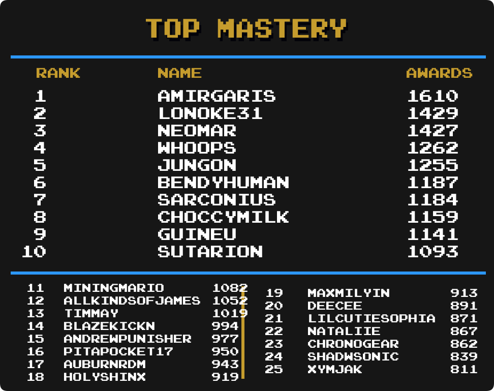

## Intro

We are going to take a look at another metric for greatness, Mastery Awards. Mastery awards are given to users when they complete every achievement for a given set in hardcore mode. Users wear mastery awards as a badge of honor on their profile page representing all the hard work they put into truly becoming a master of the game.

Below we will take a look at which users rank among the best with the most mastery awards in several categories well as notable updates from the previous month to each individual category. Check to see how you rank among the rest of the community members.

Special thanks to  for creating the ranking image templates.

\* Data as of August 1st 2025.

 

## Current Champions

| :joystick: Category               | :trophy: Champions                                          | Mastery Awards |
| --------------------------------- | ----------------------------------------------------------- | -------------- |
|  |                                     | 1610           | <!-- Total Awards                     --> |
|  |                                    | 52             | <!-- Event Awards                     --> |
|   |                                         | 43             | <!-- Site Awards                      --> |
|         |                                    | 404            | <!-- Hacks                            --> |
|     |                                     | 437            | <!-- Homebrews                        --> |
|       |                                  | 54             | <!-- Subsets                          --> |
|               |    | 17             | <!-- [43] 3DO Interactive Multiplayer --> |
|               |                                   | 31             | <!-- [37] Amstrad CPC                 --> |
|               |                                       | 56             | <!-- [38] Apple II                    --> |
|               |                                      | 182            | <!-- [27] Arcade                      --> |
|               |                                   | 29             | <!-- [73] Arcadia 2001                --> |
|               |                                   | 89             | <!-- [71] Arduboy                     --> |
|               |                                       | 126            | <!-- [25] Atari 2600                  --> |
|               |                                       | 21             | <!-- [51] Atari 7800                  --> |
|               |                                       | 12             | <!-- [17] Atari Jaguar                --> |
|               |                                 | 9              | <!-- [77] Atari Jaguar CD             --> |
|               |                                       | 15             | <!-- [13] Atari Lynx                  --> |
|               |                                       | 24             | <!-- [44] ColecoVision                --> |
|               |                                | 67             | <!-- [40] Dreamcast                   --> |
|               |          | 26             | <!-- [75] Elektor TV Games Computer   --> |
|               |      | 33             | <!-- [57] Fairchild Channel F         --> |
|                |                                      | 178            | <!-- [4 ] Game Boy                    --> |
|                |                              | 224            | <!-- [5 ] Game Boy Advance            --> |
|                |                                    | 204            | <!-- [6 ] Game Boy Color              --> |
|               |                                       | 106            | <!-- [15] Game Gear                   --> |
|               |                                | 33             | <!-- [16] GameCube                    --> |
|               |                                       | 29             | <!-- [45] Intellivision               --> |
|               |                                   | 35             | <!-- [74] Interton VC 4000            --> |
|               |                                   | 28             | <!-- [23] Magnavox Odyssey 2          --> |
|               |                                       | 123            | <!-- [11] Master System               --> |
|                |                                       | 129            | <!-- [1 ] Genesis/Mega Drive          --> |
|               |                                 | 212            | <!-- [69] Mega Duck                   --> |
|               |                                       | 16             | <!-- [29] MSX                         --> |
|                |                                  | 102            | <!-- [2 ] Nintendo 64                 --> |
|               |                                      | 12             | <!-- [56] Neo Geo CD                  --> |
|               |                                       | 22             | <!-- [14] Neo Geo Pocket              --> |
|                |                                         | 326            | <!-- [7 ] NES/Famicom                 --> |
|               |                                       | 190            | <!-- [18] Nintendo DS                 --> |
|               |                                  | 48             | <!-- [78] Nintendo DSi                --> |
|                |                                      | 28             | <!-- [8 ] PC Engine/TurboGrafx-16     --> |
|               |                                      | 22             | <!-- [76] PC Engine CD/TurboGrafx-CD  --> |
|               |                                       | 32             | <!-- [47] PC-8000/8800                --> |
|               |                                      | 13             | <!-- [49] PC-FX                       --> |
|               |                                       | 145            | <!-- [12] PlayStation                 --> |
|               |                                       | 134            | <!-- [21] PlayStation 2               --> |
|               |                                    | 85             | <!-- [41] PlayStation Portable        --> |
|               |                                   | 38             | <!-- [24] Pokémon Mini                --> |
|               |                                       | 7              | <!-- [10] Sega 32X                    --> |
|               |                                    | 32             | <!-- [37] Sega Saturn                 --> |
|                |                                       | 20             | <!-- [9 ] Sega CD                     --> |
|               |                                       | 64             | <!-- [33] SG-1000                     --> |
|                |                                    | 298            | <!-- [3 ] SNES/Super Famicom          --> |
|               |                                 | 36             | <!-- [80] Uzebox                      --> |
|               |                                        | 22             | <!-- [46] Vectrex                     --> |
|               |                                      | 20             | <!-- [28] Virtual Boy                 --> |
|               |                                     | 59             | <!-- [72] WASM-4                      --> |
|               |                                 | 58             | <!-- [63] Watara Supervision          --> |
|               |                                 | 16             | <!-- [53] WonderSwan                  --> |

## Notable Milestones

### 1600 Mastery Awards

||||

### 1400 Mastery Awards

||||

### 1000 Mastery Awards

||||

### 800 Mastery Awards

||||

### 700 Mastery Awards

||||

### 600 Mastery Awards

||||
||||

### 500 Mastery Awards

||||
||||

### 400 Mastery Awards

||||
||||
||||

### 300 Mastery Awards

||||
||||
||||
||||

### 200 Mastery Awards

||||
||||
||||
||||
||||
||||
||||
||||

### 100 Mastery Awards

||||
||||
||||
||||

## Category Rankings

### Total Awards

  

*  remains in 1st with 1610 total mastery awards.
*  has moved up 1 spot and is in 8th place.
*  has moved up 1 spot and is in 13th place.
*  has moved up 1 spot and is in 16th place.
*  has moved up 1 spot and is in 18th place.
*  has moved up 1 spot and is in 22nd place.

### Total Awards (Excluding Hacks)

  

*  remains in 1st with 1490 total mastery awards.
*  has moved up 1 spot and is in 11th place.
*  has moved up 1 spot and is in 12th place.
*  has moved up 1 spot and is in 13th place.
*  has moved up 1 spot and is in 16th place.
*  has moved up 2 spots and is in 19th place.
*  has moved up 1 spot and is in 22nd place.

### Event Awards

  

*  remains in 1st with 52 total mastery awards.
*  has moved up 3 spots and is tied for 8th place.
*  has moved up 2 spots and is in 12th place.
*  has moved up 1 spot and is tied for 15th place.
*  has made it into the top 25 and is in a 4-way tie for 24th place..

### Site Awards

  

*  remains in 1st with 43 total mastery awards.
*  has moved up 1 spot and is tied for 12th place.
*  has moved up 2 spots and is tied for 20th place.

### Hack Awards

  

*  remains in 1st with 404 total mastery awards.
*  has moved up 1 spot and is in 3rd place.
*  has moved up 1 spot and is tied for 14th place.
*  has moved up 1 spot and is tied for 19th place.
*  has moved up 1 spot and is tied for 22nd place.
*  has moved up 1 spot and is in 24th place.

### Homebrew Awards

  

*  remains in 1st with 437 total mastery awards.
*  has moved up 1 spot and is in 8th place.
*  has moved up 5 spots and is in 12th place.
*  has moved up 2 spots and is in 16th place.
*  has moved up 1 spot and is in 19th place.
*  has moved up 1 spot and is in 23rd place.

### Subset Awards

  

*  remains in 1st with 54 total mastery awards.
*  has moved up 2 spots and is in a 3-way tie for 5th place.
*  has moved up 1 spot and is in 8th place.
*  has moved up 1 spot and is in a 5-way tie for 13th place.
*  has moved up 5 spots and is in 18th place.
*  has moved up 2 spots and is in a 3-way tie for 23rd place.

### Amstrad CPC

  

*  remains in 1st with 31 total mastery awards.
*  has moved up 2 spots and is tied for 11th place.

### Apple II

  

*  remains in 1st with 56 total mastery awards.
*  has moved up 5 spots and is tied for 5th place.
*  has moved up 1 spot and is tied for 10th place.
*  has moved up 7 spots and is in 12th place.

### Arcade

  

*  remains in 1st with 182 total mastery awards.
*  has moved up 1 spot and is in 6th place.
*  has moved up 11 spot and is tied for 10th place.
*  has moved up 2 spots and is tied for 14th place.
*  has moved up 2 spots and is in a 4-way tie for 16th place.
*  has moved up 3 spots and is in a 4-way tie for 16th place.
*  has moved up 1 spot and is in a 4-way tie for 23rd place.
*  has made it into the top 25 and is in a 4-way tie for 23rd place.
*  has made it into the top 25 and is in a 4-way tie for 23rd place.

### Arcadia 2001

  

*  remains in 1st with 29 total mastery awards.
*  has moved up 3 spots and is tied for 4th place.
*  has moved up 4 spots and is in a 3-way tie for 19th place.

### Arduboy

  

*  remains in 1st with 89 total mastery awards.
*  has moved up 1 spot and is in 2nd place.
*  has moved up 1 spot and is in 6th place.
*  has moved up 3 spots and is tied for 12th place.
*  has moved up 1 spot and is tied for 16th place.
*  has moved up 1 spot and is in 18th place.
*  has moved up 3 spots and is in a 3-way tie for 19th place.
*  has moved up 1 spot and is in a 4-way tie for 22nd place.
*  has made it into the top 25 and is in a 4-way tie for 22nd place.

### Atari 2600

  

*  remains in 1st with 126 total mastery awards.
*  has moved up 1 spot and is in 7th place.
*  has made it into the top 25 and is in 12th place.
*  has made it into the top 25 and is in 25th place.

### Atari Jaguar CD

  

*  remains in 1st with 9 total mastery awards.
*  has moved up 12 spots and is in a 4-way tie for 6th place.
*  has made it into the top 25 and is in a 9-way tie for 10th place.
*  has moved up 8 spots and is in a 9-way tie for 10th place.
*  has made it into the top 25 and is in a 15-way tie for 19th place.
*  has made it into the top 25 and is in a 15-way tie for 19th place.

### Dreamcast

  

*  remains in 1st with 67 total mastery awards.
*  has made it into the top 25 and is in a 9-way tie for 25th place.

### Elektor TV Games Computer

  

*  remains in 1st with 26 total mastery awards.
*  has made it into the top 25 and is in 12th place.
*  has moved up 3 spots and is in a 3-way tie for 13th place.e.

### Fairchild Channel F

  

*  remains in 1st with 33 total mastery awards.
*  has moved up 15 spots and is in a 4-way tie for 4th place.
*  has moved up 8 spots and is in a 5-way tie for 14th place.

### Game Boy

  

*  remains in 1st with 178 total mastery awards.
*  has moved up 1 spot and is in 8th place.
*  has moved up 2 spots and is in 13th place.
*  has moved up 2 spots and is in 14th place.
*  has moved up 1 spot and is tied for 15th place.
*  has moved up 3 spots and is in 19th place.
*  has moved up 1 spot and is in a 4-way tie for 21st place.
*  has made it into the top 25 and is in a 4-way tie for 21st place.

### Game Boy Advance

  

*  remains in 1st with 224 total mastery awards.
*  has moved up 1 spot and is in 2nd place.
*  has moved up 1 spot and is in 6th place.
*  has moved up 1 spot and is tied for 11th place.
*  has moved up 3 spots and is tied for 13th place.
*  has moved up 1 spot and is tied for 17th place.
*  has made it into the top 25 and is tied for 22nd place.

### Game Boy Color

  

*  remains in 1st with 204 total mastery awards.
*  has moved up 2 spots and is tied for 14th place.
*  has made it into the top 25 and is tied for 16th place.
*  has moved up 1 spot and is tied for 16th place.
*  has moved up 5 spots and is tied for 19th place.
*  has made it into the top 25 and is in 22nd place.
*  has made it into the top 25 and is tied for 23rd place.
*  has made it into the top 25 and is tied for 25th place.

### Game Gear

  

*  remains in 1st with 106 total mastery awards.
*  has moved up 2 spots and is in a 6-way tie for 17th place.
*  has made it into the top 25 and is in a 6-way tie for 25th place.

### GameCube

  

*  remains in 1st with 33 total mastery awards.
*  has moved up 2 spots and is in 5th place.
*  has moved up 1 spot and is in a 3-way tie for 6th place.
*  has moved up 1 spot and is in a 3-way tie for 10th place.
*  has moved up 2 spots and is in a 5-way tie for 16th place.
*  has made it into the top 25 and is in a 5-way tie for 16th place.
*  has moved up 1 spot and is in a 3-way tie for 21st place.
*  has moved up 2 spots and is in a 3-way tie for 21st place.
*  has made it into the top 25 and is in a 3-way tie for 21st place.
*  has made it into the top 25 and is in a 8-way tie for 24th place.

### Interton VC 4000

  

*  remains in 1st with 35 total mastery awards.
*  has moved up 2 spots and is in 7th place.
*  has moved up 7 spots and is in a 3-way tie for 14th place.

### Master System

  

*  remains in 1st with 123 total mastery awards.
*  has moved up 1 spot and is in 3rd place.
*  has moved up 3 spots and is in a 3-way tie for 16th place.
*  has moved up 3 spots and is in a 4-way tie for 19th place.
*  has made it into the top 25 and is in a 4-way tie for 23rd place.

### Mega Drive

  

*  remains in 1st with 129 total mastery awards.

### Mega Duck

  

*  remains in 1st with 22 total mastery awards.

### Nintendo 64

  

*  remains in 1st with 102 total mastery awards.
*  has moved up 4 spots and is tied for 6th place.
*  has moved up 1 spot and is tied for 13th place.
*  has moved up 1 spot and is in a 3-way tie for 18th place.
*  has moved up 1 spot and is in a 3-way tie for 18th place.

### NES

  

*  remains in 1st with 326 total mastery awards.
*  has moved up 6 spots and is in 11th place.
*  has moved up 2 spots and is in 22nd place.
*  has made it into the top 25 and is in 25th place.

### Nintendo DS

  

*  remains in 1st with 190 total mastery awards.
*  has moved up 1 spot and is tied for 5th place.
*  has moved up 1 spot and is tied for 18th place.
*  has made it into the top 25 and is in a 3-way tie for 23rd place.

### Nintendo DSi

  

*  remains in 1st with 48 total mastery awards.
*  has moved up 1 spot and is in 11th place.
*  has moved up 1 spot and is in a 7-way tie for 12th place.
*  has moved up 5 spots and is in a 7-way tie for 12th place.
*  has made it into the top 25 and is in a 7-way tie for 12th place.
*  has moved up 5 spots and is in a 7-way tie for 12th place.
*  has made it into the top 25 and is in a 8-way tie for 19th place.

### PC Engine

  

*  remains in 1st with 28 total mastery awards.
*  has made it into the top 25 and is in a 3-way tie for 15th place.
*  has moved up 2 spots and is in a 3-way tie for 20th place.

### PC Engine CD

  

*  remains in 1st with 22 total mastery awards.
*  has made it into the top 25 and is in a 10-way tie for 16th place.

### PC-8000/8800

  

*  remains in 1st with 32 total mastery awards.
*  has moved up 4 spots and is in a 3-way tie for 7th place.

### PlayStation

  

*  remains in 1st with 145 total mastery awards.
*  has made it into the top 25 and is in 22nd place.

### PlayStation 2

  

*  remains in 1st with 134 total mastery awards.
*  has moved up 2 spots and is in 3rd place.
*  has moved up 1 spot and is in 6th place.
*  has moved up 2 spots and is in 9th place.
*  has moved up 10 spots and is in 11th place.
*  has moved up 3 spots and is in a 3-way tie for 12th place.
*  has moved up 3 spots and is in a 3-way tie for 12th place.
*  has made it into the top 25 and is in a 4-way tie for 18th place.
*  has moved up 5 spots and is in a 4-way tie for 18th place.
*  has made it into the top 25 and is in a 4-way tie for 22nd place.

### PlayStation Portable

  

*  remains in 1st with 85 total mastery awards.
*  has moved up 2 spots and is in 13th place.
*  has moved up 2 spots and is in a 6-way tie for 17th place.
*  has moved up 2 spots and is in a 6-way tie for 17th place.
*  has made it into the top 25 and is in a 4-way tie for 23rd place.
*  has made it into the top 25 and is in a 4-way tie for 23rd place.

### Pokémon Mini

  

*  remains in 1st with 38 total mastery awards.
*  has moved up 1 spot and is tied for 3rd place.

### Sega Saturn

  

*  remains in 1st with 32 total mastery awards.
*  has moved up 3 spots and is in 6th place.
*  has moved up 5 spots and is in 10th place.
*  has moved up 6 spots and is in a 3-way tie for 16th place.

### Sega CD

  

*  remains in 1st with 20 total mastery awards.
*  has moved up 3 spots and is in a 4-way tie for 4th place.
*  has moved up 11 spot and is in a 4-way tie for 4th place.
*  has moved up 2 spots and is in a 4-way tie for 4th place.
*  has moved up 7 spots and is in a 7-way tie for 8th place.
*  has made it into the top 25 and is in a 7-way tie for 8th place.
*  has made it into the top 25 and is in a 7-way tie for 8th place.
*  has moved up 10 spots and is in a 7-way tie for 8th place.
*  has moved up 9 spots and is in a 7-way tie for 8th place.
*  has made it into the top 25 and is tied for 15th place.
*  has made it into the top 25 and is in a 4-way tie for 17th place.
*  has made it into the top 25 and is in a 4-way tie for 17th place.
*  has moved up 1 spot and is in a 4-way tie for 17th place.
*  has made it into the top 25 and is in a 4-way tie for 17th place.
*  has made it into the top 25 and is in a 3-way tie for 21st place.
*  has made it into the top 25 and is in a 3-way tie for 21st place.
*  has made it into the top 25 and is in a 3-way tie for 21st place.
*  has made it into the top 25 and is in a 28-way tie for 24th place.
*  has made it into the top 25 and is in a 28-way tie for 24th place.

### SG-1000

  

*  remains in 1st with 64 total mastery awards.
*  has moved up 2 spots and is tied for 17th place.
*  has moved up 1 spot and is tied for 23rd place.

### SNES

  

*  remains in 1st with 298 total mastery awards.
*  has moved up 1 spot and is tied for 23rd place.

### Uzebox

  

*  remains in 1st with 36 total mastery awards.
*  has moved up 1 spot and is in 6th place.

### Virtual Boy

  

*  remains in 1st with 20 total mastery awards.
*  has made it into the top 25 and is in a 6-way tie for 21st place.

### WASM-4

  

*  remains in 1st with 59 total mastery awards.
*  has moved up 1 spot and is in 2nd place.
*  has moved up 2 spots and is in 5th place.
*  has moved up 1 spot and is tied for 9th place.
*  has made it into the top 25 and is tied for 11th place.
*  has moved up 1 spot and is tied for 17th place.
*  has moved up 2 spots and is tied for 17th place.
*  has made it into the top 25 and is in a 3-way tie for 22nd place.

### Watara Supervision

  

*  remains in 1st with 58 total mastery awards.
*  has moved up 1 spot and is in a 3-way tie for 23rd place.
*  has made it into the top 25 and is in a 3-way tie for 23rd place.