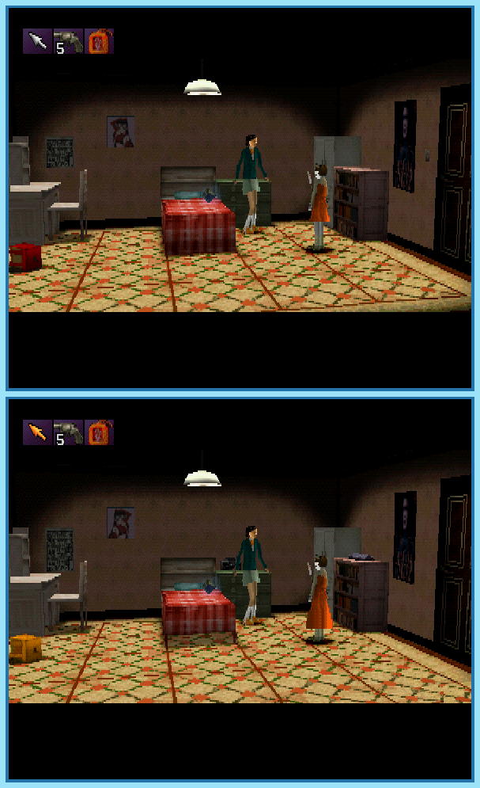

## Last Month's Winners

<table><tbody>
    <tr>
    <td colspan="4" style="text-align: center; vertical-align: middle;">
 
</td>
    </tr>
    <tr>
    <td colspan="2" style="text-align: center; vertical-align: middle;">🥈 </td>
    <td colspan="2" style="text-align: center; vertical-align: middle;">🥉 </td>
    </tr>
    <tr>
        <td></td>
        <td></td>
        <td></td>
    </tr>
    <tr>
        <td></td>
        <td></td>
        <td></td>
    </tr>
    <tr>
        <td></td>
        <td></td>
        <td></td>
    </tr>
    <tr>
        <td></td>
        <td></td>
        <td></td>
    </tr>
    <tr>
        <td></td>
        <td></td>
        <td></td>
    </tr>
    <tr>
        <td></td>
        <td></td>
        <td></td>
    </tr>
    <tr>
        <td></td>
        <td></td>
        <td></td>
    </tr>
    <tr>
        <td></td>
        <td></td>
        <td></td>
    </tr>
    <tr>
        <td></td>
        <td colspan="2"></td>
    </tr>
</tbody></table>

 

All answers for previous issues can be found [here](../spot-the-diff-answers.html).

 

Alyssa is visiting her father's friend and his wife to learn about the secrets of her family. Inside the house she notices that both of them were missing, she made scary discoveries and quickly her friendly visit turns into a horror trip. While being hunted by her cousin who wants to kill her, she needs to find a way out of this situation and if this isn't already enough, something sinister seems to change the placement of objects in the house depending on her previous actions. Can you help her and find all 10 differences?

  

## About the Game

| Game                                                   | Console     | Genre                                      |
| ------------------------------------------------------ | ----------- | ------------------------------------------ |
|  | PlayStation | Point-and-Click Adventure, Survival Horror |

* Suggested by: 

**Note:** Every user who finds all 10 differences and sends proof to SporyTike via Site DM or Discord will be listed in the next issue. Additionally a random selected user who submitted the solution until the end of the month will be chosen to select the game of the next picture.
