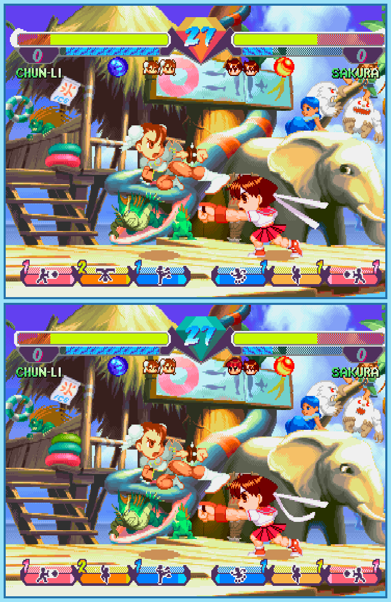

## Last Month's Winners

<table><tbody>
    <tr>
    <td colspan="4" style="text-align: center; vertical-align: middle;">
 
</td>
    </tr>
    <tr>
    <td colspan="2" style="text-align: center; vertical-align: middle;">🥈 </td>
    <td colspan="2" style="text-align: center; vertical-align: middle;">🥉 </td>
    </tr>
    <tr>
        <td></td>
        <td></td>
        <td></td>
    </tr>
    <tr>
        <td></td>
        <td></td>
        <td></td>
    </tr>
    <tr>
        <td></td>
        <td></td>
        <td></td>
    </tr>
    <tr>
        <td></td>
        <td></td>
        <td></td>
    </tr>
    <tr>
        <td></td>
        <td></td>
        <td></td>
    </tr>
    <tr>
        <td></td>
        <td></td>
        <td></td>
    </tr>
    <tr>
        <td></td>
        <td></td>
        <td></td>
    </tr>
    <tr>
        <td></td>
        <td></td>
        <td></td>
    </tr>
    <tr>
        <td></td>
        <td></td>
        <td></td>
    </tr>
    <tr>
        <td></td>
        <td></td>
        <td></td>
    </tr>
    <tr>
        <td></td>
        <td></td>
        <td></td>
    </tr>
    <tr>
        <td></td>
        <td></td>
        <td></td>
    </tr>
    <tr>
        <td></td>
        <td colspan="2"></td>
    </tr>
</tbody></table>

 

All answers for previous issues can be found [here](../spot-the-diff-answers.html).

 

Capcom's best fighters are coming together to make yet another tournament to find out who the strongest is. During fights it is not only important to be able to use professional martial arts but also to get familiar with the environment and know what can be used as an advantage. In this bracket Chun-Li is fighting against Sakura and both are eager to win this tough match, but seems like they aren't really able to investigate the arena. Can you help and find 10 differences so you can give your favorite fighter an advantage to win the fight?

  

## About the Game

| Game                                         | Console     | Genre       |
| -------------------------------------------- | ----------- | ----------- |
|  | PlayStation | 2D Fighting |

* Suggested by: 

**Note:** Every user who finds all 10 differences and sends proof to SporyTike via Site DM or Discord will be listed in the next issue. Additionally a random selected user who submitted the solution until the end of the month will be chosen to select the game of the next picture.
