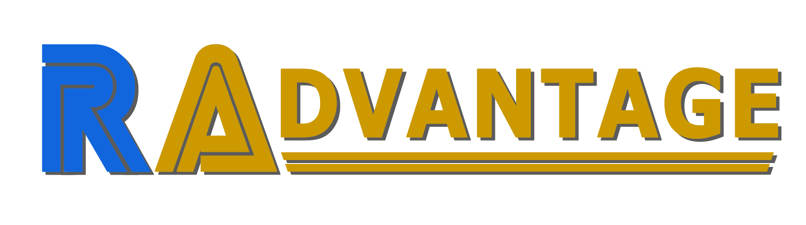

RAdvantage is bringing you tips for some of the hardest achievements on the site. As always, our DMs remain open at , if you have tips for any 100 point or other very difficult achievements you have earned please let us and the rest of the community know.

# Tip Provided By:

  

 

| Game                                                        | Console       | Genre             |
| ----------------------------------------------------------- | ------------- | ----------------- |
|  | PlayStation 2 | Platform Fighting |

 

| Achievement                                        | Description                                        | Points |
| -------------------------------------------------- | -------------------------------------------------- | ------ |
|  | Get the 1st place in challenge Succeed With Guard! | 50     |

I played this game at the time it was listed for Unwanted, and the concept of this game hooked me. When I first started it, I did not know what kind of challenges awaits me. Besides its main modes, this game has some kind of special missions, which are the hardest part of this set. Nearly every achievement with 25 points or above consists in getting the highscore in every mission. I could talk about every each one of them, but I decided to choose the best one in my opinion.

In this mission you need to block every incoming ball to gather points for your high score. Easy, right? Not quite. It is hard to master (literally). The first incoming balls are easy to block. But soon, you're hit with a full wave of them all at once, and here's where the game's physics play their little trick: every time you block a ball, your character gets pushed slightly backward. It's a small detail, but in a tight mission like this, it's a game-changer.

Use this trick for the other falling waves of balls to prevail. Don't panic if you mess up, you're allowed to miss two balls and still reach the high score threshold. However, maintaining a combo is key to maximizing your score, so minimizing mistakes is crucial. A neat little strategy I picked up: use the background palms to orient where the balls are going to land. After a few runs, you'll start memorizing the positions and can anticipate where to be before the ball even drops.

When 30 seconds remain, another evil part will be thrown in your path to mastery: you need to block two balls at once. The problem: your shield is very limited in its range. To block both of them, you need to stand on the perfect spot. This part always ruined my runs many times. Watch out for it! Following that, prepare for a series of sneaky, rebounding shots that bounce off the wall before flying at you. They're tricky to predict and even trickier to block, requiring both sharp reflexes and positional awareness.

And then comes the final gauntlet. A brutal wave that demands not just blocking, but immediately sprinting forward after each hit. The timing needs to be spot on. I failed this part more than any other, and honestly, my advice here is: skip it if you can afford to. If you've hit every other ball cleanly, you might still be able to reach the required score even with this section missed.

The mission ends with, what else, another double shot. Time it perfectly, and you're done. Even though this achievement gives you 50 points and is somewhat difficult, this mission isn't what I'd call frustrating. It's a challenge, yes, but a fair one. The mechanics are consistent, the patterns can be learned, and every failure teaches you something. If you want to have a nice, challenging time for a few minutes for some points, I recommend you the missions of DreamMix TV World Fighters!

Gambare, Hunters!

