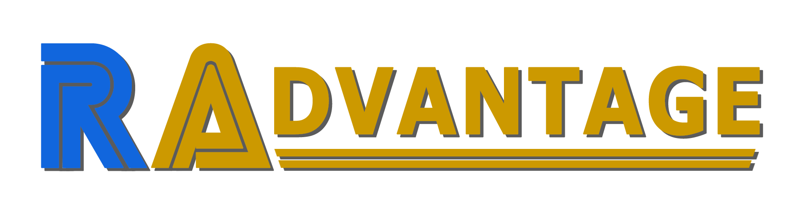

RAdvantage is bringing you tips for some of the hardest achievements on the site. As always, our DMs remain open at , if you have tips for any 100 point or other very difficult achievements you have earned please let us and the rest of the community know.

# Tip Provided By:

  

 

| Game                                                   | Console   | Genre            |
| ------------------------------------------------------ | --------- | ---------------- |
|  | Game Gear | Action-Adventure |

 

| Achievement                                          | Description                                                      | Points |
| ---------------------------------------------------- | ---------------------------------------------------------------- | ------ |
|  | Clear the game without killing any enemy and without eating fish | 50     |

If you are scared of failing this challenge you can unbind the button for charge (but you will need it in "The Eye" where a barrier blocks you; it will not void the achievement to destroy one of the circles). Only charge can damage enemies, fast swim and sonar are safe to use.

If you kept charge bound, know that sharks die in 2 hits so if they annoy you, you can get away without taking damage by charging (but be careful if something else is close, you don't want to kill it by accident)

Fish are usually the way to restore energy, but they are banned for this challenge. Other creatures can refill your health while keeping the pacifist challenge active : bats and shells.

If you need to know what they look like, you have a bat at the beginning of level 2 : swim up, right, up and the bat will be out of water, and a shell in level 3, after you lost your powers.
For bats you can sing from any direction, even if there is a wall between ecco and your target, but they only refill 25% of your energy (1 orange bubble, so if you're badly hurt you will need to sing 4 times).

Sing to shells and they will release a bubble that completely refills your health AND your air (remember, once your air is empty, you start losing health. Those shells can save you).

Both creatures will appear on your map as yellow dots. Keep the sonar (start) pressed to open a map of your surroundings.

It is not too complicated if you move carefully.

Keep in mind that you have infinite continues, and levels are relatively short.
