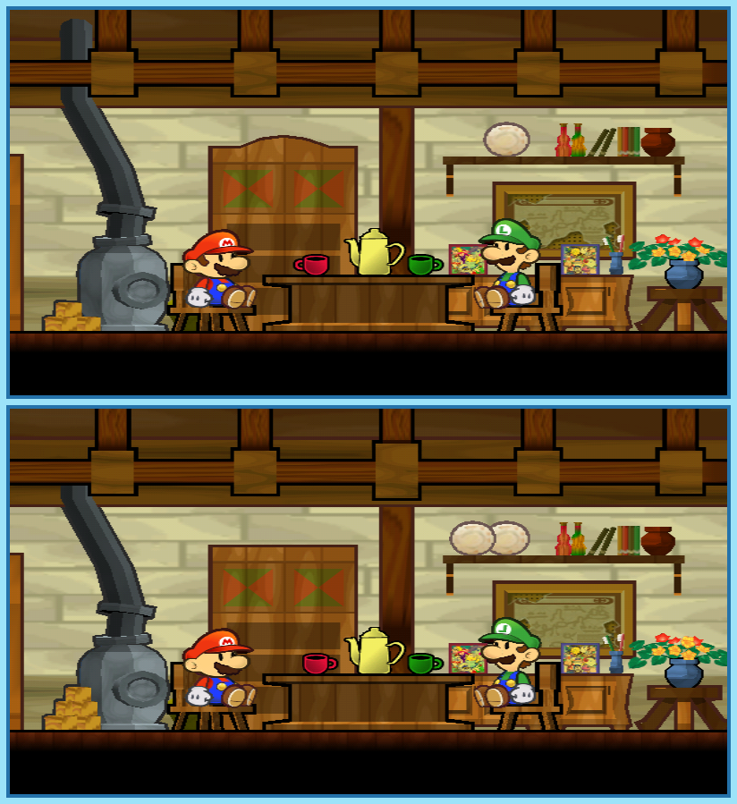

## Last Month's Winners

<table><tbody>
    <tr>
        <td colspan="4" style="text-align: center; vertical-align: middle;">
 
</td>
    </tr>
    <tr>
        <td colspan="2" style="text-align: center; vertical-align: middle;">🥈 </td>
        <td colspan="2" style="text-align: center; vertical-align: middle;">🥉 </td>
    </tr>
    <tr>
        <td></td>
        <td></td>
        <td></td>
    </tr>
    <tr>
        <td></td>
        <td></td>
        <td></td>
    </tr>
    <tr>
        <td></td>
        <td></td>
        <td></td>
    </tr>
    <tr>
        <td></td>
        <td></td>
        <td></td>
    </tr>
    <tr>
        <td></td>
        <td></td>
        <td></td>
    </tr>
    <tr>
        <td></td>
        <td></td>
        <td></td>
    </tr>
    <tr>
        <td></td>
        <td></td>
        <td></td>
    </tr>
    <tr>
        <td></td>
        <td></td>
        <td></td>
    </tr>
</tbody></table>

 

All answers for previous issues can be found [here](../spot-the-diff-answers.html).

 

Princess Peach got kidnapped once again, but surprisingly this time Bowser is not the enemy Mario and Luigi need to face. An evil creature naming itself Count Bleck appeared and wants to summon the void by flipping the world in a state it never was before. To prevent this catastrophe, the plumbers need to team up with Princess Peach and Bowser and travel through different dimensions. However, looking at the world in this new perspective seems to have unintended side effects. Can you find all 10 differences and help our heroes?

  

## About the Game

| Game                                           | Console | Genre                        |
| ---------------------------------------------- | ------- | ---------------------------- |
|  | Wii     | 2.5D Platforming, Action RPG |

* Suggested by: 

**Note:** Every user who finds all 10 differences and sends proof to SporyTike via Site DM or Discord will be listed in the next issue. Additionally a random selected user who submitted the solution until the end of the month will be chosen to select the game of the next picture.
