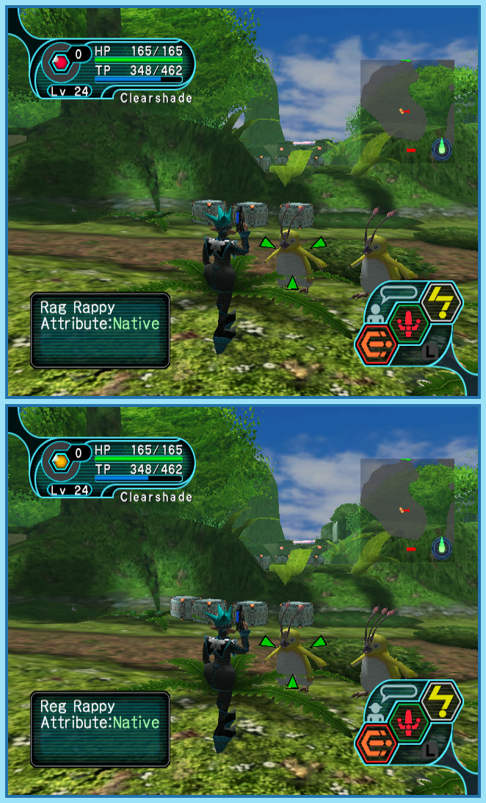

## Last Month's Winners

<table><tbody>
    <tr>
        <td colspan="4" style="text-align: center; vertical-align: middle;">
 
</td>
    </tr>
    <tr>
        <td colspan="2" style="text-align: center; vertical-align: middle;">🥈 </td>
        <td colspan="2" style="text-align: center; vertical-align: middle;">🥉 </td>
    </tr>
    <tr>
        <td></td>
        <td></td>
        <td></td>
    </tr>
    <tr>
        <td></td>
        <td></td>
        <td></td>
    </tr>
    <tr>
        <td></td>
        <td></td>
        <td></td>
    </tr>
    <tr>
        <td></td>
        <td></td>
        <td></td>
    </tr>
    <tr>
        <td></td>
        <td></td>
        <td></td>
    </tr>
    <tr>
        <td></td>
        <td></td>
        <td></td>
    </tr>
    <tr>
        <td></td>
        <td></td>
        <td></td>
    </tr>
    <tr>
        <td></td>
        <td></td>
        <td></td>
    </tr>
    <tr>
        <td></td>
        <td></td>
        <td></td>
    </tr>
    <tr>
        <td></td>
        <td></td>
        <td></td>
    </tr>
    <tr>
        <td></td>
        <td></td>
        <td></td>
    </tr>
    <tr>
        <td></td>
        <td></td>
        <td></td>
    </tr>
</tbody></table>

 

All answers for previous issues can be found [here](../spot-the-diff-answers.html).

 

While the spaceship Pioneer II tried to land on the planet Ragol to create a new colony, the surface exploded resulting into it losing contact to its sister ship and the crew boarding it. Hunters get called to investigate the explosion and find clues about the Pioneer I. While traveling through the various regions of the planet, the hunters occasionally backtrack to restock their resources. It seems like during their trips a few things change in the environment around the Pioneer II. Can you find all 10 differences to make sure the spaceship is still in a safe area?

  

## About the Game

| Game                                                                   | Console  | Genre      |
| ---------------------------------------------------------------------- | -------- | ---------- |
|  | GameCube | Action RPG |

* Suggested by: 

**Note:** Every user who finds all 10 differences and sends proof to SporyTike via Site DM or Discord will be listed in the next issue. Additionally a random selected user who submitted the solution until the end of the month will be chosen to select the game of the next picture.
