## Intro

We are going to take a look at another metric for greatness, Mastery Awards. Mastery awards are given to users when they complete every achievement for a given set in hardcore mode. Users wear mastery awards as a badge of honor on their profile page representing all the hard work they put into truly becoming a master of the game.

Below we will take a look at which users rank among the best with the most mastery awards in several categories well as notable updates from the previous month to each individual category. Check to see how you rank among the rest of the community members.

Special thanks to  for creating the ranking image templates.

\* Data as of June 1st 2026.

 

## Current Champions

| :joystick: Category                        | :trophy: Champions                                                                                             | Mastery Awards |
| ------------------------------------------ | -------------------------------------------------------------------------------------------------------------- | -------------- |
|           |                                                                                        | 1929           | <!-- Total Awards -->                |
|       |                                                                                        | 1770           | <!-- Total - No Hacks -->            |
|           |                                                                                        | 73             | <!-- Event Awards -->                |
|            |                                                                                  | 46             | <!-- Site Awards -->                 |
|     |                                                                                     | 438            | <!-- Total - Hacks Only -->          |
|  |                                                                                        | 492            | <!-- Total - Homebrew Only -->       |
|        |                                                                                     | 71             | <!-- Total - Subsets -->             |
|                        |                                                                                   | 9              | <!-- 32X -->                         |
|                        |                                                                                  | 22             | <!-- 3DO Interactive Multiplayer --> |
|                        |                                                                                      | 48             | <!-- Amstrad CPC -->                 |
|                        |                                                                                  | 62             | <!-- Apple II -->                    |
|                        |                                                                                         | 221            | <!-- Arcade -->                      |
|                        |                                                                                      | 31             | <!-- Arcadia 2001 -->                |
|                        |                                                                                        | 97             | <!-- Arduboy -->                     |
|                        |                                                                                          | 125            | <!-- Atari 2600 -->                  |
|                        |                                                                                          | 20             | <!-- Atari 7800 -->                  |
|                        |                                                                                          | 12             | <!-- Atari Jaguar -->                |
|                        |                                                                                    | 9              | <!-- Atari Jaguar CD -->             |
|                        |                                                                                          | 16             | <!-- Atari Lynx -->                  |
|                        |                                                                                          | 24             | <!-- ColecoVision -->                |
|                        |                                                                                   | 69             | <!-- Dreamcast -->                   |
|                        |     | 29             | <!-- Elektor TV Games Computer -->   |
|                        |                                                                                      | 36             | <!-- Fairchild Channel F -->         |
|    |                                                                                            | 7              | <!-- Famicom Disk System -->         |
|                         |                                                                                         | 186            | <!-- Game Boy -->                    |
|                         |                                                                                 | 234            | <!-- Game Boy Advance -->            |
|                         |                                                                                       | 216            | <!-- Game Boy Color -->              |
|                        |                                                                                          | 108            | <!-- Game Gear -->                   |
|                        |                                                                                     | 45             | <!-- GameCube -->                    |
|                         |                                                                                          | 136            | <!-- Genesis/Mega Drive -->          |
|                        |                                                                                          | 32             | <!-- Intellivision -->               |
|                        |                                                                                      | 35             | <!-- Interton VC 4000 -->            |
|                        |                                                                                      | 28             | <!-- Magnavox Odyssey 2 -->          |
|                        |                                                                                          | 129            | <!-- Master System -->               |
|                        |                                                                                    | 22             | <!-- Mega Duck -->                   |
|                        |                                                                                          | 66             | <!-- MSX -->                         |
|                        |                                                                                         | 16             | <!-- Neo Geo CD -->                  |
|                        |                                                                                          | 26             | <!-- Neo Geo Pocket -->              |
|                         |                                                                                            | 365            | <!-- NES/Famicom -->                 |
|                         |                                                                                     | 125            | <!-- Nintendo 64 -->                 |
|                        |                                                                                          | 238            | <!-- Nintendo DS -->                 |
|                        |                                                                                     | 49             | <!-- Nintendo DSi -->                |
|                        |                                                                                         | 27             | <!-- PC Engine CD/TurboGrafx-CD -->  |
|                         |                                                                                    | 37             | <!-- PC Engine/TurboGrafx-16 -->     |
|                        |                                                                                          | 32             | <!-- PC-8000/8800 -->                |
|                        |                                                                                         | 13             | <!-- PC-FX -->                       |
|                        |                                                                                        | 160            | <!-- PlayStation -->                 |
|                        |                                                                                          | 184            | <!-- PlayStation 2 -->               |
|                        |                                                                                       | 91             | <!-- PlayStation Portable -->        |
|                        |                                                                                      | 40             | <!-- Pokemon Mini -->                |
|                        |                                                                                          | 41             | <!-- Saturn -->                      |
|                         |                                                                                      | 36             | <!-- Sega CD -->                     |
|                        |                                                                                          | 67             | <!-- SG-1000 -->                     |
|                         |                                                                                       | 318            | <!-- SNES/Super Famicom -->          |
|                        |                                                                                    | 40             | <!-- Uzebox -->                      |
|                        |                                                                                           | 22             | <!-- Vectrex -->                     |
|                        |                                                                                         | 24             | <!-- Virtual Boy -->                 |
|                        |                                                                                      | 65             | <!-- WASM-4 -->                      |
|                        |                                                                                    | 59             | <!-- Watara Supervision -->          |
|                    |                                                                                     | 66             | <!-- Wii -->                         |
|                        |                                                                                    | 18             | <!-- WonderSwan -->                  |

## Notable Milestones

### 1,900 Mastery Awards

||||

### 1,400 Mastery Awards

||||

### 1,300 Mastery Awards

||||

### 1,100 Mastery Awards

||||

### 700 Mastery Awards

||||

### 600 Mastery Awards

||||
||||
||||

### 500 Mastery Awards

||||
||||

### 400 Mastery Awards

||||
||||
||||
||||
||||

### 300 Mastery Awards

||||
||||
||||
||||
||||
||||
||||

### 200 Mastery Awards

||||
||||
||||
||||
||||
||||
||||
||||
||||
||||

### 100 Mastery Awards

||||
||||
||||
||||
||||
||||
||||
||||

### Total Awards

    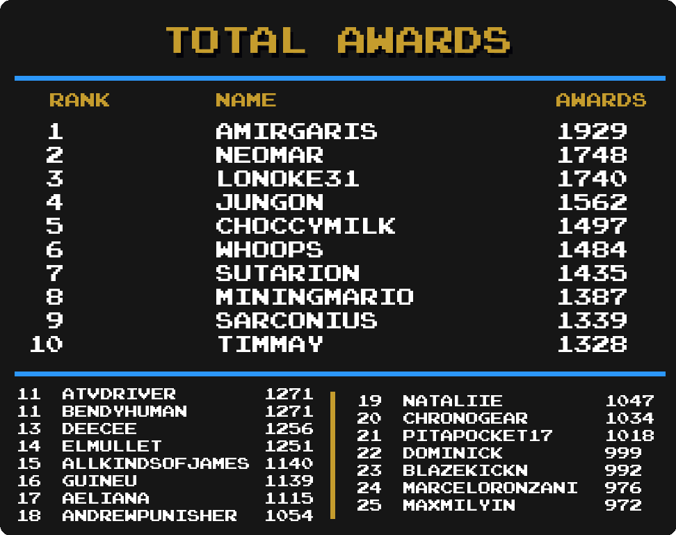

*  remains in 1st with 1929 total mastery awards.
*  has moved up 1 spot and is in 5th place.
*  has moved up 1 spot and is in a 2-way tie for 11th place.
*  has moved up 1 spot and is in 15th place.
*  has moved up 2 spots and is in 17th place.
*  has moved up 3 spots and is in 22nd place.
*  has moved up 5 spots and is in 24th place.

### Total - No Hacks

    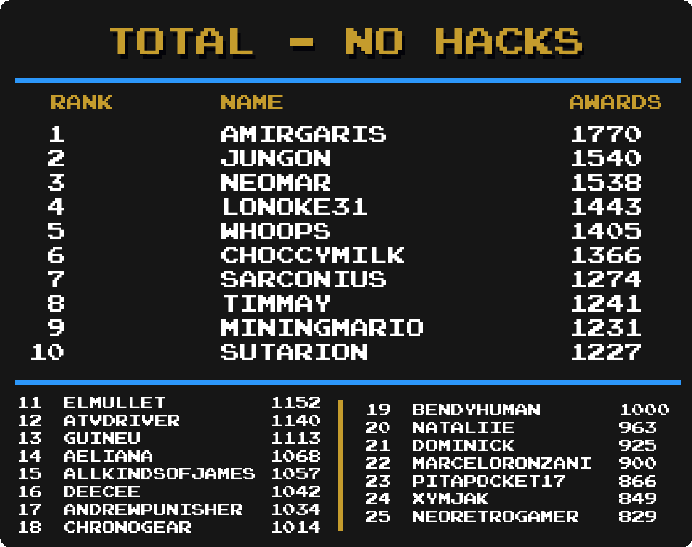

*  remains in 1st with 1770 total mastery awards.
*  has moved up 1 spot and is in 2nd place.
*  has moved up 1 spot and is in 11th place.
*  has moved up 5 spots and is in 14th place.
*  has moved up 1 spot and is in 22nd place.
*  has moved up 1 spot and is in a 2-way tie for 25th place.

### Event Awards

    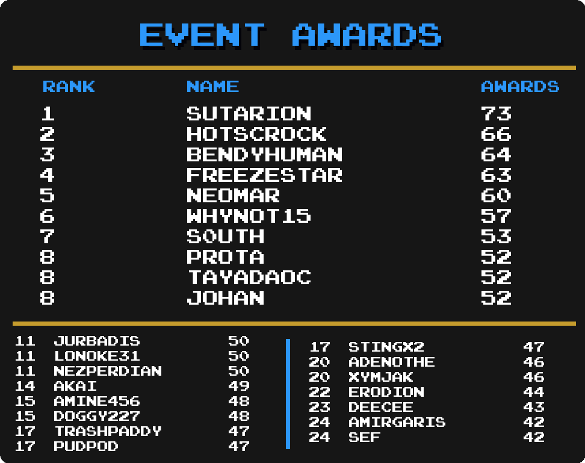

*  remains in 1st with 73 total mastery awards.
*  has moved up 1 spot and is in 3rd place.
*  has moved up 1 spot and is in 6th place.
*  has moved up 3 spots and is in a 3-way tie for 8th place.
*  has moved up 1 spot and is in a 3-way tie for 8th place.
*  has moved up 4 spots and is in a 3-way tie for 11th place.
*  has moved up 2 spots and is in a 3-way tie for 11th place.
*  has moved up 1 spot and is in 14th place.
*  has moved up 3 spots and is in a 3-way tie for 17th place.
*  has moved up 1 spot and is in a 2-way tie for 20th place.

### Site Awards

    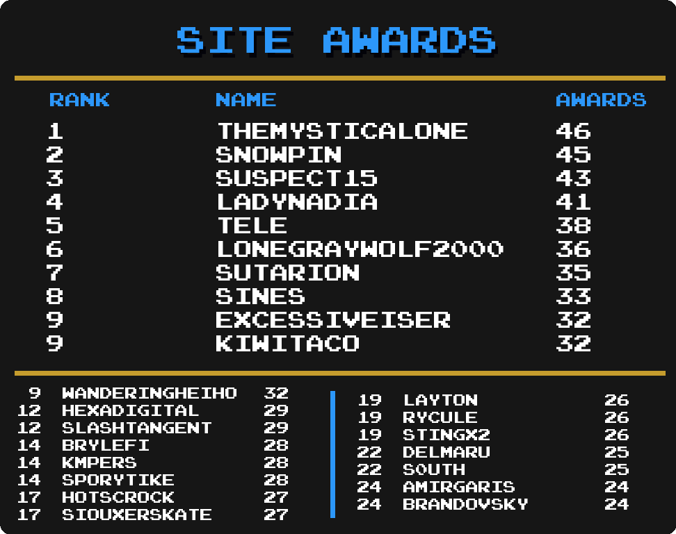

*  remains in 1st with 46 total mastery awards.
*  has moved up 2 spots and is in a 3-way tie for 9th place.
*  has moved up 2 spots and is in a 3-way tie for 19th place.

### Total - Hacks Only

    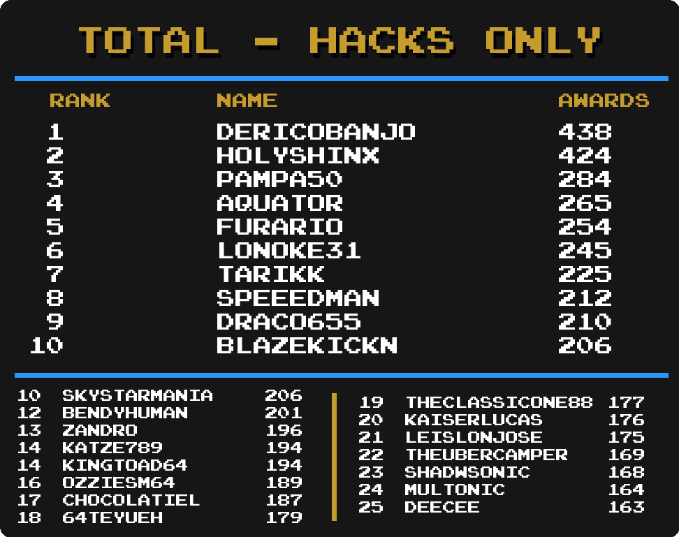

*  remains in 1st with 438 total mastery awards.
*  has moved up 1 spot and is in 13th place.
*  has moved up 2 spots and is in a 2-way tie for 14th place.
*  has moved up 5 spots and is in 16th place.
*  has moved up 2 spots and is in 18th place.

### Total - Homebrew Only

    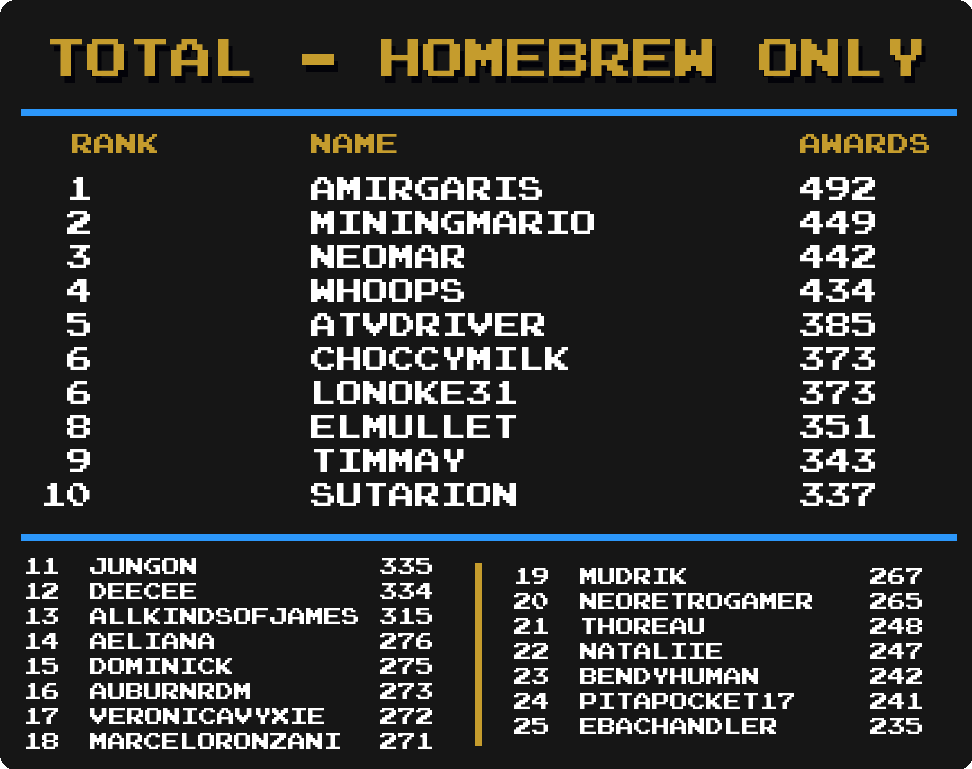

*  remains in 1st with 492 total mastery awards.
*  has moved up 1 spot and is in a 2-way tie for 6th place.
*  has moved up 1 spot and is in 11th place.
*  has moved up 5 spots and is in 14th place.
*  has moved up 3 spots and is in 15th place.
*  has moved up 1 spot and is in 18th place.

### Total - Subsets

    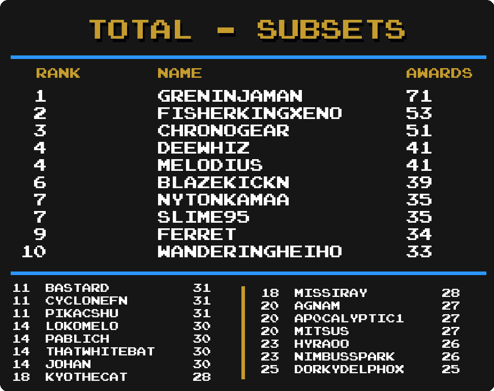

*  remains in 1st with 71 total mastery awards.
*  has moved up 1 spot and is in a 2-way tie for 4th place.
*  has moved up 2 spots and is in a 2-way tie for 7th place.
*  has moved up 14 spots and is in a 8-way tie for 25th place.
*  has moved up 9 spots and is in a 8-way tie for 25th place.
*  has moved up 5 spots and is in a 8-way tie for 25th place.

### 32X

    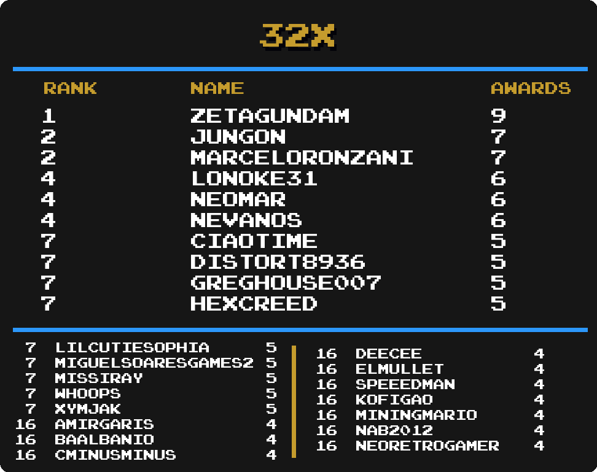

*  remains in 1st with 9 total mastery awards.
*  has moved up 15 spots and is in a 16-way tie for 16th place.

### 3DO Interactive Multiplayer

    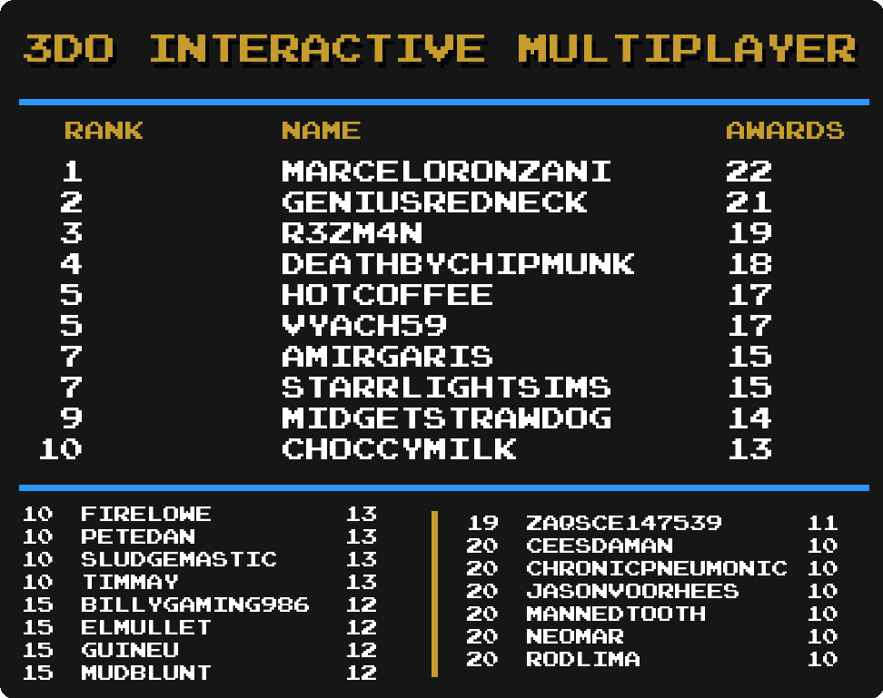

*  remains in 1st with 22 total mastery awards.
*  has moved up 2 spots and is in 4th place.
*  has moved up 3 spots and is in a 4-way tie for 15th place.

### Amstrad CPC

    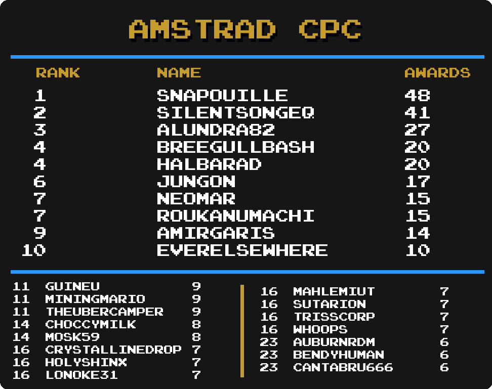

*  remains in 1st with 48 total mastery awards.
*  has moved up 6 spots and is in a 7-way tie for 16th place.

### Apple II

    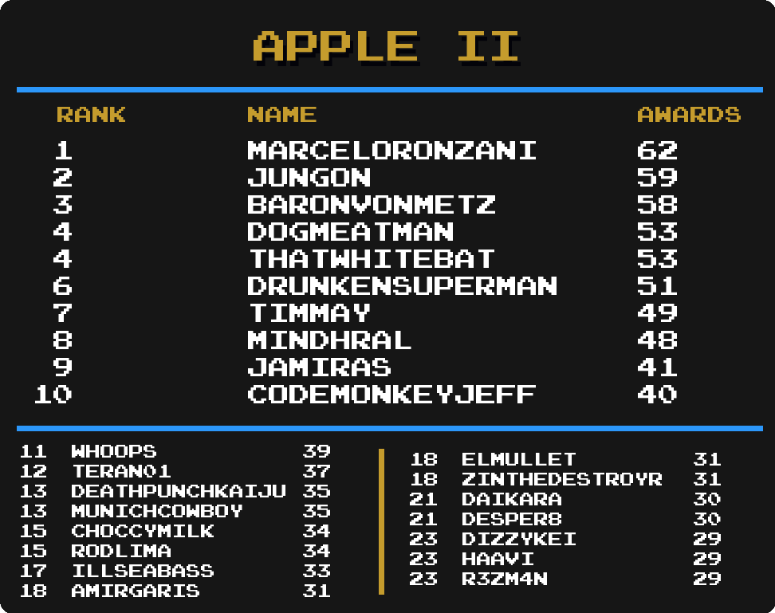

*  remains in 1st with 62 total mastery awards.
*  has moved up 3 spots and is in a 2-way tie for 4th place.
*  has moved up 11 spots and is in a 2-way tie for 15th place.
*  has moved up 2 spots and is in 17th place.
*  has moved up 3 spots and is in a 3-way tie for 18th place.

### Arcade

    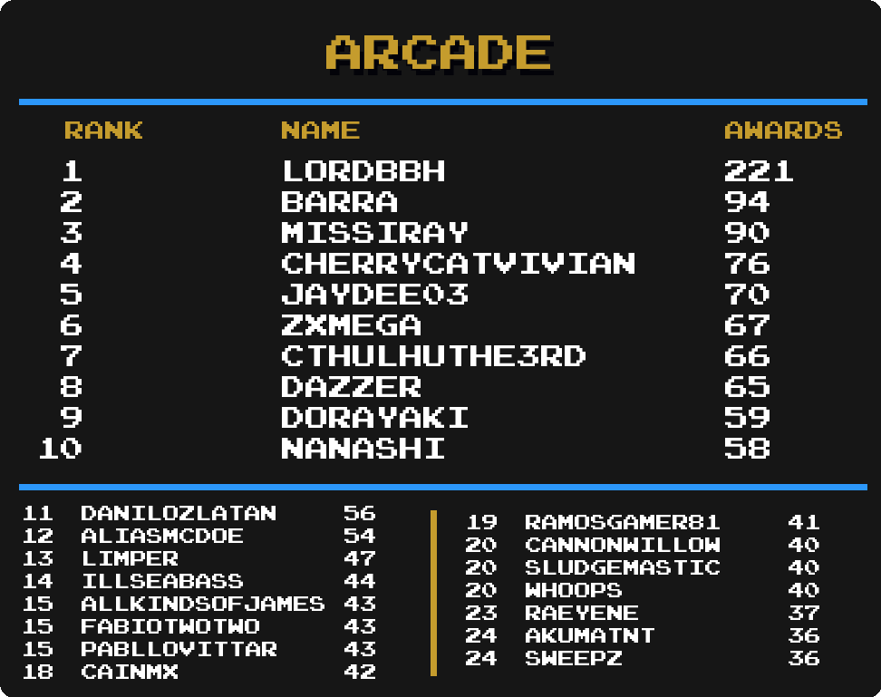

*  remains in 1st with 221 total mastery awards.
*  has moved up 1 spot and is in 7th place.
*  has moved up 3 spots and is in a 3-way tie for 15th place.
*  has moved up 2 spots and is in a 3-way tie for 20th place.
*  has moved up 2 spots and is in 23rd place.

### Arcadia 2001

    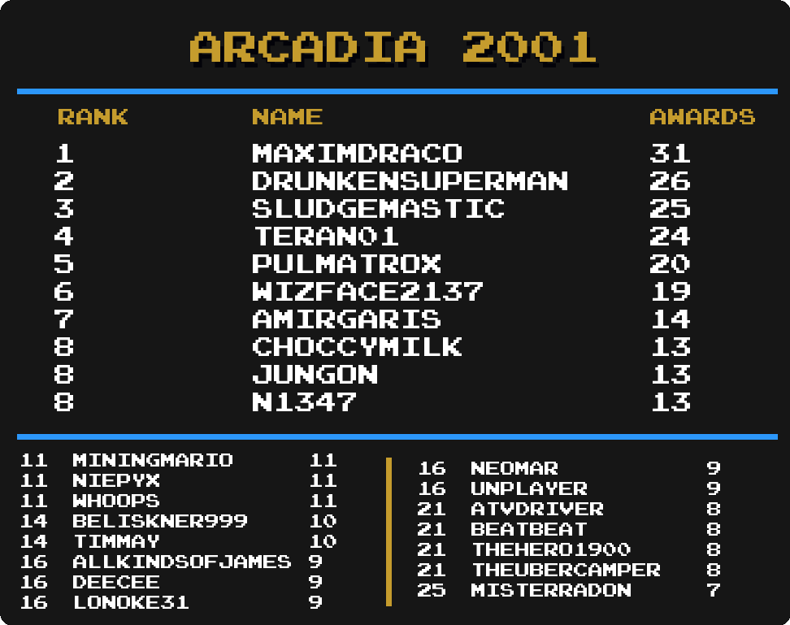

*  remains in 1st with 31 total mastery awards.
*  has moved up 1 spot and is in 2nd place.
*  has moved up 1 spot and is in a 3-way tie for 8th place.
*  has moved up 6 spots and is in a 3-way tie for 8th place.
*  has moved up 1 spot and is in a 3-way tie for 11th place.
*  has moved up 4 spots and is in a 5-way tie for 16th place.
*  has made it into the top 25 and is in a 4-way tie for 25th place.
*  has moved up 8 spots and is in a 4-way tie for 25th place.

### Arduboy

    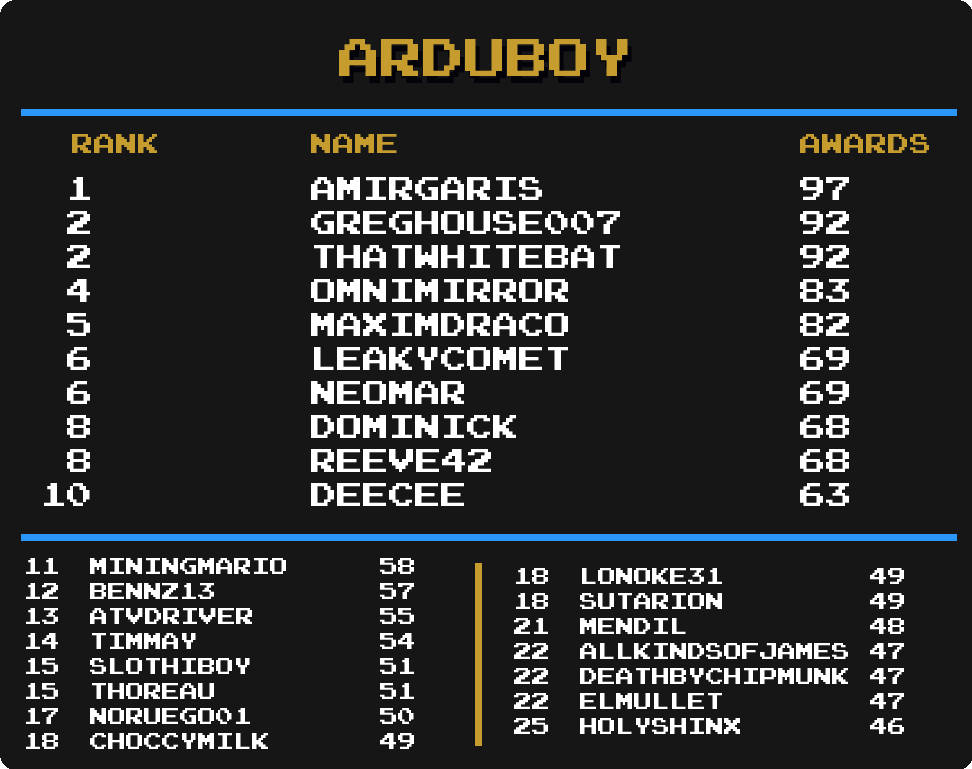

*  remains in 1st with 97 total mastery awards.
*  has moved up 1 spot and is in a 2-way tie for 6th place.
*  has moved up 1 spot and is in a 2-way tie for 8th place.
*  has moved up 17 spots and is in a 2-way tie for 15th place.
*  has moved up 11 spots and is in 17th place.
*  has moved up 1 spot and is in a 3-way tie for 18th place.

### Atari 2600

    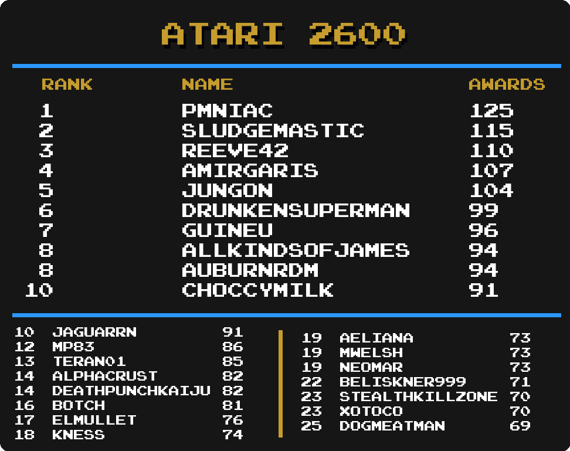

*  remains in 1st with 125 total mastery awards.
*  has moved up 1 spot and is in 3rd place.
*  has moved up 1 spot and is in 6th place.
*  has moved up 1 spot and is in a 2-way tie for 8th place.
*  has moved up 4 spots and is in 12th place.
*  has moved up 1 spot and is in a 3-way tie for 19th place.
*  has moved up 2 spots and is in a 3-way tie for 19th place.
*  has moved up 1 spot and is in 22nd place.
*  has moved up 7 spots and is in a 2-way tie for 23rd place.

### Atari 7800

    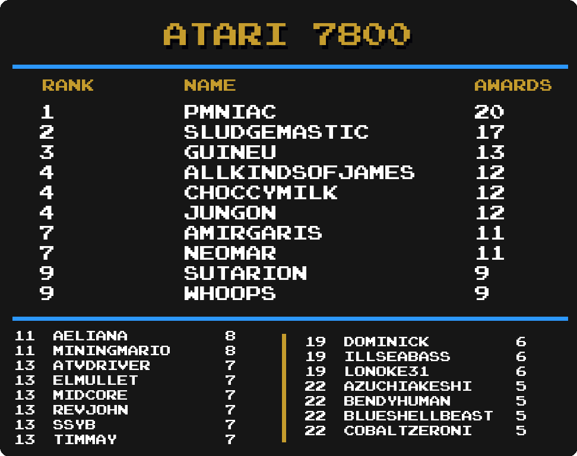

*  remains in 1st with 20 total mastery awards.
*  has moved up 5 spots and is in a 6-way tie for 13th place.
*  has moved up 13 spots and is in a 14-way tie for 22nd place.

### Atari Jaguar

    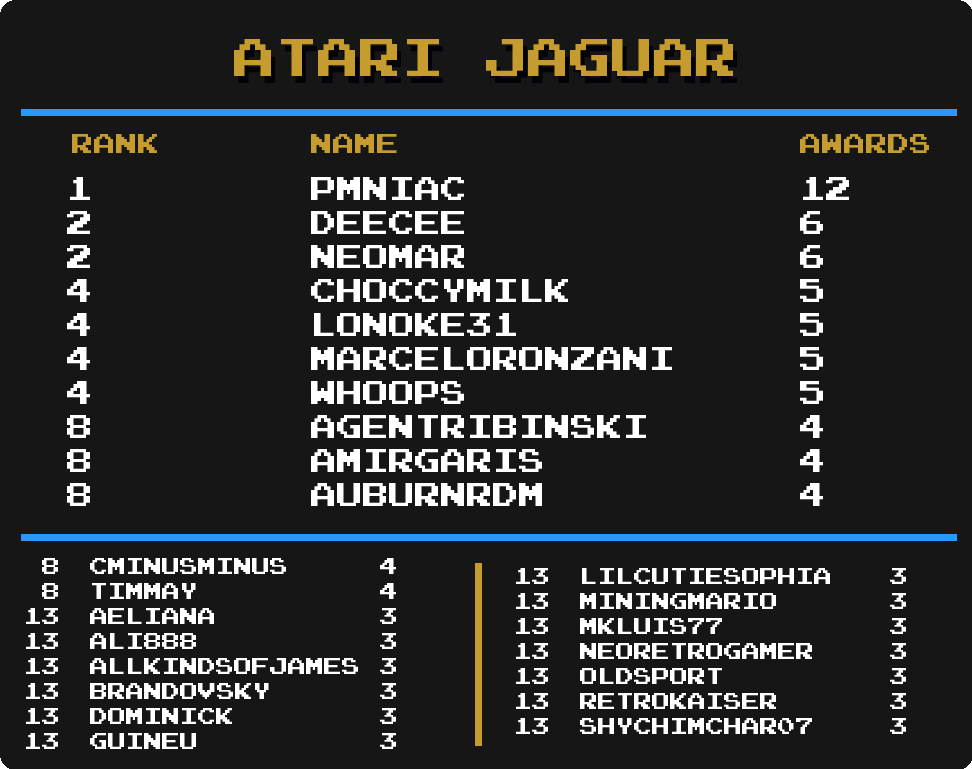

*  remains in 1st with 12 total mastery awards.
*  has moved up 1 spot and is in a 2-way tie for 2nd place.
*  has moved up 3 spots and is in a 4-way tie for 4th place.
*  has moved up 4 spots and is in a 5-way tie for 8th place.
*  has moved up 63 spots and is in a 18-way tie for 13th place.
*  has made it into the top 25 and is in a 18-way tie for 13th place.
*  has moved up 15 spots and is in a 18-way tie for 13th place.

### Atari Jaguar CD

    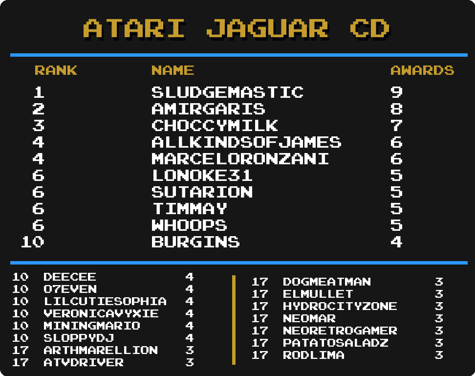

*  remains in 1st with 9 total mastery awards.
*  has moved up 6 spots and is in a 7-way tie for 10th place.

### Atari Lynx

    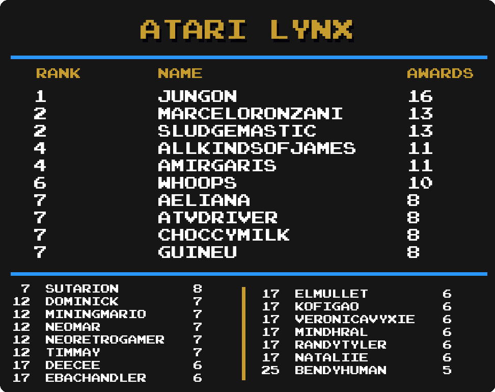

*  remains in 1st with 16 total mastery awards.
*  has moved up 12 spots and is in a 13-way tie for 25th place.

### ColecoVision

    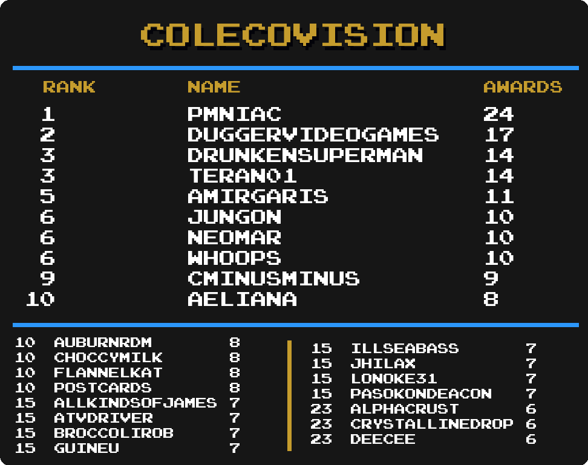

*  remains in 1st with 24 total mastery awards.
*  has moved up 4 spots and is in 9th place.
*  has moved up 3 spots and is in a 5-way tie for 10th place.
*  has moved up 6 spots and is in a 8-way tie for 15th place.
*  has moved up 6 spots and is in a 8-way tie for 15th place.
*  has moved up 32 spots and is in a 11-way tie for 23rd place.
*  has moved up 32 spots and is in a 11-way tie for 23rd place.

### Dreamcast

    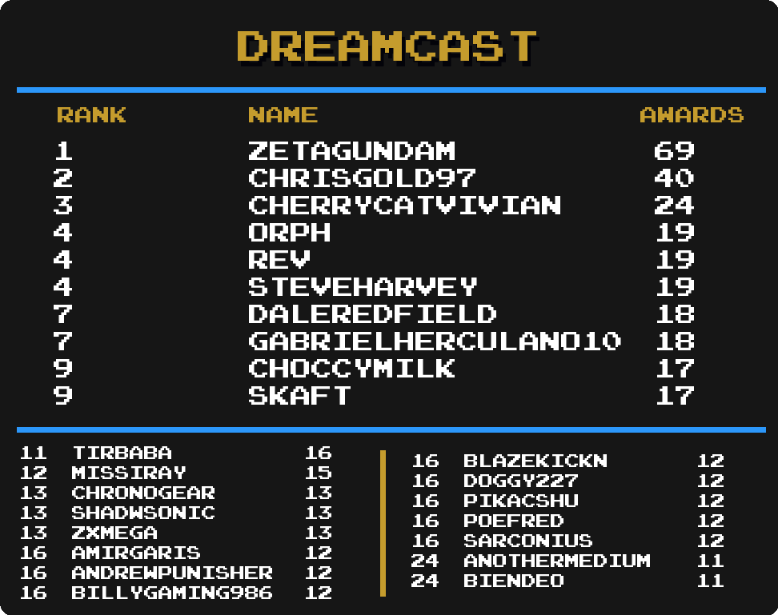

*  remains in 1st with 69 total mastery awards.
*  has moved up 2 spots and is in a 3-way tie for 13th place.

### Elektor TV Games Computer

    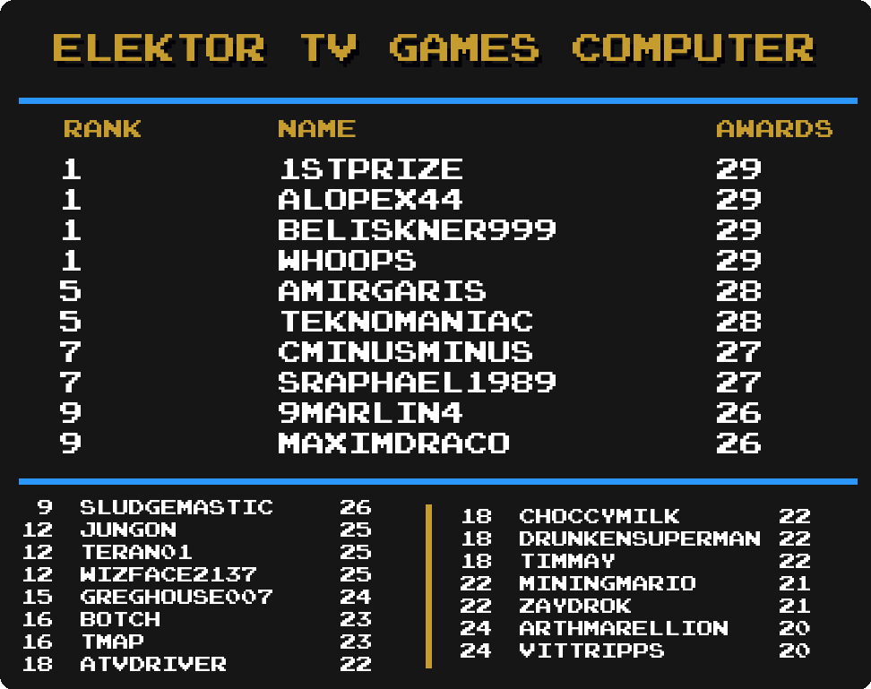

*  remains in 1st with 29 total mastery awards.
*  remains in 1st with 29 total mastery awards.
*  remains in 1st with 29 total mastery awards.
*  remains in 1st with 29 total mastery awards.
*  has moved up 1 spot and is in a 2-way tie for 7th place.
*  has moved up 1 spot and is in a 3-way tie for 12th place.
*  has moved up 1 spot and is in a 3-way tie for 12th place.
*  has moved up 3 spots and is in a 4-way tie for 18th place.
*  has moved up 5 spots and is in a 2-way tie for 22nd place.

### Fairchild Channel F

    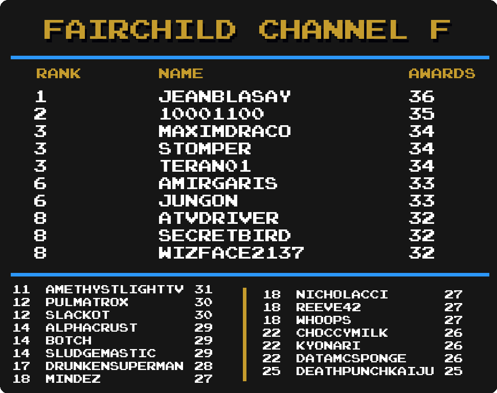

*  remains in 1st with 36 total mastery awards.
*  has moved up 1 spot and is in a 3-way tie for 3rd place.
*  has moved up 4 spots and is in a 3-way tie for 3rd place.
*  has moved up 2 spots and is in a 3-way tie for 8th place.

### Famicom Disk System

    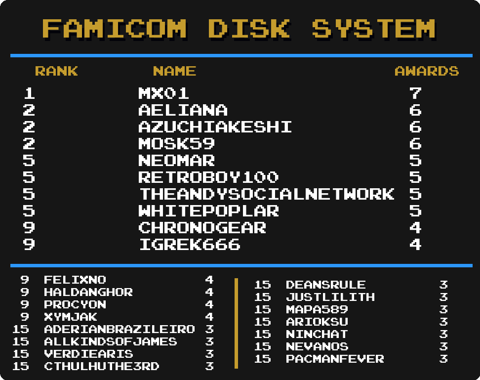

*  remains in 1st with 7 total mastery awards.
*  has made it into the top 25 and is in a 4-way tie for 5th place.
*  has moved up 13 spots and is in a 6-way tie for 9th place.
*  has moved up 1 spot and is in a 6-way tie for 9th place.
*  has made it into the top 25 and is in a 6-way tie for 9th place.
*  has moved up 1 spot and is in a 6-way tie for 9th place.
*  has moved up 7 spots and is in a 21-way tie for 15th place.
*  has moved up 7 spots and is in a 21-way tie for 15th place.
*  has moved up 7 spots and is in a 21-way tie for 15th place.
*  has moved up 7 spots and is in a 21-way tie for 15th place.
*  has moved up 7 spots and is in a 21-way tie for 15th place.
*  has moved up 7 spots and is in a 21-way tie for 15th place.
*  has made it into the top 25 and is in a 21-way tie for 15th place.
*  has moved up 7 spots and is in a 21-way tie for 15th place.
*  has moved up 7 spots and is in a 21-way tie for 15th place.
*  has moved up 7 spots and is in a 21-way tie for 15th place.
*  has made it into the top 25 and is in a 21-way tie for 15th place.

### Game Boy

    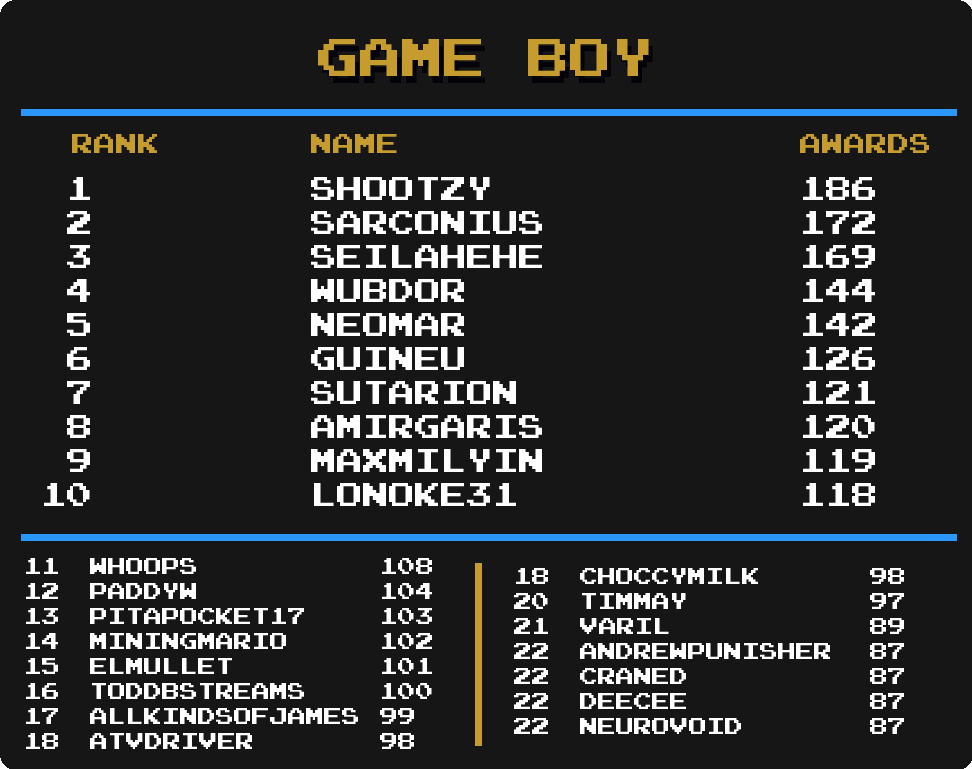

*  remains in 1st with 186 total mastery awards.
*  has moved up 3 spots and is in 7th place.
*  has moved up 2 spots and is in a 2-way tie for 18th place.
*  has moved up 3 spots and is in a 4-way tie for 22nd place.

### Game Boy Advance

    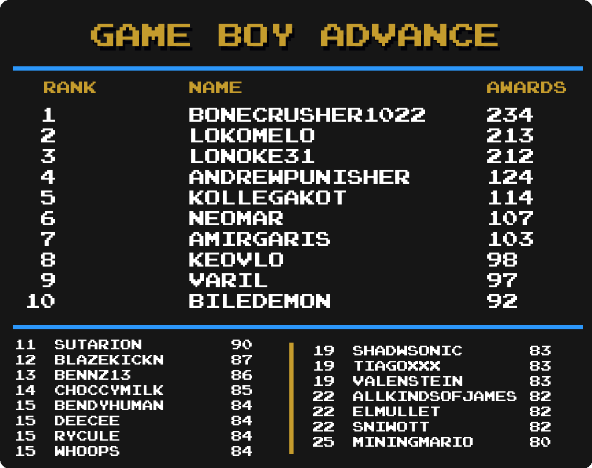

*  remains in 1st with 234 total mastery awards.
*  has moved up 8 spots and is in 8th place.
*  has moved up 1 spot and is in a 4-way tie for 15th place.
*  has moved up 6 spots and is in a 4-way tie for 15th place.
*  has moved up 1 spot and is in a 3-way tie for 22nd place.
*  has moved up 5 spots and is in a 3-way tie for 22nd place.

### Game Boy Color

    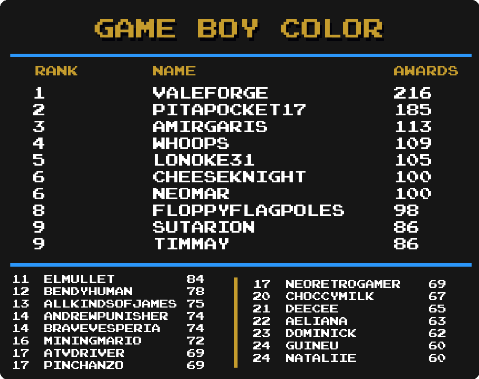

*  remains in 1st with 216 total mastery awards.
*  has moved up 1 spot and is in a 2-way tie for 6th place.
*  has moved up 1 spot and is in a 2-way tie for 14th place.
*  has moved up 2 spots and is in a 3-way tie for 17th place.
*  has moved up 3 spots and is in 23rd place.

### Game Gear

    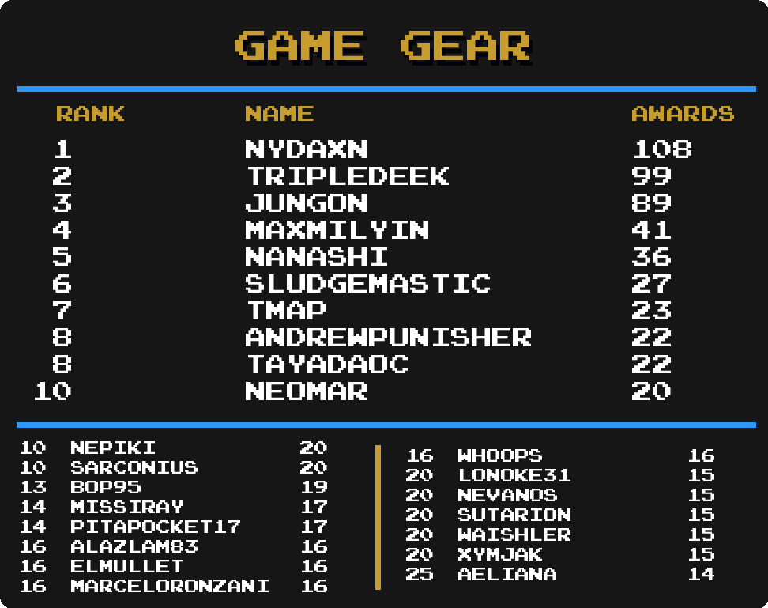

*  remains in 1st with 108 total mastery awards.
*  has moved up 1 spot and is in a 2-way tie for 14th place.
*  has moved up 7 spots and is in a 4-way tie for 16th place.
*  has moved up 12 spots and is in a 4-way tie for 16th place.

### GameCube

    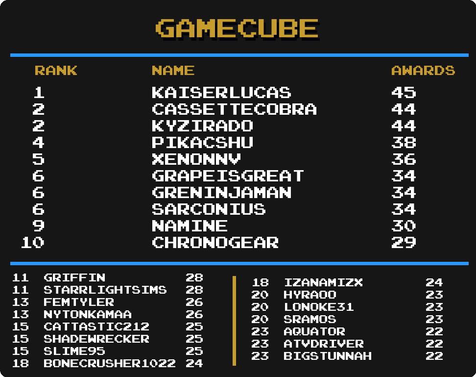

*  remains in 1st with 45 total mastery awards.
*  has moved up 1 spot and is in a 2-way tie for 2nd place.
*  has moved up 2 spots and is in a 3-way tie for 6th place.
*  has moved up 2 spots and is in a 3-way tie for 15th place.
*  has moved up 2 spots and is in a 2-way tie for 18th place.
*  has moved up 6 spots and is in a 3-way tie for 20th place.
*  has moved up 11 spots and is in a 3-way tie for 20th place.

### Genesis/Mega Drive

    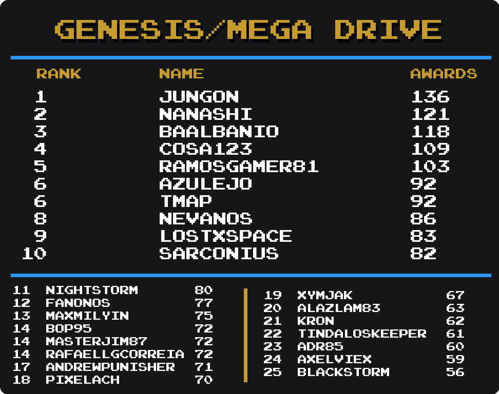

*  remains in 1st with 136 total mastery awards.
*  has moved up 1 spot and is in 4th place.
*  has moved up 1 spot and is in a 2-way tie for 6th place.
*  has moved up 2 spots and is in 9th place.
*  has moved up 3 spots and is in a 3-way tie for 14th place.
*  has moved up 1 spot and is in a 3-way tie for 14th place.
*  has moved up 9 spots and is in 20th place.
*  has moved up 4 spots and is in a 2-way tie for 25th place.

### Intellivision

    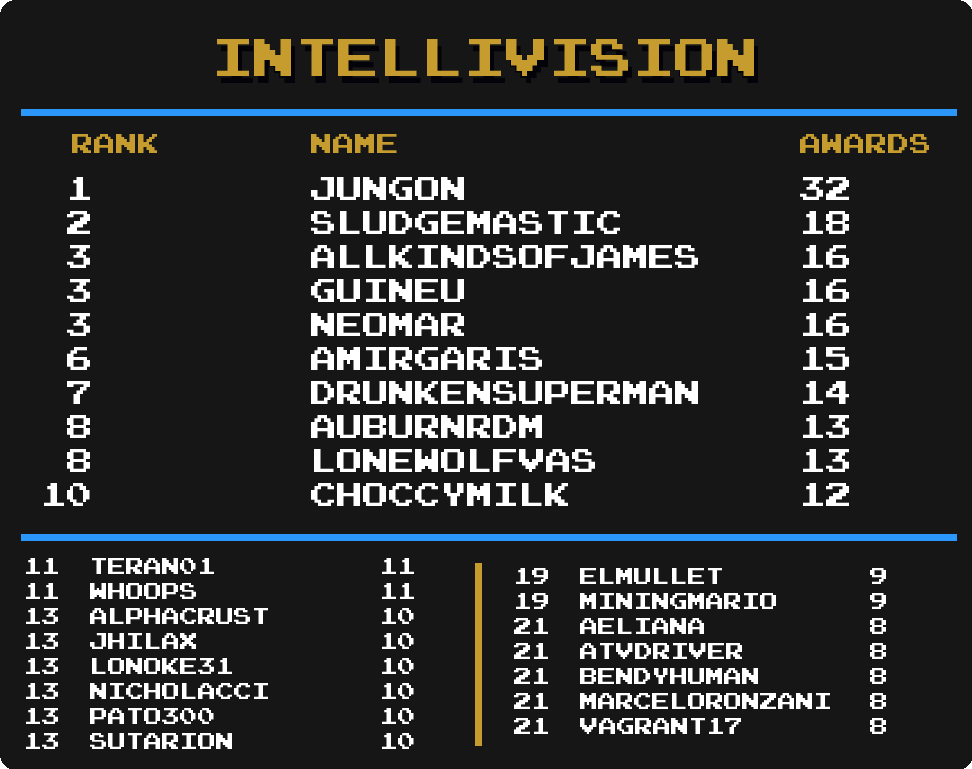

*  remains in 1st with 32 total mastery awards.
*  has moved up 2 spots and is in a 3-way tie for 3rd place.
*  has moved up 4 spots and is in a 6-way tie for 13th place.
*  has made it into the top 25 and is in a 6-way tie for 13th place.
*  has moved up 5 spots and is in a 2-way tie for 19th place.

### Interton VC 4000

    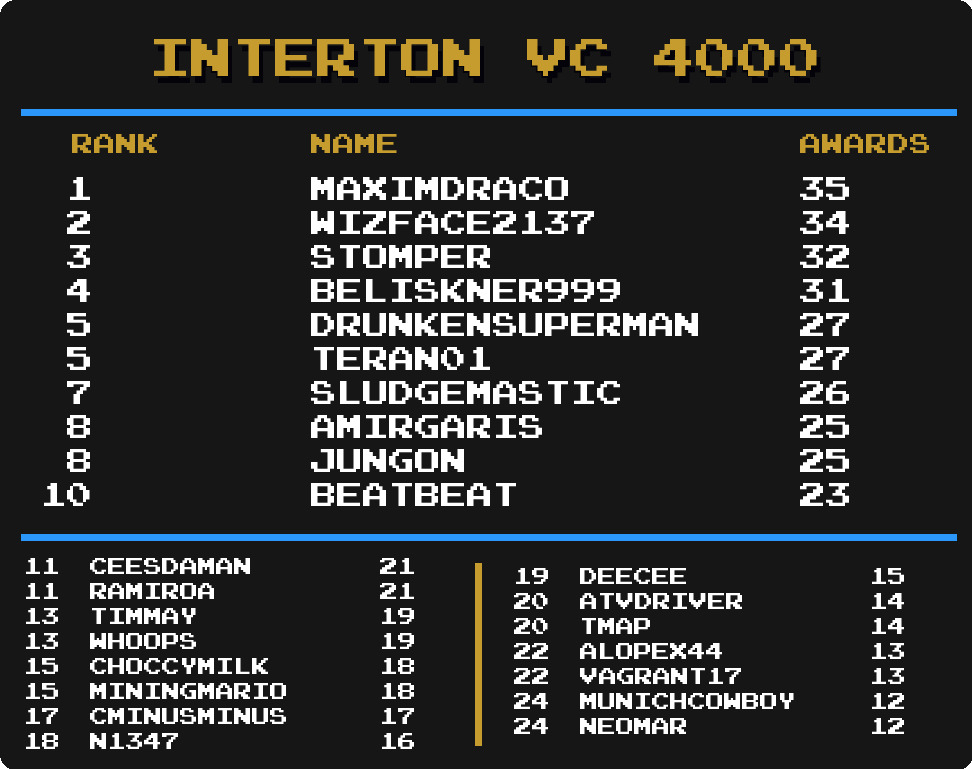

*  remains in 1st with 35 total mastery awards.
*  has moved up 2 spots and is in a 2-way tie for 5th place.
*  has moved up 1 spot and is in a 2-way tie for 11th place.
*  has moved up 2 spots and is in 19th place.

### Magnavox Odyssey 2

    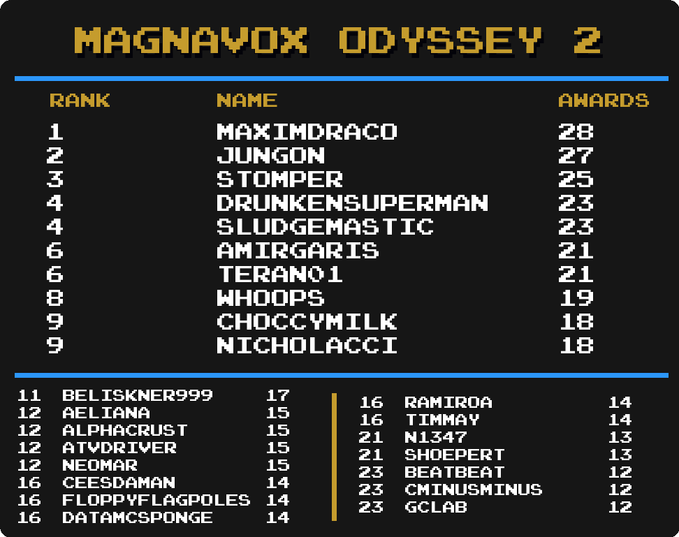

*  remains in 1st with 28 total mastery awards.
*  has moved up 1 spot and is in a 2-way tie for 4th place.
*  has moved up 4 spots and is in a 5-way tie for 16th place.
*  has moved up 4 spots and is in a 5-way tie for 23rd place.

### Master System

    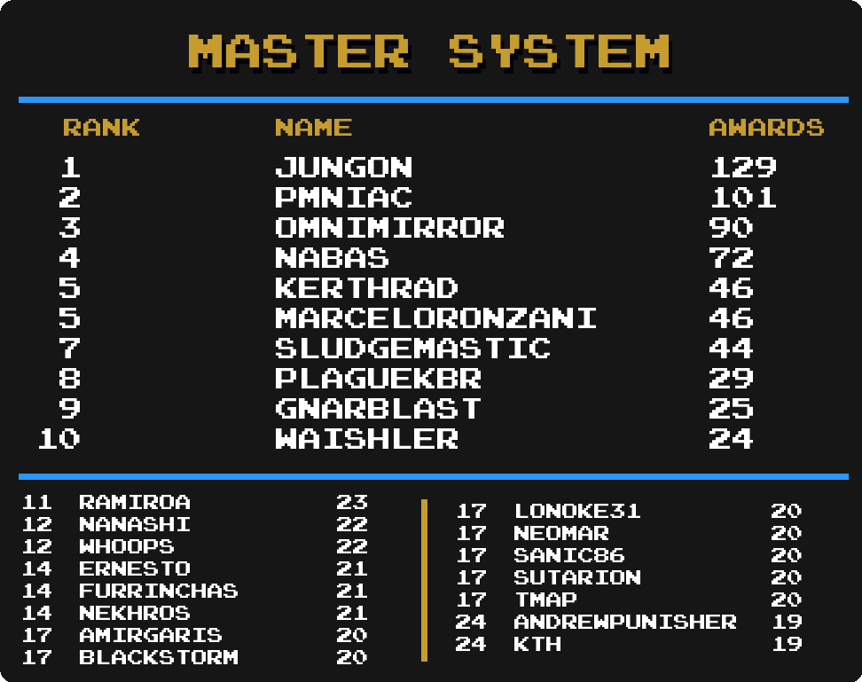

*  remains in 1st with 129 total mastery awards.
*  has moved up 1 spot and is in a 2-way tie for 5th place.

### Mega Duck

    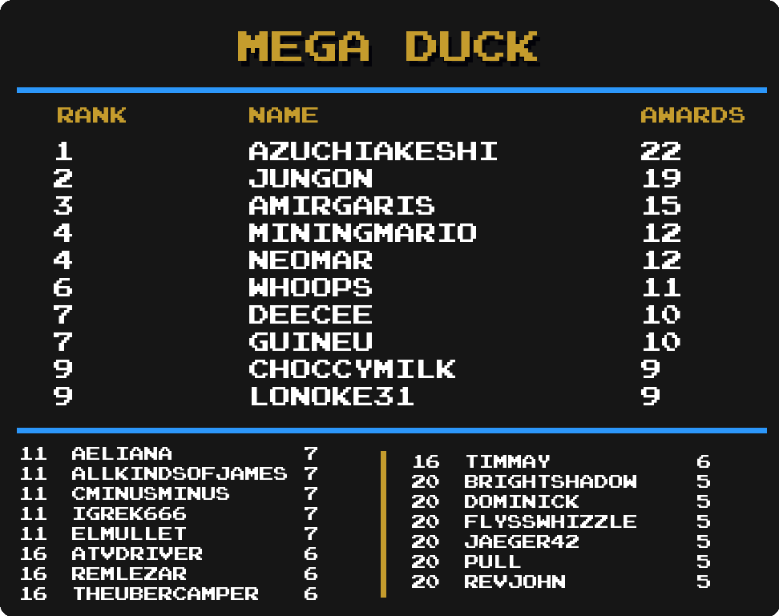

*  remains in 1st with 22 total mastery awards.
*  has moved up 1 spot and is in a 2-way tie for 9th place.
*  has moved up 29 spots and is in a 5-way tie for 11th place.
*  has moved up 3 spots and is in a 5-way tie for 11th place.

### MSX

    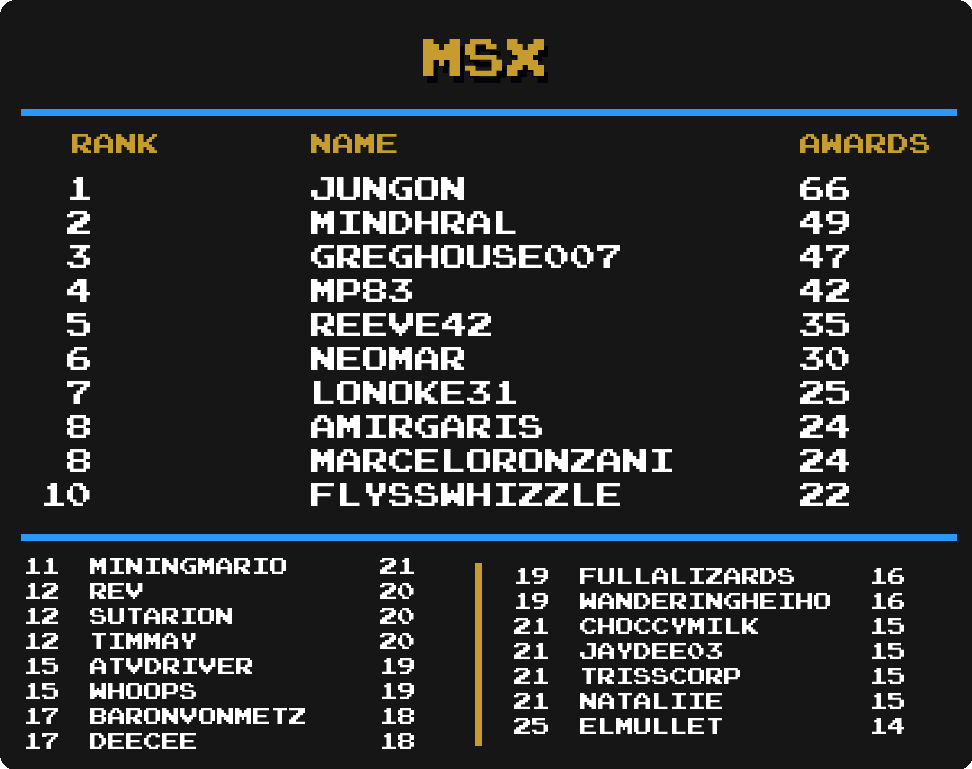

*  remains in 1st with 66 total mastery awards.
*  has moved up 1 spot and is in a 2-way tie for 8th place.
*  has moved up 1 spot and is in a 2-way tie for 15th place.
*  has moved up 8 spots and is in a 4-way tie for 21st place.

### Neo Geo CD

    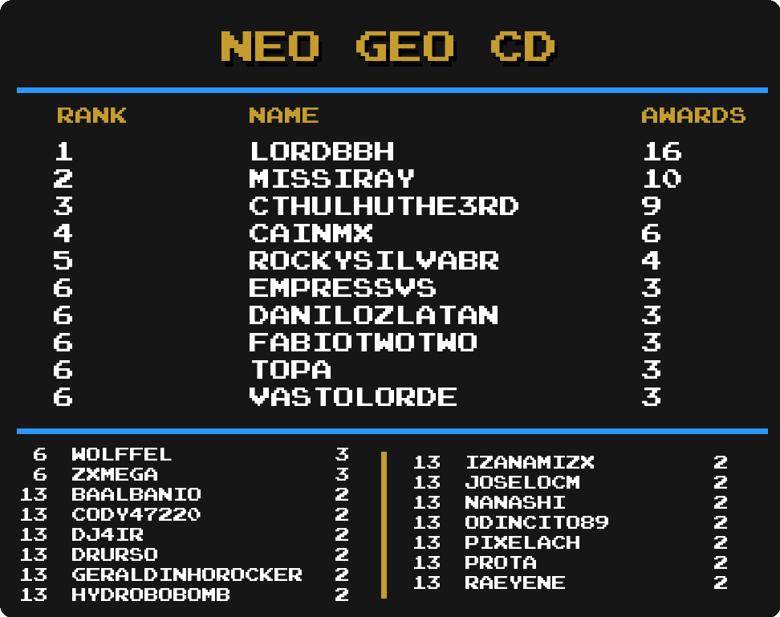

*  remains in 1st with 16 total mastery awards.
*  has moved up 25 spots and is in a 7-way tie for 6th place.
*  has moved up 18 spots and is in a 21-way tie for 13th place.
*  has made it into the top 25 and is in a 21-way tie for 13th place.

### Neo Geo Pocket

    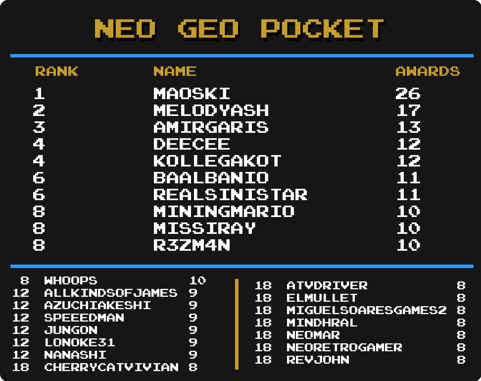

*  remains in 1st with 26 total mastery awards.
*  has made it into the top 25 and is in a 2-way tie for 4th place.
*  has moved up 8 spots and is in a 10-way tie for 18th place.

### NES/Famicom

    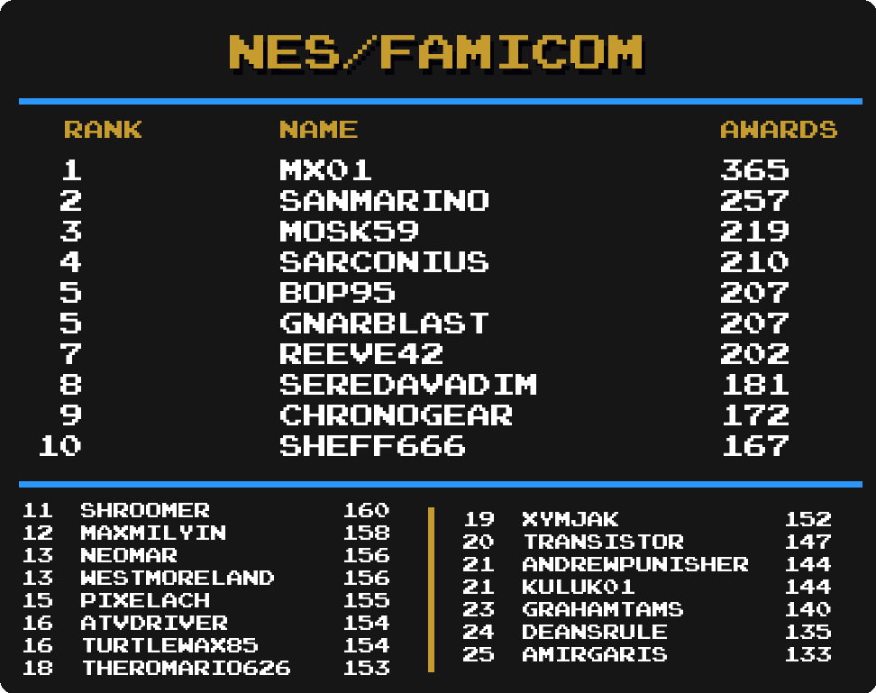

*  remains in 1st with 365 total mastery awards.
*  has moved up 1 spot and is in a 2-way tie for 5th place.
*  has moved up 2 spots and is in a 2-way tie for 13th place.
*  has moved up 1 spot and is in a 2-way tie for 16th place.
*  has moved up 2 spots and is in a 2-way tie for 16th place.
*  has moved up 1 spot and is in 18th place.
*  has moved up 1 spot and is in a 2-way tie for 21st place.
*  has moved up 1 spot and is in 25th place.

### Nintendo 64

    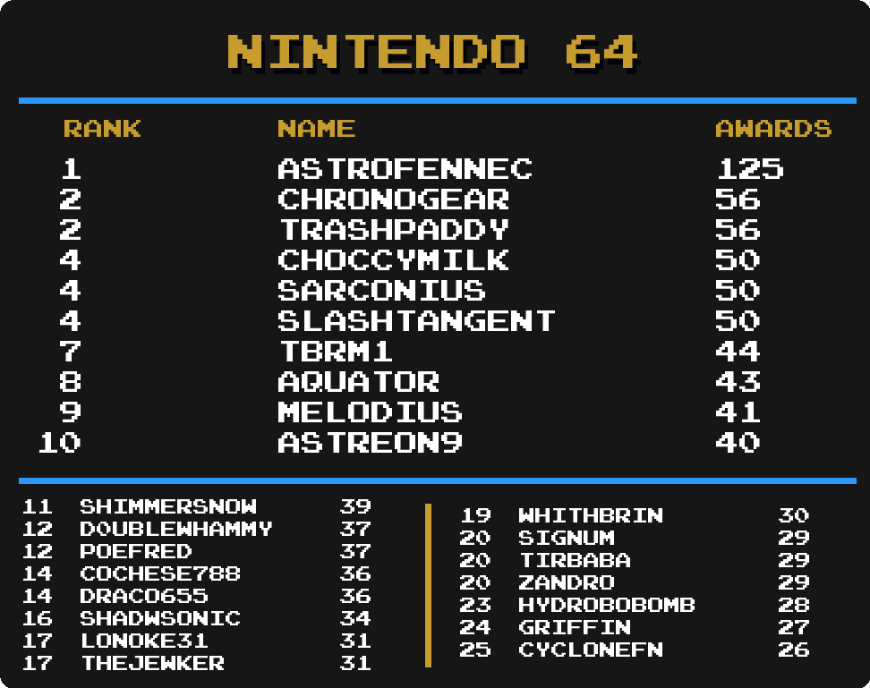

*  remains in 1st with 125 total mastery awards.
*  has moved up 1 spot and is in a 2-way tie for 2nd place.
*  has moved up 1 spot and is in a 3-way tie for 4th place.
*  has moved up 1 spot and is in a 3-way tie for 4th place.
*  has moved up 1 spot and is in a 2-way tie for 14th place.
*  has moved up 1 spot and is in a 3-way tie for 20th place.
*  has moved up 1 spot and is in a 3-way tie for 20th place.
*  has moved up 2 spots and is in a 3-way tie for 25th place.

### Nintendo DS

    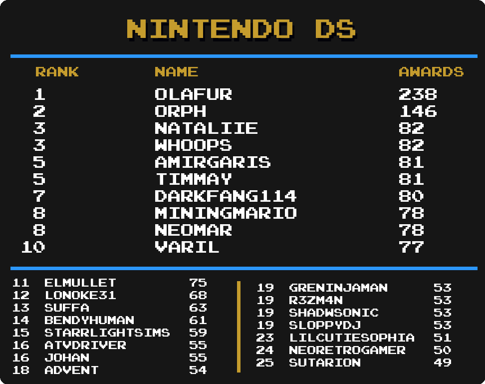

*  remains in 1st with 238 total mastery awards.
*  has moved up 1 spot and is in a 2-way tie for 5th place.
*  has moved up 3 spots and is in a 4-way tie for 19th place.

### Nintendo DSi

    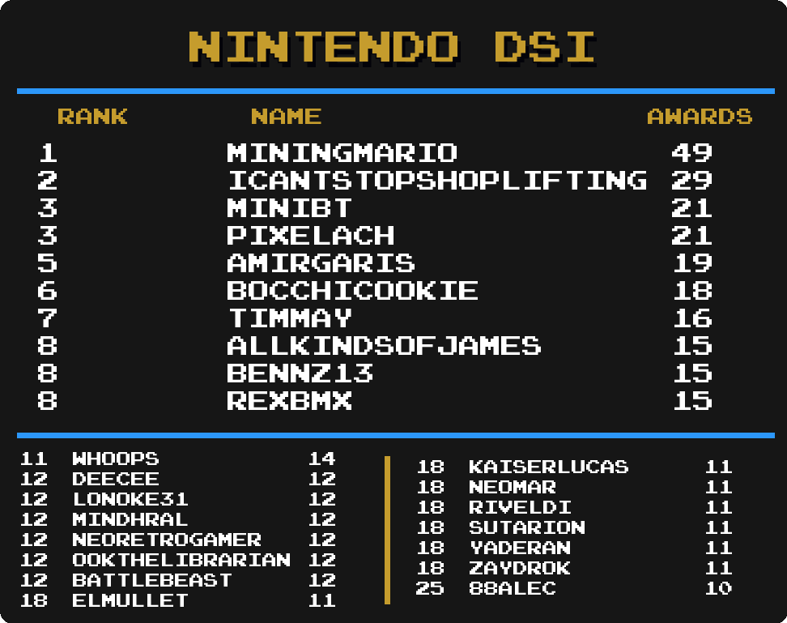

*  remains in 1st with 49 total mastery awards.
*  has moved up 9 spots and is in a 3-way tie for 8th place.
*  has moved up 16 spots and is in a 7-way tie for 18th place.

### PC Engine CD/TurboGrafx-CD

    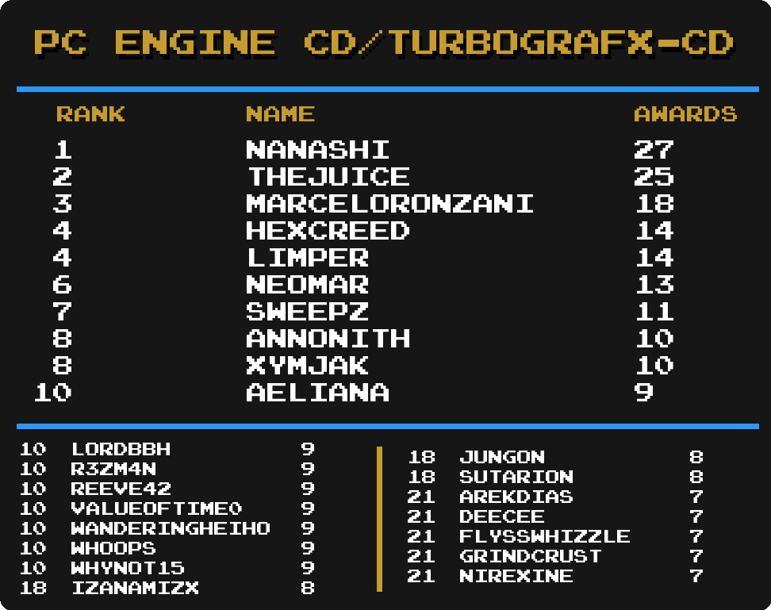

*  remains in 1st with 27 total mastery awards.
*  has made it into the top 25 and is in 3rd place.
*  has moved up 4 spots and is in a 8-way tie for 10th place.
*  has moved up 4 spots and is in a 8-way tie for 10th place.
*  has moved up 4 spots and is in a 8-way tie for 10th place.
*  has moved up 6 spots and is in a 8-way tie for 21st place.

### PC Engine/TurboGrafx-16

    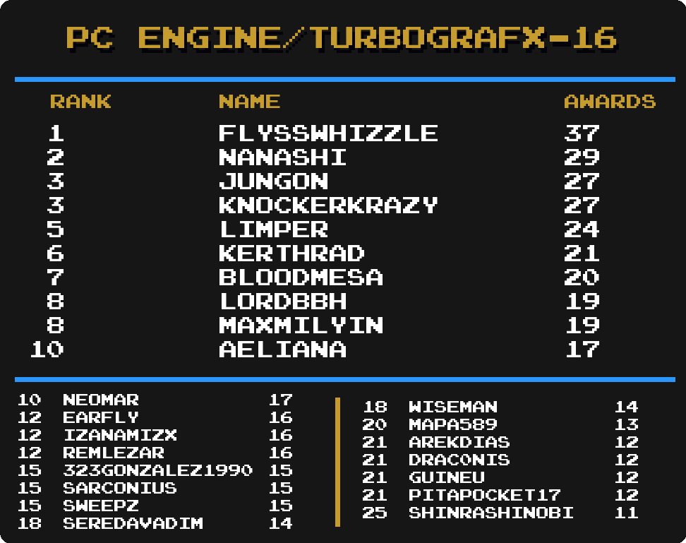

*  remains in 1st with 37 total mastery awards.
*  has moved up 1 spot and is in a 2-way tie for 3rd place.
*  has moved up 5 spots and is in a 3-way tie for 12th place.
*  has moved up 3 spots and is in a 4-way tie for 21st place.

### PC-8000/8800

    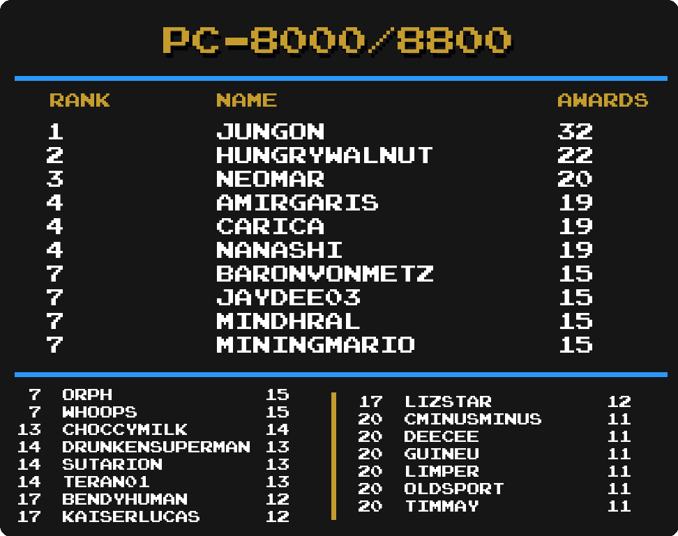

*  remains in 1st with 32 total mastery awards.
*  has moved up 2 spots and is in a 3-way tie for 14th place.
*  has moved up 5 spots and is in a 6-way tie for 20th place.

### PC-FX

    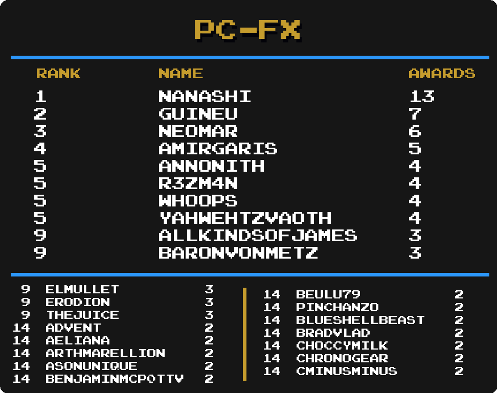

*  remains in 1st with 13 total mastery awards.
*  has moved up 3 spots and is in a 4-way tie for 5th place.
*  has made it into the top 25 and is in a 44-way tie for 14th place.

### PlayStation

    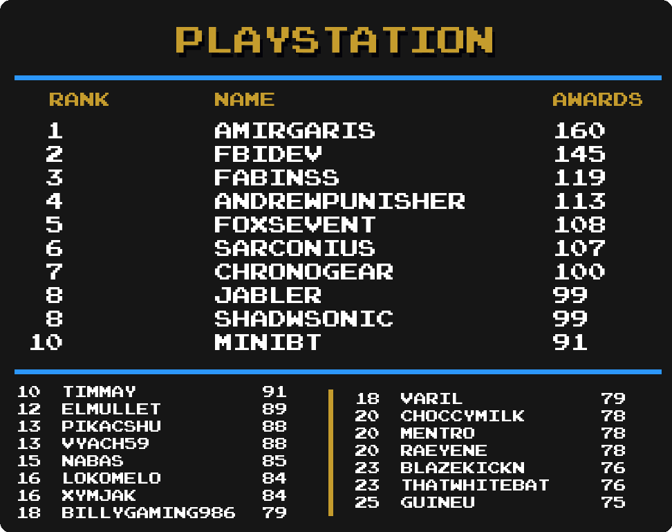

*  remains in 1st with 160 total mastery awards.
*  has moved up 5 spots and is in a 2-way tie for 8th place.
*  has moved up 3 spots and is in 12th place.
*  has moved up 2 spots and is in 15th place.
*  has moved up 8 spots and is in a 2-way tie for 18th place.
*  has moved up 1 spot and is in a 3-way tie for 20th place.

### PlayStation 2

    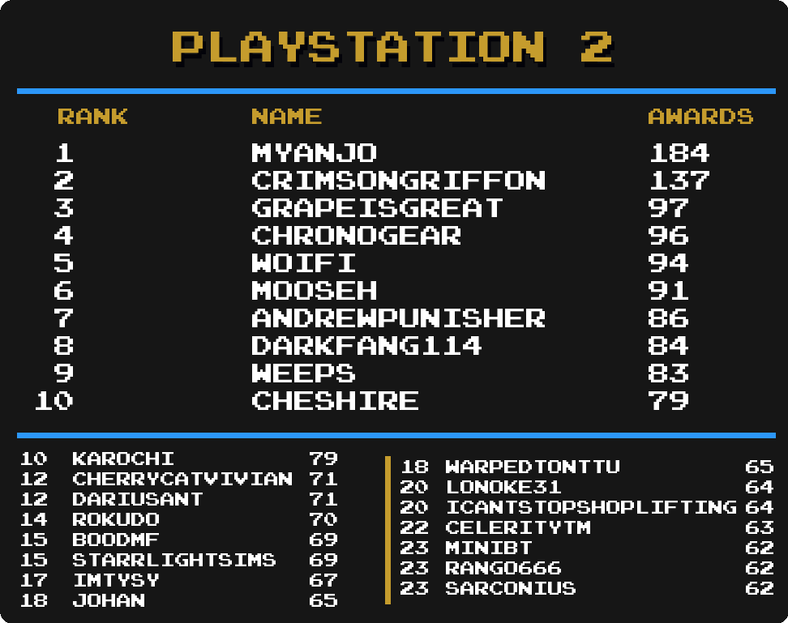

*  remains in 1st with 184 total mastery awards.
*  has moved up 1 spot and is in 9th place.
*  has moved up 1 spot and is in a 2-way tie for 10th place.
*  has moved up 3 spots and is in a 2-way tie for 12th place.
*  has moved up 2 spots and is in 14th place.
*  has moved up 7 spots and is in a 2-way tie for 18th place.

### PlayStation Portable

    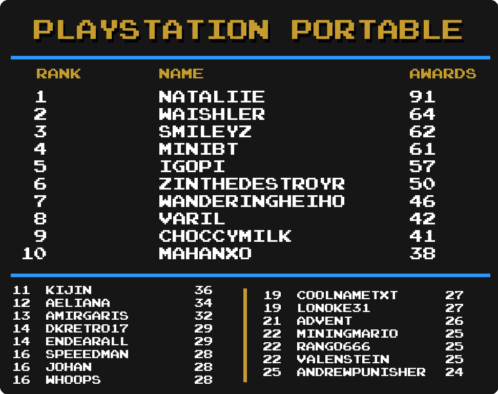

*  remains in 1st with 91 total mastery awards.
*  has moved up 2 spots and is in 11th place.
*  has moved up 1 spot and is in a 3-way tie for 16th place.
*  has moved up 1 spot and is in a 3-way tie for 16th place.
*  has moved up 2 spots and is in a 3-way tie for 22nd place.
*  has moved up 2 spots and is in a 5-way tie for 25th place.
*  has moved up 2 spots and is in a 5-way tie for 25th place.
*  has moved up 11 spots and is in a 5-way tie for 25th place.

### Pokemon Mini

    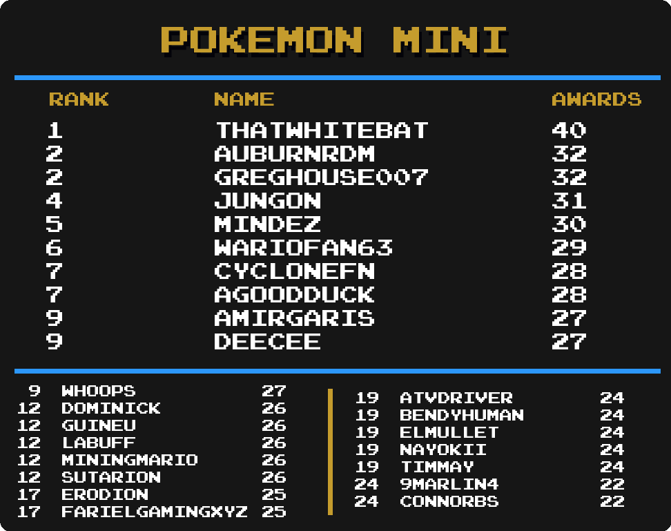

*  remains in 1st with 40 total mastery awards.
*  has moved up 1 spot and is in a 2-way tie for 2nd place.
*  has moved up 1 spot and is in a 2-way tie for 2nd place.
*  has moved up 1 spot and is in 4th place.
*  has moved up 1 spot and is in 5th place.
*  has moved up 1 spot and is in 6th place.
*  has moved up 1 spot and is in a 2-way tie for 7th place.
*  has moved up 1 spot and is in a 2-way tie for 7th place.
*  has moved up 1 spot and is in a 3-way tie for 9th place.
*  has moved up 1 spot and is in a 3-way tie for 9th place.
*  has moved up 1 spot and is in a 3-way tie for 9th place.
*  has moved up 1 spot and is in a 5-way tie for 12th place.
*  has moved up 1 spot and is in a 5-way tie for 12th place.
*  has moved up 1 spot and is in a 5-way tie for 12th place.
*  has moved up 1 spot and is in a 5-way tie for 12th place.
*  has moved up 1 spot and is in a 5-way tie for 12th place.
*  has moved up 1 spot and is in a 2-way tie for 17th place.
*  has moved up 1 spot and is in a 2-way tie for 17th place.
*  has moved up 1 spot and is in a 5-way tie for 19th place.
*  has moved up 1 spot and is in a 5-way tie for 19th place.
*  has moved up 1 spot and is in a 5-way tie for 19th place.
*  has moved up 1 spot and is in a 5-way tie for 19th place.
*  has moved up 1 spot and is in a 5-way tie for 19th place.
*  has moved up 1 spot and is in a 5-way tie for 24th place.
*  has moved up 1 spot and is in a 5-way tie for 24th place.
*  has moved up 1 spot and is in a 5-way tie for 24th place.
*  has moved up 1 spot and is in a 5-way tie for 24th place.
*  has moved up 1 spot and is in a 5-way tie for 24th place.

### Saturn

    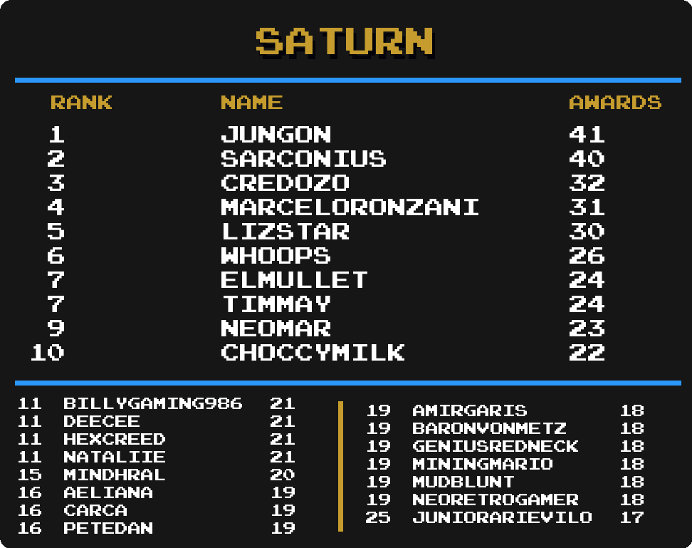

*  has moved up 1 spot and is in 1st place.
*  has moved up 2 spots and is in 3rd place.
*  has moved up 2 spots and is in a 4-way tie for 11th place.
*  has moved up 2 spots and is in a 4-way tie for 11th place.
*  has moved up 40 spots and is in a 3-way tie for 16th place.
*  has moved up 4 spots and is in a 6-way tie for 19th place.

### Sega CD

    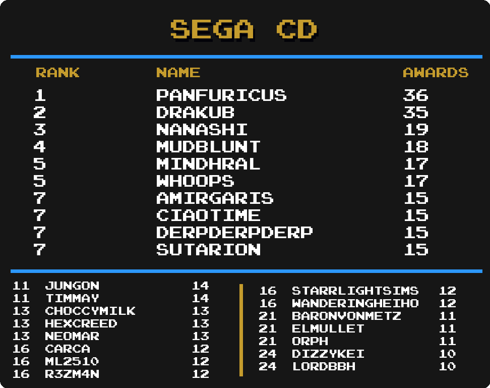

*  remains in 1st with 36 total mastery awards.
*  has moved up 1 spot and is in a 2-way tie for 5th place.
*  has moved up 3 spots and is in a 4-way tie for 7th place.
*  has moved up 2 spots and is in a 3-way tie for 13th place.
*  has moved up 4 spots and is in a 5-way tie for 16th place.
*  has moved up 5 spots and is in a 6-way tie for 24th place.

### SG-1000

    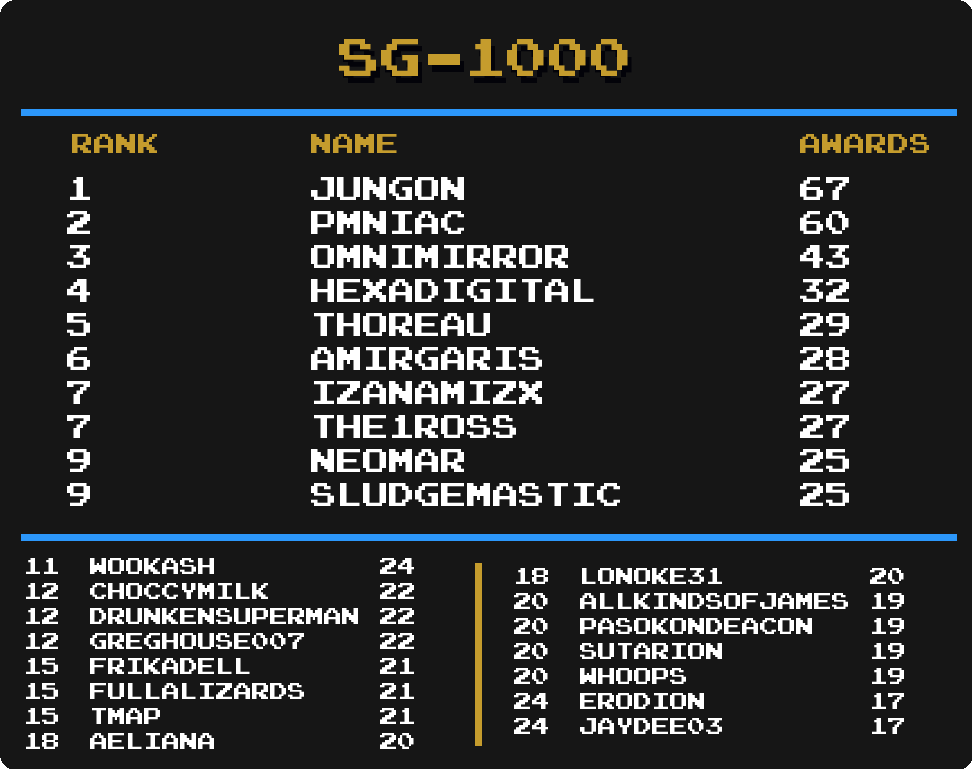

*  remains in 1st with 67 total mastery awards.
*  has moved up 27 spots and is in a 3-way tie for 15th place.
*  has moved up 1 spot and is in a 3-way tie for 15th place.
*  has moved up 2 spots and is in a 4-way tie for 20th place.
*  has moved up 1 spot and is in a 4-way tie for 20th place.

### SNES/Super Famicom

    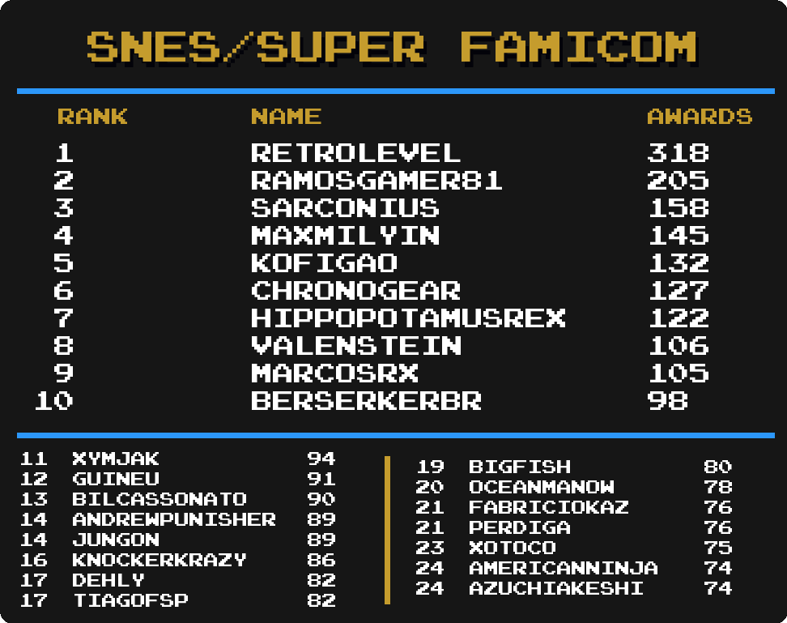

*  remains in 1st with 318 total mastery awards.
*  has moved up 3 spots and is in a 4-way tie for 24th place.

### Uzebox

    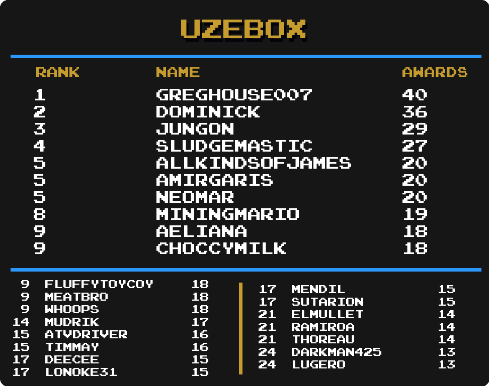

*  remains in 1st with 40 total mastery awards.
*  has moved up 2 spots and is in a 4-way tie for 17th place.
*  has moved up 2 spots and is in a 4-way tie for 17th place.

### Vectrex

    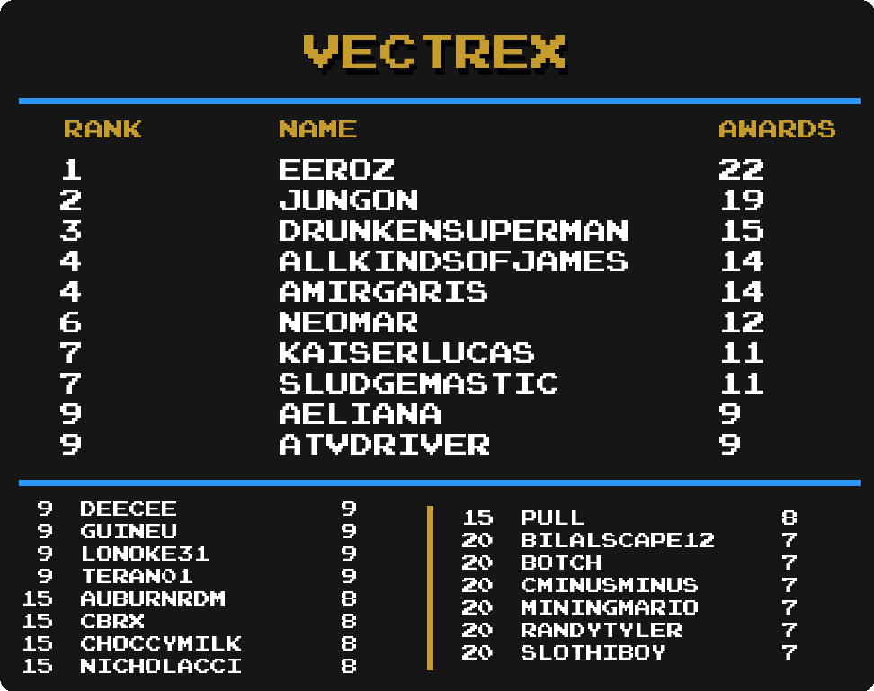

*  remains in 1st with 22 total mastery awards.
*  has moved up 4 spots and is in a 5-way tie for 15th place.
*  has made it into the top 25 and is in a 7-way tie for 20th place.
*  has made it into the top 25 and is in a 7-way tie for 20th place.

### Virtual Boy

    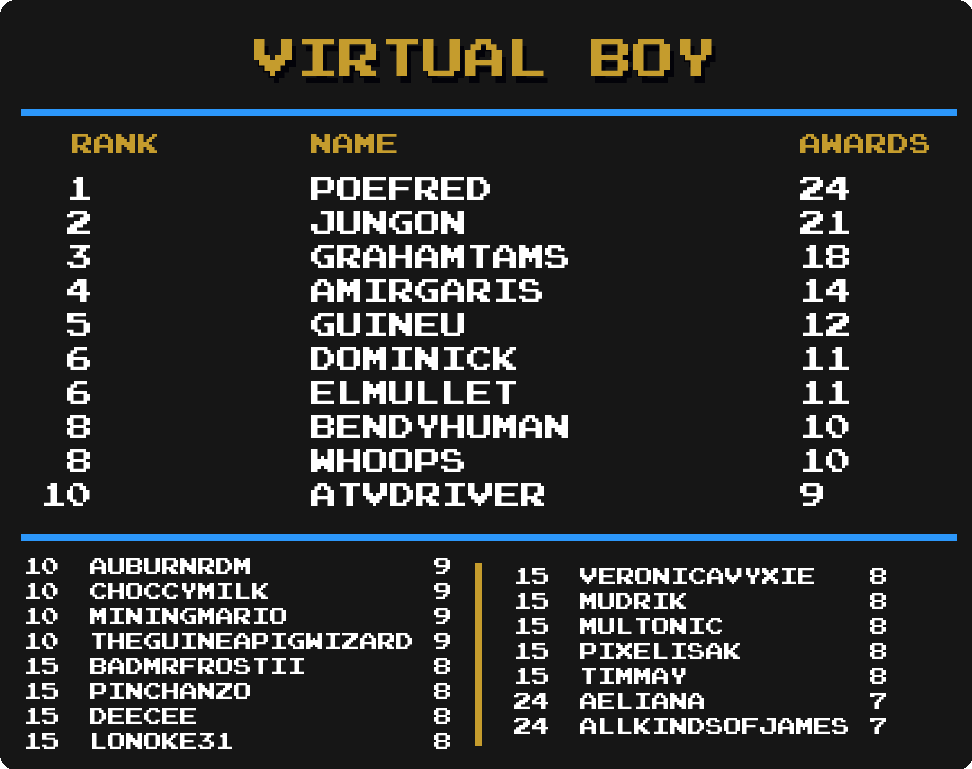

*  remains in 1st with 24 total mastery awards.
*  has moved up 14 spots and is in a 6-way tie for 24th place.

### WASM-4

    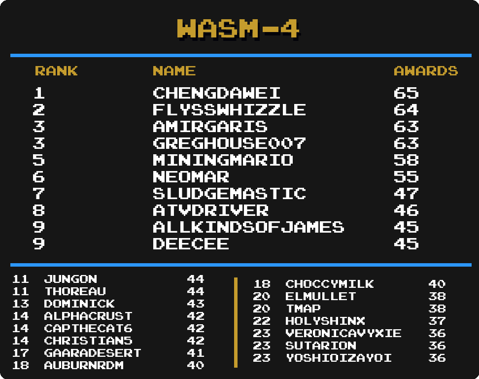

*  remains in 1st with 65 total mastery awards.
*  has moved up 1 spot and is in a 2-way tie for 3rd place.
*  has moved up 3 spots and is in a 2-way tie for 9th place.
*  has moved up 6 spots and is in 13th place.
*  has moved up 2 spots and is in a 3-way tie for 23rd place.

### Watara Supervision

    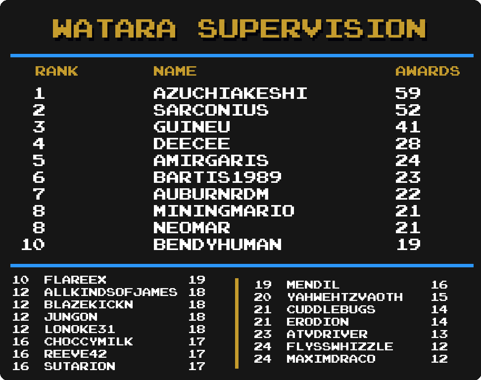

*  remains in 1st with 59 total mastery awards.
*  has moved up 1 spot and is in a 2-way tie for 8th place.
*  has moved up 2 spots and is in a 3-way tie for 16th place.

### Wii

    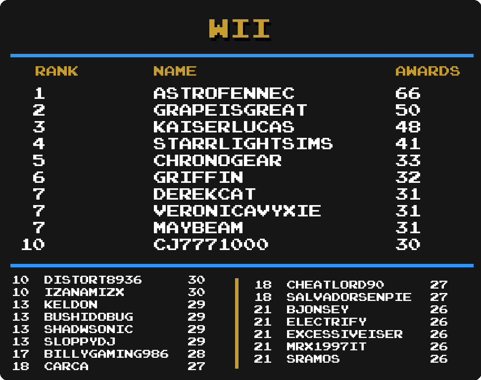

*  remains in 1st with 66 total mastery awards.
*  has moved up 13 spots and is in 2nd place.
*  has moved up 1 spot and is in 4th place.
*  has moved up 62 spots and is in 6th place.
*  has moved up 13 spots and is in a 3-way tie for 7th place.
*  has moved up 13 spots and is in a 3-way tie for 7th place.
*  has made it into the top 25 and is in a 3-way tie for 7th place.
*  has moved up 5 spots and is in a 3-way tie for 10th place.
*  has moved up 24 spots and is in a 4-way tie for 13th place.
*  has moved up 14 spots and is in a 4-way tie for 13th place.
*  has moved up 7 spots and is in a 4-way tie for 13th place.
*  has made it into the top 25 and is in a 3-way tie for 18th place.
*  has made it into the top 25 and is in a 3-way tie for 18th place.
*  has moved up 6 spots and is in a 5-way tie for 21st place.
*  has made it into the top 25 and is in a 5-way tie for 21st place.

### WonderSwan

    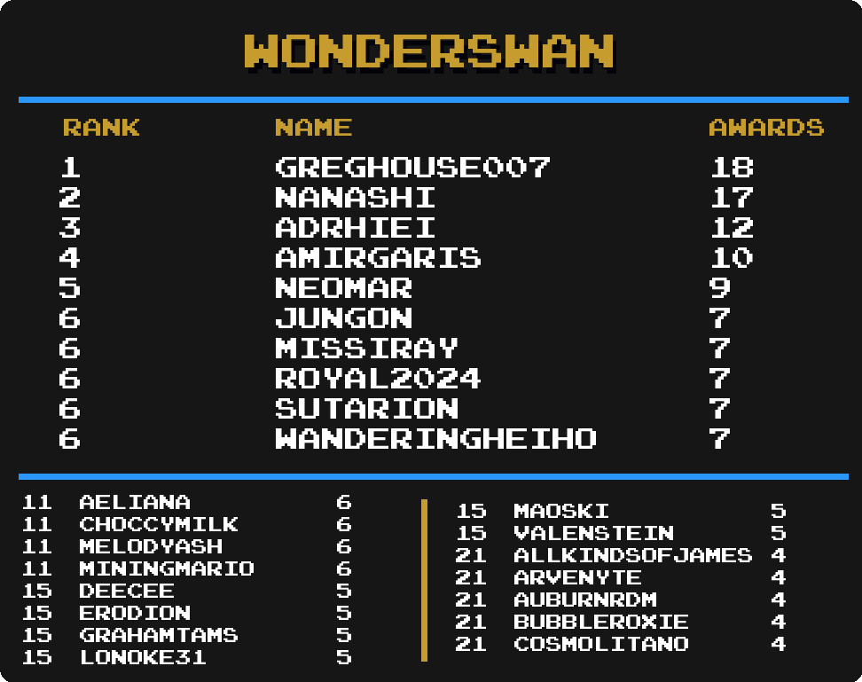

*  remains in 1st with 18 total mastery awards.
*  has moved up 4 spots and is in a 5-way tie for 6th place.
*  has moved up 3 spots and is in a 4-way tie for 11th place.
*  has moved up 15 spots and is in a 19-way tie for 21st place.
*  has moved up 15 spots and is in a 19-way tie for 21st place.
*  has moved up 15 spots and is in a 19-way tie for 21st place.
*  has moved up 15 spots and is in a 19-way tie for 21st place.