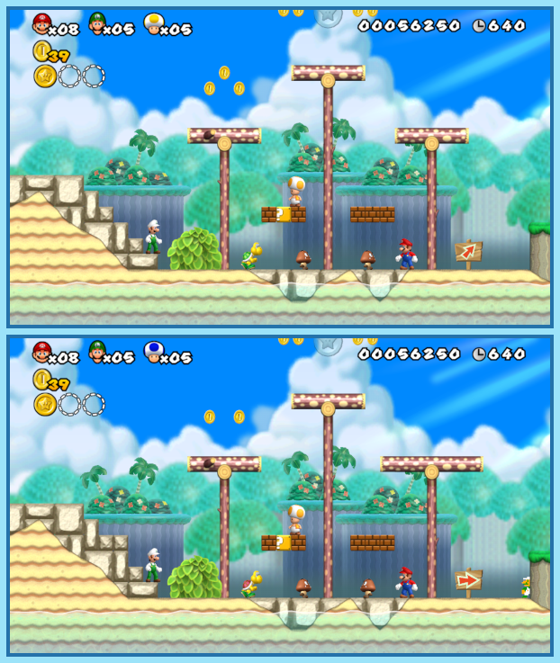

## Last Month's Winners

<table><tbody>
    <tr>
        <td colspan="4" style="text-align: center; vertical-align: middle;">
 
</td>
    </tr>
    <tr>
        <td colspan="2" style="text-align: center; vertical-align: middle;">🥈 </td>
        <td colspan="2" style="text-align: center; vertical-align: middle;">🥉 </td>
    </tr>
    <tr>
        <td></td>
        <td></td>
        <td></td>
    </tr>
    <tr>
        <td></td>
        <td></td>
        <td></td>
    </tr>
    <tr>
        <td></td>
        <td></td>
        <td></td>
    </tr>
    <tr>
        <td></td>
        <td></td>
        <td></td>
    </tr>
    <tr>
        <td></td>
        <td></td>
        <td></td>
    </tr>
    <tr>
        <td></td>
        <td></td>
        <td></td>
    </tr>
    <tr>
        <td></td>
        <td></td>
        <td></td>
    </tr>
    <tr>
        <td></td>
        <td></td>
        <td></td>
    </tr>
    <tr>
        <td></td>
        <td></td>
        <td></td>
    </tr>
    <tr>
        <td></td>
        <td colspan="2"></td>
    </tr>
</tbody></table>

 

All answers for previous issues can be found [here](../spot-the-diff-answers.html).

 

The Reaper's Game is beginning and Neku, Shiki and several other people are forced to play it. While completing daily tasks to escape this game, they need to face and defeat Noise, creatures that attack people to collect their souls. Lately the power of the Noise is drastically increasing and they even managed to create illusions in the environment to fool human and make them an easier target. Can you help Neku by using your Observe Pin to track down all 10 differences?

  

## About the Game

| Game                                                                                                  | Console | Genre          |
| ----------------------------------------------------------------------------------------------------- | ------- | -------------- |
|  | Wii     | 2D Platforming |

* Suggested by: 

**Note:** Every user who finds all 10 differences and sends proof to SporyTike via Site DM or Discord will be listed in the next issue. Additionally a random selected user who submitted the solution until the end of the month will be chosen to select the game of the next picture.
