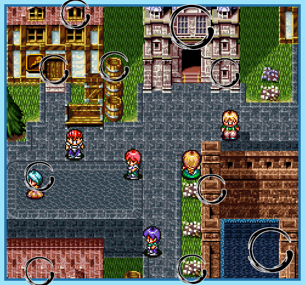
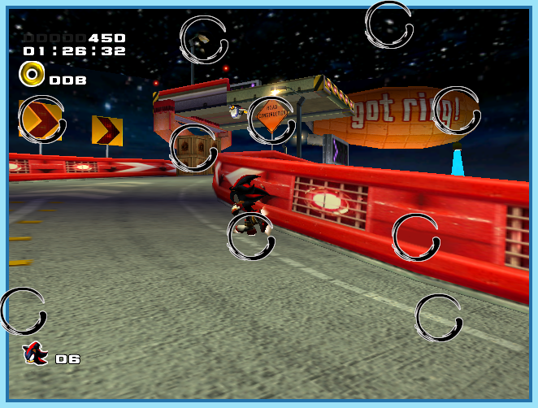
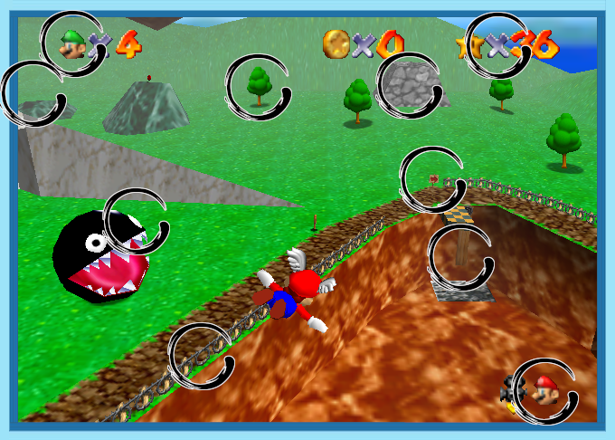

# 2025

<table>
    <tbody>
        <thead>
            <tr>
                <td>January</td>
                <td>February</td>
                <td>March</td>
            </tr>
        </thead>
        <tr>
            <td> </td>
            <td> </td>
            <!-- <td> </td> -->
        <!-- </tr>
        <thead>
            <tr>
                <td>April</td>
                <td>May</td>
                <td>June</td>
            </tr>
        </thead>
        <tr> -->
            <!-- <td> </td> -->
            <!-- <td> </td> -->
            <!-- <td> </td> -->
        <!-- </tr>
        <thead>
            <tr>
                <td>July </td>
                <td>August</td>
                <td>September</td>
            </tr>
        </thead>
        <tr> -->
            <!-- <td> </td> -->
            <!-- <td> </td> -->
            <!-- <td> </td> -->
        <!-- </tr>
        <thead>
            <tr>
                <td>October</td>
                <td>November</td>
                <td>December</td>
            </tr>
        </thead>
        <tr> -->
            <!-- <td> </td> -->
            <!-- <td> </td> -->
            <!-- <td> </td> -->
        </tr>
    </tbody>
</table>

---

# 2024

<table>
    <tbody>
        <thead>
            <tr>
                <td>January</td>
                <td>February</td>
                <td>March</td>
            </tr>
        </thead>
        <tr>
            <td> </td>
            <td> </td>
            <td> </td>
        </tr>
        <thead>
            <tr>
                <td>April</td>
                <td>May</td>
                <td>June</td>
            </tr>
        </thead>
        <tr>
            <td> </td>
            <td> </td>
            <td> </td>
        </tr>
        <thead>
            <tr>
                <td>July </td>
                <td>August</td>
                <td>September</td>
            </tr>
        </thead>
        <tr>
            <td> </td>
            <td> </td>
            <td> </td>
        </tr>
        <thead>
            <tr>
                <td>October</td>
                <td>November</td>
                <td>December</td>
            </tr>
        </thead>
        <tr>
            <td> </td>
            <td> </td>
            <td> </td>
        </tr>
    </tbody>
</table>

---

# 2023

<table>
    <tbody>
        <thead>
            <tr>
                <td>January</td>
                <td>February</td>
                <td>March</td>
            </tr>
        </thead>
        <tr>
            <td> </td>
            <td> </td>
            <td> </td>
        </tr>
        <thead>
            <tr>
                <td>April</td>
                <td>May</td>
                <td>June</td>
            </tr>
        </thead>
        <tr>
            <td> </td>
            <td> </td>
            <td> </td>
        </tr>
        <thead>
            <tr>
                <td>July </td>
                <td>August</td>
                <td>September</td>
            </tr>
        </thead>
        <tr>
            <td> </td>
            <td> </td>
            <td> </td>
        </tr>
        <thead>
            <tr>
                <td>October</td>
                <td>November</td>
                <td>December</td>
            </tr>
        </thead>
        <tr>
            <td> </td>
            <td> </td>
            <td> </td>
        </tr>
    </tbody>
</table>

---

# 2022

<table>
    <tbody>
        <thead>
            <tr>
                <td>January</td>
                <td>February</td>
                <td>March</td>
            </tr>
        </thead>
        <tr>
            <td> </td>
            <td> </td>
            <td> </td>
        </tr>
        <thead>
            <tr>
                <td>April</td>
                <td>May</td>
                <td>June</td>
            </tr>
        </thead>
        <tr>
            <td> </td>
            <td> </td>
            <td> </td>
        </tr>
        <thead>
            <tr>
                <td>July </td>
                <td>August</td>
                <td>September</td>
            </tr>
        </thead>
        <tr>
            <td> </td>
            <td> </td>
            <td> </td>
        </tr>
        <thead>
            <tr>
                <td>October</td>
                <td>November</td>
                <td>December</td>
            </tr>
        </thead>
        <tr>
            <td> </td>
            <td> </td>
            <td> </td>
        </tr>
    </tbody>
</table>

---

# 2021

<table>
    <tbody>
        <thead>
            <tr>
                <td>January</td>
                <td>February</td>
                <td>March</td>
            </tr>
        </thead>
        <tr>
            <td> 

</td>
            <td> 

</td>
            <td> 

</td>
        </tr>
        <thead>
            <tr>
                <td>April</td>
                <td>May</td>
                <td>June</td>
            </tr>
        </thead>
        <tr>
            <td> 

</td>
            <td> </td>
            <td> </td>
        </tr>
        <thead>
            <tr>
                <td>July </td>
                <td>August</td>
                <td>September</td>
            </tr>
        </thead>
        <tr>
            <td> </td>
            <td> </td>
            <td> </td>
        </tr>
        <thead>
            <tr>
                <td>October</td>
                <td>November</td>
                <td>December</td>
            </tr>
        </thead>
        <tr>
            <td> </td>
            <td> </td>
            <td> </td>
        </tr>
    </tbody>
</table>